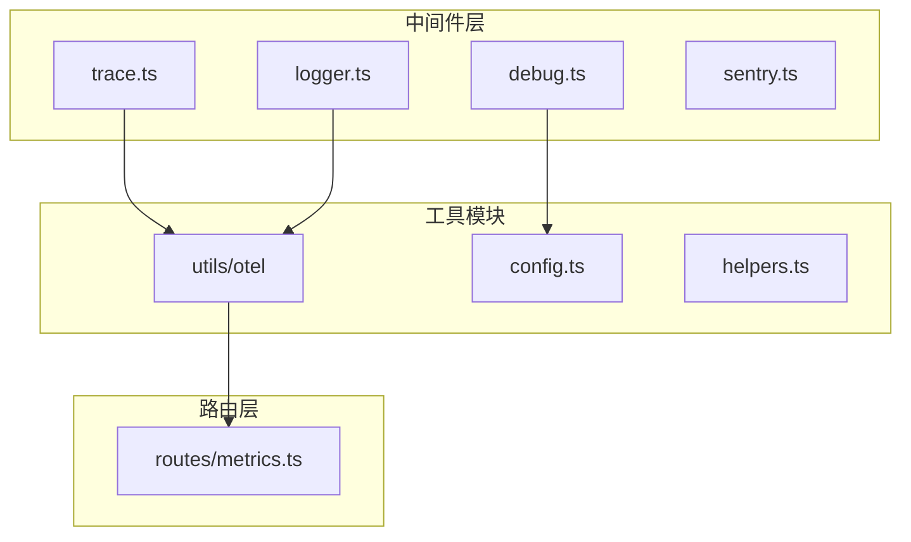
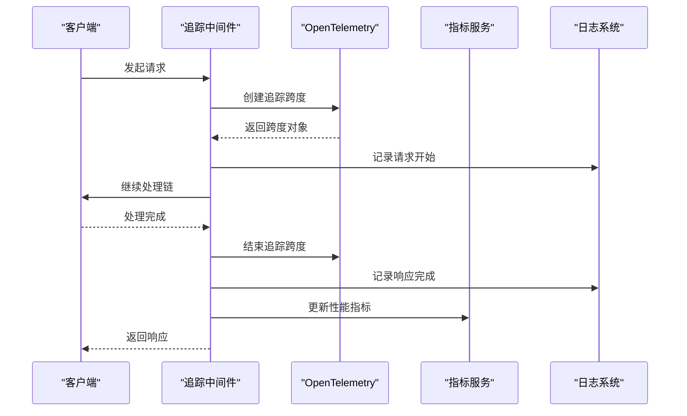
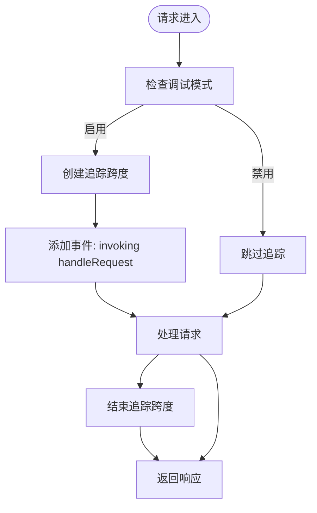
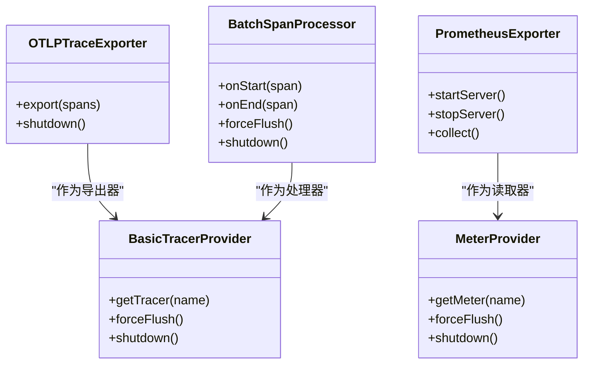
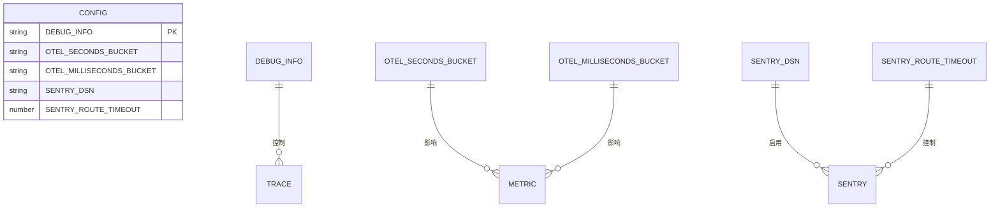
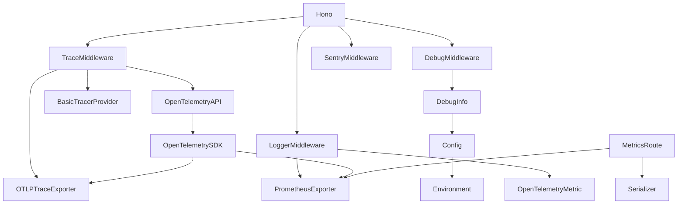

# 请求追踪

<cite>
**本文档引用的文件**
- [trace.ts](file://lib/middleware/trace.ts)
- [config.ts](file://lib/config.ts)
- [otel/trace.ts](file://lib/utils/otel/trace.ts)
- [otel/metric.ts](file://lib/utils/otel/metric.ts)
- [app-bootstrap.tsx](file://lib/app-bootstrap.tsx)
- [debug-info.ts](file://lib/utils/debug-info.ts)
- [logger.ts](file://lib/middleware/logger.ts)
- [metrics.ts](file://lib/routes/metrics.ts)
</cite>

## 目录
1. [简介](#简介)
2. [项目结构](#项目结构)
3. [核心组件](#核心组件)
4. [架构概述](#架构概述)
5. [详细组件分析](#详细组件分析)
6. [依赖分析](#依赖分析)
7. [性能考虑](#性能考虑)
8. [故障排除指南](#故障排除指南)
9. [结论](#结论)

## 简介
RSSHub 的请求追踪功能为系统诊断和性能分析提供了强大的工具。本技术文档详细说明了如何使用 RSSHub 的请求追踪功能来诊断问题，包括追踪 ID 的生成和传播机制、在分布式环境中跟踪单个请求的完整生命周期、追踪数据的收集和展示方式，以及如何利用追踪信息定位性能瓶颈、识别错误源头和分析系统依赖关系。

## 项目结构
RSSHub 的请求追踪功能主要分布在中间件和工具模块中，通过 OpenTelemetry 实现全面的监控和追踪能力。

**图示来源**
- [trace.ts](file://lib/middleware/trace.ts)
- [debug.ts](file://lib/middleware/debug.ts)
- [logger.ts](file://lib/middleware/logger.ts)
- [sentry.ts](file://lib/middleware/sentry.ts)
- [otel](file://lib/utils/otel)
- [config.ts](file://lib/config.ts)
- [metrics.ts](file://lib/routes/metrics.ts)

**章节来源**
- [app-bootstrap.tsx](file://lib/app-bootstrap.tsx)
- [middleware](file://lib/middleware)

## 核心组件
RSSHub 的请求追踪系统由多个核心组件构成，包括追踪中间件、OpenTelemetry 工具、配置管理、性能指标收集和调试信息管理。这些组件协同工作，提供了完整的请求追踪能力。

**章节来源**
- [trace.ts](file://lib/middleware/trace.ts)
- [otel/trace.ts](file://lib/utils/otel/trace.ts)
- [otel/metric.ts](file://lib/utils/otel/metric.ts)
- [config.ts](file://lib/config.ts)

## 架构概述
RSSHub 的请求追踪架构基于 OpenTelemetry 实现，采用分层设计，从请求进入系统到响应返回的整个生命周期都受到监控。

**图示来源**
- [trace.ts](file://lib/middleware/trace.ts)
- [otel/trace.ts](file://lib/utils/otel/trace.ts)
- [otel/metric.ts](file://lib/utils/otel/metric.ts)
- [logger.ts](file://lib/middleware/logger.ts)

## 详细组件分析

### 追踪中间件分析
追踪中间件是 RSSHub 请求追踪系统的核心，负责在请求处理过程中创建和管理追踪跨度。

**图示来源**
- [trace.ts](file://lib/middleware/trace.ts)

**章节来源**
- [trace.ts](file://lib/middleware/trace.ts)
- [config.ts](file://lib/config.ts)

### OpenTelemetry 集成分析
OpenTelemetry 模块为 RSSHub 提供了标准化的追踪和指标收集能力。

**图示来源**
- [otel/trace.ts](file://lib/utils/otel/trace.ts)
- [otel/metric.ts](file://lib/utils/otel/metric.ts)

**章节来源**
- [otel/trace.ts](file://lib/utils/otel/trace.ts)
- [otel/metric.ts](file://lib/utils/otel/metric.ts)

### 配置管理分析
配置系统控制着请求追踪功能的启用和行为，通过环境变量进行灵活配置。

**图示来源**
- [config.ts](file://lib/config.ts)

**章节来源**
- [config.ts](file://lib/config.ts)

## 依赖分析
RSSHub 的请求追踪系统依赖于多个外部库和内部模块，形成了复杂的依赖关系网络。

**图示来源**
- [package.json](file://package.json)
- [pnpm-lock.yaml](file://pnpm-lock.yaml)
- [app-bootstrap.tsx](file://lib/app-bootstrap.tsx)

**章节来源**
- [app-bootstrap.tsx](file://lib/app-bootstrap.tsx)
- [config.ts](file://lib/config.ts)
- [middleware](file://lib/middleware)

## 性能考虑
请求追踪功能对系统性能有一定影响，需要通过配置选项进行权衡和优化。

**章节来源**
- [config.ts](file://lib/config.ts)
- [trace.ts](file://lib/middleware/trace.ts)
- [otel/trace.ts](file://lib/utils/otel/trace.ts)

## 故障排除指南
当请求追踪功能出现问题时，可以通过以下步骤进行诊断和解决。

**章节来源**
- [trace.ts](file://lib/middleware/trace.ts)
- [otel/trace.ts](file://lib/utils/otel/trace.ts)
- [config.ts](file://lib/config.ts)

## 结论
RSSHub 的请求追踪系统通过 OpenTelemetry 实现了全面的监控能力，为系统诊断和性能优化提供了有力支持。通过合理的配置和使用，可以有效定位性能瓶颈、识别错误源头并分析系统依赖关系。