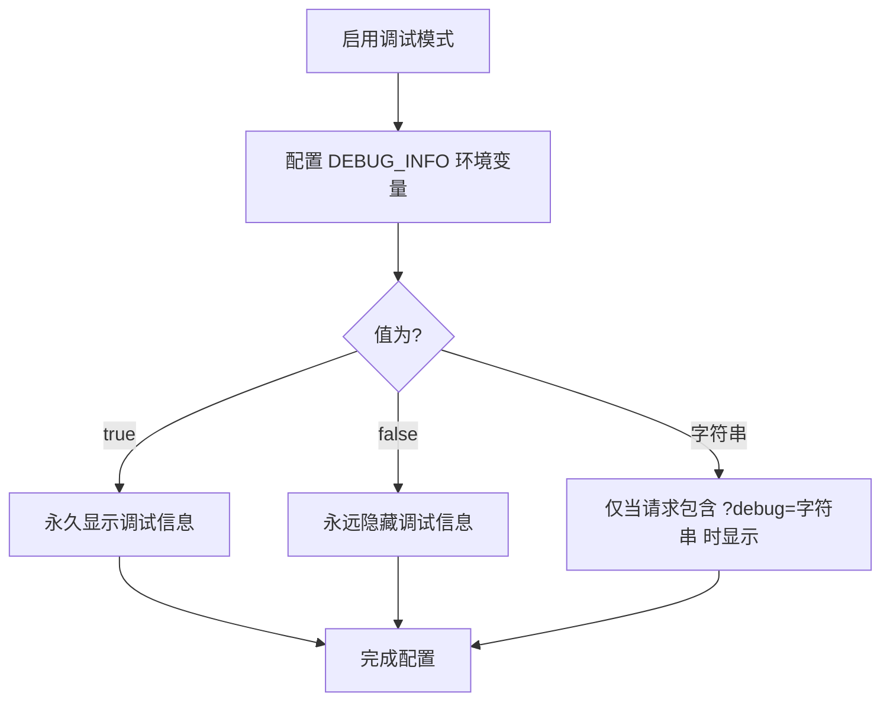
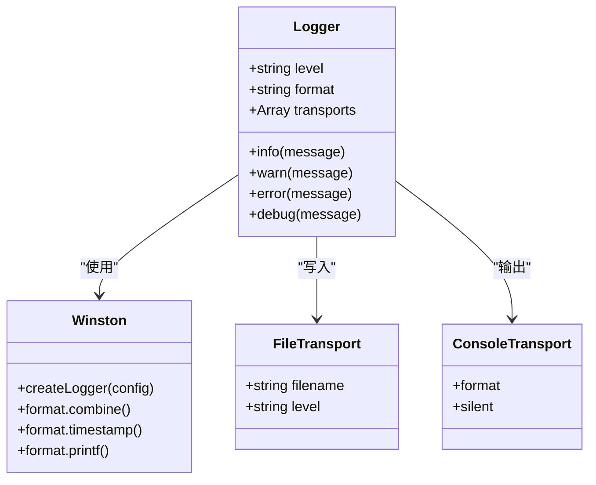
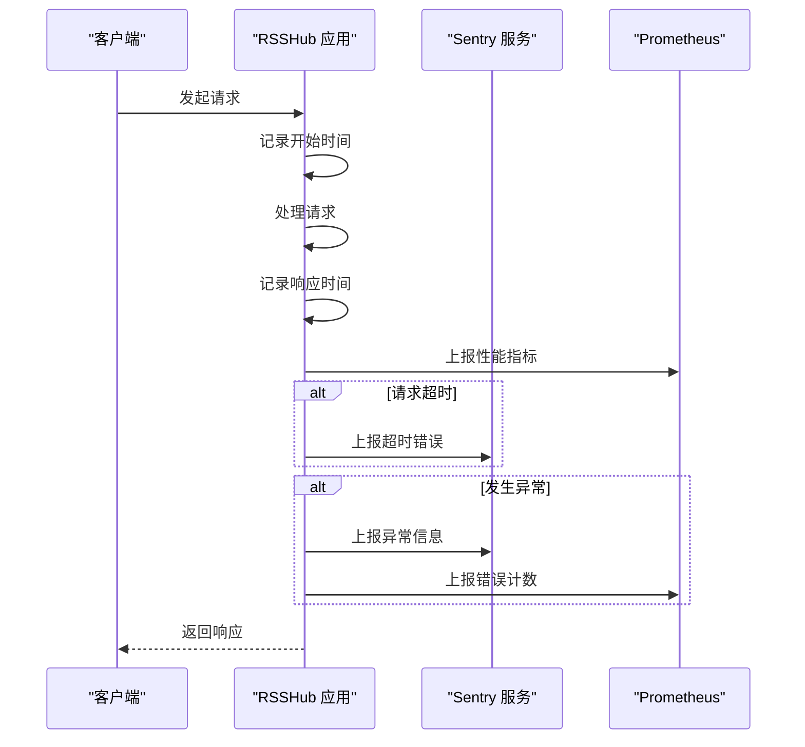
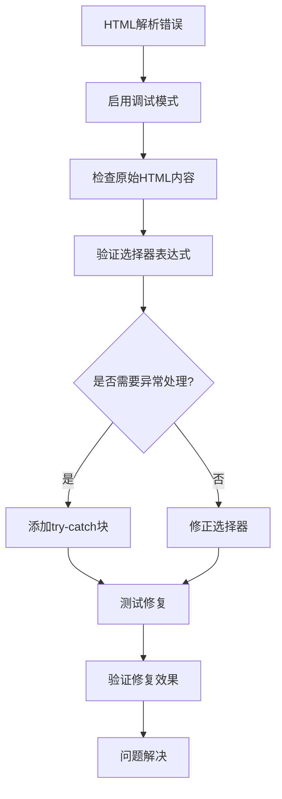
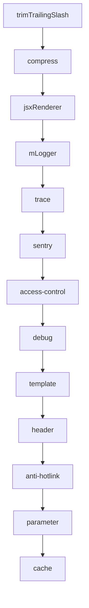
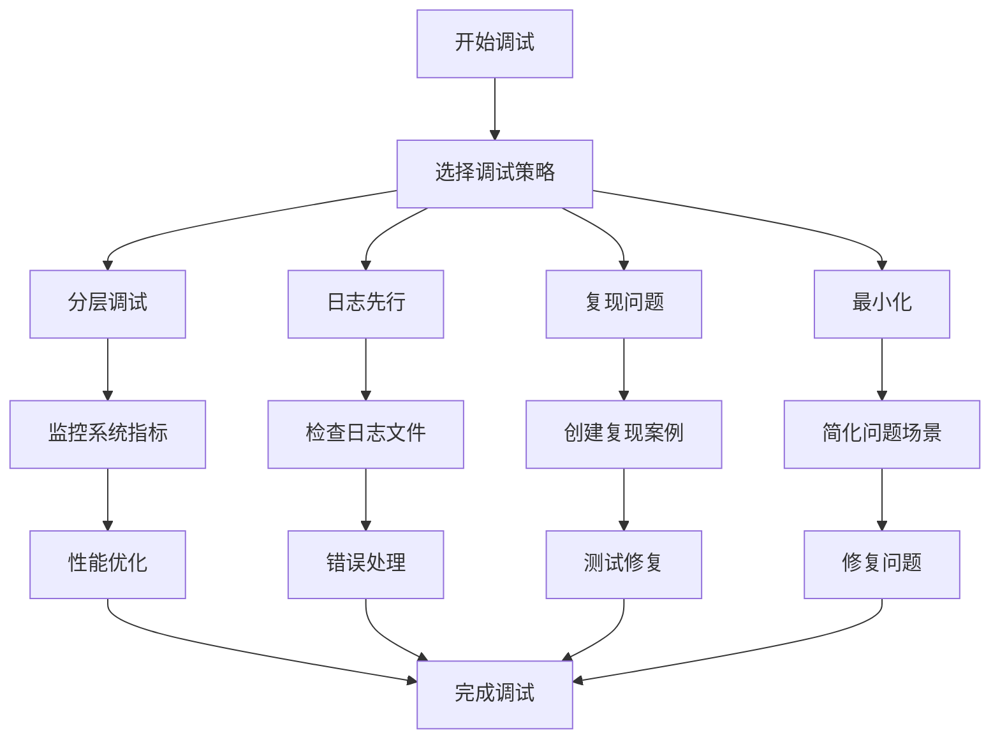

# 调试技巧

<cite>
**本文档引用的文件**
- [debug.ts](file://lib/middleware/debug.ts)
- [logger.ts](file://lib/middleware/logger.ts)
- [trace.ts](file://lib/middleware/trace.ts)
- [config.ts](file://lib/config.ts)
- [debug-info.ts](file://lib/utils/debug-info.ts)
- [app-bootstrap.tsx](file://lib/app-bootstrap.tsx)
- [sentry.ts](file://lib/middleware/sentry.ts)
- [errors/index.tsx](file://lib/errors/index.tsx)
- [utils/logger.ts](file://lib/utils/logger.ts)
- [utils/otel/metric.ts](file://lib/utils/otel/metric.ts)
</cite>

## 目录
1. [简介](#简介)
2. [调试中间件使用](#调试中间件使用)
3. [日志系统配置](#日志系统配置)
4. [请求追踪功能](#请求追踪功能)
5. [实际调试场景](#实际调试场景)
6. [调试工具配置](#调试工具配置)
7. [最佳实践](#最佳实践)
8. [结论](#结论)

## 简介
RSSHub 提供了一套完整的调试工具链，帮助开发者有效诊断和解决系统中的问题。本文档详细介绍了调试中间件的使用方法、日志系统的配置、请求追踪功能以及实际的调试场景示例。通过合理配置和使用这些工具，开发者可以快速定位性能瓶颈、错误根源，并解决常见的缓存、解析等问题。

**调试中间件使用**
- [debug.ts](file://lib/middleware/debug.ts#L1-L40)
- [config.ts](file://lib/config.ts#L770-L772)

**日志系统配置**
- [logger.ts](file://lib/middleware/logger.ts#L1-L45)
- [utils/logger.ts](file://lib/utils/logger.ts#L1-L49)

**请求追踪功能**
- [trace.ts](file://lib/middleware/trace.ts#L1-L26)
- [sentry.ts](file://lib/middleware/sentry.ts#L1-L28)

## 调试中间件使用

RSSHub 的调试中间件提供了详细的请求和响应信息追踪功能。通过配置 `DEBUG_INFO` 环境变量，可以控制调试信息的显示方式。

调试中间件的主要功能包括：
- 统计请求总量
- 记录缓存命中情况
- 跟踪 ETag 匹配状态
- 分析热门路由和路径

调试模式的配置选项：
- `true`：永久显示调试信息
- `false`：永远隐藏调试信息
- `some_string`：只有在请求中包含 `?debug=some_string` 参数时才显示

**调试中间件使用**
- [debug.ts](file://lib/middleware/debug.ts#L6-L39)
- [config.ts](file://lib/config.ts#L770-L772)
- [debug-info.ts](file://lib/utils/debug-info.ts#L1-L24)

## 日志系统配置

RSSHub 的日志系统基于 Winston 实现，提供了灵活的日志级别配置和输出格式。

日志级别配置通过 `LOGGER_LEVEL` 环境变量设置，支持以下级别：
- `error`：仅记录错误信息
- `warn`：记录警告和错误信息
- `info`：记录基本信息、警告和错误信息
- `verbose`：记录详细信息
- `debug`：记录调试信息
- `silly`：记录所有信息

日志输出包含以下信息：
- 请求方法和路径
- 响应状态码（彩色显示）
- 请求处理时间
- 错误堆栈信息

**日志系统配置**
- [logger.ts](file://lib/middleware/logger.ts#L29-L45)
- [utils/logger.ts](file://lib/utils/logger.ts#L7-L30)
- [config.ts](file://lib/config.ts#L772-L773)

## 请求追踪功能

RSSHub 提供了多层次的请求追踪功能，帮助开发者分析性能瓶颈和错误根源。

### 调试信息追踪
调试中间件收集以下性能指标：
- 请求总量统计
- 缓存命中率
- ETag 匹配率
- 系统健康度
- 运行时间
- 热门路由和路径

### Sentry 错误追踪
通过配置 `SENTRY` DSN，可以启用 Sentry 错误监控：
- 自动上报未捕获的异常
- 记录错误发生时的上下文信息
- 监控路由超时情况
- 跟踪错误发生的路由名称

### OpenTelemetry 性能监控
RSSHub 集成了 OpenTelemetry，提供详细的性能指标：
- 请求持续时间直方图
- 请求成功率统计
- 错误请求计数
- 自定义指标收集

**请求追踪功能**
- [trace.ts](file://lib/middleware/trace.ts#L7-L26)
- [sentry.ts](file://lib/middleware/sentry.ts#L8-L28)
- [utils/otel/metric.ts](file://lib/utils/otel/metric.ts#L34-L56)
- [errors/index.tsx](file://lib/errors/index.tsx#L39-L44)

## 实际调试场景

### HTML 解析错误处理
当遇到 HTML 解析错误时，可以采取以下步骤：
1. 启用详细日志记录
2. 检查原始 HTML 内容
3. 验证选择器表达式
4. 处理异常情况

### 应对 API 变更
当目标网站 API 发生变更时：
1. 检查返回的数据结构
2. 更新数据提取逻辑
3. 添加兼容性处理
4. 测试新旧版本

### 解决缓存问题
常见缓存问题及解决方案：
- 缓存未生效：检查缓存配置和中间件顺序
- 缓存过期：调整 `CACHE_EXPIRE` 设置
- 缓存穿透：实现适当的缓存策略
- 缓存雪崩：设置随机的缓存过期时间

**实际调试场景**
- [errors/index.tsx](file://lib/errors/index.tsx#L46-L68)
- [utils/debug-info.ts](file://lib/utils/debug-info.ts#L1-L24)
- [middleware/cache.test.ts](file://lib/middleware/cache.test.ts#L173-L190)

## 调试工具配置

### 环境变量配置
关键调试相关的环境变量：

| 环境变量 | 默认值 | 说明 |
|---------|-------|------|
| DEBUG_INFO | true | 调试信息显示控制 |
| LOGGER_LEVEL | info | 日志级别设置 |
| SENTRY | undefined | Sentry DSN |
| SENTRY_ROUTE_TIMEOUT | 30000 | 路由超时阈值（毫秒） |
| NO_LOGFILES | false | 是否禁用日志文件 |
| SHOW_LOGGER_TIMESTAMP | false | 是否显示日志时间戳 |

### 中间件执行顺序
RSSHub 中间件按以下顺序执行，这对调试至关重要：

1. trimTrailingSlash - 去除尾部斜杠
2. compress - 响应压缩
3. jsxRenderer - JSX 渲染器
4. mLogger - 日志记录
5. trace - 链路追踪
6. sentry - 错误追踪
7. access-control - 访问控制
8. debug - 调试支持
9. template - 模板处理
10. header - 请求头处理
11. anti-hotlink - 热链保护
12. parameter - 参数处理
13. cache - 缓存管理

**调试工具配置**
- [config.ts](file://lib/config.ts#L770-L783)
- [app-bootstrap.tsx](file://lib/app-bootstrap.tsx#L36-L45)

## 最佳实践

### 调试策略
1. **分层调试**：从外到内逐层排查问题
2. **日志先行**：先查看日志信息，再深入代码
3. **复现问题**：确保能够稳定复现问题
4. **最小化**：创建最小可复现案例

### 性能优化
1. **监控热门路由**：关注访问量大的路由
2. **优化缓存策略**：合理设置缓存过期时间
3. **减少外部依赖**：降低对外部服务的依赖
4. **异步处理**：将耗时操作异步化

### 错误处理
1. **优雅降级**：在错误发生时提供备用方案
2. **详细记录**：记录足够的上下文信息
3. **用户友好**：向用户展示友好的错误信息
4. **自动恢复**：实现自动重试和恢复机制

**最佳实践**
- [errors/index.tsx](file://lib/errors/index.tsx#L46-L82)
- [utils/otel/metric.ts](file://lib/utils/otel/metric.ts#L47-L56)
- [middleware/logger.ts](file://lib/middleware/logger.ts#L41-L42)

## 结论
RSSHub 提供了一套完整的调试工具链，包括调试中间件、日志系统、请求追踪和错误监控等功能。通过合理配置和使用这些工具，开发者可以快速定位和解决各种问题。建议在开发和测试环境中充分使用这些调试功能，在生产环境中根据需要调整日志级别和监控强度，以平衡调试需求和系统性能。