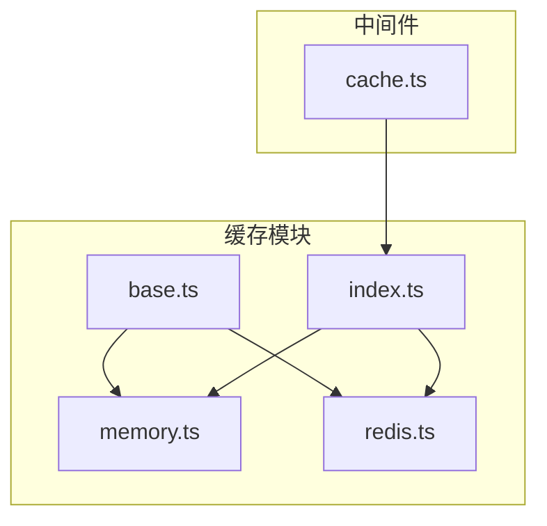
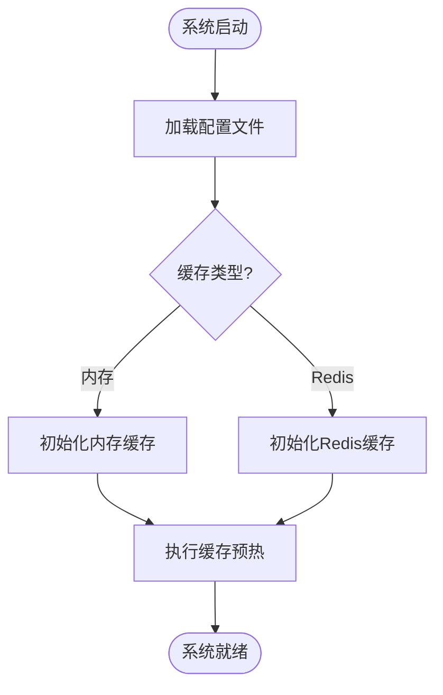
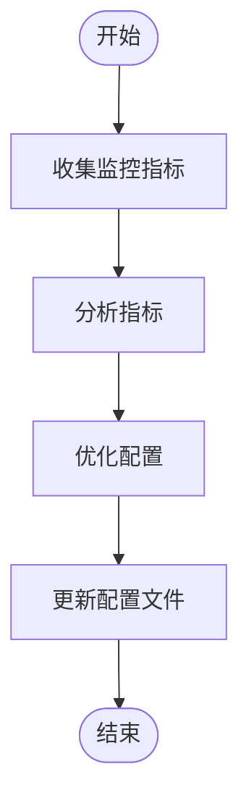

# 缓存优化

<cite>
**本文档中引用的文件**  
- [cache.ts](file://lib/middleware/cache.ts)
- [index.ts](file://lib/utils/cache/index.ts)
- [memory.ts](file://lib/utils/cache/memory.ts)
- [redis.ts](file://lib/utils/cache/redis.ts)
- [base.ts](file://lib/utils/cache/base.ts)
- [config.ts](file://lib/config.ts)
- [utils.ts](file://lib/routes/newrank/utils.ts)
</cite>

## 目录
1. [引言](#引言)
2. [缓存架构概述](#缓存架构概述)
3. [缓存键设计原则与最佳实践](#缓存键设计原则与最佳实践)
4. [缓存预热策略](#缓存预热策略)
5. [智能缓存更新机制](#智能缓存更新机制)
6. [分布式环境下的缓存一致性](#分布式环境下的缓存一致性)
7. [缓存性能监控与调优](#缓存性能监控与调优)
8. [缓存失效策略与异常处理](#缓存失效策略与异常处理)
9. [总结](#总结)

## 引言

RSSHub 是一个开源的 RSS 生成器，其核心功能依赖于高效的缓存机制来提升性能和响应速度。本文档深入探讨 RSSHub 缓存机制的高级优化技巧，涵盖缓存键设计、预热策略、智能更新、分布式一致性、性能监控与调优等多个方面，旨在为开发者提供全面的缓存优化指导。

## 缓存架构概述

RSSHub 的缓存系统支持多种后端存储，包括内存（memory）和 Redis。系统通过配置文件 `config.ts` 中的 `CACHE_TYPE` 环境变量来决定使用哪种缓存类型。默认情况下，系统使用内存缓存，但可以通过配置切换到 Redis 以支持分布式部署。

缓存模块的核心实现位于 `lib/utils/cache/` 目录下，主要包括以下几个文件：
- `base.ts`：定义了缓存模块的接口。
- `memory.ts`：实现了基于 LRU（Least Recently Used）算法的内存缓存。
- `redis.ts`：实现了基于 Redis 的分布式缓存。
- `index.ts`：根据配置初始化并导出相应的缓存实例。

中间件 `lib/middleware/cache.ts` 负责在请求处理过程中应用缓存逻辑，通过检查缓存是否存在来决定是否直接返回缓存数据或继续执行后续处理。



**Diagram sources**
- [base.ts](file://lib/utils/cache/base.ts)
- [memory.ts](file://lib/utils/cache/memory.ts)
- [redis.ts](file://lib/utils/cache/redis.ts)
- [index.ts](file://lib/utils/cache/index.ts)
- [cache.ts](file://lib/middleware/cache.ts)

## 缓存键设计原则与最佳实践

缓存键的设计是确保缓存高效性和避免冲突的关键。RSSHub 的缓存键设计遵循以下原则：

1. **唯一性**：每个缓存键必须唯一标识一个数据项，避免不同数据项使用相同的键导致冲突。
2. **可读性**：虽然缓存键通常经过哈希处理以缩短长度，但在调试时应尽量保持一定的可读性。
3. **层次化**：使用冒号 `:` 作为分隔符创建层次化的键结构，便于管理和查询。

例如，在 `lib/middleware/cache.ts` 中，缓存键的生成方式如下：
```typescript
const key = 'rsshub:koa-redis-cache:' + h64ToString(requestPath + format + limit);
```
这里，`rsshub:koa-redis-cache:` 是前缀，`requestPath`、`format` 和 `limit` 是请求的具体参数，通过 XXH64 哈希算法生成固定长度的字符串，确保键的唯一性和紧凑性。

**Section sources**
- [cache.ts](file://lib/middleware/cache.ts)

## 缓存预热策略

缓存预热是指在系统启动或特定时间点主动加载常用数据到缓存中，以减少首次访问时的延迟。RSSHub 通过配置文件中的 `CACHE_EXPIRE` 和 `CACHE_CONTENT_EXPIRE` 参数来控制缓存的有效期，从而实现自动预热。

在系统启动时，可以通过脚本或定时任务调用关键接口，触发缓存填充。例如，可以编写一个脚本定期请求热门路由，确保这些数据始终处于缓存中。



**Diagram sources**
- [config.ts](file://lib/config.ts)
- [index.ts](file://lib/utils/cache/index.ts)

## 智能缓存更新机制

智能缓存更新机制基于内容变化自动刷新缓存，确保数据的实时性和准确性。RSSHub 通过 `tryGet` 方法实现了这一机制，该方法在缓存未命中时会调用提供的 `getValueFunc` 函数获取最新数据，并将其存入缓存。

`tryGet` 方法的签名如下：
```typescript
tryGet: async <T extends string | Record<string, any>>(key: string, getValueFunc: () => Promise<T>, maxAge = config.cache.contentExpire, refresh = true) => T
```
其中，`key` 是缓存键，`getValueFunc` 是获取数据的异步函数，`maxAge` 是缓存的最大存活时间，`refresh` 表示是否在命中缓存时更新其过期时间。

通过这种方式，系统可以在数据发生变化时自动更新缓存，而无需手动干预。

**Section sources**
- [index.ts](file://lib/utils/cache/index.ts)

## 分布式环境下的缓存一致性

在分布式环境中，多个实例可能同时访问和修改同一份数据，因此需要解决缓存一致性问题。RSSHub 通过以下几种方式来保证缓存的一致性：

1. **分布式锁**：在更新缓存时使用分布式锁，确保同一时间只有一个实例可以修改缓存。
2. **版本号机制**：为每个数据项添加版本号，每次更新时递增版本号，客户端在读取数据时检查版本号是否匹配。
3. **事件驱动更新**：当数据发生变化时，发布事件通知所有实例更新缓存。

例如，在 `lib/utils/cache/redis.ts` 中，通过 Redis 的原子操作来实现分布式锁：
```typescript
await clients.redisClient.set(controlKey, '1', config.cache.requestTimeout);
```
这里的 `controlKey` 用于标记某个路径正在被请求，防止多个实例同时处理同一个请求。

**Section sources**
- [redis.ts](file://lib/utils/cache/redis.ts)

## 缓存性能监控与调优

缓存性能监控是确保系统稳定运行的重要环节。RSSHub 提供了多种监控指标，包括缓存命中率、内存使用情况等。这些指标可以通过日志或监控工具进行收集和分析。

### 缓存命中率优化

缓存命中率是衡量缓存效果的重要指标。高命中率意味着大多数请求都能从缓存中直接获取数据，减少了后端负载。为了提高命中率，可以采取以下措施：
- **合理设置缓存有效期**：根据数据的更新频率调整 `CACHE_EXPIRE` 和 `CACHE_CONTENT_EXPIRE` 参数。
- **优化缓存键设计**：确保缓存键的唯一性和层次化，避免不必要的缓存未命中。

### 内存使用优化

内存使用优化主要针对内存缓存，避免因缓存过大导致内存溢出。可以通过以下方式优化内存使用：
- **限制缓存大小**：通过 `MEMORY_MAX` 参数设置内存缓存的最大容量。
- **使用 LRU 算法**：自动淘汰最近最少使用的数据，保持缓存的高效性。



**Diagram sources**
- [config.ts](file://lib/config.ts)
- [memory.ts](file://lib/utils/cache/memory.ts)

## 缓存失效策略与异常处理

缓存失效策略决定了缓存数据何时过期并被清除。RSSHub 支持多种缓存失效策略，包括基于时间的失效和基于事件的失效。

### 基于时间的失效

基于时间的失效是最常见的策略，通过设置 `maxAge` 参数来控制缓存的有效期。一旦超过设定的时间，缓存数据将自动失效。

### 基于事件的失效

基于事件的失效适用于数据频繁变化的场景。当数据发生变化时，通过发布事件通知缓存系统立即清除相关缓存。

### 异常处理

在缓存操作过程中可能会遇到各种异常，如网络故障、Redis 连接失败等。RSSHub 通过以下方式处理异常：
- **重试机制**：在网络故障时自动重试，直到成功或达到最大重试次数。
- **降级策略**：当缓存不可用时，降级到直接从后端获取数据，确保服务的可用性。

例如，在 `lib/middleware/cache.ts` 中，当检测到某个路径正在被请求时，会等待一段时间后再次尝试：
```typescript
let retryTimes = process.env.NODE_ENV === 'test' ? 1 : 10;
let bypass = false;
while (retryTimes > 0) {
    await new Promise((resolve) => setTimeout(resolve, process.env.NODE_ENV === 'test' ? 3000 : 6000));
    if ((await cacheModule.globalCache.get(controlKey)) !== '1') {
        bypass = true;
        break;
    }
    retryTimes--;
}
if (!bypass) {
    throw new RequestInProgressError('This path is currently fetching, please come back later!');
}
```

**Section sources**
- [cache.ts](file://lib/middleware/cache.ts)

## 总结

本文档详细介绍了 RSSHub 缓存机制的高级优化技巧，涵盖了缓存键设计、预热策略、智能更新、分布式一致性、性能监控与调优以及缓存失效策略与异常处理等方面。通过合理配置和优化，可以显著提升系统的性能和稳定性，为用户提供更好的体验。