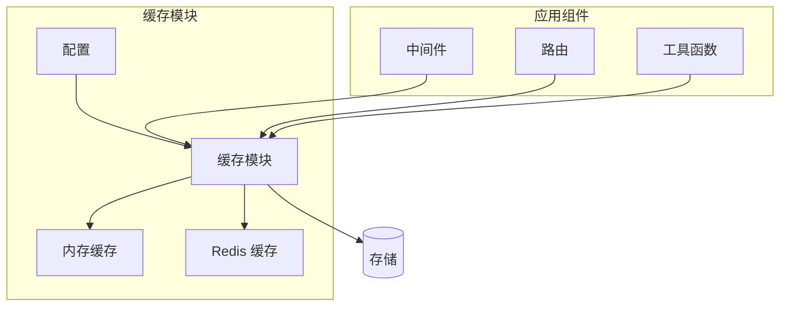
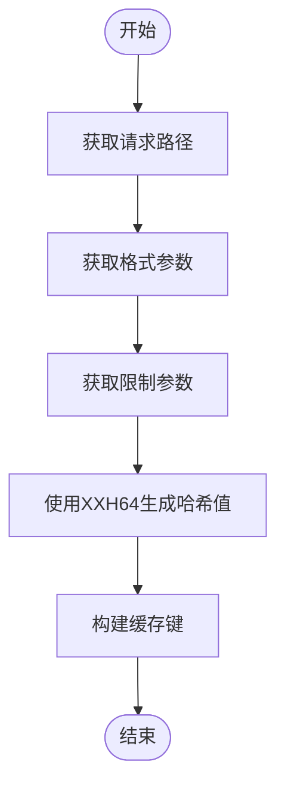
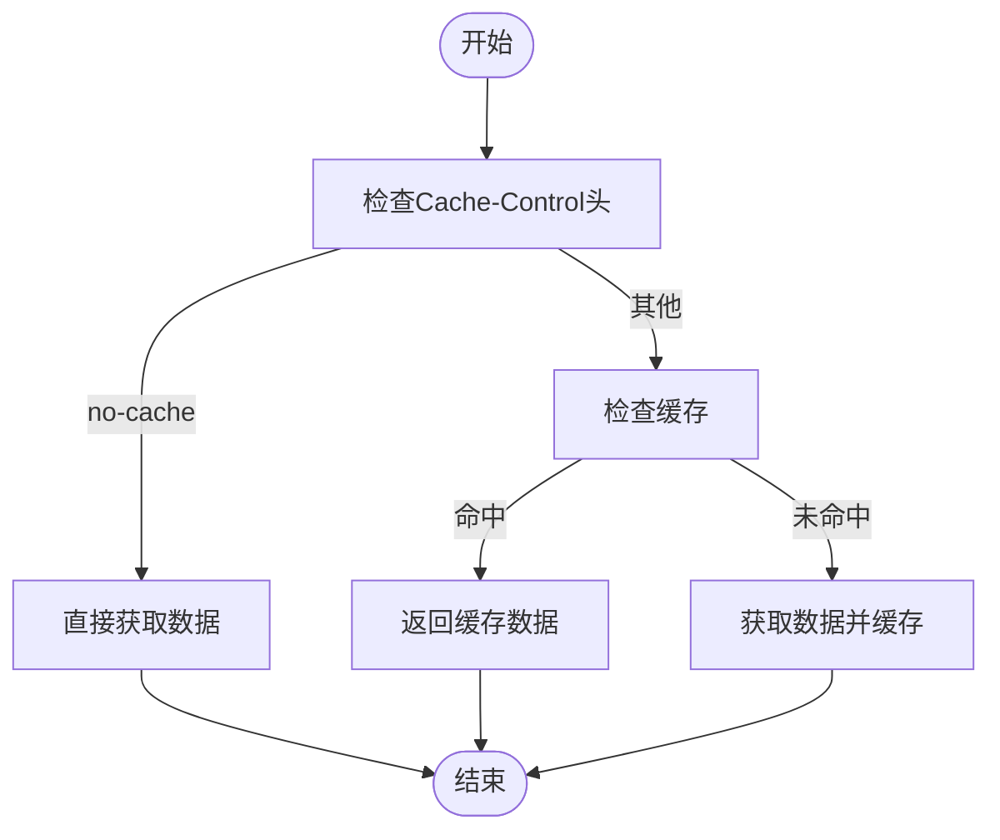
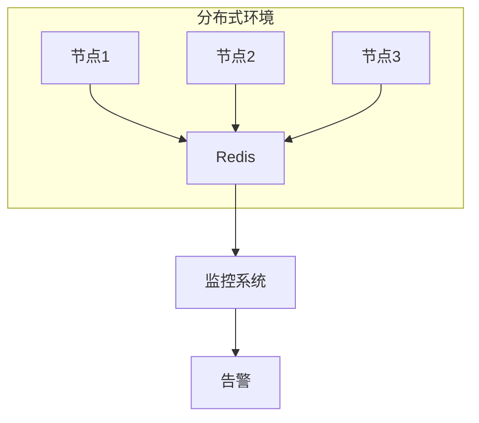
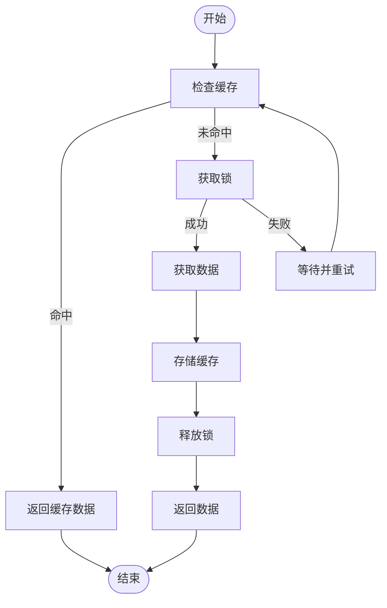

# 缓存策略

<cite>
**本文档引用的文件**
- [cache.ts](file://lib/middleware/cache.ts)
- [cache.test.ts](file://lib/middleware/cache.test.ts)
- [index.ts](file://lib/utils/cache/index.ts)
- [memory.ts](file://lib/utils/cache/memory.ts)
- [redis.ts](file://lib/utils/cache/redis.ts)
- [config.ts](file://lib/config.ts)
- [bilibili/cache.ts](file://lib/routes/bilibili/cache.ts)
- [header.ts](file://lib/middleware/header.ts)
- [template.tsx](file://lib/middleware/template.tsx)
</cite>

## 目录
1. [引言](#引言)
2. [缓存机制概述](#缓存机制概述)
3. [缓存键生成规则](#缓存键生成规则)
4. [缓存策略类型](#缓存策略类型)
5. [缓存过期时间设置](#缓存过期时间设置)
6. [分布式缓存注意事项](#分布式缓存注意事项)
7. [缓存调试与监控](#缓存调试与监控)
8. [路由开发中的缓存应用](#路由开发中的缓存应用)
9. [缓存穿透与雪崩处理](#缓存穿透与雪崩处理)
10. [结论](#结论)

## 引言

RSSHub 是一个开源的 RSS 生成器，通过缓存机制来提高性能和响应速度。本文档详细解释了 RSSHub 的缓存机制及其在路由开发中的应用，包括缓存键的生成规则、命名约定、不同缓存策略的适用场景、缓存过期时间的设置、分布式缓存环境下的注意事项以及缓存调试和监控方法。

## 缓存机制概述

RSSHub 的缓存机制主要通过中间件实现，支持内存缓存和 Redis 缓存两种类型。缓存模块在应用启动时根据配置初始化，并提供统一的接口供其他组件使用。



**Diagram sources**
- [config.ts](file://lib/config.ts#L263-L274)
- [index.ts](file://lib/utils/cache/index.ts#L18-L59)

**Section sources**
- [config.ts](file://lib/config.ts#L263-L274)
- [index.ts](file://lib/utils/cache/index.ts#L18-L59)

## 缓存键生成规则

缓存键的生成规则是确保缓存唯一性和有效性的关键。RSSHub 使用请求路径、格式和限制参数来生成缓存键，并通过 XXH64 哈希算法缩小键的大小。

### 缓存键生成流程

1. 获取请求路径 `requestPath`
2. 获取格式参数 `format`，默认为 `rss`
3. 获取限制参数 `limit`，如果存在则添加
4. 使用 XXH64 哈希算法生成哈希值
5. 构建最终的缓存键



**Diagram sources**
- [cache.ts](file://lib/middleware/cache.ts#L19-L23)

**Section sources**
- [cache.ts](file://lib/middleware/cache.ts#L19-L23)

## 缓存策略类型

RSSHub 支持多种缓存策略，包括基于时间的缓存和条件缓存。

### 时间-based 缓存

时间-based 缓存是最常见的缓存策略，通过设置固定的过期时间来控制缓存的有效期。RSSHub 的路由缓存过期时间由 `CACHE_EXPIRE` 环境变量控制，默认为 5 分钟。

### 条件缓存

条件缓存根据特定条件决定是否使用缓存。例如，当请求头中包含 `Cache-Control: no-cache` 时，RSSHub 会跳过缓存直接获取最新数据。



**Diagram sources**
- [cache.ts](file://lib/middleware/cache.ts#L71-L75)

**Section sources**
- [cache.ts](file://lib/middleware/cache.ts#L71-L75)

## 缓存过期时间设置

合理的缓存过期时间可以平衡数据新鲜度和性能。RSSHub 提供了多个配置选项来控制缓存过期时间。

### 配置选项

- `CACHE_EXPIRE`: 路由缓存过期时间，单位为秒，默认为 300 秒（5 分钟）
- `CACHE_CONTENT_EXPIRE`: 不变内容缓存过期时间，单位为秒，默认为 3600 秒（1 小时）
- `CACHE_REQUEST_TIMEOUT`: 请求超时时间，单位为秒，默认为 60 秒

### 设置建议

- 对于频繁更新的内容，建议设置较短的过期时间（如 1-5 分钟）
- 对于较少变化的内容，可以设置较长的过期时间（如 30 分钟到 1 小时）
- 在高并发场景下，适当延长过期时间以减少后端压力

**Section sources**
- [config.ts](file://lib/config.ts#L738-L740)

## 分布式缓存注意事项

在分布式环境下使用缓存时，需要注意以下几点：

### 数据一致性

确保所有节点访问相同的缓存实例，避免因缓存不一致导致的问题。推荐使用 Redis 作为集中式缓存服务器。

### 容错处理

当缓存服务不可用时，应有相应的容错机制。RSSHub 在 Redis 连接失败时会记录错误日志并继续运行，但不会限制并发请求。

### 性能监控

定期监控缓存的命中率、响应时间和内存使用情况，及时发现和解决问题。



**Diagram sources**
- [redis.ts](file://lib/utils/cache/redis.ts#L20-L34)

**Section sources**
- [redis.ts](file://lib/utils/cache/redis.ts#L20-L34)

## 缓存调试与监控

有效的调试和监控可以帮助开发者更好地理解和优化缓存行为。

### 调试信息

通过设置 `DEBUG_INFO` 环境变量，可以在响应头中查看缓存状态。例如，`RSSHub-Cache-Status: HIT` 表示缓存命中。

### 监控指标

- 缓存命中率：反映缓存的有效性
- 平均响应时间：衡量缓存对性能的影响
- 内存使用率：监控缓存占用的资源

### 日志记录

启用详细的日志记录，跟踪缓存的读写操作和异常情况。

**Section sources**
- [debug.ts](file://lib/middleware/debug.ts#L29-L31)
- [header.ts](file://lib/middleware/header.ts#L50-L52)

## 路由开发中的缓存应用

在开发新的路由时，合理利用缓存可以显著提升用户体验。

### 缓存控制

通过 `ctx.set('cacheKey', key)` 和 `ctx.set('cacheControlKey', controlKey)` 可以让路由控制缓存行为。

### 示例代码

```typescript
const key = 'rsshub:koa-redis-cache:' + h64ToString(requestPath + format + limit);
const controlKey = 'rsshub:path-requested:' + h64ToString(requestPath + format + limit);

ctx.set('cacheKey', key);
ctx.set('cacheControlKey', controlKey);
```

**Section sources**
- [cache.ts](file://lib/middleware/cache.ts#L60-L61)

## 缓存穿透与雪崩处理

### 缓存穿透

缓存穿透是指查询一个不存在的数据，由于缓存中没有该数据，每次请求都会打到数据库。解决方案包括：

- 对空结果也进行缓存，设置较短的过期时间
- 使用布隆过滤器预判数据是否存在

### 缓存雪崩

缓存雪崩是指大量缓存在同一时间过期，导致瞬间大量请求直接打到数据库。解决方案包括：

- 设置随机的过期时间，避免集中过期
- 使用互斥锁，保证只有一个请求去加载数据



**Diagram sources**
- [cache.ts](file://lib/middleware/cache.ts#L28-L43)

**Section sources**
- [cache.ts](file://lib/middleware/cache.ts#L28-L43)

## 结论

RSSHub 的缓存机制通过灵活的配置和高效的实现，有效提升了系统的性能和稳定性。开发者在路由开发中应充分利用缓存功能，合理设置缓存过期时间，并注意处理缓存穿透和雪崩等问题。通过有效的调试和监控，可以进一步优化缓存策略，提供更好的用户体验。