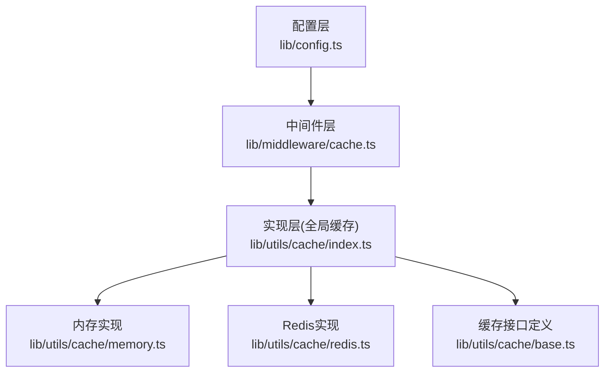
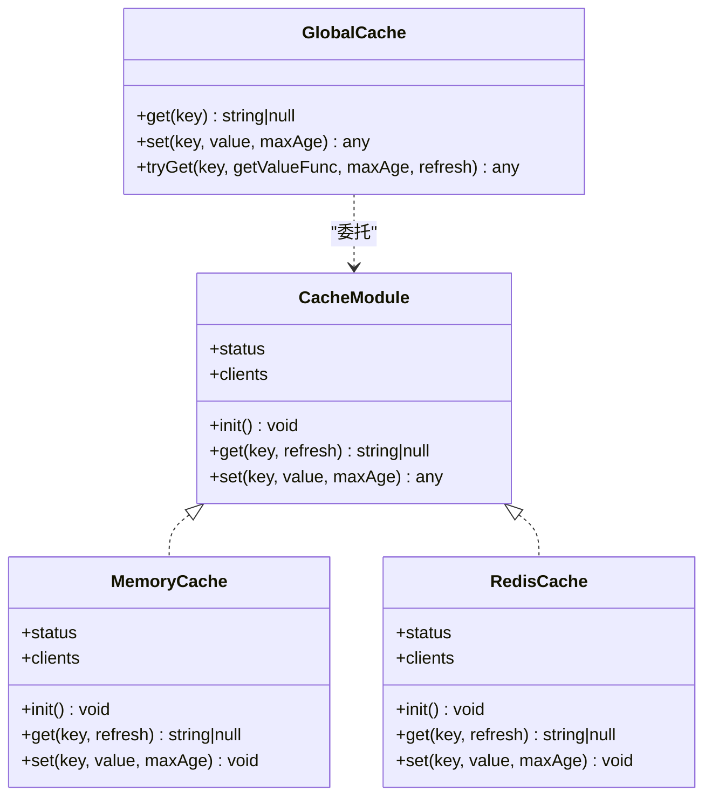
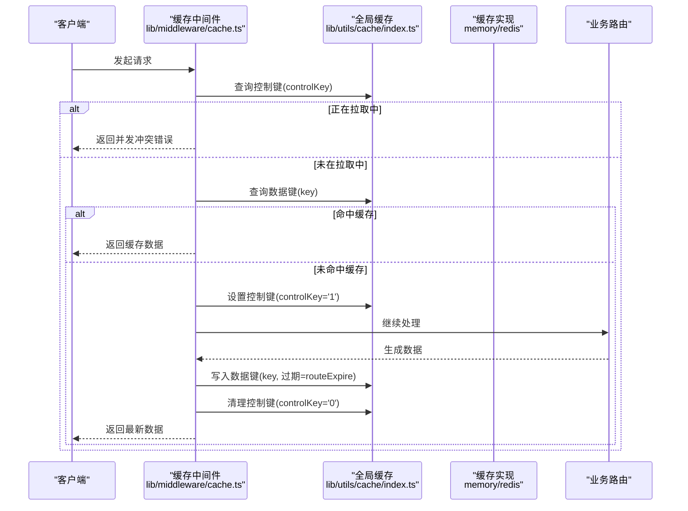

# 缓存配置

<cite>
**本文引用的文件列表**
- [lib/config.ts](file://lib/config.ts)
- [lib/middleware/cache.ts](file://lib/middleware/cache.ts)
- [lib/utils/cache/index.ts](file://lib/utils/cache/index.ts)
- [lib/utils/cache/memory.ts](file://lib/utils/cache/memory.ts)
- [lib/utils/cache/redis.ts](file://lib/utils/cache/redis.ts)
- [lib/utils/cache/base.ts](file://lib/utils/cache/base.ts)
- [lib/middleware/cache.test.ts](file://lib/middleware/cache.test.ts)
- [lib/utils/cache.test.ts](file://lib/utils/cache.test.ts)
- [scripts/ansible/rsshub.env](file://scripts/ansible/rsshub.env)
- [flake.nix](file://flake.nix)
</cite>

## 目录
1. [简介](#简介)
2. [项目结构与缓存相关模块](#项目结构与缓存相关模块)
3. [核心配置项与默认值](#核心配置项与默认值)
4. [缓存后端与实现细节](#缓存后端与实现细节)
5. [缓存中间件工作流](#缓存中间件工作流)
6. [开发与生产环境配置建议](#开发与生产环境配置建议)
7. [性能与资源影响](#性能与资源影响)
8. [故障排查与常见问题](#故障排查与常见问题)
9. [结论](#结论)

## 简介
本文件面向RSSHub使用者与运维人员，系统性说明缓存配置与使用方式，涵盖：
- 如何通过配置文件与环境变量设置缓存类型（内存/Redis）与过期时间
- 不同后端的配置方法、性能特点与适用场景
- 开发与生产环境的推荐配置策略
- 缓存相关环境变量的设置与优先级
- 缓存配置对系统性能与资源消耗的影响

## 项目结构与缓存相关模块
RSSHub的缓存体系由“配置层 → 中间件层 → 缓存实现层”构成：
- 配置层：从环境变量读取并计算出最终配置对象
- 中间件层：在路由请求前进行命中判断、并发控制与缓存写入
- 实现层：按配置选择内存或Redis作为后端，提供统一的get/set接口

图表来源
- [lib/config.ts](file://lib/config.ts#L733-L747)
- [lib/middleware/cache.ts](file://lib/middleware/cache.ts#L1-L84)
- [lib/utils/cache/index.ts](file://lib/utils/cache/index.ts#L1-L60)
- [lib/utils/cache/memory.ts](file://lib/utils/cache/memory.ts#L1-L45)
- [lib/utils/cache/redis.ts](file://lib/utils/cache/redis.ts#L1-L78)
- [lib/utils/cache/base.ts](file://lib/utils/cache/base.ts#L1-L17)

章节来源
- [lib/config.ts](file://lib/config.ts#L733-L747)
- [lib/middleware/cache.ts](file://lib/middleware/cache.ts#L1-L84)
- [lib/utils/cache/index.ts](file://lib/utils/cache/index.ts#L1-L60)
- [lib/utils/cache/memory.ts](file://lib/utils/cache/memory.ts#L1-L45)
- [lib/utils/cache/redis.ts](file://lib/utils/cache/redis.ts#L1-L78)
- [lib/utils/cache/base.ts](file://lib/utils/cache/base.ts#L1-L17)

## 核心配置项与默认值
RSSHub通过环境变量驱动缓存配置，主要键如下：
- 缓存类型：CACHE_TYPE
  - 取值："memory"、"redis" 或空字符串/非上述值时禁用缓存
  - 默认："memory"
- 请求并发控制超时：CACHE_REQUEST_TIMEOUT（秒）
  - 默认：60
- 路由缓存过期：CACHE_EXPIRE（秒）
  - 默认：5 分钟
- 内容缓存过期：CACHE_CONTENT_EXPIRE（秒）
  - 默认：1 小时
- 内存缓存最大条目数：MEMORY_MAX
  - 默认：2^8（256）
- Redis连接地址：REDIS_URL
  - 默认："redis://localhost:6379/"

这些键在配置文件中被解析并写入最终配置对象，供中间件与缓存实现使用。

章节来源
- [lib/config.ts](file://lib/config.ts#L22-L29)
- [lib/config.ts](file://lib/config.ts#L733-L747)

## 缓存后端与实现细节
RSSHub支持两种后端：内存LRU与Redis。实现层根据配置动态选择并初始化对应客户端。

- 全局缓存接口
  - 提供统一的get/set接口，供中间件直接使用
  - 当未启用缓存时，get/set返回空值/不写入

- 内存后端（LRU）
  - 使用LRUCache，基于ttl与max两个维度控制容量与过期
  - 初始化时以路由过期时间作为LRU的ttl，以MEMORY_MAX作为最大条目数
  - get时可选择是否刷新访问时间

- Redis后端
  - 使用ioredis客户端，连接地址来自REDIS_URL
  - get时会同时查询键与“TTL键”，若存在则刷新主键与TTL键的过期时间
  - set时若maxAge非默认值，则额外存储一个“TTL键”，用于后续get刷新

- 接口约束
  - Redis实现对内部使用的键前缀有保护，禁止外部使用保留前缀
  - 提供tryGet方法，支持miss时自动调用回调函数并缓存结果

图表来源
- [lib/utils/cache/base.ts](file://lib/utils/cache/base.ts#L1-L17)
- [lib/utils/cache/memory.ts](file://lib/utils/cache/memory.ts#L1-L45)
- [lib/utils/cache/redis.ts](file://lib/utils/cache/redis.ts#L1-L78)
- [lib/utils/cache/index.ts](file://lib/utils/cache/index.ts#L1-L101)

章节来源
- [lib/utils/cache/index.ts](file://lib/utils/cache/index.ts#L1-L60)
- [lib/utils/cache/memory.ts](file://lib/utils/cache/memory.ts#L1-L45)
- [lib/utils/cache/redis.ts](file://lib/utils/cache/redis.ts#L1-L78)
- [lib/utils/cache/base.ts](file://lib/utils/cache/base.ts#L1-L17)

## 缓存中间件工作流
中间件负责在请求进入路由前进行缓存命中与并发控制，流程如下：

图表来源
- [lib/middleware/cache.ts](file://lib/middleware/cache.ts#L1-L84)
- [lib/utils/cache/index.ts](file://lib/utils/cache/index.ts#L1-L60)

章节来源
- [lib/middleware/cache.ts](file://lib/middleware/cache.ts#L1-L84)

## 开发与生产环境配置建议
- 开发环境
  - 推荐使用内存缓存，便于本地调试且无需外部依赖
  - 可适当缩短过期时间以便快速验证变更
  - 示例键值参考：CACHE_TYPE=memory、CACHE_EXPIRE=60、CACHE_CONTENT_EXPIRE=300、MEMORY_MAX=512
  - 若需要演示并发控制效果，可将CACHE_REQUEST_TIMEOUT调小

- 生产环境
  - 推荐使用Redis缓存，跨进程/多实例共享，具备持久化能力
  - 根据流量规模调整MEMORY_MAX与Redis连接参数
  - 示例键值参考：CACHE_TYPE=redis、REDIS_URL=你的Redis地址、CACHE_EXPIRE=300、CACHE_CONTENT_EXPIRE=3600
  - 可结合部署工具（如Ansible）批量注入环境变量，避免硬编码

- 环境变量设置与优先级
  - 优先级：运行时环境变量 > 配置文件中显式赋值 > 默认值
  - 可通过脚本或容器编排工具设置，例如Ansible示例文件中包含NODE_ENV与CACHE_TYPE等键
  - Nix配置中也提供了环境变量与Redis参数的示例

章节来源
- [scripts/ansible/rsshub.env](file://scripts/ansible/rsshub.env#L1-L4)
- [flake.nix](file://flake.nix#L152-L188)
- [lib/config.ts](file://lib/config.ts#L733-L747)

## 性能与资源影响
- 内存缓存
  - 优点：低延迟、无网络开销、部署简单
  - 代价：单实例内存占用，重启丢失；多实例间无法共享
  - 适合：单实例部署、开发/测试、热点数据量较小

- Redis缓存
  - 优点：跨实例共享、持久化、可扩展
  - 代价：网络延迟、Redis资源占用、需维护连接与过期策略
  - 适合：生产多实例、高并发、需要持久化与共享的场景

- 过期策略对性能的影响
  - 路由缓存（routeExpire）：控制中间件层命中与写入的生命周期
  - 内容缓存（contentExpire）：控制具体RSS/数据内容的过期
  - MEMORY_MAX：限制内存LRU容量，避免内存膨胀

- 并发控制
  - 控制键用于避免同一路径的重复拉取，减少上游压力
  - 超时时间内未完成的请求会被阻塞或报错，合理设置超时可平衡吞吐与一致性

章节来源
- [lib/middleware/cache.ts](file://lib/middleware/cache.ts#L1-L84)
- [lib/utils/cache/index.ts](file://lib/utils/cache/index.ts#L1-L60)
- [lib/utils/cache/memory.ts](file://lib/utils/cache/memory.ts#L1-L45)
- [lib/utils/cache/redis.ts](file://lib/utils/cache/redis.ts#L1-L78)
- [lib/config.ts](file://lib/config.ts#L733-L747)

## 故障排查与常见问题
- 禁用缓存
  - 当CACHE_TYPE为空字符串或非memory/redis时，缓存不可用，中间件不会进行命中与写入
  - 测试用例覆盖了禁用缓存的情况，可参考验证行为

- Redis连接异常
  - 当Redis连接失败或被主动关闭时，缓存可用状态会变为不可用，所有get/set返回空值
  - 测试用例展示了错误连接与退出后的表现

- 键名冲突与保留前缀
  - Redis实现对内部使用的键前缀做了保护，禁止外部使用保留前缀
  - tryGet方法要求键必须为字符串，否则抛出错误

- 并发冲突
  - 同一路径在请求超时内重复访问会被拒绝，直到控制键释放
  - 可通过调整CACHE_REQUEST_TIMEOUT与业务逻辑避免频繁冲突

章节来源
- [lib/middleware/cache.test.ts](file://lib/middleware/cache.test.ts#L132-L190)
- [lib/utils/cache.test.ts](file://lib/utils/cache.test.ts#L1-L92)
- [lib/utils/cache/redis.ts](file://lib/utils/cache/redis.ts#L13-L18)
- [lib/utils/cache/index.ts](file://lib/utils/cache/index.ts#L75-L98)
- [lib/middleware/cache.ts](file://lib/middleware/cache.ts#L28-L44)

## 结论
RSSHub的缓存配置以环境变量为核心，通过配置层统一计算，中间件与实现层解耦协作。内存与Redis两种后端分别适用于开发与生产场景。正确设置过期时间与容量参数，有助于在性能与资源之间取得平衡。建议在生产环境中采用Redis，并结合监控与压测持续优化过期策略与并发控制参数。