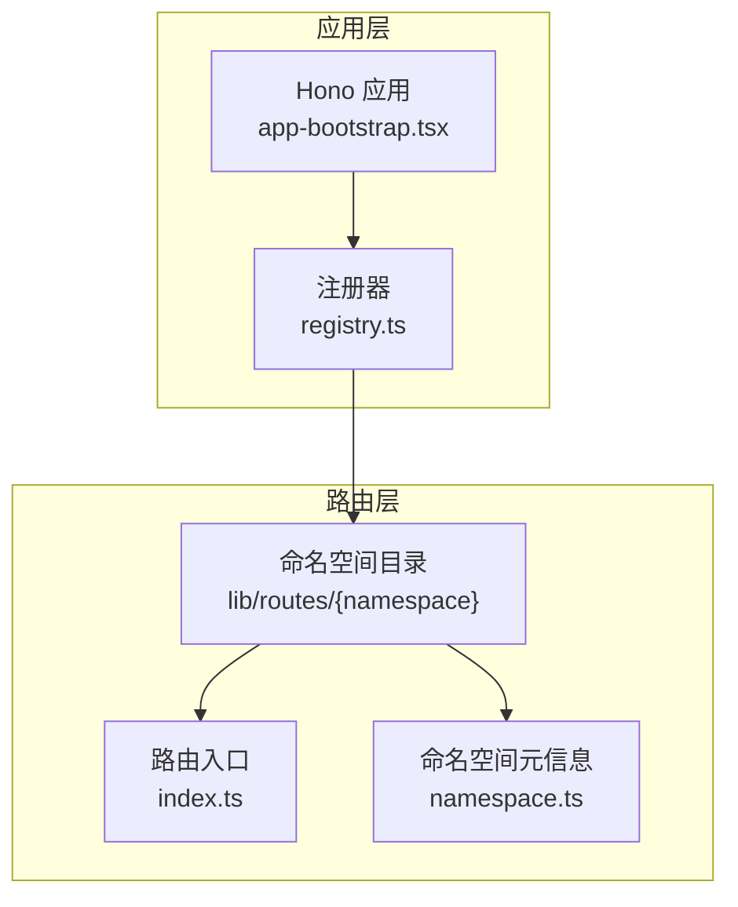
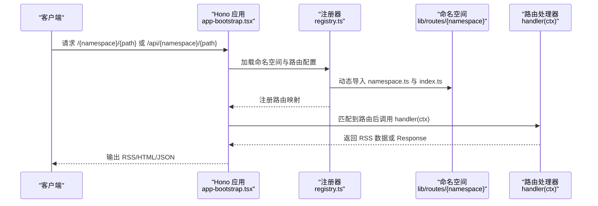
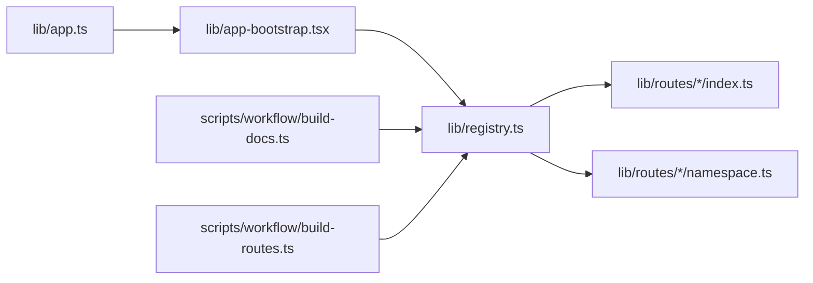

# 路由创建

<cite>
**本文引用的文件**
- [lib/app.ts](file://lib/app.ts)
- [lib/app-bootstrap.tsx](file://lib/app-bootstrap.tsx)
- [lib/router.js](file://lib/router.js)
- [lib/registry.ts](file://lib/registry.ts)
- [lib/types.ts](file://lib/types.ts)
- [lib/routes/005/namespace.ts](file://lib/routes/005/namespace.ts)
- [lib/routes/005/index.ts](file://lib/routes/005/index.ts)
- [lib/routes/12306/namespace.ts](file://lib/routes/12306/namespace.ts)
- [lib/routes/12306/index.ts](file://lib/routes/12306/index.ts)
- [lib/api/category/one.ts](file://lib/api/category/one.ts)
- [lib/errors/types/invalid-parameter.ts](file://lib/errors/types/invalid-parameter.ts)
- [lib/utils/cache.ts](file://lib/utils/cache.ts)
- [lib/routes/test/index.ts](file://lib/routes/test/index.ts)
- [lib/pkg.ts](file://lib/pkg.ts)
- [lib/route-paths.d.ts](file://lib/route-paths.d.ts)
- [scripts/workflow/build-docs.ts](file://scripts/workflow/build-docs.ts)
- [scripts/workflow/build-routes.ts](file://scripts/workflow/build-routes.ts)
</cite>

## 目录
1. [简介](#简介)
2. [项目结构](#项目结构)
3. [核心组件](#核心组件)
4. [架构总览](#架构总览)
5. [详细组件分析](#详细组件分析)
6. [依赖关系分析](#依赖关系分析)
7. [性能考量](#性能考量)
8. [故障排查指南](#故障排查指南)
9. [结论](#结论)
10. [附录：从零开始创建一个新路由](#附录从零开始创建一个新路由)

## 简介
本指南面向希望在 RSSHub 中新增内容源路由的开发者，系统讲解路由文件的命名约定与目录结构、路由配置对象字段语义、参数解析与校验、路由注册与匹配机制、以及冲突避免与命名最佳实践。文档同时提供从创建路由文件到成功部署的完整流程说明，并通过真实示例文件展示关键实现细节与调用链路。

## 项目结构
RSSHub 的路由体系采用“命名空间 + 路由路径”的两级组织方式：
- 命名空间：每个站点或业务域对应一个命名空间目录（如 005、12306），用于聚合该域下的所有路由。
- 路由文件：在命名空间目录下通常包含两个文件：
  - namespace.ts：声明该命名空间的元信息（名称、站点 URL、分类、语言等）。
  - index.ts：导出 route 配置对象与 handler 函数，定义路由路径、参数、示例、描述、特性等。

路由注册与运行时匹配由 Hono 应用与注册器共同完成：
- Hono 应用在启动时挂载中间件、路由与错误处理。
- 注册器负责扫描 routes 目录，收集命名空间与路由配置，并按命名空间挂载到 /{namespace} 与 /api/{namespace} 路由前缀下。

图表来源
- [lib/app-bootstrap.tsx](file://lib/app-bootstrap.tsx#L1-L54)
- [lib/registry.ts](file://lib/registry.ts#L1-L272)
- [lib/routes/005/namespace.ts](file://lib/routes/005/namespace.ts#L1-L10)
- [lib/routes/005/index.ts](file://lib/routes/005/index.ts#L1-L156)

章节来源
- [lib/app-bootstrap.tsx](file://lib/app-bootstrap.tsx#L1-L54)
- [lib/registry.ts](file://lib/registry.ts#L1-L272)

## 核心组件
- Hono 应用与中间件栈：负责请求生命周期管理、压缩、模板渲染、日志、追踪、缓存、参数校验、访问控制、反热链等。
- 注册器：动态扫描 routes 目录，构建命名空间与路由索引，按命名空间挂载到 /{namespace} 与 /api/{namespace}。
- 路由配置对象 Route：定义路由路径、名称、示例、参数、描述、分类、特性、雷达规则等元数据。
- 路由处理器 handler：接收上下文 ctx，解析参数，抓取数据，返回标准化的 RSS 数据结构。

章节来源
- [lib/app-bootstrap.tsx](file://lib/app-bootstrap.tsx#L1-L54)
- [lib/registry.ts](file://lib/registry.ts#L1-L272)
- [lib/types.ts](file://lib/types.ts#L249-L463)

## 架构总览
RSSHub 的路由创建与运行时匹配流程如下：

图表来源
- [lib/app-bootstrap.tsx](file://lib/app-bootstrap.tsx#L1-L54)
- [lib/registry.ts](file://lib/registry.ts#L1-L272)
- [lib/routes/005/index.ts](file://lib/routes/005/index.ts#L1-L156)

## 详细组件分析

### 路由配置对象 Route 字段详解
- path：路由路径，支持字符串或数组；Hono 路由语法，支持参数占位符与可选段。
- name：人类可读的路由名称，用于文档标题与雷达规则标题。
- url：对应站点 URL（无协议）。
- maintainers：维护者 GitHub 用户名列表。
- handler：异步函数，接收 ctx，返回 RSS 数据对象或 Response。
- example：示例订阅地址，便于用户快速试用。
- parameters：参数描述，支持默认值与选项列表，用于生成文档与参数校验。
- description：对路由用途与注意事项的补充说明，支持 Markdown。
- categories：分类标签，用于文档与分类 API。
- features：特性开关，如是否需要额外配置、是否启用 Puppeteer、是否反爬、支持 BT/播客/Sci-Hub、NSFW 等。
- radar：RSSHub-Radar 规则，定义网页源与目标 RSSHub 路径的映射。
- view：默认视图类型（文章/社交/图片/视频/音频/通知）。

章节来源
- [lib/types.ts](file://lib/types.ts#L249-L463)

### 参数解析与校验
- 路由参数：通过 ctx.req.param('key') 获取路径参数；例如 /12306/:date/:from/:to/:type?。
- 查询参数：通过 ctx.req.query('key') 获取查询参数；例如 /005/:category?。
- 参数校验：当参数非法或缺失时抛出自定义异常（如 InvalidParameterError），由全局错误处理器统一响应。
- 示例：12306 路由对日期、站点、类型进行解析与校验；005 路由对分类与 limit 进行解析。

章节来源
- [lib/routes/12306/index.ts](file://lib/routes/12306/index.ts#L52-L131)
- [lib/routes/005/index.ts](file://lib/routes/005/index.ts#L12-L20)
- [lib/errors/types/invalid-parameter.ts](file://lib/errors/types/invalid-parameter.ts#L1-L5)
- [lib/routes/test/index.ts](file://lib/routes/test/index.ts#L20-L58)

### 路由注册与匹配
- 命名空间注册：registry.ts 扫描 routes 目录，按命名空间聚合路由与 API 路由。
- 路由排序：同命名空间内按段优先级排序（字面量段优先于参数段），确保精确匹配优先。
- 路由挂载：通过 app.basePath('/{namespace}') 与 app.get(path, handler) 完成挂载。
- API 路由：/api/{namespace} 下挂载 APIRoute，返回 JSON 结构。

章节来源
- [lib/registry.ts](file://lib/registry.ts#L1-L272)
- [lib/pkg.ts](file://lib/pkg.ts#L54-L75)

### 命名空间与文档生成
- 命名空间元信息：namespace.ts 提供 name、url、categories、description、lang 等。
- 文档生成：build-docs.ts 依据命名空间与路由配置生成分类文档，自动计算热度与排序。
- 路由路径类型：build-routes.ts 生成 route-paths 类型声明，便于静态类型约束。

章节来源
- [lib/routes/005/namespace.ts](file://lib/routes/005/namespace.ts#L1-L10)
- [lib/routes/12306/namespace.ts](file://lib/routes/12306/namespace.ts#L1-L8)
- [scripts/workflow/build-docs.ts](file://scripts/workflow/build-docs.ts#L28-L102)
- [scripts/workflow/build-routes.ts](file://scripts/workflow/build-routes.ts#L112-L127)
- [lib/route-paths.d.ts](file://lib/route-paths.d.ts#L1-L5)

### 路由处理器实现要点
- 解析参数与查询：ctx.req.param()/ctx.req.query()。
- 数据抓取：使用 utils/got 与 cheerio 等工具解析页面。
- 缓存复用：使用 utils/cache 的 tryGet 提升性能与稳定性。
- RSS 结构：返回标准化的 Data 对象（title/description/link/item 等）。
- 错误处理：对无效参数、网络异常、验证码等情况抛出特定异常。

章节来源
- [lib/routes/005/index.ts](file://lib/routes/005/index.ts#L12-L99)
- [lib/utils/cache.ts](file://lib/utils/cache.ts#L1-L200)

## 依赖关系分析
- app.ts 作为应用入口，仅负责引入请求重写与延迟加载 app-bootstrap.tsx。
- app-bootstrap.tsx 组装 Hono 应用与中间件栈，并挂载 registry 与 API 路由。
- registry.ts 是路由发现与注册的核心，负责扫描 routes 目录、构建命名空间与路由索引、挂载到 Hono 应用。
- 路由文件（index.ts）导出路由配置与处理器，供 registry.ts 使用。
- 分类 API 与文档生成脚本依赖 registry.ts 中的命名空间与路由配置。

图表来源
- [lib/app.ts](file://lib/app.ts#L1-L6)
- [lib/app-bootstrap.tsx](file://lib/app-bootstrap.tsx#L1-L54)
- [lib/registry.ts](file://lib/registry.ts#L1-L272)
- [scripts/workflow/build-docs.ts](file://scripts/workflow/build-docs.ts#L28-L102)
- [scripts/workflow/build-routes.ts](file://scripts/workflow/build-routes.ts#L112-L127)

章节来源
- [lib/app.ts](file://lib/app.ts#L1-L6)
- [lib/app-bootstrap.tsx](file://lib/app-bootstrap.tsx#L1-L54)
- [lib/registry.ts](file://lib/registry.ts#L1-L272)

## 性能考量
- 按需懒加载：router.js 使用懒加载机制，首次请求才 require 对应路由处理器，降低启动时长与内存占用。
- 路由排序：registry.ts 对路由进行排序，使字面量段优先匹配，减少歧义与回溯。
- 缓存策略：大量使用 utils/cache 的 tryGet 缓存页面与解析结果，显著降低重复抓取成本。
- 中间件优化：启用压缩、模板渲染、日志与追踪等中间件，平衡可观测性与性能。

章节来源
- [lib/router.js](file://lib/router.js#L1-L120)
- [lib/registry.ts](file://lib/registry.ts#L154-L216)
- [lib/utils/cache.ts](file://lib/utils/cache.ts#L1-L200)

## 故障排查指南
- 参数错误：当参数不合法时抛出 InvalidParameterError，检查 parameters 定义与 handler 中的参数解析逻辑。
- 网络异常：确认目标站点可用性与反爬策略，必要时开启 features.requirePuppeteer 或调整 UA。
- 404/未匹配：核对 path 是否与实际站点路径一致，是否存在命名空间拼写错误或路径段顺序问题。
- 文档与分类：若分类未显示或路径未收录，检查 build-docs.ts 与 build-routes.ts 的生成流程与命名空间配置。

章节来源
- [lib/errors/types/invalid-parameter.ts](file://lib/errors/types/invalid-parameter.ts#L1-L5)
- [lib/routes/test/index.ts](file://lib/routes/test/index.ts#L20-L58)
- [scripts/workflow/build-docs.ts](file://scripts/workflow/build-docs.ts#L28-L102)
- [scripts/workflow/build-routes.ts](file://scripts/workflow/build-routes.ts#L112-L127)

## 结论
RSSHub 的路由体系以“命名空间 + 路由配置对象”为核心，结合 Hono 的中间件与注册器机制，实现了高扩展、易维护、可文档化的路由生态。遵循本文的命名约定、配置字段语义与参数解析规范，即可快速、稳定地新增内容源路由，并通过文档与分类 API 自动对外发布。

## 附录：从零开始创建一个新路由

### 第一步：创建命名空间目录与文件
- 在 lib/routes 下新建目录，命名为你的站点或业务域名称（如 mysite）。
- 在该目录下创建 namespace.ts，导出 Namespace 对象，填写 name、url、categories、description、lang 等元信息。
- 在同一目录下创建 index.ts，导出 route 配置对象与 handler 函数。

章节来源
- [lib/routes/005/namespace.ts](file://lib/routes/005/namespace.ts#L1-L10)
- [lib/routes/005/index.ts](file://lib/routes/005/index.ts#L101-L156)

### 第二步：编写路由配置与处理器
- 在 index.ts 中：
  - 定义 route 对象，设置 path、name、url、maintainers、example、parameters、description、categories、features、radar 等字段。
  - 实现 handler(ctx)，使用 ctx.req.param()/ctx.req.query() 解析参数，抓取数据并返回标准化的 Data 对象。
  - 如需缓存，使用 utils/cache 的 tryGet；如需渲染模板，使用 utils/render 的 art。

章节来源
- [lib/routes/12306/index.ts](file://lib/routes/12306/index.ts#L52-L131)
- [lib/routes/005/index.ts](file://lib/routes/005/index.ts#L12-L99)

### 第三步：本地验证与调试
- 启动服务后，访问 /{namespace}/{path}?{query}，观察输出是否符合预期。
- 若出现参数错误，检查 parameters 定义与 handler 中的参数校验逻辑。
- 使用测试路由 /test/{id} 快速验证错误分支与重定向行为。

章节来源
- [lib/routes/test/index.ts](file://lib/routes/test/index.ts#L20-L58)

### 第四步：生成文档与分类
- 运行文档与路由生成脚本，确保新路由被收录到分类文档与路由路径类型声明中。
- 检查 build-docs.ts 与 build-routes.ts 的输出文件是否更新。

章节来源
- [scripts/workflow/build-docs.ts](file://scripts/workflow/build-docs.ts#L28-L102)
- [scripts/workflow/build-routes.ts](file://scripts/workflow/build-routes.ts#L112-L127)

### 第五步：部署与发布
- 本地验证通过后，提交代码并走 CI/CD 流程，确保生成产物（assets/build/routes.js、routes.json、route-paths.ts 等）被正确打包与发布。
- 验证 /{namespace} 与 /api/{namespace} 前缀下的路由均可正常访问。

章节来源
- [lib/pkg.ts](file://lib/pkg.ts#L54-L75)
- [lib/app-bootstrap.tsx](file://lib/app-bootstrap.tsx#L1-L54)

### 路由参数使用范式
- 必需参数：通过 ctx.req.param('key') 获取；在 parameters 中提供清晰描述。
- 可选参数：通过 ctx.req.param('key') ?? 默认值 获取；在 parameters 中提供默认值与可选值列表。
- 查询参数：通过 ctx.req.query('key') 获取；常用于 limit、lang、category 等筛选条件。

章节来源
- [lib/routes/12306/index.ts](file://lib/routes/12306/index.ts#L70-L88)
- [lib/routes/005/index.ts](file://lib/routes/005/index.ts#L12-L19)

### 路由冲突避免与命名最佳实践
- 路径设计：尽量使用字面量段表达明确资源，避免过多参数段导致歧义；必要时使用可选段（:param?）。
- 命名空间：以站点域名或业务域命名，避免与现有命名空间重名。
- 路由排序：registry.ts 已按字面量段优先排序，但建议仍保持路径简洁明确，减少潜在冲突。
- 文档与分类：为路由设置合理的 categories，便于分类 API 与文档生成。

章节来源
- [lib/registry.ts](file://lib/registry.ts#L154-L216)
- [lib/api/category/one.ts](file://lib/api/category/one.ts#L1-L43)