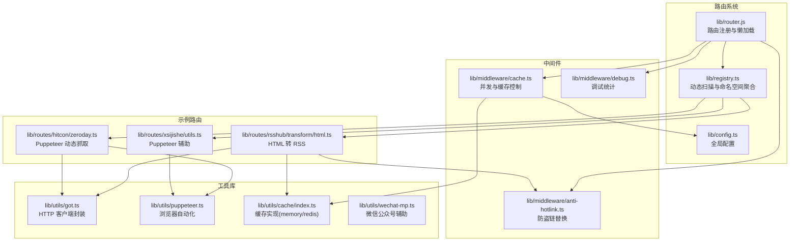
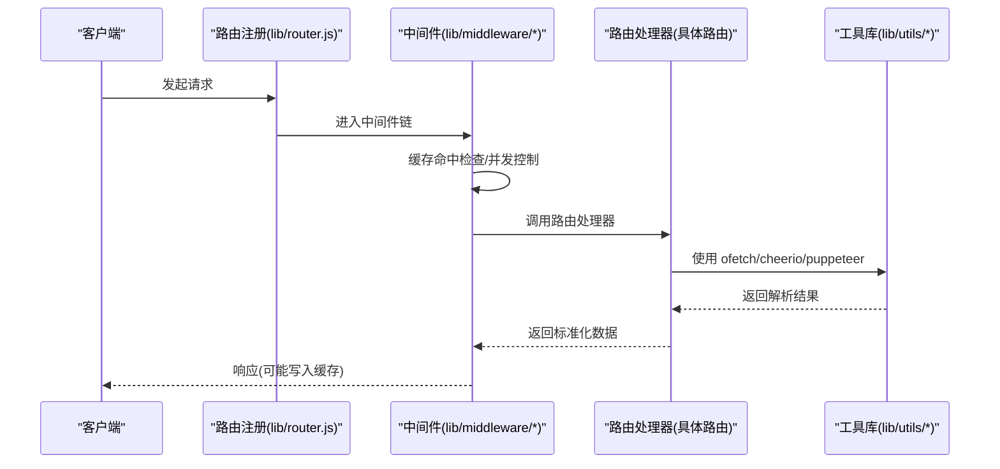
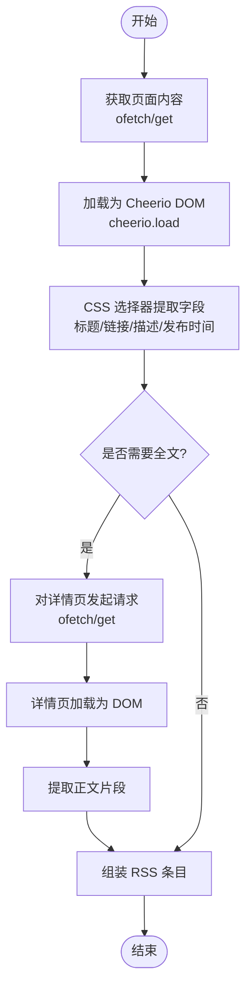
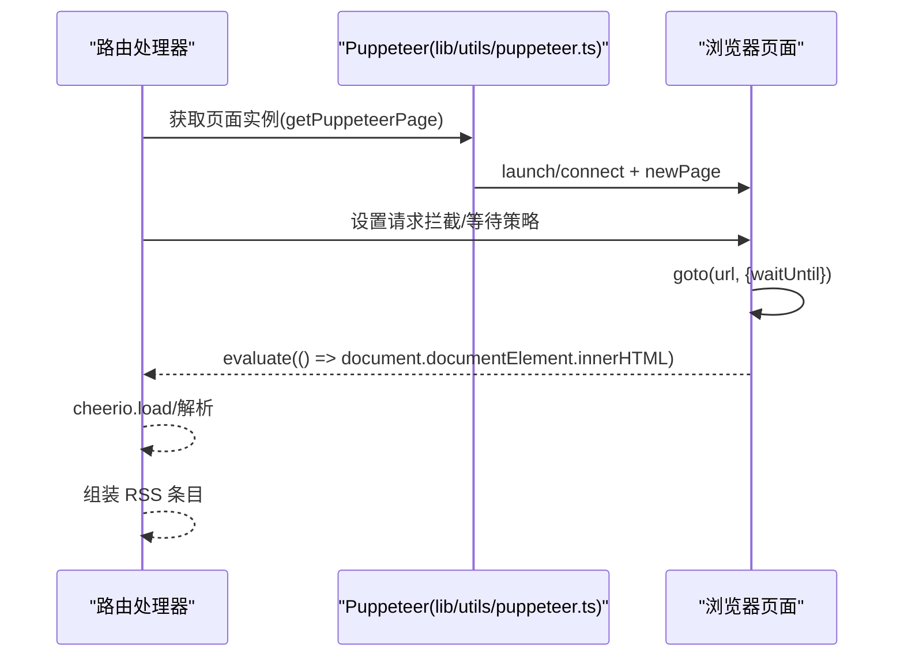
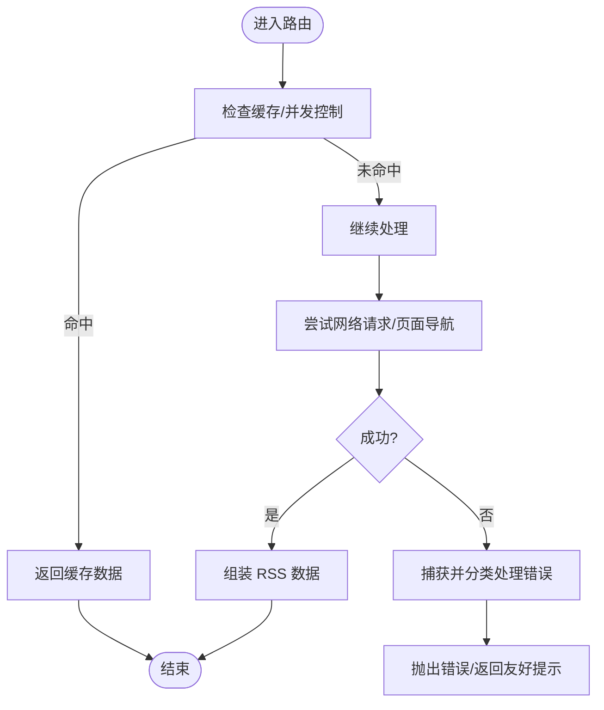
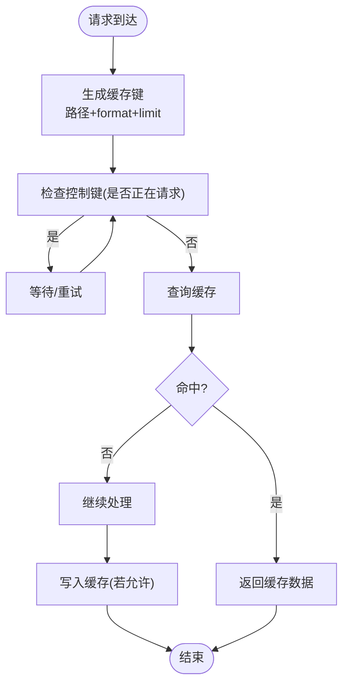
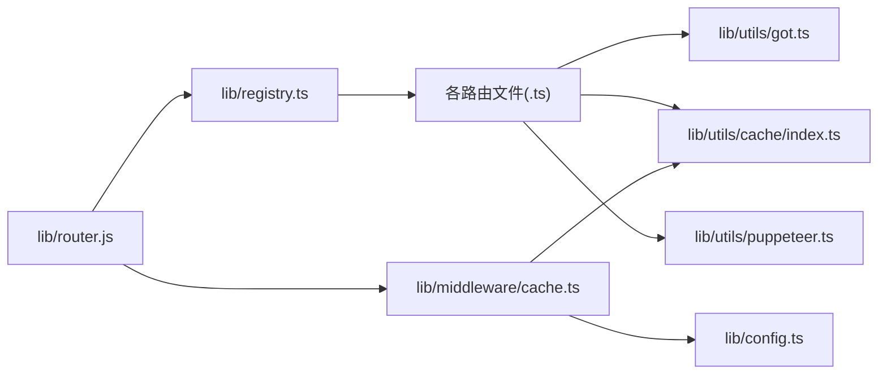

# 路由开发指南

<cite>
**本文引用的文件列表**
- [lib/router.js](file://lib/router.js)
- [lib/app.ts](file://lib/app.ts)
- [lib/config.ts](file://lib/config.ts)
- [lib/middleware/cache.ts](file://lib/middleware/cache.ts)
- [lib/utils/cache/index.ts](file://lib/utils/cache/index.ts)
- [lib/utils/puppeteer.ts](file://lib/utils/puppeteer.ts)
- [lib/routes/rsshub/transform/html.ts](file://lib/routes/rsshub/transform/html.ts)
- [lib/routes/hitcon/zeroday.ts](file://lib/routes/hitcon/zeroday.ts)
- [lib/routes/xsijishe/utils.ts](file://lib/routes/xsijishe/utils.ts)
- [lib/utils/got.ts](file://lib/utils/got.ts)
- [lib/registry.ts](file://lib/registry.ts)
- [lib/routes/CLAUDE.md](file://lib/routes/CLAUDE.md)
- [lib/errors/types/request-in-progress.ts](file://lib/errors/types/request-in-progress.ts)
- [lib/errors/index.test.ts](file://lib/errors/index.test.ts)
- [lib/middleware/debug.ts](file://lib/middleware/debug.ts)
- [lib/middleware/anti-hotlink.ts](file://lib/middleware/anti-hotlink.ts)
- [lib/utils/wechat-mp.ts](file://lib/utils/wechat-mp.ts)
- [scripts/workflow/test-route/test.mjs](file://scripts/workflow/test-route/test.mjs)
- [scripts/workflow/test-route/identify.mjs](file://scripts/workflow/test-route/identify.mjs)
</cite>

## 目录
1. [简介](#简介)
2. [项目结构](#项目结构)
3. [核心组件](#核心组件)
4. [架构总览](#架构总览)
5. [详细组件分析](#详细组件分析)
6. [依赖关系分析](#依赖关系分析)
7. [性能考量](#性能考量)
8. [故障排查指南](#故障排查指南)
9. [结论](#结论)
10. [附录](#附录)

## 简介
本指南面向希望为 RSSHub 添加新内容源路由的开发者，系统讲解路由文件的结构与命名约定、HTML 解析与动态内容抓取（cheerio 与 puppeteer）、错误处理最佳实践、缓存策略、性能优化技巧以及调试与测试方法。文档结合仓库现有实现，提供从零开始创建一个新路由的全流程参考。

## 项目结构
RSSHub 的路由系统采用“按领域分组”的目录结构：每个站点或服务对应一个命名空间目录，内部包含若干路由文件与可选的工具函数。路由注册通过动态扫描完成，并在运行期构建类型与文档。

图表来源
- [lib/router.js](file://lib/router.js#L1-L120)
- [lib/registry.ts](file://lib/registry.ts#L56-L150)
- [lib/config.ts](file://lib/config.ts#L241-L338)
- [lib/middleware/cache.ts](file://lib/middleware/cache.ts#L1-L84)
- [lib/utils/cache/index.ts](file://lib/utils/cache/index.ts#L16-L60)
- [lib/utils/puppeteer.ts](file://lib/utils/puppeteer.ts#L1-L192)
- [lib/utils/got.ts](file://lib/utils/got.ts#L1-L90)
- [lib/routes/rsshub/transform/html.ts](file://lib/routes/rsshub/transform/html.ts#L1-L160)
- [lib/routes/hitcon/zeroday.ts](file://lib/routes/hitcon/zeroday.ts#L1-L109)
- [lib/routes/xsijishe/utils.ts](file://lib/routes/xsijishe/utils.ts#L1-L26)

章节来源
- [lib/routes/CLAUDE.md](file://lib/routes/CLAUDE.md#L1-L120)
- [lib/registry.ts](file://lib/registry.ts#L56-L150)

## 核心组件
- 路由注册与懒加载：通过 Koa Router 在首次访问时按需加载路由处理器，降低启动成本。
- 动态扫描与命名空间：基于目录导入生成命名空间与路由映射，支持多环境构建。
- 中间件体系：缓存控制、并发限制、调试统计、防盗链替换。
- 工具库：HTTP 客户端封装、浏览器自动化、缓存实现、微信公众号辅助。
- 示例路由：演示 HTML 解析与 Puppeteer 动态抓取两种常见场景。

章节来源
- [lib/router.js](file://lib/router.js#L1-L120)
- [lib/registry.ts](file://lib/registry.ts#L56-L150)
- [lib/middleware/cache.ts](file://lib/middleware/cache.ts#L1-L84)
- [lib/utils/cache/index.ts](file://lib/utils/cache/index.ts#L16-L60)
- [lib/utils/puppeteer.ts](file://lib/utils/puppeteer.ts#L1-L192)
- [lib/utils/got.ts](file://lib/utils/got.ts#L1-L90)
- [lib/routes/rsshub/transform/html.ts](file://lib/routes/rsshub/transform/html.ts#L1-L160)
- [lib/routes/hitcon/zeroday.ts](file://lib/routes/hitcon/zeroday.ts#L1-L109)

## 架构总览
路由开发遵循“声明式定义 + 中间件拦截 + 工具库支撑”的模式。请求进入后，先经过中间件层（缓存、并发、调试、防盗链），再由路由处理器执行业务逻辑，最后返回标准化的数据结构。

图表来源
- [lib/router.js](file://lib/router.js#L1-L120)
- [lib/middleware/cache.ts](file://lib/middleware/cache.ts#L1-L84)
- [lib/utils/got.ts](file://lib/utils/got.ts#L1-L90)
- [lib/utils/puppeteer.ts](file://lib/utils/puppeteer.ts#L1-L192)
- [lib/routes/rsshub/transform/html.ts](file://lib/routes/rsshub/transform/html.ts#L61-L160)
- [lib/routes/hitcon/zeroday.ts](file://lib/routes/hitcon/zeroday.ts#L44-L109)

## 详细组件分析

### 路由文件结构与命名约定
- 目录组织：每个命名空间（如 weibo、zhihu、bilibili）下包含若干路由文件，必要时可嵌套子目录。
- 命名空间文件：通常命名为 namespace.ts，用于声明站点名称、URL、语言、默认分类等元信息。
- 路由定义接口：包含 path、categories、example、parameters、features、name、maintainers、handler 等字段。
- 路由注册：通过动态扫描将路由注册到全局路由表；支持数组形式的多个 path。

章节来源
- [lib/routes/CLAUDE.md](file://lib/routes/CLAUDE.md#L52-L124)
- [lib/registry.ts](file://lib/registry.ts#L56-L150)

### 使用 cheerio 进行 HTML 解析
- 基本流程：使用 ofetch 获取页面内容，使用 cheerio.load 解析为 DOM，通过 CSS 选择器提取所需字段，最终组装为 RSS 条目。
- 内容补全：当需要全文时，可对条目链接发起二次请求，再次使用 cheerio 提取正文片段。
- 防盗链替换：中间件可将资源地址替换为可控模板，避免外部资源直接暴露。

图表来源
- [lib/routes/rsshub/transform/html.ts](file://lib/routes/rsshub/transform/html.ts#L61-L160)
- [lib/middleware/anti-hotlink.ts](file://lib/middleware/anti-hotlink.ts#L29-L72)

章节来源
- [lib/routes/rsshub/transform/html.ts](file://lib/routes/rsshub/transform/html.ts#L1-L160)
- [lib/middleware/anti-hotlink.ts](file://lib/middleware/anti-hotlink.ts#L29-L72)

### 使用 puppeteer 进行动态内容抓取
- 场景：目标站点使用前端渲染、反爬策略严格或需要登录态。
- 实践要点：限制仅放行 document/script 等必要资源，加速导航；根据站点特性设置 waitUntil；必要时注入鉴权或代理。
- 示例：通过 getPuppeteerPage 获取页面实例，在 onBeforeLoad 中配置拦截规则与响应处理，最后 evaluate 获取 HTML。

图表来源
- [lib/utils/puppeteer.ts](file://lib/utils/puppeteer.ts#L69-L192)
- [lib/routes/hitcon/zeroday.ts](file://lib/routes/hitcon/zeroday.ts#L44-L109)
- [lib/routes/xsijishe/utils.ts](file://lib/routes/xsijishe/utils.ts#L1-L26)

章节来源
- [lib/utils/puppeteer.ts](file://lib/utils/puppeteer.ts#L1-L192)
- [lib/routes/hitcon/zeroday.ts](file://lib/routes/hitcon/zeroday.ts#L1-L109)
- [lib/routes/xsijishe/utils.ts](file://lib/routes/xsijishe/utils.ts#L1-L26)

### 错误处理最佳实践
- 并发冲突：当同一路径正在请求时，中间件会阻塞后续请求并在超时后抛出“请求进行中”错误，避免雪崩。
- 配置缺失：某些路由需要特定配置项才可启用，未满足条件时抛出配置缺失错误。
- 网络异常：HTTP 请求失败或导航失败时，记录日志并根据代理策略进行降级或重试。
- 自定义异常：可定义专用错误类型（如验证码错误），便于统一捕获与提示。

图表来源
- [lib/middleware/cache.ts](file://lib/middleware/cache.ts#L1-L84)
- [lib/errors/types/request-in-progress.ts](file://lib/errors/types/request-in-progress.ts#L1-L5)
- [lib/errors/index.test.ts](file://lib/errors/index.test.ts#L30-L49)
- [lib/utils/puppeteer.ts](file://lib/utils/puppeteer.ts#L171-L183)

章节来源
- [lib/middleware/cache.ts](file://lib/middleware/cache.ts#L1-L84)
- [lib/errors/types/request-in-progress.ts](file://lib/errors/types/request-in-progress.ts#L1-L5)
- [lib/errors/index.test.ts](file://lib/errors/index.test.ts#L30-L49)
- [lib/utils/puppeteer.ts](file://lib/utils/puppeteer.ts#L171-L183)

### 缓存策略
- 缓存类型：支持内存缓存与 Redis 缓存，可通过配置切换。
- 路由级缓存：中间件根据请求路径、format、limit 生成缓存键，命中则直接返回。
- 并发控制：通过控制键标记当前路径是否正在请求，避免重复并发。
- 内容过期：可配置路由缓存过期时间与内容缓存过期时间，平衡新鲜度与性能。

图表来源
- [lib/middleware/cache.ts](file://lib/middleware/cache.ts#L1-L84)
- [lib/utils/cache/index.ts](file://lib/utils/cache/index.ts#L16-L60)
- [lib/config.ts](file://lib/config.ts#L241-L338)

章节来源
- [lib/middleware/cache.ts](file://lib/middleware/cache.ts#L1-L84)
- [lib/utils/cache/index.ts](file://lib/utils/cache/index.ts#L16-L60)
- [lib/config.ts](file://lib/config.ts#L241-L338)

### 从零开始创建一个新路由（全流程）
- 步骤一：确定命名空间与路径
  - 在 routes 目录下创建站点命名空间目录，编写 namespace.ts（可选）。
  - 在该目录内新建路由文件，导出路由对象，包含 path、categories、example、parameters、features、name、maintainers、handler。
- 步骤二：实现 handler
  - 使用 ofetch 或 puppeteer 获取数据。
  - 使用 cheerio 解析静态 HTML，或在需要时使用 Puppeteer。
  - 组装为标准 RSS 数据结构（title、link、description、pubDate 等）。
- 步骤三：接入中间件
  - 缓存：中间件自动处理缓存与并发控制，无需额外代码。
  - 防盗链：如需替换资源链接，可在中间件层配置模板。
  - 调试：开启调试中间件可统计命中率与热点路径。
- 步骤四：测试与验证
  - 使用工作流脚本对路由进行测试，确保返回有效 RSS。
  - 如涉及动态内容，建议在本地或 CI 中启用 Puppeteer 环境。
- 步骤五：性能优化
  - 合并请求、减少不必要的二次请求。
  - 仅放行必要资源类型，缩短等待时间。
  - 合理设置缓存过期时间，兼顾实时性与性能。

章节来源
- [lib/routes/CLAUDE.md](file://lib/routes/CLAUDE.md#L52-L124)
- [lib/routes/rsshub/transform/html.ts](file://lib/routes/rsshub/transform/html.ts#L1-L160)
- [lib/routes/hitcon/zeroday.ts](file://lib/routes/hitcon/zeroday.ts#L1-L109)
- [lib/middleware/cache.ts](file://lib/middleware/cache.ts#L1-L84)
- [lib/middleware/debug.ts](file://lib/middleware/debug.ts#L1-L40)
- [scripts/workflow/test-route/test.mjs](file://scripts/workflow/test-route/test.mjs#L1-L79)
- [scripts/workflow/test-route/identify.mjs](file://scripts/workflow/test-route/identify.mjs#L104-L132)

## 依赖关系分析
- 路由注册依赖动态扫描与命名空间聚合，确保运行期可访问所有路由。
- 中间件依赖配置与缓存实现，形成统一的并发与缓存控制。
- 路由处理器依赖工具库（HTTP 客户端、浏览器自动化、缓存工具）。
- 示例路由展示了两种典型数据源：静态 HTML 与动态渲染。

图表来源
- [lib/router.js](file://lib/router.js#L1-L120)
- [lib/registry.ts](file://lib/registry.ts#L56-L150)
- [lib/utils/got.ts](file://lib/utils/got.ts#L1-L90)
- [lib/utils/cache/index.ts](file://lib/utils/cache/index.ts#L16-L60)
- [lib/utils/puppeteer.ts](file://lib/utils/puppeteer.ts#L1-L192)
- [lib/middleware/cache.ts](file://lib/middleware/cache.ts#L1-L84)
- [lib/config.ts](file://lib/config.ts#L241-L338)

章节来源
- [lib/router.js](file://lib/router.js#L1-L120)
- [lib/registry.ts](file://lib/registry.ts#L56-L150)

## 性能考量
- 减少 HTTP 请求
  - 合并请求、复用会话、避免重复解析。
  - 对于需要全文的条目，使用缓存工具（tryGet）避免重复抓取。
- 优化数据解析
  - 仅选择必要字段，避免全量 DOM 解析。
  - 使用 CSS 选择器精准定位，减少遍历范围。
- 控制并发
  - 利用中间件的并发控制键，避免同一路径的重复请求。
- 缓存策略
  - 合理设置路由缓存与内容缓存过期时间，兼顾新鲜度与性能。
- 动态内容抓取
  - 限制资源类型、缩短等待时间、必要时使用代理与鉴权。

章节来源
- [lib/routes/rsshub/transform/html.ts](file://lib/routes/rsshub/transform/html.ts#L120-L151)
- [lib/middleware/cache.ts](file://lib/middleware/cache.ts#L1-L84)
- [lib/config.ts](file://lib/config.ts#L241-L338)
- [lib/utils/puppeteer.ts](file://lib/utils/puppeteer.ts#L69-L192)

## 故障排查指南
- 路由无法匹配
  - 检查路由路径是否正确，确认已通过动态扫描注册。
  - 使用工作流识别脚本核对 PR 中的路由清单。
- 缓存命中异常
  - 查看中间件返回的缓存状态头，确认缓存键生成是否一致。
  - 检查缓存类型与过期时间配置。
- 并发冲突
  - 当出现“请求进行中”错误时，确认控制键是否正确清理。
  - 调整请求超时与重试策略。
- 动态抓取失败
  - 检查 Puppeteer 启动参数、代理配置与导航等待策略。
  - 对于需要登录的站点，确认鉴权流程与 Cookie 设置。
- 调试与统计
  - 启用调试中间件，查看命中率、热点路径与错误统计。

章节来源
- [scripts/workflow/test-route/identify.mjs](file://scripts/workflow/test-route/identify.mjs#L104-L132)
- [lib/middleware/cache.ts](file://lib/middleware/cache.ts#L1-L84)
- [lib/errors/index.test.ts](file://lib/errors/index.test.ts#L30-L49)
- [lib/middleware/debug.ts](file://lib/middleware/debug.ts#L1-L40)
- [lib/utils/puppeteer.ts](file://lib/utils/puppeteer.ts#L171-L183)

## 结论
通过遵循 RSSHub 的路由开发规范，结合中间件的缓存与并发控制、工具库提供的 HTTP 与浏览器自动化能力，开发者可以高效地为新内容源添加高质量的 RSS 路由。建议在开发过程中重视错误处理、缓存策略与性能优化，并利用调试与测试工具保障路由稳定性与可用性。

## 附录
- 常用工具与接口参考
  - HTTP 客户端：ofetch（got 封装）
  - HTML 解析：cheerio
  - 浏览器自动化：puppeteer
  - 缓存实现：内存/Redis
  - 防盗链替换：中间件模板
- 示例路由参考
  - HTML 转换：/rsshub/transform/html
  - 动态抓取：/hitcon/zeroday
  - Puppeteer 辅助：xsijishe 工具

章节来源
- [lib/utils/got.ts](file://lib/utils/got.ts#L1-L90)
- [lib/utils/puppeteer.ts](file://lib/utils/puppeteer.ts#L1-L192)
- [lib/utils/cache/index.ts](file://lib/utils/cache/index.ts#L16-L60)
- [lib/middleware/anti-hotlink.ts](file://lib/middleware/anti-hotlink.ts#L29-L72)
- [lib/routes/rsshub/transform/html.ts](file://lib/routes/rsshub/transform/html.ts#L1-L160)
- [lib/routes/hitcon/zeroday.ts](file://lib/routes/hitcon/zeroday.ts#L1-L109)
- [lib/routes/xsijishe/utils.ts](file://lib/routes/xsijishe/utils.ts#L1-L26)