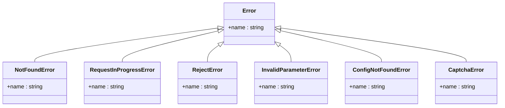
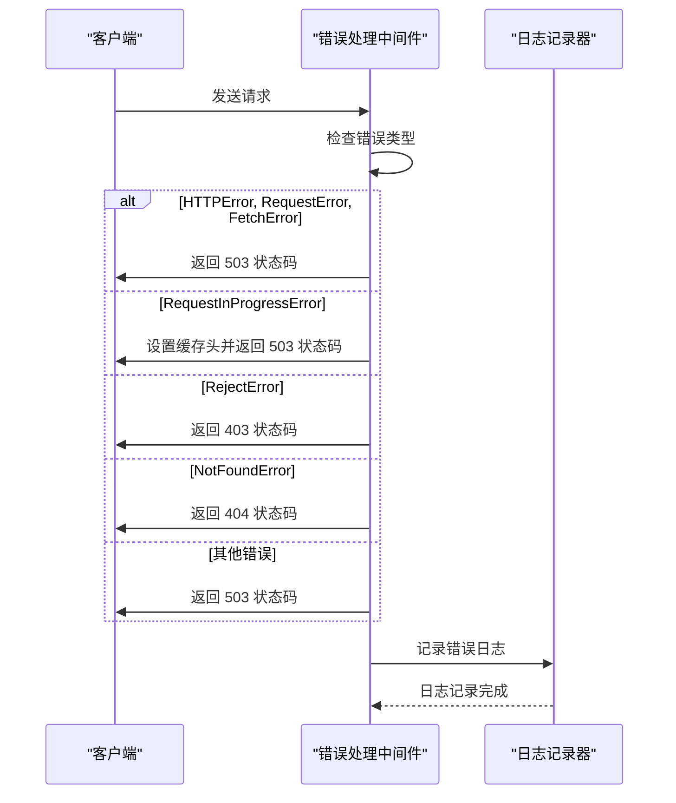
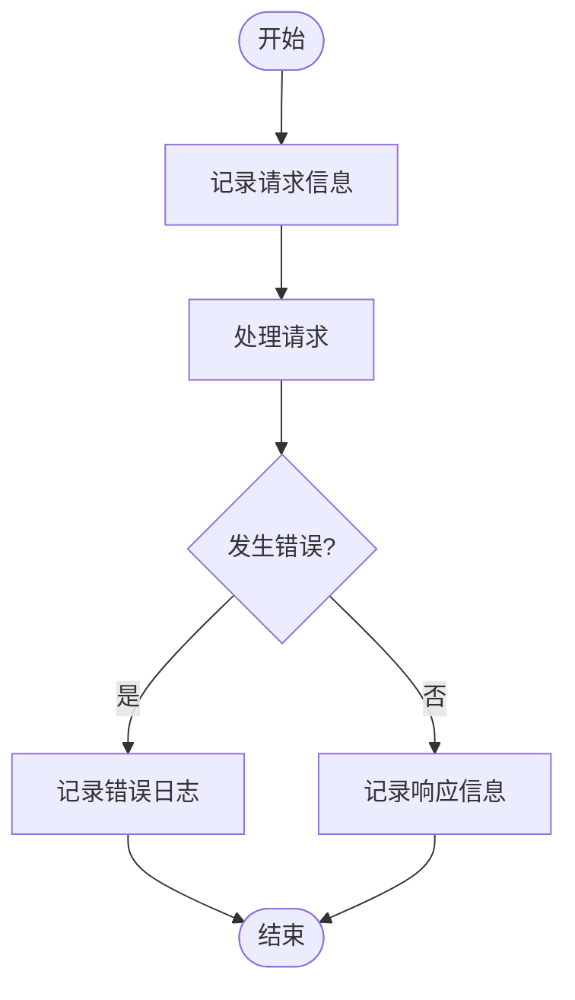

# 错误处理

<cite>
**本文档引用的文件**   
- [errorHandler](file://lib/errors/index.tsx)
- [logger.ts](file://lib/middleware/logger.ts)
- [sentry.ts](file://lib/middleware/sentry.ts)
- [debug.ts](file://lib/middleware/debug.ts)
- [debug-info.ts](file://lib/utils/debug-info.ts)
- [not-found.ts](file://lib/errors/types/not-found.ts)
- [request-in-progress.ts](file://lib/errors/types/request-in-progress.ts)
- [reject.ts](file://lib/errors/types/reject.ts)
- [invalid-parameter.ts](file://lib/errors/types/invalid-parameter.ts)
- [config-not-found.ts](file://lib/errors/types/config-not-found.ts)
- [captcha.ts](file://lib/errors/types/captcha.ts)
- [index.test.ts](file://lib/errors/index.test.ts)
</cite>

## 目录
1. [引言](#引言)
2. [错误分类体系](#错误分类体系)
3. [内置错误类的使用](#内置错误类的使用)
4. [重试机制实现](#重试机制实现)
5. [错误日志记录最佳实践](#错误日志记录最佳实践)
6. [错误码设计原则](#错误码设计原则)
7. [用户友好错误消息编写技巧](#用户友好错误消息编写技巧)
8. [总结](#总结)

## 引言
RSSHub 是一个强大的 RSS 生成器，为各种网站提供 RSS 订阅支持。在路由开发过程中，正确处理异常情况至关重要，以确保系统的稳定性和用户体验。本文档旨在为开发者提供全面的错误处理指南，涵盖错误分类、内置错误类的使用、重试机制、日志记录、错误码设计以及用户友好错误消息的编写技巧。

**Section sources**
- [errorHandler](file://lib/errors/index.tsx#L13-L82)

## 错误分类体系
RSSHub 的错误分类体系涵盖了多种异常情况，主要包括网络错误、解析错误、验证错误等。这些错误类型通过不同的错误类来表示，以便于开发者能够快速识别和处理。

### 网络错误
网络错误通常发生在与外部服务通信时，如 HTTP 请求失败或超时。RSSHub 使用 `HTTPError`、`RequestError` 和 `FetchError` 来表示这类错误。

### 解析错误
解析错误发生在尝试解析外部数据（如 HTML 或 JSON）时，如果数据格式不符合预期，则会抛出相应的错误。例如，`CaptchaError` 表示需要验证码才能继续访问。

### 验证错误
验证错误涉及参数验证和配置检查。`InvalidParameterError` 用于表示请求参数无效，而 `ConfigNotFoundError` 则表示所需的配置项未找到。

### 其他错误
- `NotFoundError`：表示请求的路由不存在或已被删除。
- `RejectError`：表示请求被拒绝，通常由于权限问题。
- `RequestInProgressError`：表示同一路径的请求正在进行中，防止重复请求。



**Diagram sources**
- [not-found.ts](file://lib/errors/types/not-found.ts#L1-L6)
- [request-in-progress.ts](file://lib/errors/types/request-in-progress.ts#L1-L6)
- [reject.ts](file://lib/errors/types/reject.ts#L1-L6)
- [invalid-parameter.ts](file://lib/errors/types/invalid-parameter.ts#L1-L6)
- [config-not-found.ts](file://lib/errors/types/config-not-found.ts#L1-L6)
- [captcha.ts](file://lib/errors/types/captcha.ts#L1-L6)

**Section sources**
- [not-found.ts](file://lib/errors/types/not-found.ts#L1-L6)
- [request-in-progress.ts](file://lib/errors/types/request-in-progress.ts#L1-L6)
- [reject.ts](file://lib/errors/types/reject.ts#L1-L6)
- [invalid-parameter.ts](file://lib/errors/types/invalid-parameter.ts#L1-L6)
- [config-not-found.ts](file://lib/errors/types/config-not-found.ts#L1-L6)
- [captcha.ts](file://lib/errors/types/captcha.ts#L1-L6)

## 内置错误类的使用
RSSHub 提供了一系列内置的错误类，开发者可以通过实例化这些类来创建语义化的错误信息。每个错误类都有一个唯一的名称，便于在日志和监控系统中进行识别。

### 创建和抛出错误
```typescript
import NotFoundError from '@/errors/types/not-found';

// 在路由处理函数中
if (!routeExists) {
    throw new NotFoundError('The requested route does not exist.');
}
```

### 错误处理中间件
RSSHub 使用 `errorHandler` 中间件来统一处理所有未捕获的异常。该中间件根据错误类型设置适当的 HTTP 状态码，并记录错误日志。



**Diagram sources**
- [errorHandler](file://lib/errors/index.tsx#L13-L82)
- [logger.ts](file://lib/middleware/logger.ts#L33-L42)

**Section sources**
- [errorHandler](file://lib/errors/index.tsx#L13-L82)
- [logger.ts](file://lib/middleware/logger.ts#L33-L42)

## 重试机制实现
为了处理临时性网络故障，RSSHub 实现了重试机制。当遇到 `RequestInProgressError` 时，客户端可以稍后重试请求。

### 重试逻辑
```typescript
class RequestInProgressError extends Error {
    name = 'RequestInProgressError';
}

// 在路由处理函数中
if (isRequestInProgress) {
    throw new RequestInProgressError('This path is currently fetching, please come back later!');
}
```

### 缓存控制
通过设置 `Cache-Control` 头，告知客户端在一段时间内不要重复请求同一路径。

```typescript
ctx.header('Cache-Control', `public, max-age=${config.requestTimeout / 1000}`);
```

**Section sources**
- [request-in-progress.ts](file://lib/errors/types/request-in-progress.ts#L1-L6)
- [errorHandler](file://lib/errors/index.tsx#L53-L56)

## 错误日志记录最佳实践
正确的错误日志记录对于调试和监控系统至关重要。RSSHub 通过 `logger` 中间件记录所有请求和响应的日志。

### 日志级别
- `info`：记录正常的请求和响应。
- `error`：记录错误信息，包括错误堆栈。

### 日志内容
- 请求方法和路径
- 响应状态码
- 请求耗时
- 错误消息和堆栈

### 保护用户隐私
避免在日志中记录敏感信息，如用户凭证或个人数据。



**Diagram sources**
- [logger.ts](file://lib/middleware/logger.ts#L33-L42)
- [errorHandler](file://lib/errors/index.tsx#L70-L71)

**Section sources**
- [logger.ts](file://lib/middleware/logger.ts#L33-L42)
- [errorHandler](file://lib/errors/index.tsx#L70-L71)

## 错误码设计原则
RSSHub 的错误码设计遵循以下原则：

### 一致性
使用标准的 HTTP 状态码，确保与其他系统的兼容性。

### 可读性
错误消息应清晰明了，便于开发者理解问题所在。

### 可扩展性
预留足够的错误码范围，以便未来添加新的错误类型。

### 示例
- `404 Not Found`：请求的资源不存在。
- `403 Forbidden`：请求被拒绝。
- `503 Service Unavailable`：服务暂时不可用。

**Section sources**
- [errorHandler](file://lib/errors/index.tsx#L50-L66)

## 用户友好错误消息编写技巧
编写用户友好的错误消息有助于提升用户体验。以下是一些编写技巧：

### 简洁明了
错误消息应简短且直接，避免冗长的描述。

### 提供解决方案
尽可能提供解决问题的方法或建议。

### 避免技术术语
使用普通用户能理解的语言，避免使用专业术语。

### 示例
- "请求的页面不存在，请检查 URL 是否正确。"
- "当前请求正在处理中，请稍后再试。"

**Section sources**
- [errorHandler](file://lib/errors/index.tsx#L62)

## 总结
通过本文档，我们详细介绍了 RSSHub 的错误处理机制，包括错误分类体系、内置错误类的使用、重试机制、日志记录、错误码设计以及用户友好错误消息的编写技巧。希望这些指南能够帮助开发者更好地理解和应用 RSSHub 的错误处理功能，提高系统的稳定性和用户体验。

**Section sources**
- [errorHandler](file://lib/errors/index.tsx#L13-L82)
- [logger.ts](file://lib/middleware/logger.ts#L33-L42)
- [sentry.ts](file://lib/middleware/sentry.ts#L17-L28)
- [debug.ts](file://lib/middleware/debug.ts#L6-L40)
- [debug-info.ts](file://lib/utils/debug-info.ts#L1-L25)