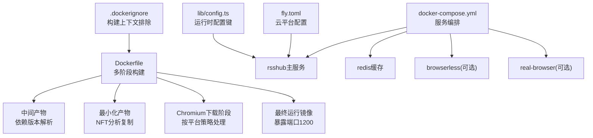
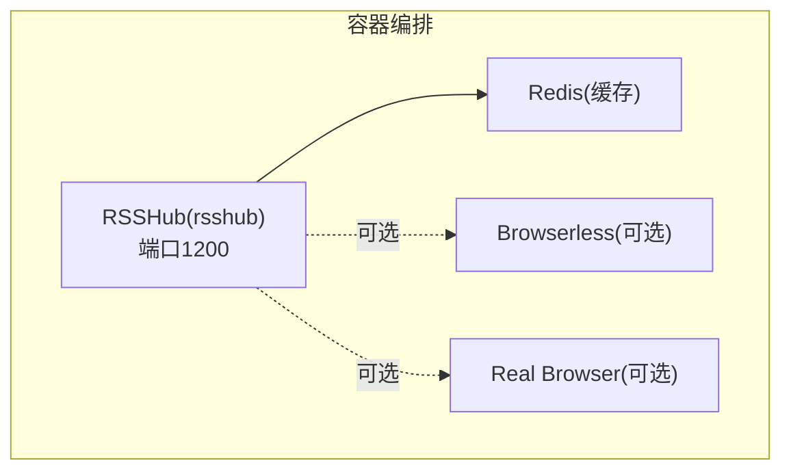
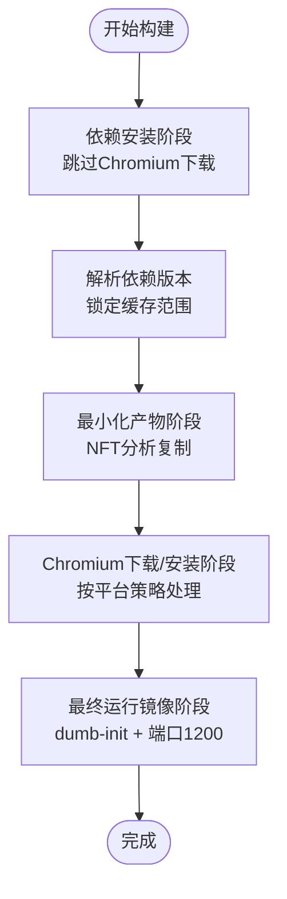
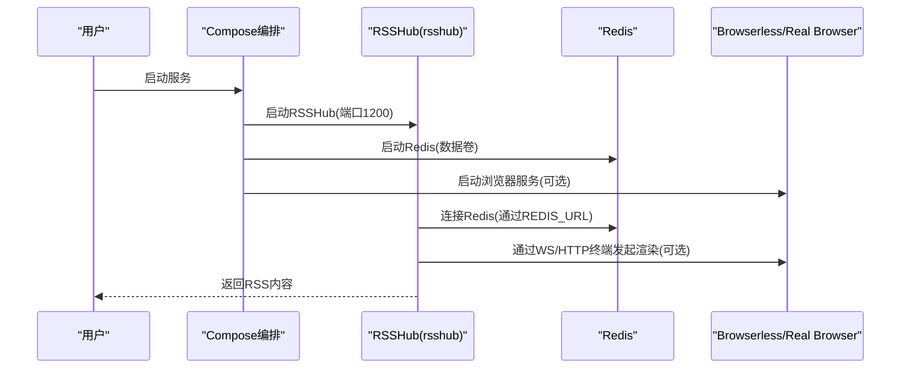
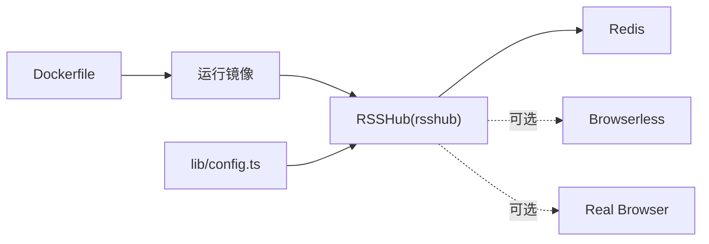

# Docker部署

<cite>
**本文引用的文件**
- [Dockerfile](file://Dockerfile)
- [docker-compose.yml](file://docker-compose.yml)
- [.dockerignore](file://.dockerignore)
- [scripts/docker/minify-docker.js](file://scripts/docker/minify-docker.js)
- [scripts/docker/test-docker.sh](file://scripts/docker/test-docker.sh)
- [lib/config.ts](file://lib/config.ts)
- [fly.toml](file://fly.toml)
- [README.md](file://README.md)
</cite>

## 目录
1. [简介](#简介)
2. [项目结构](#项目结构)
3. [核心组件](#核心组件)
4. [架构总览](#架构总览)
5. [详细组件分析](#详细组件分析)
6. [依赖关系分析](#依赖关系分析)
7. [性能考量](#性能考量)
8. [故障排查指南](#故障排查指南)
9. [结论](#结论)
10. [附录](#附录)

## 简介
本文件面向希望在生产环境中使用容器化方式部署 RSSHub 的用户，系统性地介绍基于仓库提供的 Dockerfile 构建流程与 docker-compose.yml 配置示例，覆盖基础镜像选择、依赖安装与构建优化、容器运行与健康检查、多实例与高可用建议、网络与卷挂载最佳实践，以及常见问题排查方法。同时给出与部署相关的环境变量与配置要点，帮助读者快速搭建稳定、可扩展的 RSSHub 容器化服务。

## 项目结构
围绕 Docker 部署的关键文件与目录如下：
- Dockerfile：定义多阶段构建流程，包含依赖解析、最小化产物、Chromium 下载策略与运行时准备。
- docker-compose.yml：定义 RSSHub 主服务、Redis 缓存、浏览器服务（可选）及真实浏览器服务的编排与健康检查。
- .dockerignore：控制构建上下文中的排除项，减少无关文件进入镜像。
- scripts/docker/minify-docker.js：用于按需复制 NFT 分析结果到最小化应用目录，配合多阶段构建实现镜像瘦身。
- scripts/docker/test-docker.sh：本地验证容器是否能成功拉起并返回首页的自动化脚本。
- lib/config.ts：RSSHub 运行时配置来源，包含端口、缓存、代理、日志等大量环境变量键名与默认值。
- fly.toml：Fly.io 平台的服务配置，包含内部端口、健康检查路径等，便于云平台部署参考。
- README.md：项目总体说明与部署入口链接。

图表来源
- [Dockerfile](file://Dockerfile#L1-L207)
- [docker-compose.yml](file://docker-compose.yml#L1-L63)
- [.dockerignore](file://.dockerignore#L1-L46)
- [lib/config.ts](file://lib/config.ts#L720-L760)
- [fly.toml](file://fly.toml#L1-L16)

章节来源
- [Dockerfile](file://Dockerfile#L1-L207)
- [docker-compose.yml](file://docker-compose.yml#L1-L63)
- [.dockerignore](file://.dockerignore#L1-L46)
- [lib/config.ts](file://lib/config.ts#L720-L760)
- [fly.toml](file://fly.toml#L1-L16)

## 核心组件
- 多阶段 Docker 构建：通过分阶段拆解依赖安装、产物最小化与运行时准备，降低镜像体积并提升构建并发与缓存命中率。
- Puppeteer/Chromium 支持：根据目标平台自动选择“内置 Chromium”或“系统包安装”，并在 amd64 平台上进行校验，避免共享库缺失导致的启动失败。
- 健康检查与重启策略：compose 中对 rsshub、redis、browserless(real-browser) 设置健康检查与重启策略，保障服务可用性。
- 最小化镜像：利用 NFT 文件追踪与自定义复制脚本，仅保留实际运行所需的 node_modules 文件，显著减小镜像大小。
- 环境变量与配置：通过环境变量驱动 RSSHub 的网络、缓存、代理、日志、遥测等行为，满足不同部署场景需求。

章节来源
- [Dockerfile](file://Dockerfile#L1-L207)
- [docker-compose.yml](file://docker-compose.yml#L1-L63)
- [scripts/docker/minify-docker.js](file://scripts/docker/minify-docker.js#L1-L26)
- [lib/config.ts](file://lib/config.ts#L720-L760)

## 架构总览
下图展示 RSSHub 在容器环境中的典型拓扑：RSSHub 主服务依赖 Redis 缓存；当需要真实浏览器渲染能力时，可通过 ws 终端连接 browserless 或 http 终端连接 real-browser 服务。

图表来源
- [docker-compose.yml](file://docker-compose.yml#L1-L63)

章节来源
- [docker-compose.yml](file://docker-compose.yml#L1-L63)

## 详细组件分析

### Dockerfile 构建流程与优化
- 基础镜像与工具链
  - 使用 Node.js 24 的 Debian Bookworm 版本作为基础，兼顾稳定性与构建工具链。
  - 使用 Corepack 启用 pnpm，统一包管理器版本。
- 中国区镜像加速
  - 可通过构建参数切换国内镜像源，加速依赖下载。
- 依赖安装与缓存优化
  - 第一阶段：启用 Chromium 跳过下载标记，先安装生产依赖以缩小镜像体积。
  - 依赖版本解析阶段：从 package.json 提取关键依赖版本，限制后续阶段缓存失效范围。
  - 最小化阶段：使用 NFT 分析与自定义脚本仅复制实际运行所需文件，随后清理开发期脚本与 node_modules。
  - Chromium 下载阶段：针对 amd64 平台直接下载 Chromium，其他平台安装系统包并写入可执行路径至 .env。
- 运行时准备
  - 安装 dumb-init 作为 PID 1，确保信号正确传递。
  - 暴露端口 1200，默认 CMD 启动 RSSHub。
  - 针对 Puppeteer 的系统依赖与库校验逻辑，避免运行时崩溃。

图表来源
- [Dockerfile](file://Dockerfile#L1-L207)
- [scripts/docker/minify-docker.js](file://scripts/docker/minify-docker.js#L1-L26)

章节来源
- [Dockerfile](file://Dockerfile#L1-L207)
- [scripts/docker/minify-docker.js](file://scripts/docker/minify-docker.js#L1-L26)

### docker-compose.yml 配置详解
- rsshub 服务
  - 镜像：可选用官方镜像或 ghcr.io 镜像。
  - 端口映射：宿主 1200:1200。
  - 环境变量：NODE_ENV=production、CACHE_TYPE=redis、REDIS_URL 指向 redis 服务、Puppeteer WS/HTTP 终端（可选）。
  - 健康检查：访问 /healthz，间隔 30s，超时 10s，重试 3 次。
  - 依赖：依赖 redis 与浏览器服务（可选）。
- real-browser 服务
  - 镜像：使用 puppeteer-real-browser-hono。
  - 端口映射：宿主 3001:3000。
  - 健康检查：访问 /。
- browserless 服务（可选）
  - 镜像：browserless/chrome。
  - 限制：关闭 core 限制，避免容器被 OOM 杀死。
  - 健康检查：访问 /pressure。
- redis 服务
  - 镜像：redis:alpine。
  - 卷：redis-data 数据卷持久化。
  - 健康检查：redis-cli ping。
- volumes
  - 定义 redis-data 数据卷。

图表来源
- [docker-compose.yml](file://docker-compose.yml#L1-L63)

章节来源
- [docker-compose.yml](file://docker-compose.yml#L1-L63)

### 环境变量与配置要点
- 端口与监听
  - PORT：RSSHub 监听端口，默认 1200。
  - LISTEN_INADDR_ANY：是否允许公网连接。
- 缓存与 Redis
  - CACHE_TYPE：缓存类型，memory 或 redis。
  - REDIS_URL：Redis 连接字符串。
- 浏览器与 Puppeteer
  - PUPPETEER_WS_ENDPOINT：browserless 的 WebSocket 终端地址。
  - PUPPETEER_REAL_BROWSER_SERVICE：real-browser 的 HTTP 终端地址。
  - CHROMIUM_EXECUTABLE_PATH：指定系统安装的 Chromium 可执行路径（arm/arm64 场景）。
- 日志与遥测
  - LOGGER_LEVEL：日志级别。
  - SENTRY：Sentry DSN。
  - OTEL_SECONDS_BUCKET、OTEL_MILLISECONDS_BUCKET：指标桶配置。
- 其他常用
  - REQUEST_RETRY、REQUEST_TIMEOUT：请求重试与超时。
  - UA/NO_RANDOM_UA：User-Agent 控制。
  - ACCESS_KEY：访问密钥（鉴权）。
  - PROXY_*：代理相关配置。
  - DEBUG_INFO：调试开关。

章节来源
- [lib/config.ts](file://lib/config.ts#L720-L760)
- [lib/config.ts](file://lib/config.ts#L1159-L1187)

### 运行、管理、更新与监控
- 运行
  - 使用 compose 启动：docker compose up -d。
  - 本地验证：使用 test-docker.sh 脚本自动拉起容器并轮询首页。
- 管理
  - 查看日志：docker compose logs -f rsshub。
  - 进入容器：docker compose exec rsshub bash。
  - 停止/重启：docker compose stop/start rsshub。
- 更新
  - 拉取最新镜像后重启：docker compose pull && docker compose up -d。
  - 如需重建镜像：docker compose build --no-cache。
- 监控
  - 健康检查：compose 内置健康检查会定期探测 /healthz 与 /。
  - 云平台：fly.toml 中定义了内部端口与健康检查路径，便于 Fly.io 平台部署。

章节来源
- [scripts/docker/test-docker.sh](file://scripts/docker/test-docker.sh#L1-L32)
- [docker-compose.yml](file://docker-compose.yml#L1-L63)
- [fly.toml](file://fly.toml#L1-L16)

### 多实例部署、负载均衡与高可用
- 多实例
  - 使用同一镜像与相同环境变量启动多个 RSSHub 实例，分别映射不同宿主端口或通过反向代理统一入口。
- 负载均衡
  - 在容器外部使用反向代理（如 Nginx、Traefik、Cloudflare Tunnel）进行流量分发。
- 高可用
  - Redis 使用持久化数据卷，确保缓存不丢失。
  - 浏览器服务（browserless/real-browser）可独立扩缩容，必要时使用集群模式。
  - 健康检查与自动重启策略保证服务可用性。

[本节为概念性说明，不直接分析具体文件]

### Docker 网络配置最佳实践
- 端口映射
  - 将宿主机端口映射到容器内 1200，便于外部访问 RSSHub。
- 卷挂载
  - Redis 数据卷 redis-data 用于持久化，避免容器删除导致数据丢失。
- 环境变量
  - 通过环境变量集中管理端口、缓存、代理、日志等配置，避免硬编码。
- 网络隔离
  - 将 rsshub、redis、browserless/real-browser 放在同一 compose 网络中，内部通信无需暴露外网端口。

章节来源
- [docker-compose.yml](file://docker-compose.yml#L1-L63)
- [.dockerignore](file://.dockerignore#L1-L46)

## 依赖关系分析
- 构建阶段依赖
  - Dockerfile 通过多阶段构建串联依赖安装、版本解析、最小化与 Chromium 下载，最终生成运行镜像。
- 运行时依赖
  - rsshub 依赖 redis；浏览器渲染能力依赖 browserless 或 real-browser（可选）。
- 配置依赖
  - lib/config.ts 解析环境变量并计算运行时配置，影响端口、缓存、代理、日志等行为。

图表来源
- [Dockerfile](file://Dockerfile#L1-L207)
- [docker-compose.yml](file://docker-compose.yml#L1-L63)
- [lib/config.ts](file://lib/config.ts#L720-L760)

章节来源
- [Dockerfile](file://Dockerfile#L1-L207)
- [docker-compose.yml](file://docker-compose.yml#L1-L63)
- [lib/config.ts](file://lib/config.ts#L720-L760)

## 性能考量
- 镜像体积与启动速度
  - 通过 NFT 分析与最小化复制，显著减少 node_modules 体积。
  - 多阶段构建与缓存策略提升构建并发与命中率。
- Puppeteer/Chromium
  - amd64 平台直接下载 Chromium 并进行共享库校验，避免运行时崩溃。
  - arm/arm64 平台安装系统包并写入可执行路径，减少不必要的下载。
- 缓存与代理
  - 使用 Redis 作为缓存后端，结合合理的过期策略与内存上限，平衡性能与资源占用。
  - 代理配置支持按需启用与健康检查，提高请求稳定性。

[本节提供通用指导，不直接分析具体文件]

## 故障排查指南
- 容器启动失败
  - 检查日志：docker compose logs rsshub。
  - 确认端口未被占用：宿主机 1200 端口是否被占用。
  - 确认依赖服务已就绪：redis、browserless/real-browser 是否健康。
- 网络连接问题
  - 确认 rsshub 与 redis 的网络连通性（同网络）。
  - 检查 REDIS_URL 是否指向正确的 redis 服务与端口。
  - 若使用浏览器服务，确认 PUPPETEER_WS_ENDPOINT 或 PUPPETEER_REAL_BROWSER_SERVICE 地址可达。
- 性能瓶颈
  - 观察 CPU/内存使用情况，必要时增加资源配额或启用集群模式。
  - 调整 REQUEST_RETRY、REQUEST_TIMEOUT、CACHE_* 等参数以适配业务负载。
- Puppeteer/Chromium 相关
  - 若 amd64 平台出现共享库缺失，检查 Chromium 安装与校验步骤。
  - arm/arm64 平台请确认系统已安装 Chromium 并设置了 CHROMIUM_EXECUTABLE_PATH。

章节来源
- [docker-compose.yml](file://docker-compose.yml#L1-L63)
- [lib/config.ts](file://lib/config.ts#L720-L760)
- [Dockerfile](file://Dockerfile#L130-L177)

## 结论
通过仓库提供的 Dockerfile 与 docker-compose.yml，可以快速搭建一个具备缓存、可选浏览器渲染能力的 RSSHub 容器化服务。多阶段构建与最小化策略有效降低了镜像体积，健康检查与重启策略提升了可用性。结合合理的网络与卷配置，可在单机或多实例环境下实现稳定、可扩展的部署。对于更高并发与跨地域场景，建议配合反向代理与集群化部署策略进一步优化。

[本节为总结性内容，不直接分析具体文件]

## 附录
- 快速开始
  - 使用 compose 启动：docker compose up -d。
  - 访问 RSSHub：http://localhost:1200。
- 参考文档入口
  - 项目 README 中提供了部署文档入口链接，可进一步查阅官方文档。

章节来源
- [README.md](file://README.md#L38-L41)