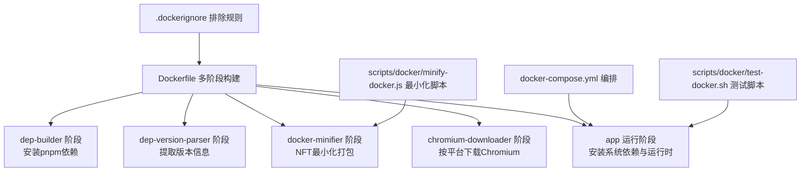
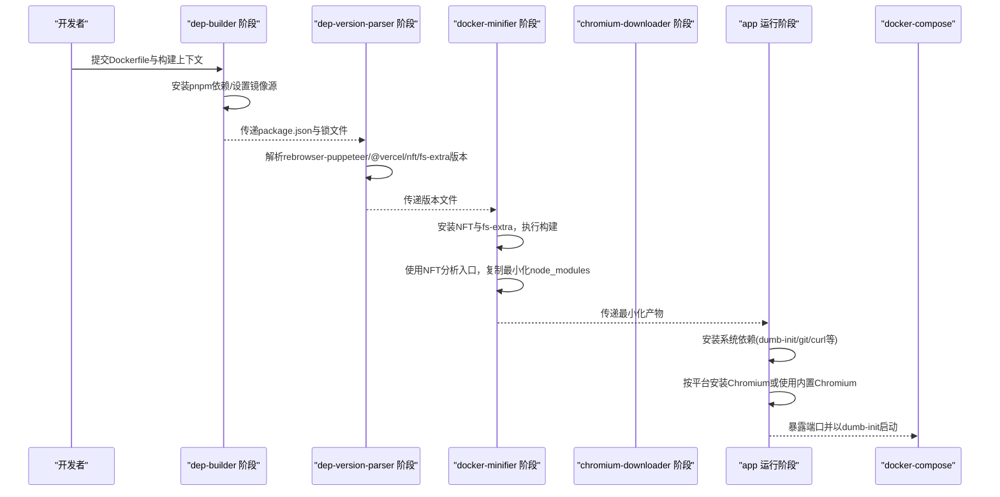
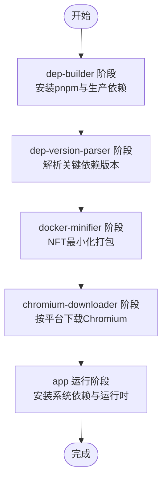
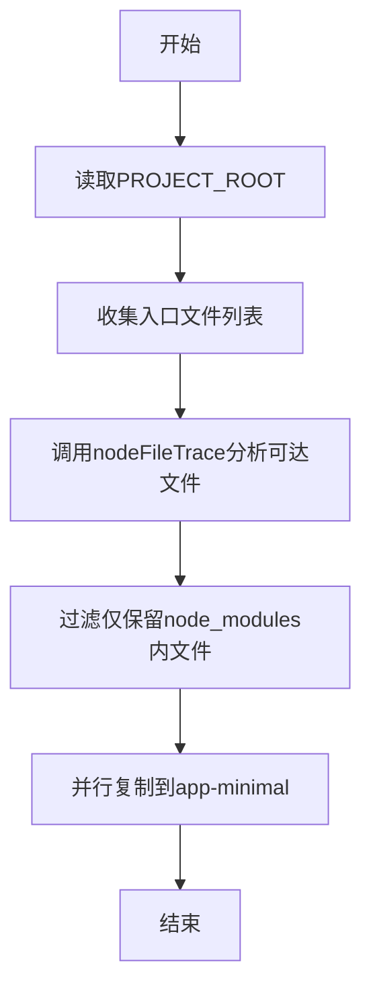
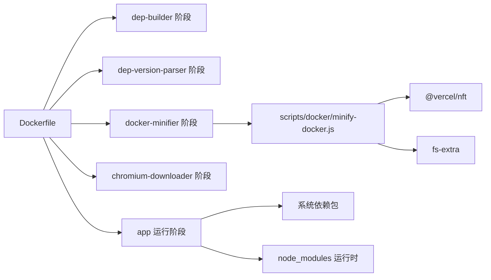

# Docker镜像

<cite>
**本文引用的文件**
- [Dockerfile](file://Dockerfile)
- [.dockerignore](file://.dockerignore)
- [docker-compose.yml](file://docker-compose.yml)
- [scripts/docker/minify-docker.js](file://scripts/docker/minify-docker.js)
- [scripts/docker/test-docker.sh](file://scripts/docker/test-docker.sh)
- [package.json](file://package.json)
- [tsconfig.json](file://tsconfig.json)
- [fly.toml](file://fly.toml)
- [vercel.json](file://vercel.json)
</cite>

## 目录
1. [简介](#简介)
2. [项目结构](#项目结构)
3. [核心组件](#核心组件)
4. [架构总览](#架构总览)
5. [详细组件分析](#详细组件分析)
6. [依赖关系分析](#依赖关系分析)
7. [性能考量](#性能考量)
8. [故障排查指南](#故障排查指南)
9. [结论](#结论)
10. [附录](#附录)

## 简介
本文件面向RSSHub的Docker镜像构建流程，系统性解析Dockerfile的多阶段构建策略、各阶段职责、依赖安装与缓存优化、镜像体积控制、以及生产环境配置与安全加固建议。同时提供自定义镜像构建的实践指导，包括添加额外依赖、修改构建参数、优化生产配置，并给出镜像大小优化技巧与安全扫描建议。

## 项目结构
围绕Docker镜像构建的相关文件主要集中在根目录与scripts/docker目录：
- Dockerfile：定义多阶段构建流程与运行时环境
- .dockerignore：排除构建上下文中的无关文件，提升构建速度与安全性
- docker-compose.yml：演示服务编排与依赖（Redis、可选浏览器服务）
- scripts/docker/minify-docker.js：基于NFT进行最小化打包，仅保留运行所需文件
- scripts/docker/test-docker.sh：快速验证容器启动与健康检查
- package.json/tsconfig.json：构建脚本与类型配置，支撑镜像构建与运行
- fly.toml/vercel.json：部署与路由配置示例（与容器运行相关）

图表来源
- [Dockerfile](file://Dockerfile#L1-L206)
- [.dockerignore](file://.dockerignore#L1-L46)
- [docker-compose.yml](file://docker-compose.yml#L1-L63)
- [scripts/docker/minify-docker.js](file://scripts/docker/minify-docker.js#L1-L26)
- [scripts/docker/test-docker.sh](file://scripts/docker/test-docker.sh#L1-L32)

章节来源
- [Dockerfile](file://Dockerfile#L1-L206)
- [.dockerignore](file://.dockerignore#L1-L46)
- [docker-compose.yml](file://docker-compose.yml#L1-L63)

## 核心组件
- 多阶段构建：通过独立阶段实现“构建期依赖”“版本解析”“最小化打包”“Chromium下载”“运行时环境”的职责分离，显著降低最终镜像体积。
- 依赖管理：使用pnpm与Corepack启用，支持中国区镜像切换，避免重复安装与加速下载。
- NFT最小化：在构建阶段分析运行入口，仅复制必要文件到app-minimal，再合并至最终镜像，减少node_modules冗余。
- 平台感知：通过TARGETPLATFORM区分amd64与arm/arm64，分别采用内置Chromium或系统包安装，保证兼容性与体积控制。
- 运行时优化：dumb-init作为PID1，暴露端口，设置时区与环境变量，便于生产部署。

章节来源
- [Dockerfile](file://Dockerfile#L1-L206)
- [scripts/docker/minify-docker.js](file://scripts/docker/minify-docker.js#L1-L26)
- [package.json](file://package.json#L1-L249)

## 架构总览
下图展示从源码到最终运行镜像的关键步骤与阶段间依赖关系。

图表来源
- [Dockerfile](file://Dockerfile#L1-L206)
- [scripts/docker/minify-docker.js](file://scripts/docker/minify-docker.js#L1-L26)
- [docker-compose.yml](file://docker-compose.yml#L1-L63)

## 详细组件分析

### 多阶段构建策略与职责划分
- dep-builder（依赖构建）：使用非slim基础镜像提供编译工具链，提前启用pnpm并可切换国内镜像，随后只安装生产依赖，避免构建期工具进入最终镜像。
- dep-version-parser（版本解析）：从package.json中提取关键依赖版本，隔离后续阶段的缓存失效范围，确保package.json变更不破坏后续构建缓存。
- docker-minifier（最小化打包）：安装NFT与fs-extra，执行构建后，使用NFT分析入口文件，仅复制必要的node_modules文件到app-minimal，再合并至最终镜像，大幅缩小体积。
- chromium-downloader（Chromium下载）：根据TARGETPLATFORM决定是否下载Chromium；amd64平台通过rebrowser-puppeteer安装Chrome，arm/arm64平台直接使用系统包，避免不必要的依赖。
- app（运行阶段）：安装dumb-init、git、curl等轻量工具，按平台安装Chromium及XVFB/procps等依赖，拷贝Chromium缓存，设置环境变量与入口命令。

图表来源
- [Dockerfile](file://Dockerfile#L1-L206)

章节来源
- [Dockerfile](file://Dockerfile#L1-L206)

### 依赖安装与缓存优化
- pnpm与Corepack：启用Corepack并使用pnpm安装，支持锁定文件，避免版本漂移；可通过构建参数切换国内镜像，提升下载速度。
- 分层缓存：将版本解析与依赖安装拆分为独立阶段，使package.json变更不会影响后续构建缓存，缩短迭代时间。
- 延迟安装Chromium：通过PUPPETEER_SKIP_DOWNLOAD与TARGETPLATFORM控制，避免在构建期安装不必要的Chromium，减少镜像体积与构建时间。

章节来源
- [Dockerfile](file://Dockerfile#L1-L206)
- [.dockerignore](file://.dockerignore#L1-L46)

### 代码复制与构建优化
- 只复制必要文件：在dep-builder阶段复制tsconfig.json、patches、pnpm-lock.yaml与package.json，避免将源码与测试文件带入构建，减少上下文大小。
- 构建入口最小化：docker-minifier阶段仅保留运行所需的node_modules文件，结合NFT分析入口，确保最终镜像只包含实际使用的模块。
- 构建产物清理：删除lib与scripts目录，移除node_modules与scripts，仅保留最小化后的node_modules，进一步压缩体积。

章节来源
- [Dockerfile](file://Dockerfile#L1-L206)
- [scripts/docker/minify-docker.js](file://scripts/docker/minify-docker.js#L1-L26)

### 运行阶段与平台适配
- 平台检测：通过TARGETPLATFORM判断当前构建平台，amd64使用rebrowser-puppeteer安装Chrome，arm/arm64使用系统包安装Chromium。
- 系统依赖：安装dumb-init、git、curl等常用工具，以及XVFB与procps等Chromium运行时依赖；arm/arm64平台设置CHROMIUM_EXECUTABLE_PATH。
- 入口与环境：以dumb-init为PID1，暴露1200端口，设置Asia/Shanghai时区与NODE_ENV=production，便于生产部署。

章节来源
- [Dockerfile](file://Dockerfile#L120-L185)

### NFT最小化流程
NFT最小化脚本会分析dist/index.mjs与cross-env相关入口，计算可达文件集合，并仅复制node_modules内的必要文件到app-minimal目录，最后合并至最终镜像。

图表来源
- [scripts/docker/minify-docker.js](file://scripts/docker/minify-docker.js#L1-L26)

章节来源
- [scripts/docker/minify-docker.js](file://scripts/docker/minify-docker.js#L1-L26)

### 自定义镜像构建指导
- 添加额外依赖
  - 在dep-builder阶段安装系统依赖时，注意不要将构建期工具带入最终镜像；若确需安装，请在docker-minifier阶段再次清理。
  - 若需要额外Node模块，可在docker-minifier阶段安装，但需确保这些模块被NFT分析入口所覆盖，否则会被剔除。
- 修改构建参数
  - USE_CHINA_NPM_REGISTRY：切换国内镜像，加速依赖下载。
  - PUPPETEER_SKIP_DOWNLOAD：控制是否在运行阶段下载Chromium；配合TARGETPLATFORM决定使用内置或系统包。
  - TARGETPLATFORM：在禁用BuildKit时手动设置，确保平台适配正确。
- 生产环境配置
  - 设置NODE_ENV=production与Asia/Shanghai时区，确保日志与定时任务行为一致。
  - 结合docker-compose使用Redis与可选浏览器服务（browserless或real-browser），并通过环境变量配置连接地址。

章节来源
- [Dockerfile](file://Dockerfile#L1-L206)
- [docker-compose.yml](file://docker-compose.yml#L1-L63)

### 安全加固与合规建议
- 仅安装必要系统依赖：运行阶段仅安装dumb-init、git、curl与Chromium运行时依赖，避免引入未使用的软件包。
- 使用slim基础镜像：运行阶段使用debian:bookworm-slim，减少攻击面。
- 镜像扫描：建议在CI中集成镜像扫描工具（如Trivy、Clair等），对最终镜像进行漏洞扫描与许可证合规检查。
- 供应链安全：固定关键依赖版本（已在dep-version-parser阶段提取），并在pnpm-lock.yaml中锁定，防止依赖漂移。

章节来源
- [Dockerfile](file://Dockerfile#L1-L206)
- [package.json](file://package.json#L1-L249)

## 依赖关系分析
- Dockerfile内部依赖：dep-builder → dep-version-parser → docker-minifier → chromium-downloader → app
- 脚本依赖：scripts/docker/minify-docker.js依赖@vercel/nft与fs-extra，且受package.json中版本解析结果影响
- 运行时依赖：app阶段依赖系统包（dumb-init、git、curl、Chromium及其运行时库），以及node_modules中的运行时模块

图表来源
- [Dockerfile](file://Dockerfile#L1-L206)
- [scripts/docker/minify-docker.js](file://scripts/docker/minify-docker.js#L1-L26)

章节来源
- [Dockerfile](file://Dockerfile#L1-L206)
- [scripts/docker/minify-docker.js](file://scripts/docker/minify-docker.js#L1-L26)

## 性能考量
- 构建缓存优化
  - 将版本解析与依赖安装拆分为独立阶段，降低package.json变更对后续阶段的影响。
  - 使用ARG参数与条件分支，避免不必要的安装步骤。
- 体积优化
  - NFT最小化仅保留运行所需文件，删除lib与scripts目录，移除node_modules与scripts，合并最小化node_modules。
  - 使用slim基础镜像与按平台安装Chromium，避免携带构建期工具与开发依赖。
- 启动与运行
  - 使用dumb-init作为PID1，避免僵尸进程问题。
  - 设置Asia/Shanghai时区，统一日志与时序输出。

章节来源
- [Dockerfile](file://Dockerfile#L1-L206)
- [scripts/docker/minify-docker.js](file://scripts/docker/minify-docker.js#L1-L26)

## 故障排查指南
- 容器无法启动或端口不通
  - 检查端口映射与暴露，确认1200端口已映射。
  - 查看健康检查路径与依赖服务（Redis、可选浏览器服务）状态。
- Chromium运行异常
  - 确认TARGETPLATFORM与PUPPETEER_SKIP_DOWNLOAD设置是否正确。
  - 在arm/arm64平台检查CHROMIUM_EXECUTABLE_PATH是否设置。
  - 如出现共享库缺失，参考Dockerfile中的注释脚本定位缺失库并补充安装。
- 构建失败或缓存命中异常
  - 检查.dockerignore是否排除了必要文件，或是否遗漏了新添加的依赖。
  - 确保dep-version-parser阶段能正确解析版本，避免因版本不匹配导致的缓存失效。
- 快速验证
  - 使用scripts/docker/test-docker.sh脚本快速拉起容器并轮询健康检查端点，确认服务可用。

章节来源
- [Dockerfile](file://Dockerfile#L120-L206)
- [docker-compose.yml](file://docker-compose.yml#L1-L63)
- [scripts/docker/test-docker.sh](file://scripts/docker/test-docker.sh#L1-L32)

## 结论
RSSHub的Docker镜像通过多阶段构建与NFT最小化策略，实现了“构建期工具链”“依赖安装”“Chromium下载”“运行时环境”的清晰分离，显著降低了最终镜像体积与启动时间。配合.dockerignore、ARG参数与平台感知逻辑，既保证了构建效率，也提升了运行稳定性。建议在生产环境中结合镜像扫描与健康检查策略，持续保障镜像质量与运行安全。

## 附录
- 部署与路由参考
  - fly.toml：定义内部端口、健康检查与自动扩缩容策略
  - vercel.json：框架与函数配置示例（与容器运行无直接关系，但可作为部署参考）

章节来源
- [fly.toml](file://fly.toml#L1-L16)
- [vercel.json](file://vercel.json#L1-L17)