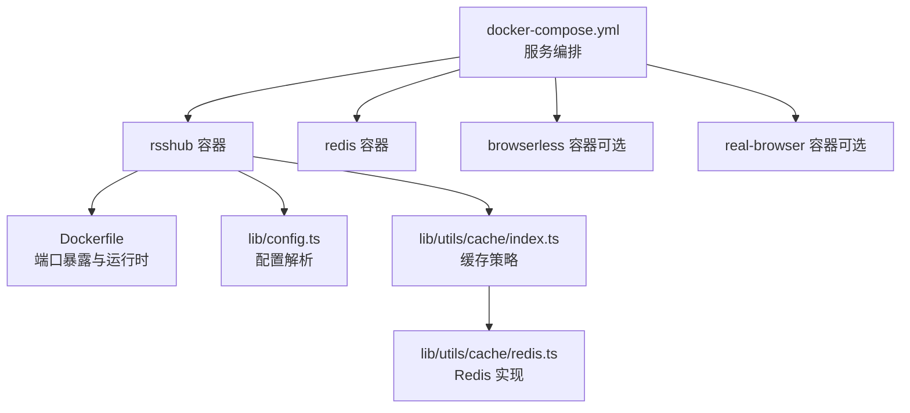
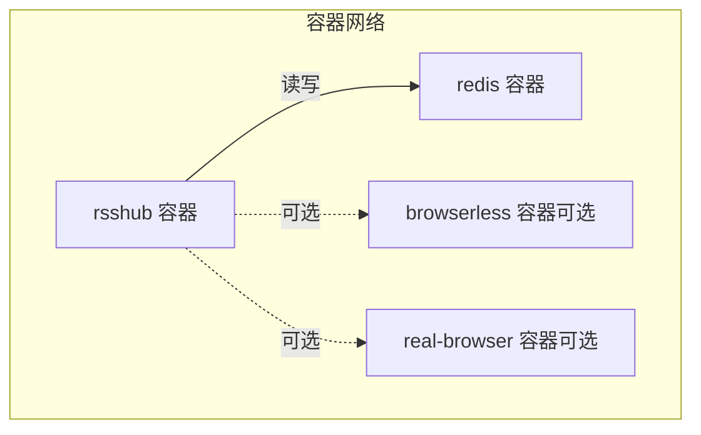
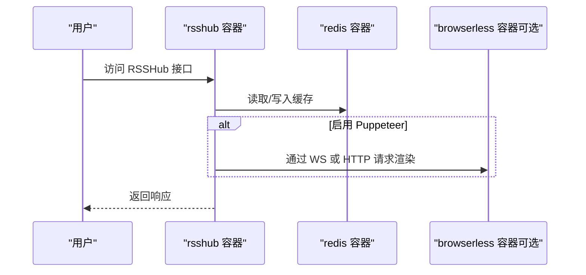
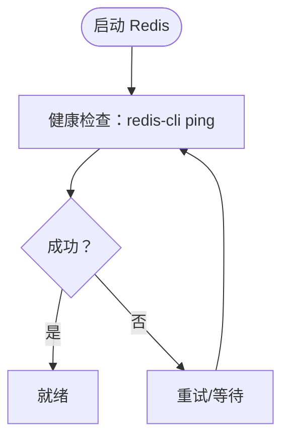
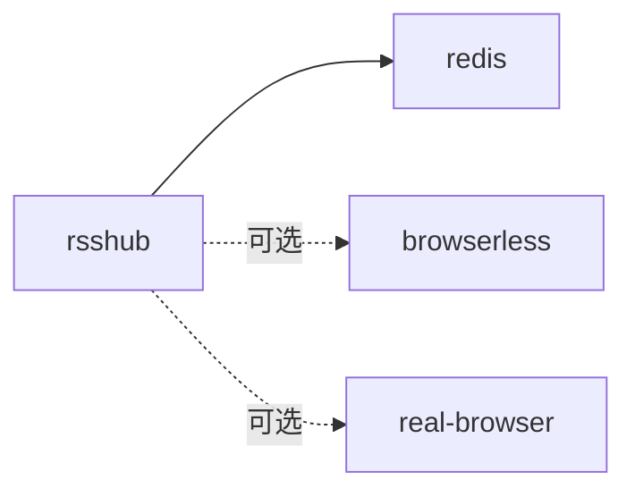

# docker-compose配置

<cite>
**本文引用的文件**
- [docker-compose.yml](file://docker-compose.yml)
- [Dockerfile](file://Dockerfile)
- [lib/config.ts](file://lib/config.ts)
- [lib/utils/cache/index.ts](file://lib/utils/cache/index.ts)
- [lib/utils/cache/redis.ts](file://lib/utils/cache/redis.ts)
- [scripts/ansible/rsshub.env](file://scripts/ansible/rsshub.env)
- [flake.nix](file://flake.nix)
</cite>

## 目录
1. [简介](#简介)
2. [项目结构](#项目结构)
3. [核心组件](#核心组件)
4. [架构总览](#架构总览)
5. [详细组件分析](#详细组件分析)
6. [依赖分析](#依赖分析)
7. [性能考虑](#性能考虑)
8. [故障排查指南](#故障排查指南)
9. [结论](#结论)
10. [附录](#附录)

## 简介
本文件面向使用 RSSHub 的运维与开发者，系统化讲解基于 docker-compose 的容器编排方案。重点覆盖：
- docker-compose.yml 的服务定义、网络、卷与环境变量
- Redis 缓存与 RSSHub 主服务的连接方式与安全建议
- 关键环境变量（如 CACHE_EXPIRE、REDIS_URL、NODE_ENV 等）的作用与取值
- 多实例部署与负载均衡思路
- 健康检查与依赖关系管理

## 项目结构
仓库中与容器编排直接相关的文件与位置如下：
- docker-compose.yml：定义 RSSHub、Redis、可选浏览器服务及真实浏览器服务的容器编排
- Dockerfile：镜像构建入口，暴露端口并设置运行时环境
- lib/config.ts：应用配置解析，包含缓存、Redis、代理、日志等配置项
- lib/utils/cache/index.ts 与 lib/utils/cache/redis.ts：缓存模块实现，负责根据配置选择内存或 Redis 缓存
- scripts/ansible/rsshub.env：示例环境变量文件
- flake.nix：Nix 配置中对环境变量与 Redis 的选项定义

图表来源
- [docker-compose.yml](file://docker-compose.yml#L1-L63)
- [Dockerfile](file://Dockerfile#L179-L184)
- [lib/config.ts](file://lib/config.ts#L730-L768)
- [lib/utils/cache/index.ts](file://lib/utils/cache/index.ts#L16-L60)
- [lib/utils/cache/redis.ts](file://lib/utils/cache/redis.ts#L1-L77)

章节来源
- [docker-compose.yml](file://docker-compose.yml#L1-L63)
- [Dockerfile](file://Dockerfile#L179-L184)

## 核心组件
- RSSHub 主服务（rsshub）
  - 使用官方镜像，映射端口，设置运行环境变量，声明对 Redis 与浏览器服务的依赖
  - 健康检查通过本地健康接口探测
- Redis 缓存（redis）
  - 使用官方 Alpine 镜像，持久化数据卷，内置健康检查
- 浏览器相关服务（可选）
  - browserless：Chrome 无头浏览器服务（标记为可选）
  - real-browser：真实浏览器服务（标记为可选）

章节来源
- [docker-compose.yml](file://docker-compose.yml#L1-L63)

## 架构总览
下图展示 RSSHub 在 docker-compose 中的典型拓扑：RSSHub 依赖 Redis 提供缓存；若启用 Puppeteer 场景，RSSHub 可通过 WebSocket 或 HTTP 与浏览器服务通信。

图表来源
- [docker-compose.yml](file://docker-compose.yml#L1-L63)

## 详细组件分析

### RSSHub 服务（rsshub）
- 镜像与端口
  - 使用官方镜像，容器内监听端口对外映射到宿主机
- 环境变量
  - NODE_ENV：运行环境（生产/开发）
  - CACHE_TYPE：缓存类型（memory/redis）
  - REDIS_URL：Redis 连接地址（默认指向同网络内的 redis 服务）
  - Puppeteer 相关（可选）：PUPPETEER_WS_ENDPOINT、PUPPETEER_REAL_BROWSER_SERVICE
- 健康检查
  - 通过本地健康接口进行探测
- 依赖关系
  - 依赖 redis 与浏览器服务（可选）

图表来源
- [docker-compose.yml](file://docker-compose.yml#L1-L63)
- [lib/utils/cache/index.ts](file://lib/utils/cache/index.ts#L16-L60)
- [lib/utils/cache/redis.ts](file://lib/utils/cache/redis.ts#L1-L77)

章节来源
- [docker-compose.yml](file://docker-compose.yml#L1-L63)
- [lib/config.ts](file://lib/config.ts#L730-L768)

### Redis 缓存服务（redis）
- 镜像与持久化
  - 使用 Alpine 镜像，将数据目录挂载到命名卷以持久化
- 健康检查
  - 通过 Redis CLI ping 检测连通性
- 连接方式
  - RSSHub 通过 REDIS_URL 指向 redis 服务，默认使用同网络域名访问

图表来源
- [docker-compose.yml](file://docker-compose.yml#L49-L63)
- [lib/utils/cache/redis.ts](file://lib/utils/cache/redis.ts#L1-L77)

章节来源
- [docker-compose.yml](file://docker-compose.yml#L49-L63)
- [lib/utils/cache/index.ts](file://lib/utils/cache/index.ts#L16-L60)
- [lib/utils/cache/redis.ts](file://lib/utils/cache/redis.ts#L1-L77)

### 浏览器服务（可选）
- browserless（可选）
  - 无头 Chrome 服务，用于 Puppeteer 渲染
- real-browser（可选）
  - 真实浏览器服务，配合 RSSHub 的真实浏览器路由

章节来源
- [docker-compose.yml](file://docker-compose.yml#L25-L48)

### 环境变量详解
以下为 RSSHub 在 docker-compose 中常用的关键环境变量及其作用范围与默认值来源：

- NODE_ENV
  - 作用：控制运行环境（如生产/开发），影响日志级别与调试行为
  - 默认值：在镜像构建阶段设置为生产环境
  - 来源：镜像环境变量与配置解析
  - 参考路径
    - [Dockerfile](file://Dockerfile#L122-L125)
    - [lib/config.ts](file://lib/config.ts#L730-L768)

- CACHE_TYPE
  - 作用：缓存类型选择（memory/redis）
  - 默认值：空字符串表示禁用缓存；未显式设置时默认 memory
  - 参考路径
    - [lib/config.ts](file://lib/config.ts#L730-L768)
    - [lib/utils/cache/index.ts](file://lib/utils/cache/index.ts#L16-L60)

- CACHE_EXPIRE
  - 作用：路由级缓存过期时间（秒）
  - 默认值：5 分钟
  - 参考路径
    - [lib/config.ts](file://lib/config.ts#L730-L768)

- CACHE_CONTENT_EXPIRE
  - 作用：内容不变类缓存的过期时间（秒）
  - 默认值：1 小时
  - 参考路径
    - [lib/config.ts](file://lib/config.ts#L730-L768)

- REDIS_URL
  - 作用：Redis 连接字符串（含协议、主机、端口、数据库）
  - 默认值：指向本地同网络 redis 服务
  - 参考路径
    - [docker-compose.yml](file://docker-compose.yml#L10-L16)
    - [lib/config.ts](file://lib/config.ts#L745-L747)
    - [lib/utils/cache/redis.ts](file://lib/utils/cache/redis.ts#L1-L77)

- PUPPETEER_WS_ENDPOINT
  - 作用：Puppeteer WebSocket 端点（与 browserless 对接）
  - 默认值：指向同网络 browserless 服务
  - 参考路径
    - [docker-compose.yml](file://docker-compose.yml#L10-L16)
    - [lib/config.ts](file://lib/config.ts#L720-L721)

- PUPPETEER_REAL_BROWSER_SERVICE
  - 作用：真实浏览器服务 HTTP 地址（与 real-browser 对接）
  - 默认值：指向同网络 real-browser 服务
  - 参考路径
    - [docker-compose.yml](file://docker-compose.yml#L10-L16)
    - [lib/config.ts](file://lib/config.ts#L720-L721)

- 其他相关变量
  - PROXY_*、ACCESS_KEY、DEBUG_INFO、LOGGER_LEVEL 等
  - 参考路径
    - [lib/config.ts](file://lib/config.ts#L749-L789)

章节来源
- [docker-compose.yml](file://docker-compose.yml#L10-L16)
- [Dockerfile](file://Dockerfile#L122-L125)
- [lib/config.ts](file://lib/config.ts#L730-L768)
- [lib/utils/cache/index.ts](file://lib/utils/cache/index.ts#L16-L60)
- [lib/utils/cache/redis.ts](file://lib/utils/cache/redis.ts#L1-L77)

## 依赖分析
- 服务间依赖
  - rsshub 依赖 redis（必须）与浏览器服务（可选）
- 健康检查
  - rsshub：健康接口探测
  - redis：Redis CLI ping
  - 浏览器服务：HTTP 健康检查
- 网络隔离
  - docker-compose 默认在同一网络，容器可通过服务名互访
  - 若需更强隔离，可在自定义网络中拆分不同子网

图表来源
- [docker-compose.yml](file://docker-compose.yml#L1-L63)

章节来源
- [docker-compose.yml](file://docker-compose.yml#L1-L63)

## 性能考虑
- 缓存策略
  - 使用 Redis 缓存可显著降低重复抓取开销；合理设置 CACHE_EXPIRE 与 CACHE_CONTENT_EXPIRE
- 并发与资源
  - Puppeteer 场景会增加 CPU/内存占用，建议按需启用并限制并发
- 存储与持久化
  - Redis 数据卷持久化避免重启丢失
- 端口与网络
  - 仅开放必要端口，避免暴露内部服务

## 故障排查指南
- Redis 连接失败
  - 检查 REDIS_URL 是否正确指向 redis 服务
  - 查看 Redis 健康检查状态
  - 参考路径
    - [docker-compose.yml](file://docker-compose.yml#L49-L63)
    - [lib/config.ts](file://lib/config.ts#L745-L747)
    - [lib/utils/cache/redis.ts](file://lib/utils/cache/redis.ts#L1-L77)

- 缓存不可用
  - 确认 CACHE_TYPE 设置为 redis，并确保 Redis 可达
  - 参考路径
    - [lib/config.ts](file://lib/config.ts#L730-L768)
    - [lib/utils/cache/index.ts](file://lib/utils/cache/index.ts#L16-L60)

- Puppeteer 无法连接
  - 检查 PUPPETEER_WS_ENDPOINT/PUPPETEER_REAL_BROWSER_SERVICE 是否指向对应服务
  - 参考路径
    - [docker-compose.yml](file://docker-compose.yml#L10-L16)
    - [lib/config.ts](file://lib/config.ts#L720-L721)

- 健康检查失败
  - 检查各服务健康检查命令与端口映射是否一致
  - 参考路径
    - [docker-compose.yml](file://docker-compose.yml#L1-L63)

章节来源
- [docker-compose.yml](file://docker-compose.yml#L1-L63)
- [lib/config.ts](file://lib/config.ts#L720-L768)
- [lib/utils/cache/index.ts](file://lib/utils/cache/index.ts#L16-L60)
- [lib/utils/cache/redis.ts](file://lib/utils/cache/redis.ts#L1-L77)

## 结论
通过 docker-compose，RSSHub 可快速搭建包含 Redis 缓存与可选浏览器服务的运行环境。合理设置环境变量、利用健康检查与依赖管理，可获得稳定可靠的部署体验。生产环境中建议开启 Redis 缓存、限制 Puppeteer 并做好网络隔离与持久化。

## 附录

### 配置示例与最佳实践

- 开发环境
  - 使用默认镜像与本地 Redis
  - 可临时关闭 Puppeteer 或使用轻量浏览器服务
  - 参考路径
    - [docker-compose.yml](file://docker-compose.yml#L1-L63)
    - [scripts/ansible/rsshub.env](file://scripts/ansible/rsshub.env#L1-L4)

- 生产环境
  - 显式设置 CACHE_TYPE=redis 与 REDIS_URL
  - 启用健康检查与持久化卷
  - 参考路径
    - [docker-compose.yml](file://docker-compose.yml#L1-L63)
    - [lib/config.ts](file://lib/config.ts#L730-L768)

- 高可用部署（概念性）
  - 多实例 RSSHub + 单 Redis：通过反向代理实现负载均衡
  - 多 Redis 实例：使用哨兵或集群（需在应用侧配置相应连接参数）
  - 网络隔离：使用自定义网络与防火墙规则限制访问
  - 参考路径
    - [docker-compose.yml](file://docker-compose.yml#L1-L63)
    - [flake.nix](file://flake.nix#L152-L209)

- 环境变量清单（节选）
  - NODE_ENV、CACHE_TYPE、CACHE_EXPIRE、CACHE_CONTENT_EXPIRE、REDIS_URL、PUPPETEER_WS_ENDPOINT、PUPPETEER_REAL_BROWSER_SERVICE
  - 参考路径
    - [lib/config.ts](file://lib/config.ts#L730-L768)
    - [docker-compose.yml](file://docker-compose.yml#L10-L16)
    - [scripts/ansible/rsshub.env](file://scripts/ansible/rsshub.env#L1-L4)