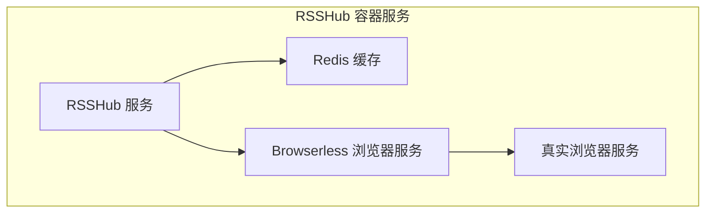
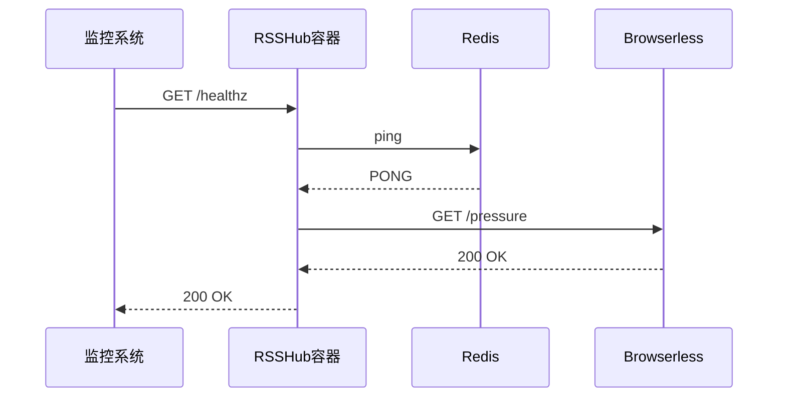
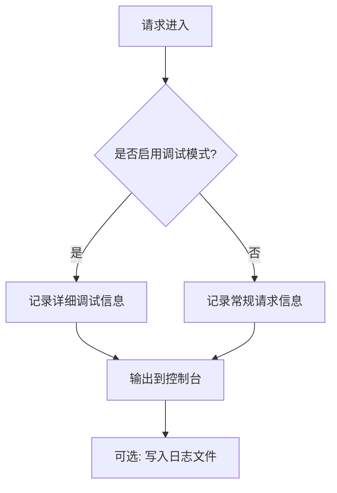
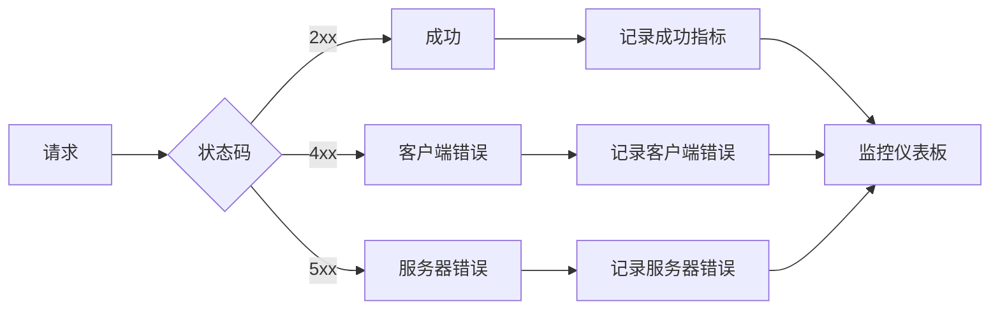

# 容器管理

<cite>
**本文档中引用的文件**  
- [Dockerfile](file://Dockerfile)
- [docker-compose.yml](file://docker-compose.yml)
- [fly.toml](file://fly.toml)
- [lib/middleware/logger.ts](file://lib/middleware/logger.ts)
- [lib/config.ts](file://lib/config.ts)
- [scripts/docker/test-docker.sh](file://scripts/docker/test-docker.sh)
</cite>

## 目录
1. [简介](#简介)
2. [容器运行管理](#容器运行管理)
3. [容器监控与健康检查](#容器监控与健康检查)
4. [日志管理](#日志管理)
5. [性能监控](#性能监控)
6. [备份与恢复策略](#备份与恢复策略)
7. [常见问题排查](#常见问题排查)

## 简介
RSSHub 是一个开源的 RSS 聚合服务，支持通过容器化方式部署和运行。本文档详细介绍了 RSSHub 容器的运行、监控、维护和故障排查方法，涵盖容器生命周期管理、日志分析、性能监控、健康检查、备份恢复等关键运维实践，帮助用户实现高可用、零停机的容器化部署。

## 容器运行管理

RSSHub 提供了完整的容器化部署方案，支持通过 Docker 和 Docker Compose 进行部署和管理。容器镜像基于 Node.js 环境构建，集成了必要的依赖和优化。

### 容器启动与停止

使用 `docker-compose.yml` 文件可以方便地启动和停止 RSSHub 容器服务。该文件定义了 RSSHub 主服务、Redis 缓存、浏览器服务等多个组件。



**Diagram sources**
- [docker-compose.yml](file://docker-compose.yml#L2-L62)

**Section sources**
- [docker-compose.yml](file://docker-compose.yml#L2-L62)
- [Dockerfile](file://Dockerfile#L1-L207)

### 容器更新与滚动部署

RSSHub 支持滚动更新策略，可以通过重新构建镜像或拉取最新镜像实现无缝更新。建议使用以下流程进行零停机部署：

1. 构建新版本镜像
2. 更新 `docker-compose.yml` 中的镜像标签
3. 使用 `docker-compose up -d` 命令启动新容器
4. 系统会自动停止旧容器并启动新容器，实现平滑过渡

对于生产环境，建议先在测试环境中验证新版本，再进行生产环境更新。

### 零停机部署方案

通过 Docker Compose 的服务编排能力，可以实现 RSSHub 的零停机部署。当更新服务时，Docker 会先启动新容器实例，待新实例健康检查通过后，再停止旧实例，确保服务不中断。

## 容器监控与健康检查

RSSHub 容器内置了完善的健康检查机制，确保服务的稳定性和可用性。

### 健康检查配置

RSSHub 主服务配置了 HTTP 健康检查，通过访问 `/healthz` 端点来检测服务状态：

```yaml
healthcheck:
  test: ['CMD', 'curl', '-f', 'http://localhost:1200/healthz']
  interval: 30s
  timeout: 10s
  retries: 3
```

Redis 和 Browserless 服务也配置了相应的健康检查，确保依赖服务的正常运行。



**Diagram sources**
- [docker-compose.yml](file://docker-compose.yml#L16-L20)
- [fly.toml](file://fly.toml#L10-L15)

**Section sources**
- [docker-compose.yml](file://docker-compose.yml#L16-L62)
- [fly.toml](file://fly.toml#L1-L15)

### 自动恢复机制

当容器健康检查失败时，Docker 会根据配置的重启策略自动重启容器。RSSHub 服务配置了 `restart: always` 策略，确保服务在异常退出后能够自动恢复。

## 日志管理

RSSHub 提供了完善的日志管理功能，便于问题排查和系统监控。

### 日志查看与分析

RSSHub 使用中间件记录请求日志，包含请求方法、路径、状态码和响应时间等信息。日志输出格式如下：

```
<-- GET /rss/some/path
--> GET /rss/some/path 200 123ms
```

通过 `docker logs` 命令可以查看容器日志：

```bash
docker logs rsshub_container_name
```

### 日志级别配置

日志级别可以通过环境变量进行配置：

- `LOGGER_LEVEL`: 设置日志级别（info、warn、error等）
- `DEBUG_INFO`: 控制是否显示调试信息



**Diagram sources**
- [lib/middleware/logger.ts](file://lib/middleware/logger.ts#L1-L46)
- [lib/config.ts](file://lib/config.ts#L770-L773)

**Section sources**
- [lib/middleware/logger.ts](file://lib/middleware/logger.ts#L1-L46)
- [lib/config.ts](file://lib/config.ts#L764-L791)

### 日志归档

默认情况下，日志输出到容器的标准输出。可以通过挂载卷的方式将日志持久化到主机文件系统，便于长期存储和分析。

## 性能监控

RSSHub 提供了多种性能监控指标，帮助用户了解系统运行状况。

### 资源使用监控

通过 Docker 的资源限制和监控功能，可以监控 RSSHub 容器的 CPU、内存、网络等资源使用情况。建议设置合理的资源限制，防止资源耗尽。

### 请求速率跟踪

RSSHub 记录每个请求的处理时间，可用于分析系统性能瓶颈。通过分析日志中的响应时间，可以识别慢请求和性能问题。

### 错误率分析

系统会记录请求的 HTTP 状态码，通过分析 4xx 和 5xx 错误率，可以及时发现服务异常。建议设置告警规则，当错误率超过阈值时及时通知。



**Diagram sources**
- [lib/middleware/logger.ts](file://lib/middleware/logger.ts#L41-L42)
- [lib/config.ts](file://lib/config.ts#L774-L777)

**Section sources**
- [lib/middleware/logger.ts](file://lib/middleware/logger.ts#L1-L46)
- [lib/config.ts](file://lib/config.ts#L764-L791)

## 备份与恢复策略

### 配置文件持久化

RSSHub 的配置文件应通过环境变量或配置卷进行管理，确保配置的持久化和可移植性。

### 缓存数据管理

Redis 作为 RSSHub 的缓存后端，其数据需要定期备份。通过 Docker Compose 中定义的卷（volume），可以将 Redis 数据持久化到主机：

```yaml
volumes:
  - redis-data:/data
```

建议定期备份 `redis-data` 卷中的数据，以防数据丢失。

### 备份恢复流程

1. 停止 RSSHub 服务
2. 备份 Redis 数据卷
3. 恢复时，将备份数据复制到 Redis 数据卷目录
4. 启动服务

## 常见问题排查

### 容器崩溃

当容器频繁崩溃时，应检查：
- 资源限制是否过低
- 日志中是否有未处理的异常
- 依赖服务（如 Redis）是否正常运行

使用 `docker logs` 查看崩溃原因，根据错误信息进行修复。

### 内存泄漏

监控容器内存使用情况，如果内存持续增长，可能存在内存泄漏。建议：
- 检查代码中是否存在未释放的资源
- 限制 Node.js 的内存使用
- 定期重启容器

### 网络连接问题

当出现网络连接问题时，应检查：
- 容器网络配置
- 防火墙设置
- 依赖服务的网络可达性

使用 `docker exec` 进入容器内部，使用 `curl` 或 `ping` 命令测试网络连接。

**Section sources**
- [scripts/docker/test-docker.sh](file://scripts/docker/test-docker.sh#L1-L32)
- [Dockerfile](file://Dockerfile#L149-L206)
- [docker-compose.yml](file://docker-compose.yml#L49-L62)