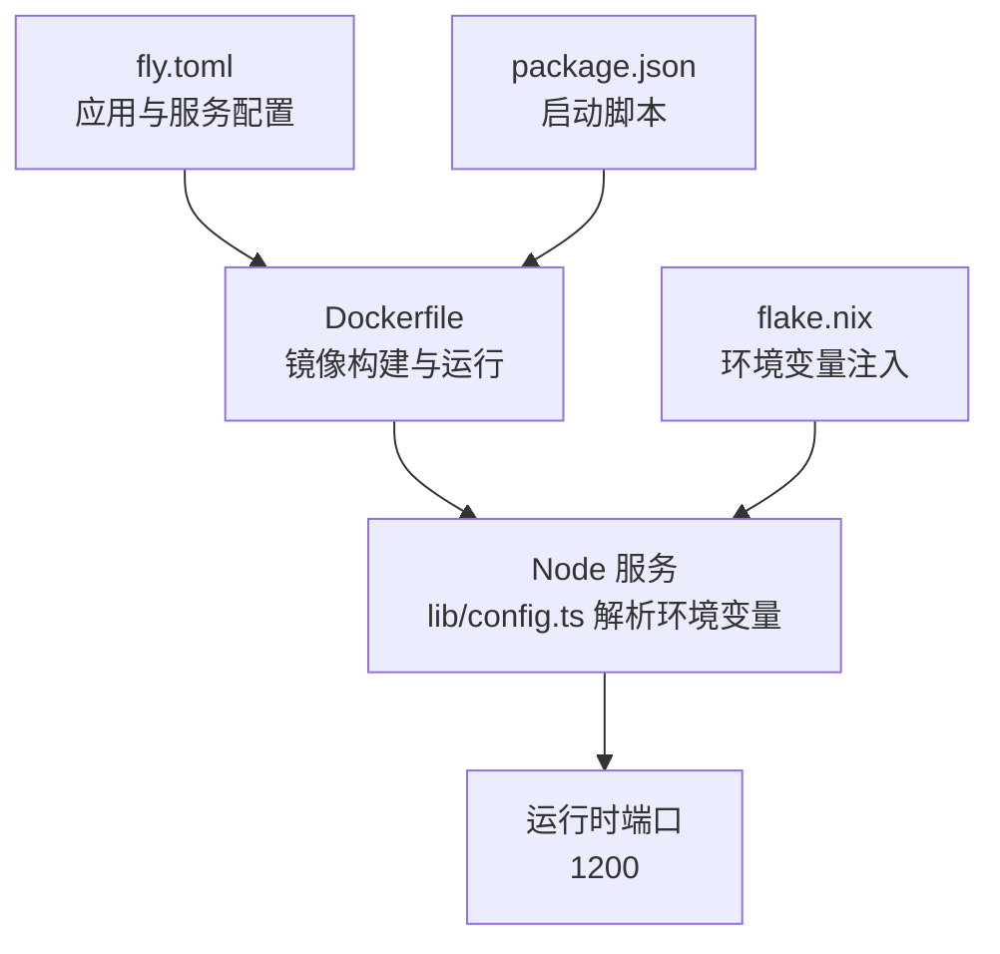
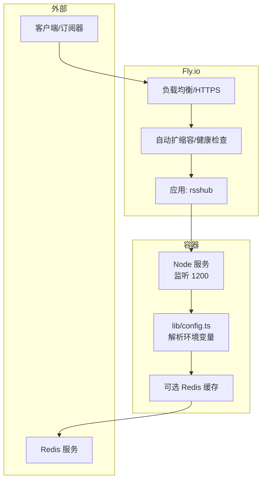
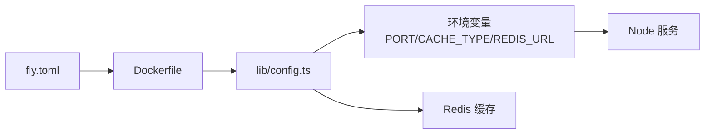

# Fly.io 部署

<cite>
**本文引用的文件列表**
- [fly.toml](file://fly.toml)
- [Dockerfile](file://Dockerfile)
- [package.json](file://package.json)
- [lib/config.ts](file://lib/config.ts)
- [flake.nix](file://flake.nix)
- [README.md](file://README.md)
</cite>

## 目录
1. [简介](#简介)
2. [项目结构与部署入口](#项目结构与部署入口)
3. [核心组件与配置要点](#核心组件与配置要点)
4. [架构总览](#架构总览)
5. [详细组件分析](#详细组件分析)
6. [依赖关系分析](#依赖关系分析)
7. [性能优化建议](#性能优化建议)
8. [故障排查指南](#故障排查指南)
9. [结论](#结论)
10. [附录：部署流程与最佳实践](#附录部署流程与最佳实践)

## 简介
本指南面向在 Fly.io 平台上部署 RSSHub 的用户，系统性解析 fly.toml 配置文件的结构与参数含义，结合仓库中的 Dockerfile、package.json、运行时配置与 NixOS 模块，给出从零开始的部署流程、持久化存储与数据库连接配置、自定义域名接入、性能优化策略以及常见问题排查方法。目标是帮助读者以最小成本完成稳定、可扩展的部署。

## 项目结构与部署入口
- 应用入口与运行方式
  - 运行脚本通过 package.json 中的启动命令执行，最终由 Docker 入口 CMD 启动 Node 服务。
  - Dockerfile 显式暴露服务端口并设置进程入口，确保容器内服务监听端口与 fly.toml 内部端口一致。
- 部署入口
  - fly.toml 定义了应用名、内部端口、HTTPS 强制、健康检查、自动启停与最低运行实例数等关键参数。
  - flake.nix 提供了 NixOS 模块示例，展示如何将环境变量（如 PORT、CACHE_TYPE、REDIS_URL）注入到 RSSHub 运行环境中。

图表来源
- [fly.toml](file://fly.toml#L1-L16)
- [Dockerfile](file://Dockerfile#L179-L184)
- [lib/config.ts](file://lib/config.ts#L725-L730)
- [package.json](file://package.json#L33-L48)
- [flake.nix](file://flake.nix#L152-L209)

章节来源
- [fly.toml](file://fly.toml#L1-L16)
- [Dockerfile](file://Dockerfile#L179-L184)
- [package.json](file://package.json#L33-L48)
- [lib/config.ts](file://lib/config.ts#L725-L730)
- [flake.nix](file://flake.nix#L152-L209)

## 核心组件与配置要点
- 应用与服务配置（fly.toml）
  - app：应用名，用于 Fly.io 识别与命名资源。
  - http_service.internal_port：容器内服务监听端口，需与 Dockerfile EXPOSE 与 Node 运行配置一致。
  - http_service.force_https：强制 HTTPS，提升安全性。
  - http_service.auto_stop_machines / auto_start_machines：按需启停机器，节省成本。
  - http_service.min_machines_running：保持至少 1 台运行中实例，保障可用性。
  - [[http_service.checks]]：健康检查路径与周期，确保自动扩缩容与负载均衡生效。
- 运行时端口与环境变量（lib/config.ts）
  - 默认监听端口来自环境变量 PORT，默认 1200；若未设置，将使用 1200。
  - 缓存与 Redis：CACHE_TYPE 控制缓存类型（memory/redis），REDIS_URL 为 Redis 连接串。
  - 网络与代理：PROXY_* 系列变量用于配置代理链路与健康检查间隔。
- 镜像与启动（Dockerfile、package.json）
  - Dockerfile EXPOSE 1200，CMD 使用 npm run start 启动 Node 服务。
  - package.json scripts.start 指向 dist/index.mjs，确保生产模式运行。

章节来源
- [fly.toml](file://fly.toml#L1-L16)
- [lib/config.ts](file://lib/config.ts#L725-L747)
- [Dockerfile](file://Dockerfile#L179-L184)
- [package.json](file://package.json#L33-L48)

## 架构总览
下图展示了 Fly.io 上 RSSHub 的部署与运行架构：Fly.io 通过 fly.toml 配置路由与实例行为，容器内 Node 服务监听 1200 端口，lib/config.ts 基于环境变量进行运行时配置，缓存层可选 Redis。

图表来源
- [fly.toml](file://fly.toml#L1-L16)
- [lib/config.ts](file://lib/config.ts#L725-L747)
- [Dockerfile](file://Dockerfile#L179-L184)

## 详细组件分析

### fly.toml 配置详解
- app
  - 作用：Fly.io 应用标识，决定资源命名与控制台可见性。
- http_service
  - internal_port：容器内服务监听端口，必须与 Dockerfile EXPOSE 一致。
  - force_https：启用后，所有入站流量将被重定向至 HTTPS。
  - auto_stop_machines：空闲时挂起实例，降低资源占用。
  - auto_start_machines：新版本或扩容时自动启动实例。
  - min_machines_running：维持至少 1 台运行中实例，避免冷启动抖动。
- [[http_service.checks]]
  - grace_period：启动后等待时间，避免过早判定失败。
  - interval：健康检查周期。
  - method/path/timeout：HTTP GET /healthz，超时与路径需与服务实现一致。

章节来源
- [fly.toml](file://fly.toml#L1-L16)

### Dockerfile 与运行时端口
- EXPOSE 1200：声明容器监听端口。
- ENTRYPOINT/CMD：使用 dumb-init 作为 PID 1，并执行 npm run start。
- 环境变量：NODE_ENV=production、TZ=Asia/Shanghai 等，确保生产环境稳定性与时区正确。

章节来源
- [Dockerfile](file://Dockerfile#L179-L184)

### package.json 启动脚本
- scripts.start：生产模式启动 Node 服务，确保 HTTP 头大小上限满足高并发场景。
- scripts.dev/dev:cache：开发与生产调试模式，便于本地验证。

章节来源
- [package.json](file://package.json#L33-L48)

### 运行时配置与环境变量（lib/config.ts）
- 端口与网络
  - connect.port：默认 1200，可通过 PORT 覆盖。
  - listenInaddrAny：是否允许公网访问。
- 缓存与 Redis
  - CACHE_TYPE：memory 或 redis；留空可禁用缓存。
  - REDIS_URL：Redis 连接串，默认 redis://localhost:6379/。
- 代理与健康检查
  - PROXY_*：代理协议、主机、端口、认证、URL 匹配与回退策略。
  - 健康检查间隔：PROXY_HEALTH_CHECK_INTERVAL。
- 其他常用变量
  - ACCESS_KEY：访问控制密钥。
  - LOGGER_LEVEL/SENTRY_*：日志级别与 Sentry 集成。
  - OPENAI_*：OpenAI 相关配置（如需）。

章节来源
- [lib/config.ts](file://lib/config.ts#L725-L747)
- [lib/config.ts](file://lib/config.ts#L749-L764)
- [lib/config.ts](file://lib/config.ts#L770-L783)

### NixOS 模块与环境变量注入（flake.nix）
- 环境变量示例：PORT、CACHE_TYPE、REDIS_URL、ALLOW_LOCALHOST 等。
- Redis 集成：当启用 redis.enable 时，自动注入 CACHE_TYPE 与 REDIS_URL。
- 端口派生：根据 cfg.port 注入 PORT，必要时注入 LISTEN_INADDR_ANY。

章节来源
- [flake.nix](file://flake.nix#L152-L209)

## 依赖关系分析
- 配置耦合
  - fly.toml 的 internal_port 必须与 Dockerfile EXPOSE 一致。
  - lib/config.ts 的 connect.port 默认来源于 PORT，需与 fly.toml 保持一致。
- 缓存依赖
  - 当 CACHE_TYPE=redis 时，需提供有效的 REDIS_URL。
- 运行时依赖
  - Node 版本与包管理器要求见 package.json engines 与 pnpm 字段。
  - Dockerfile 中对 Puppeteer/Chromium 的处理与多阶段构建逻辑影响镜像体积与启动时间。

图表来源
- [fly.toml](file://fly.toml#L1-L16)
- [Dockerfile](file://Dockerfile#L179-L184)
- [lib/config.ts](file://lib/config.ts#L725-L747)

章节来源
- [fly.toml](file://fly.toml#L1-L16)
- [Dockerfile](file://Dockerfile#L179-L184)
- [lib/config.ts](file://lib/config.ts#L725-L747)

## 性能优化建议
- 实例类型与自动扩缩容
  - 在 Fly.io 控制台选择合适的实例规格，结合 http_service.min_machines_running 与健康检查，平衡成本与可用性。
- 缓存策略
  - 使用 Redis 作为缓存后端，合理设置 REDIS_URL 与 CACHE_TYPE，减少上游抓取压力。
  - 对热点路由开启更长的内容缓存时间（参考 lib/config.ts 中的缓存相关字段）。
- 端口与网络
  - 确保 PORT 与 internal_port 一致，避免路由转发异常导致延迟。
  - 如需公网访问，确认 listenInaddrAny 设置与安全组策略。
- 镜像与启动
  - Dockerfile 已采用多阶段构建与最小化依赖，尽量复用现有镜像以缩短构建时间。
  - 启动脚本使用 dumb-init，有助于进程生命周期管理与信号处理。

章节来源
- [fly.toml](file://fly.toml#L1-L16)
- [lib/config.ts](file://lib/config.ts#L725-L747)
- [Dockerfile](file://Dockerfile#L179-L184)

## 故障排查指南
- 部署失败
  - 检查 fly.toml 与 Dockerfile 端口一致性（internal_port 与 EXPOSE）。
  - 确认 package.json 启动脚本与 Dockerfile CMD 一致。
- 连接超时
  - 查看 [[http_service.checks]] 的 timeout 与 path，确保服务能在健康检查时间内响应 /healthz。
  - 检查 Redis 连接串（REDIS_URL）与网络连通性。
- 资源限制
  - 若内存不足，适当提高实例规格或优化缓存策略。
  - 关注 Dockerfile 中 Chromium/Puppeteer 的安装与依赖，避免启动阶段资源争用。
- 环境变量未生效
  - 确认环境变量已在 Fly.io 应用设置中配置，或通过 NixOS 模块注入（参考 flake.nix）。

章节来源
- [fly.toml](file://fly.toml#L10-L16)
- [Dockerfile](file://Dockerfile#L179-L184)
- [lib/config.ts](file://lib/config.ts#L725-L747)
- [flake.nix](file://flake.nix#L152-L209)

## 结论
通过 fly.toml、Dockerfile、package.json 与运行时配置的协同，RSSHub 可在 Fly.io 上实现稳定、可扩展的部署。关键在于端口一致性、缓存与数据库连接配置、健康检查与自动扩缩容策略，以及环境变量的正确注入。结合本文提供的流程与排障建议，可快速完成从零到一的部署与优化。

## 附录：部署流程与最佳实践
- 准备工作
  - 安装 Fly.io CLI 并登录账户。
  - 准备 fly.toml、Dockerfile、package.json 与 lib/config.ts。
- 创建应用与部署
  - 在 Fly.io 控制台创建应用，或使用 CLI 初始化。
  - 配置环境变量：PORT、CACHE_TYPE、REDIS_URL 等。
  - 执行部署命令，观察健康检查状态与日志输出。
- 持久化存储与数据库
  - 使用 Redis 作为缓存后端，确保 REDIS_URL 正确且网络可达。
  - 如需本地 Redis，可参考 flake.nix 的 Redis 配置示例。
- 自定义域名
  - 在 Fly.io 控制台绑定自定义域名，并确保 DNS 记录指向 Fly.io 提供的地址。
- 性能与可用性
  - 合理设置 http_service.min_machines_running 与健康检查参数。
  - 选择合适实例规格，结合自动扩缩容策略。
- 文档与参考
  - 参考项目 README 的部署与文档链接，获取更多背景信息与社区支持。

章节来源
- [README.md](file://README.md#L38-L41)
- [fly.toml](file://fly.toml#L1-L16)
- [Dockerfile](file://Dockerfile#L179-L184)
- [lib/config.ts](file://lib/config.ts#L725-L747)
- [flake.nix](file://flake.nix#L152-L209)