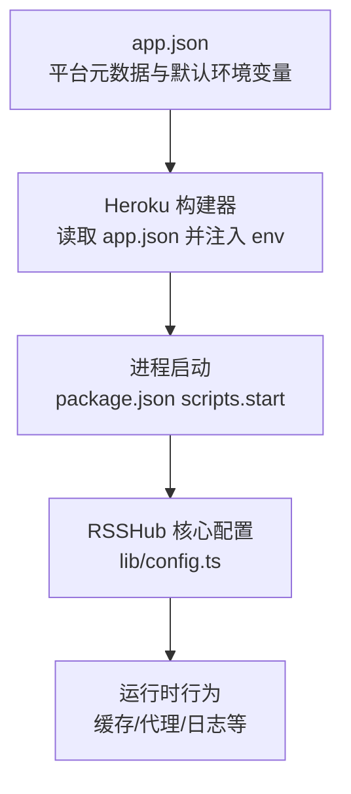
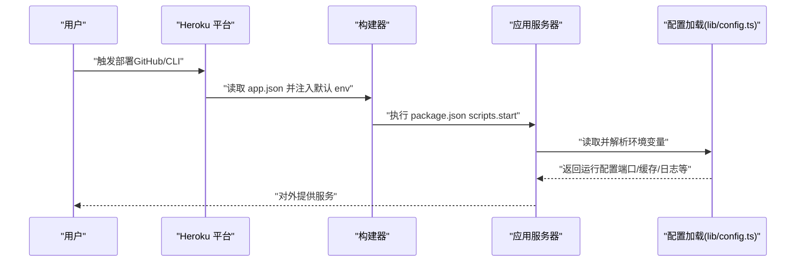
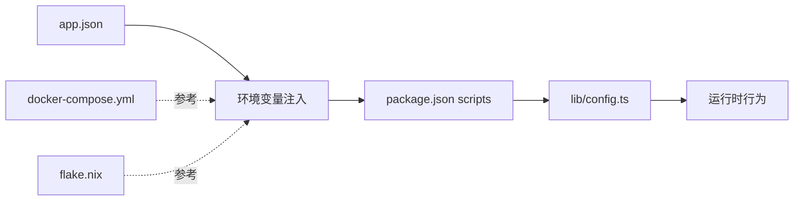

# Heroku 部署

<cite>
**本文引用的文件**
- [app.json](file://app.json)
- [package.json](file://package.json)
- [README.md](file://README.md)
- [lib/config.ts](file://lib/config.ts)
- [lib/utils/git-hash.ts](file://lib/utils/git-hash.ts)
- [scripts/ansible/rsshub.env](file://scripts/ansible/rsshub.env)
- [docker-compose.yml](file://docker-compose.yml)
- [flake.nix](file://flake.nix)
</cite>

## 目录
1. [简介](#简介)
2. [项目结构](#项目结构)
3. [核心组件](#核心组件)
4. [架构总览](#架构总览)
5. [详细组件分析](#详细组件分析)
6. [依赖关系分析](#依赖关系分析)
7. [性能与资源规划](#性能与资源规划)
8. [部署方式与步骤](#部署方式与步骤)
9. [环境变量与配置](#环境变量与配置)
10. [监控、日志与性能分析](#监控日志与性能分析)
11. [成本控制与套餐建议](#成本控制与套餐建议)
12. [故障排查指南](#故障排查指南)
13. [结论](#结论)

## 简介
本文件面向在 Heroku 平台上部署 RSSHub 的用户，系统性梳理 app.json 配置、环境变量、部署流程、监控与成本控制，并给出常见问题的排查建议。文档同时结合仓库中的配置与示例文件，帮助读者快速完成从零到一的部署与运维。

## 项目结构
- 应用入口与运行脚本：通过 package.json 的 scripts 定义启动与开发命令，生产模式下通过 start 命令运行。
- 配置加载：RSSHub 通过 lib/config.ts 统一读取环境变量并生成运行配置；同时支持从 .env 文件加载默认值。
- Heroku 集成：app.json 提供 Heroku 平台所需的元数据与默认环境变量；仓库中还包含对 Heroku 特定环境变量的兼容逻辑（例如 slug commit）。

图表来源
- [app.json](file://app.json#L1-L23)
- [package.json](file://package.json#L28-L48)
- [lib/config.ts](file://lib/config.ts#L689-L760)

章节来源
- [app.json](file://app.json#L1-L23)
- [package.json](file://package.json#L28-L48)
- [lib/config.ts](file://lib/config.ts#L689-L760)

## 核心组件
- app.json：定义应用名称、描述、仓库地址、网站、Logo、关键词，以及默认环境变量（如 NODE_MODULES_CACHE、PORT、PUPPETEER_SKIP_DOWNLOAD）。
- package.json：定义 Node.js 引擎版本要求、构建与启动脚本，生产模式通过 start 启动服务。
- lib/config.ts：集中解析环境变量，决定监听端口、缓存类型、Redis 连接、日志级别、Sentry 等运行参数。
- lib/utils/git-hash.ts：兼容 Heroku 的 slug commit 变量，用于版本标识与健康检查展示。

章节来源
- [app.json](file://app.json#L1-L23)
- [package.json](file://package.json#L28-L48)
- [lib/config.ts](file://lib/config.ts#L689-L760)
- [lib/utils/git-hash.ts](file://lib/utils/git-hash.ts#L1-L15)

## 架构总览
下图展示了 Heroku 部署的关键路径：app.json → Heroku 构建器 → 运行时环境变量 → RSSHub 启动脚本 → 配置解析 → 业务运行。

图表来源
- [app.json](file://app.json#L1-L23)
- [package.json](file://package.json#L28-L48)
- [lib/config.ts](file://lib/config.ts#L689-L760)

## 详细组件分析

### app.json 结构与字段说明
- 元数据字段
  - name：应用名称
  - description：简要描述
  - repository：源码仓库地址
  - website：官方文档或站点链接
  - logo：应用 Logo 图片地址
  - keywords：关键词数组
- env 环境变量
  - NODE_MODULES_CACHE：是否缓存 node_modules（必填）
  - PORT：监听端口（可选，默认值来自 app.json）
  - PUPPETEER_SKIP_DOWNLOAD：跳过 Puppeteer 二进制下载（可选）

章节来源
- [app.json](file://app.json#L1-L23)

### package.json 与启动流程
- engines.node：限定 Node.js 版本范围
- scripts.start：生产模式启动命令
- scripts.dev：开发模式启动命令

章节来源
- [package.json](file://package.json#L208-L210)
- [package.json](file://package.json#L28-L48)

### 配置加载与运行参数
- 端口与网络
  - connect.port：默认从 PORT 解析，未设置时采用默认值
  - listenInaddrAny：是否允许外网访问
- 缓存与 Redis
  - cache.type：支持 memory 或 redis；空字符串可禁用缓存
  - redis.url：Redis 连接字符串
- 日志与 Sentry
  - loggerLevel：日志级别
  - sentry.dsn：Sentry DSN
- 其他关键项
  - REQUEST_RETRY/REQUEST_TIMEOUT：请求重试与超时
  - UA/NO_RANDOM_UA：User-Agent 控制
  - DEBUG_INFO：调试开关

章节来源
- [lib/config.ts](file://lib/config.ts#L689-L760)
- [lib/config.ts](file://lib/config.ts#L735-L747)

### Heroku 兼容性与版本标识
- 支持读取 HEROKU_SLUG_COMMIT 作为版本标识，便于健康检查与版本展示
- 若未提供该变量，则回退到本地 Git 信息

章节来源
- [lib/utils/git-hash.ts](file://lib/utils/git-hash.ts#L1-L15)

## 依赖关系分析
- app.json 与 Heroku 构建器：app.json 中的 env 字段会被注入到构建与运行环境中
- package.json 与启动：scripts.start 决定进程启动方式
- lib/config.ts 与运行参数：所有运行期行为由环境变量驱动
- docker-compose.yml 与 flake.nix：提供本地/系统化部署参考，其中包含 Redis 与 Puppeteer 相关的环境变量示例

图表来源
- [app.json](file://app.json#L1-L23)
- [package.json](file://package.json#L28-L48)
- [lib/config.ts](file://lib/config.ts#L689-L760)
- [docker-compose.yml](file://docker-compose.yml#L1-L63)
- [flake.nix](file://flake.nix#L152-L209)

章节来源
- [app.json](file://app.json#L1-L23)
- [package.json](file://package.json#L28-L48)
- [lib/config.ts](file://lib/config.ts#L689-L760)
- [docker-compose.yml](file://docker-compose.yml#L1-L63)
- [flake.nix](file://flake.nix#L152-L209)

## 性能与资源规划
- 端口与并发
  - 默认监听端口由 PORT 决定；若未设置，将采用默认值
- 缓存策略
  - 使用 Redis 可显著降低重复抓取开销；memory 缓存适合小规模实例
- 日志与遥测
  - 通过 LOGGER_LEVEL 与 OTEL_* 可控日志粒度与指标桶
- 浏览器自动化
  - 若启用 Puppeteer/Real Browser，需额外资源与网络带宽，建议配合 Redis 缓存与限流策略

章节来源
- [lib/config.ts](file://lib/config.ts#L689-L760)
- [lib/config.ts](file://lib/config.ts#L735-L747)

## 部署方式与步骤

### 方式一：从 GitHub 直接部署（推荐）
- 步骤概览
  1) 登录 Heroku 控制台，选择“创建新应用”
  2) 在“部署”选项卡中，选择“GitHub”并授权仓库
  3) 启用自动部署（可选），或手动触发一次构建
  4) 在“设置”→“配置变量”中补充必要环境变量
  5) 在“资源”中确保 Web 进程已启动
  6) 访问应用域名进行验证

章节来源
- [README.md](file://README.md#L38-L41)

### 方式二：使用 Heroku CLI 部署
- 步骤概览
  1) 安装 Heroku CLI 并登录
  2) 在项目根目录初始化 Git 仓库（若尚未存在）
  3) 创建 Heroku 应用：heroku create <your-app-name>
  4) 将 Heroku 远程仓库加入当前仓库
  5) 推送代码至 heroku 主分支
  6) 补充环境变量并重启进程

章节来源
- [README.md](file://README.md#L38-L41)

## 环境变量与配置

### 必需与常用环境变量
- NODE_ENV：生产模式
- NODE_MODULES_CACHE：必须设置为 false，避免 Heroku 构建缓存异常
- PORT：监听端口（可选，未设置时采用默认值）
- CACHE_TYPE：缓存类型，支持 memory/redis；留空可禁用缓存
- REDIS_URL：Redis 连接字符串（当 CACHE_TYPE=redis 时必需）
- PUPPETEER_SKIP_DOWNLOAD：可选，跳过浏览器二进制下载
- PUPPETEER_WS_ENDPOINT：可选，浏览器自动化 WebSocket 端点
- SENTRY：可选，Sentry DSN
- LOGGER_LEVEL：可选，日志级别
- REQUEST_RETRY/REQUEST_TIMEOUT：可选，请求重试与超时

章节来源
- [app.json](file://app.json#L1-L23)
- [lib/config.ts](file://lib/config.ts#L689-L760)
- [lib/config.ts](file://lib/config.ts#L735-L747)
- [scripts/ansible/rsshub.env](file://scripts/ansible/rsshub.env#L1-L4)
- [docker-compose.yml](file://docker-compose.yml#L1-L63)
- [flake.nix](file://flake.nix#L152-L209)

### 设置建议
- 缓存优先使用 Redis：在 Heroku 上可选用 Redis 托管服务（如 Heroku Redis 或第三方 Redis 服务），并将 REDIS_URL 注入为环境变量
- 禁用 node_modules 缓存：确保 NODE_MODULES_CACHE=false，避免构建阶段缓存导致的不可预期行为
- 端口与公网访问：根据需要设置 PORT 与 LISTEN_INADDR_ANY，确保进程监听在 Heroku 分配的端口上

章节来源
- [app.json](file://app.json#L1-L23)
- [lib/config.ts](file://lib/config.ts#L689-L760)

## 监控、日志与性能分析

### 日志查看
- Heroku 提供实时日志流，可在控制台或 CLI 中查看
- RSSHub 通过 LOGGER_LEVEL 控制日志输出级别，便于在不同环境下平衡可观测性与性能

章节来源
- [lib/config.ts](file://lib/config.ts#L770-L783)

### 性能分析
- 可结合 OTEL_* 指标桶配置，导出 Prometheus 指标或链路追踪数据
- 对于高并发场景，建议启用 Redis 缓存与合理的 REQUEST_RETRY/REQUEST_TIMEOUT

章节来源
- [lib/config.ts](file://lib/config.ts#L770-L783)

### 健康检查
- Heroku 可通过健康检查端点判断应用状态；RSSHub 提供健康检查路由，可用于集成
- 版本标识可通过 HEROKU_SLUG_COMMIT 或本地 Git 信息获取，便于运维观测

章节来源
- [lib/utils/git-hash.ts](file://lib/utils/git-hash.ts#L1-L15)

## 成本控制与套餐建议
- Heroku Dyno 套餐
  - 免费/基础套餐：适合测试与低流量场景，具备资源限制与休眠机制
  - 收费套餐：按需提升 CPU/内存与网络带宽，适合生产环境
- Redis 服务
  - Heroku Redis 或第三方 Redis 服务会产生额外费用，建议按需选择合适规格
- 成本优化建议
  - 合理使用缓存（Redis）减少重复抓取
  - 控制日志级别与采样率，降低 I/O 与存储压力
  - 避免不必要的浏览器自动化任务，或将其降级为按需触发

[本节为通用建议，无需列出具体文件来源]

## 故障排查指南

### 构建失败
- 症状：构建阶段报错或超时
- 排查要点
  - 确认 NODE_MODULES_CACHE=false
  - 检查 engines.node 与 Heroku 运行时版本匹配
  - 查看构建日志中的依赖安装与编译错误
- 参考
  - app.json 中的默认环境变量
  - package.json 中的引擎版本要求

章节来源
- [app.json](file://app.json#L1-L23)
- [package.json](file://package.json#L208-L210)

### 内存溢出
- 症状：进程频繁崩溃或被终止
- 排查要点
  - 评估路由数量与并发，适当启用 Redis 缓存
  - 调整 REQUEST_TIMEOUT 与 REQUEST_RETRY，避免长时间阻塞
  - 降低日志级别或关闭调试输出
- 参考
  - 缓存与日志相关配置项

章节来源
- [lib/config.ts](file://lib/config.ts#L689-L760)
- [lib/config.ts](file://lib/config.ts#L735-L747)

### 连接数限制
- 症状：外部服务返回连接数限制或超时
- 排查要点
  - 合理设置 REQUEST_TIMEOUT 与 REQUEST_RETRY
  - 使用代理或限流策略，避免瞬时高峰
  - 如需浏览器自动化，确保 WebSocket 端点可用且稳定
- 参考
  - 代理与浏览器自动化相关配置

章节来源
- [lib/config.ts](file://lib/config.ts#L749-L764)

### 缓存不可用
- 症状：CACHE_TYPE=redis 但未生效
- 排查要点
  - 确认 REDIS_URL 已正确设置
  - 检查 Redis 服务可用性与权限
  - 若需禁用缓存，将 CACHE_TYPE 设为空字符串
- 参考
  - 缓存类型与 Redis URL 的解析逻辑

章节来源
- [lib/config.ts](file://lib/config.ts#L735-L747)

## 结论
通过 app.json 提供的元数据与默认环境变量，结合 package.json 的启动脚本与 lib/config.ts 的统一配置解析，RSSHub 可在 Heroku 平台上实现快速部署与稳定运行。建议优先启用 Redis 缓存、合理设置日志级别与超时参数，并通过 Heroku 的日志与健康检查能力持续监控应用状态。对于生产环境，应根据流量与功能需求选择合适的 Dyno 与 Redis 规格，并制定成本控制策略。