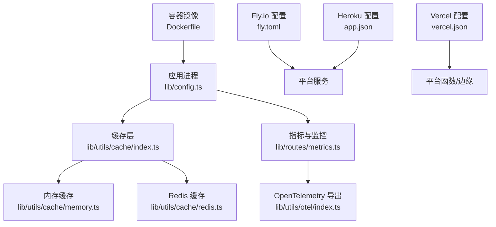
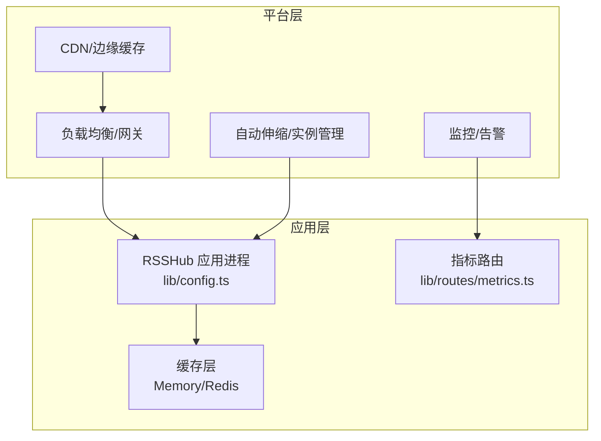
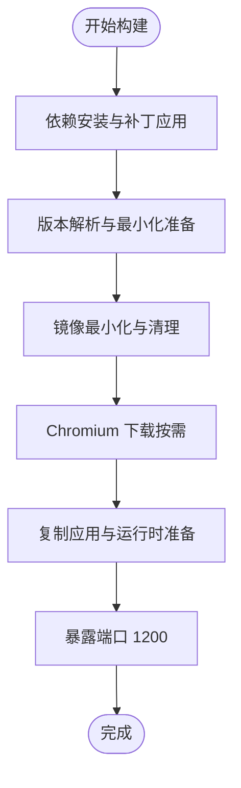
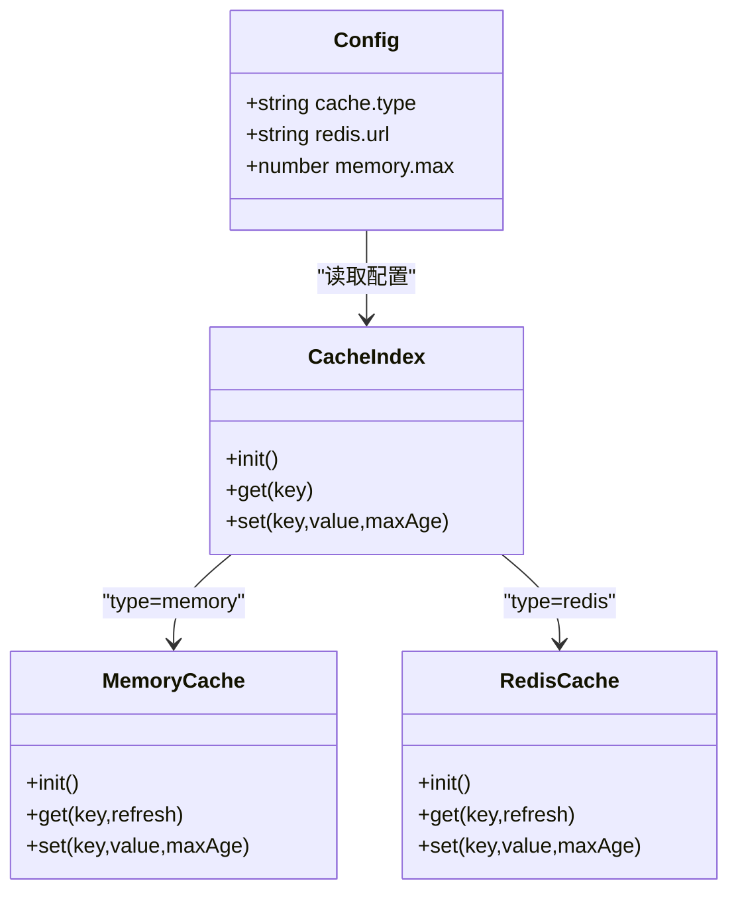
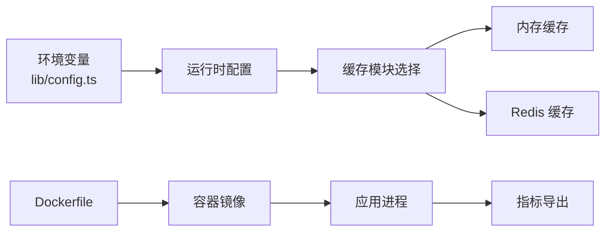

# 云平台部署

<cite>
**本文引用的文件**
- [fly.toml](file://fly.toml)
- [app.json](file://app.json)
- [vercel.json](file://vercel.json)
- [Dockerfile](file://Dockerfile)
- [docker-compose.yml](file://docker-compose.yml)
- [lib/config.ts](file://lib/config.ts)
- [lib/utils/cache/index.ts](file://lib/utils/cache/index.ts)
- [lib/utils/cache/redis.ts](file://lib/utils/cache/redis.ts)
- [lib/utils/cache/memory.ts](file://lib/utils/cache/memory.ts)
- [lib/routes/metrics.ts](file://lib/routes/metrics.ts)
- [lib/utils/otel/index.ts](file://lib/utils/otel/index.ts)
- [lib/utils/git-hash.ts](file://lib/utils/git-hash.ts)
- [scripts/docker/minify-docker.js](file://scripts/docker/minify-docker.js)
- [flake.nix](file://flake.nix)
</cite>

## 目录
1. [简介](#简介)
2. [项目结构与部署入口](#项目结构与部署入口)
3. [核心组件与环境变量](#核心组件与环境变量)
4. [架构总览](#架构总览)
5. [详细组件分析](#详细组件分析)
6. [依赖关系分析](#依赖关系分析)
7. [性能与成本优化](#性能与成本优化)
8. [故障排查指南](#故障排查指南)
9. [结论](#结论)
10. [附录：各云平台部署要点](#附录各云平台部署要点)

## 简介
本文件面向在不同云平台上部署 RSSHub 的工程师与运维人员，系统性梳理 Fly.io、Heroku、Vercel 等平台的适配方式，并结合仓库内现有配置文件（fly.toml、app.json、vercel.json、Dockerfile、docker-compose.yml）给出可落地的部署步骤与最佳实践。同时，文档覆盖云平台特性配置（自动伸缩、CDN 集成、监控）、成本优化与性能调优策略，帮助在云环境中实现稳定高效的运行。

## 项目结构与部署入口
- 容器化与编排
  - Dockerfile 定义了多阶段构建、Chromium 下载策略、最小化镜像生成与运行时入口。
  - docker-compose.yml 提供本地或自建集群的编排示例，包含 RSSHub 主服务、Redis 缓存与可选的浏览器服务。
- 平台配置
  - fly.toml：Fly.io 平台的服务与健康检查配置。
  - app.json：Heroku 平台的应用描述与环境变量定义。
  - vercel.json：Vercel 平台的框架、输出目录与函数配置。
- 运行时与配置
  - lib/config.ts：集中解析环境变量并生成运行时配置对象，是所有云平台部署的关键。
  - lib/utils/cache/*：内存与 Redis 缓存模块，决定云上缓存层的选择与成本。
  - lib/routes/metrics.ts 与 lib/utils/otel/*：指标导出与可观测性能力。

图表来源
- [Dockerfile](file://Dockerfile#L1-L207)
- [lib/config.ts](file://lib/config.ts#L1-L200)
- [lib/utils/cache/index.ts](file://lib/utils/cache/index.ts#L1-L60)
- [lib/utils/cache/memory.ts](file://lib/utils/cache/memory.ts#L1-L44)
- [lib/utils/cache/redis.ts](file://lib/utils/cache/redis.ts#L1-L77)
- [lib/routes/metrics.ts](file://lib/routes/metrics.ts#L1-L13)
- [lib/utils/otel/index.ts](file://lib/utils/otel/index.ts#L1-L2)
- [fly.toml](file://fly.toml#L1-L16)
- [app.json](file://app.json#L1-L23)
- [vercel.json](file://vercel.json#L1-L17)

章节来源
- [Dockerfile](file://Dockerfile#L1-L207)
- [docker-compose.yml](file://docker-compose.yml#L1-L63)
- [fly.toml](file://fly.toml#L1-L16)
- [app.json](file://app.json#L1-L23)
- [vercel.json](file://vercel.json#L1-L17)

## 核心组件与环境变量
- 端口与网络
  - 应用监听端口默认 1200；通过环境变量 PORT 可调整。
  - 允许公网访问可通过 LISTEN_INADDR_ANY 控制。
- 缓存与存储
  - CACHE_TYPE 支持 memory 与 redis；REDIS_URL 指定 Redis 连接串。
  - MEMORY_MAX 控制内存缓存容量上限。
- 日志与监控
  - LOGGER_LEVEL、DEBUG_INFO、SENTRY、OTEL_SECONDS_BUCKET、OTEL_MILLISECONDS_BUCKET 等用于日志级别、调试开关与遥测桶配置。
- 代理与跨域
  - PROXY_* 系列与 ALLOW_ORIGIN 用于网络代理与跨域控制。
- Puppeteer 与浏览器
  - PUPPETEER_WS_ENDPOINT、PUPPETEER_REAL_BROWSER_SERVICE、CHROMIUM_EXECUTABLE_PATH 用于无头浏览器接入与路径指定。
- 远程配置
  - REMOTE_CONFIG 与 REMOTE_CONFIG_AUTH 支持从远端加载配置，便于云上动态下发。

章节来源
- [lib/config.ts](file://lib/config.ts#L1-L200)
- [lib/config.ts](file://lib/config.ts#L720-L820)
- [lib/config.ts](file://lib/config.ts#L820-L920)
- [lib/config.ts](file://lib/config.ts#L1153-L1187)
- [flake.nix](file://flake.nix#L152-L188)

## 架构总览
下图展示 RSSHub 在云平台上的典型运行架构：应用进程基于容器运行，缓存层可选内存或 Redis；平台侧负责负载均衡、健康检查、自动伸缩与 CDN；可观测性通过指标路由与 OpenTelemetry 导出实现。

图表来源
- [lib/config.ts](file://lib/config.ts#L1-L200)
- [lib/utils/cache/index.ts](file://lib/utils/cache/index.ts#L1-L60)
- [lib/routes/metrics.ts](file://lib/routes/metrics.ts#L1-L13)

## 详细组件分析

### Fly.io 部署（fly.toml）
- 关键配置项
  - internal_port：应用内部监听端口，默认 1200。
  - force_https：强制 HTTPS 访问。
  - auto_stop_machines / auto_start_machines：空闲/启动自动挂起/唤醒。
  - min_machines_running：保持至少运行的实例数。
  - http_service.checks：健康检查周期、超时与路径（/healthz）。
- 建议
  - 将 CACHE_TYPE 设为 redis 并配置 REDIS_URL，以提升高并发下的缓存命中率与稳定性。
  - 结合平台自动伸缩策略，合理设置 min_machines_running 与实例规格。
  - 使用 force_https 保障安全传输，配合 CDN 启用 HTTPS 加速。

章节来源
- [fly.toml](file://fly.toml#L1-L16)

### Heroku 部署（app.json）
- 关键配置项
  - name/description/repository/website/logo/keywords：应用元数据。
  - env：
    - NODE_MODULES_CACHE=false：禁用 Heroku 的 node_modules 缓存，确保依赖一致性。
    - PORT：应用监听端口（默认 80，Fly.io 默认 1200）。
    - PUPPETEER_SKIP_DOWNLOAD=1：跳过 Chromium 下载，降低构建体积与时间。
- 建议
  - 在 Heroku 上使用 Redis 托管服务（如 Redis Cloud）并设置 REDIS_URL。
  - 若启用 Puppeteer，需考虑 dyno 内存限制，必要时选择更大规格或使用外部浏览器服务。
  - 通过环境变量覆盖 lib/config.ts 中的默认行为，确保与平台端口一致。

章节来源
- [app.json](file://app.json#L1-L23)

### Vercel 郥部署（vercel.json）
- 关键配置项
  - framework=hono：声明使用 Hono 框架。
  - outputDirectory=src：构建产物输出目录。
  - functions：将特定函数文件纳入打包范围，并 includeFiles 指定模板资源。
  - rewrites：路径重写规则（如 favicon.ico 到 favicon.png）。
- 建议
  - 保持与 Hono 生态兼容，确保路由与中间件在边缘执行。
  - 对于需要持久化缓存的场景，建议使用外部 Redis 或平台提供的缓存服务。
  - 注意 Vercel 边缘函数的冷启动与内存限制，避免长时间任务阻塞。

章节来源
- [vercel.json](file://vercel.json#L1-L17)
- [tsdown-vercel.config.ts](file://tsdown-vercel.config.ts#L1-L15)

### 容器化与镜像优化（Dockerfile）
- 多阶段构建
  - 依赖安装、最小化、Chromium 下载与运行时准备分阶段进行，减少最终镜像体积。
  - PUPPETEER_SKIP_DOWNLOAD 控制是否下载 Chromium，以适配不同平台的运行时。
- 运行时
  - EXPOSE 1200，ENTRYPOINT 使用 dumb-init，CMD 启动应用。
  - scripts/docker/minify-docker.js 通过 @vercel/nft 分析依赖，仅复制必要的 node_modules 文件，进一步缩小镜像。

图表来源
- [Dockerfile](file://Dockerfile#L1-L207)
- [scripts/docker/minify-docker.js](file://scripts/docker/minify-docker.js#L1-L26)

章节来源
- [Dockerfile](file://Dockerfile#L1-L207)
- [scripts/docker/minify-docker.js](file://scripts/docker/minify-docker.js#L1-L26)

### 缓存策略（Memory/Redis）
- 选择逻辑
  - 当 CACHE_TYPE=redis 时，使用 Redis 客户端；当 CACHE_TYPE=memory 时，使用 LRU 内存缓存；否则禁用缓存。
- Redis 缓存
  - 自动连接与错误处理，支持 TTL 维护与键空间扩展。
- 内存缓存
  - 基于 LRU，受 MEMORY_MAX 限制，适合单实例或小规模部署。

图表来源
- [lib/config.ts](file://lib/config.ts#L720-L820)
- [lib/utils/cache/index.ts](file://lib/utils/cache/index.ts#L1-L60)
- [lib/utils/cache/memory.ts](file://lib/utils/cache/memory.ts#L1-L44)
- [lib/utils/cache/redis.ts](file://lib/utils/cache/redis.ts#L1-L77)

章节来源
- [lib/utils/cache/index.ts](file://lib/utils/cache/index.ts#L1-L60)
- [lib/utils/cache/memory.ts](file://lib/utils/cache/memory.ts#L1-L44)
- [lib/utils/cache/redis.ts](file://lib/utils/cache/redis.ts#L1-L77)

### 指标与可观测性（Metrics/OpenTelemetry）
- 指标路由
  - lib/routes/metrics.ts 导出当前运行时的 OTel 上下文文本，便于平台抓取。
- OpenTelemetry
  - lib/utils/otel/index.ts 暴露指标与追踪工具，可用于平台侧的监控面板。
- 版本信息
  - lib/utils/git-hash.ts 支持从 Heroku/Verce 的环境变量中提取提交哈希，便于追踪版本。

章节来源
- [lib/routes/metrics.ts](file://lib/routes/metrics.ts#L1-L13)
- [lib/utils/otel/index.ts](file://lib/utils/otel/index.ts#L1-L2)
- [lib/utils/git-hash.ts](file://lib/utils/git-hash.ts#L1-L14)

## 依赖关系分析
- 配置依赖
  - lib/config.ts 依赖 process.env 与远程配置（可选），并根据环境变量计算运行时配置。
- 缓存依赖
  - lib/utils/cache/index.ts 动态选择内存或 Redis 实现，Redis 实现依赖 ioredis。
- 平台适配
  - fly.toml、app.json、vercel.json 分别定义平台侧的端口、健康检查、函数与输出目录等约束。
- 构建依赖
  - Dockerfile 依赖 pnpm、@vercel/nft 与 Chromium（按需），scripts/docker/minify-docker.js 用于最小化 node_modules。

图表来源
- [lib/config.ts](file://lib/config.ts#L1-L200)
- [lib/utils/cache/index.ts](file://lib/utils/cache/index.ts#L1-L60)
- [Dockerfile](file://Dockerfile#L1-L207)
- [lib/routes/metrics.ts](file://lib/routes/metrics.ts#L1-L13)

章节来源
- [lib/config.ts](file://lib/config.ts#L1-L200)
- [lib/utils/cache/index.ts](file://lib/utils/cache/index.ts#L1-L60)
- [Dockerfile](file://Dockerfile#L1-L207)

## 性能与成本优化
- 缓存层优化
  - 优先使用 Redis（CACHE_TYPE=redis），并合理设置 REDIS_URL 与内容过期时间，降低重复抓取与渲染开销。
  - 对热点路由设置更短的 routeExpire 与更长的 contentExpire，平衡新鲜度与命中率。
- 容器镜像与运行时
  - 使用 Dockerfile 的多阶段与最小化策略，减少镜像体积与拉取时间。
  - 在平台侧启用镜像缓存与预热，缩短冷启动时间。
- 平台伸缩与实例规格
  - 根据流量峰值设置最小实例数与自动伸缩阈值，避免突发流量导致的延迟与丢弃。
  - 对需要浏览器渲染的任务，选择具备足够内存与 CPU 的实例规格，或使用外部浏览器服务。
- CDN 与边缘
  - 启用平台 CDN，对静态资源与热点响应进行缓存，降低源站压力。
  - 对于 Vercel/Hono，利用函数与边缘能力就近处理请求。
- 监控与告警
  - 通过 lib/routes/metrics.ts 与 OpenTelemetry 导出指标，建立延迟、错误率、缓存命中率等关键指标看板。
  - 结合平台日志与告警，设置阈值与通知策略。

[本节为通用指导，不直接分析具体文件]

## 故障排查指南
- 健康检查
  - Fly.io 通过 /healthz 路径进行健康检查，确保应用在平台侧可被正确识别与重启。
- 缓存异常
  - Redis 连接失败或 URL 错误会导致缓存不可用，应用会降级为无缓存模式。检查 REDIS_URL 与网络连通性。
- Puppeteer 问题
  - 在 Heroku/Docker 环境中，若未正确下载或定位 Chromium，可能导致渲染失败。可通过 PUPPETEER_SKIP_DOWNLOAD 与 CHROMIUM_EXECUTABLE_PATH 控制。
- 端口冲突
  - Heroku 默认端口为 80，Fly.io 默认端口为 1200。请确保环境变量 PORT 与平台配置一致。
- 版本追踪
  - 利用 lib/utils/git-hash.ts 从平台环境变量中提取提交哈希，便于快速定位问题版本。

章节来源
- [fly.toml](file://fly.toml#L1-L16)
- [lib/utils/cache/redis.ts](file://lib/utils/cache/redis.ts#L1-L77)
- [lib/utils/git-hash.ts](file://lib/utils/git-hash.ts#L1-L14)

## 结论
通过合理利用 fly.toml、app.json、vercel.json 与 Dockerfile 等配置文件，RSSHub 可在 Fly.io、Heroku、Vercel 等云平台上实现稳定部署。结合 Redis 缓存、CDN、自动伸缩与可观测性体系，可在保证性能的同时有效控制成本。建议在生产环境中优先采用 Redis 缓存与平台 CDN，并建立完善的监控与告警机制。

[本节为总结，不直接分析具体文件]

## 附录：各云平台部署要点
- Fly.io
  - 使用 fly.toml 配置内部端口、HTTPS 强制、健康检查与最小实例数。
  - 推荐设置 CACHE_TYPE=redis 与 REDIS_URL，启用自动伸缩与 CDN。
- Heroku
  - 使用 app.json 设置 NODE_MODULES_CACHE=false、PORT、PUPPETEER_SKIP_DOWNLOAD。
  - 使用 Redis 托管服务并设置 REDIS_URL；注意 dyno 内存限制。
- Vercel
  - 使用 vercel.json 指定 Hono 框架、输出目录与函数 includeFiles。
  - 对需要持久化缓存的场景，建议使用外部缓存服务或平台提供的缓存产品。
- Docker
  - 使用 Dockerfile 的多阶段与最小化策略，结合 scripts/docker/minify-docker.js 减少镜像体积。
  - 在平台侧启用镜像缓存与预热，优化冷启动。

章节来源
- [fly.toml](file://fly.toml#L1-L16)
- [app.json](file://app.json#L1-L23)
- [vercel.json](file://vercel.json#L1-L17)
- [Dockerfile](file://Dockerfile#L1-L207)
- [scripts/docker/minify-docker.js](file://scripts/docker/minify-docker.js#L1-L26)