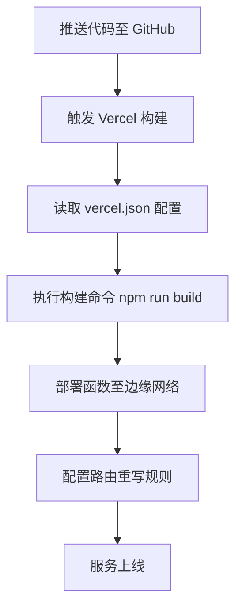
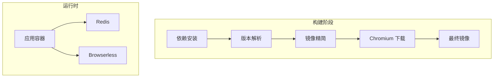
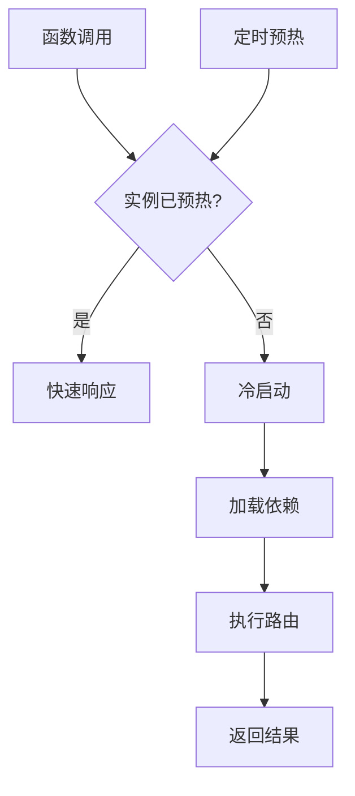
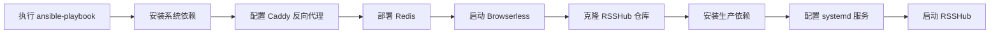

# 其他云平台部署

<cite>
**本文档中引用的文件**   
- [README.md](file://README.md)
- [vercel.json](file://vercel.json)
- [app.json](file://app.json)
- [Dockerfile](file://Dockerfile)
- [docker-compose.yml](file://docker-compose.yml)
- [scripts/docker/minify-docker.js](file://scripts/docker/minify-docker.js)
- [scripts/ansible/README.md](file://scripts/ansible/README.md)
- [scripts/ansible/rsshub.yaml](file://scripts/ansible/rsshub.yaml)
- [scripts/ansible/rsshub.env](file://scripts/ansible/rsshub.env)
- [scripts/ansible/rsshub.service](file://scripts/ansible/rsshub.service)
- [scripts/ansible/rsshub.Caddyfile](file://scripts/ansible/rsshub.Caddyfile)
</cite>

## 目录
1. [简介](#简介)
2. [Vercel 部署指南](#vercel-部署指南)
3. [Render 与 Railway 部署](#render-与-railway-部署)
4. [基于 Docker 的通用部署方案](#基于-docker-的通用部署方案)
5. [无服务器架构适配方法](#无服务器架构适配方法)
6. [跨平台部署最佳实践](#跨平台部署最佳实践)
7. [自动化脚本使用说明](#自动化脚本使用说明)
8. [总结](#总结)

## 简介
RSSHub 是一个开源、易用且可扩展的 RSS 聚合器，支持从各种来源聚合内容。本指南详细说明如何在现代云平台（如 Vercel、Render、Railway）上部署 RSSHub，并提供适用于 AWS ECS、Google Cloud Run 等容器化平台的通用 Docker 部署方案。同时涵盖无服务器架构的适配方法和跨平台部署的最佳实践。

**Section sources**
- [README.md](file://README.md#L1-L62)

## Vercel 部署指南
Vercel 提供了对 RSSHub 的原生支持，通过 `vercel.json` 配置文件定义函数入口和重写规则。项目根目录下的 `vercel.json` 文件指定了框架为 Hono，输出目录为 `src`，并将 `/favicon.ico` 请求重写到 `/favicon.png`。

环境变量可通过 Vercel 控制台设置，包括 `NODE_ENV`、`CACHE_TYPE`、`REDIS_URL` 等。构建命令通常为 `npm run build`，启动命令为 `npm start`。Vercel 自动识别 `vercel.json` 并应用相应配置。

**Diagram sources**
- [vercel.json](file://vercel.json#L1-L17)

**Section sources**
- [vercel.json](file://vercel.json#L1-L17)

## Render 与 Railway 部署
Render 和 Railway 均支持通过 Git 仓库直接部署 Node.js 应用。在这些平台上部署时，需指定以下关键配置：

- **运行环境**：Node.js
- **构建命令**：`npm install && npm run build`
- **启动命令**：`npm start`
- **端口**：1200（由 `Dockerfile` 暴露）
- **环境变量**：参考 `app.json` 中定义的变量，如 `NODE_MODULES_CACHE=false`、`PORT=80`、`PUPPETEER_SKIP_DOWNLOAD=1`

`app.json` 文件为 Heroku 兼容平台提供了标准化的应用描述和环境变量定义，可直接用于 Render 和 Railway 的配置导入。

**Diagram sources**
- [app.json](file://app.json#L1-L23)

**Section sources**
- [app.json](file://app.json#L1-L23)

## 基于 Docker 的通用部署方案
对于 AWS ECS、Google Cloud Run 等支持容器的平台，可使用项目提供的 `Dockerfile` 进行部署。该文件采用多阶段构建策略，优化镜像大小并确保兼容性。

主要构建阶段包括：
1. **依赖安装**：使用完整 Node 镜像安装生产依赖
2. **版本解析**：提取 Puppeteer 等关键依赖版本
3. **镜像精简**：利用 `@vercel/nft` 分析文件依赖，仅保留必要模块
4. **Chromium 下载**：根据平台架构选择是否捆绑 Chromium
5. **最终镜像构建**：基于 `node:24-bookworm-slim` 构建运行时环境

`docker-compose.yml` 提供了本地测试的完整服务编排，包含 RSSHub 主服务、Redis 缓存、Browserless 浏览器服务等。

**Diagram sources**
- [Dockerfile](file://Dockerfile#L1-L207)
- [docker-compose.yml](file://docker-compose.yml#L1-L63)

**Section sources**
- [Dockerfile](file://Dockerfile#L1-L207)
- [docker-compose.yml](file://docker-compose.yml#L1-L63)

## 无服务器架构适配方法
RSSHub 可适配无服务器环境，但需注意冷启动和请求超时问题。建议采取以下优化措施：

- **预热机制**：定期发送请求防止实例休眠
- **超时配置**：确保函数超时时间大于最长路由处理时间
- **缓存策略**：启用 Redis 或内存缓存减少重复计算
- **轻量构建**：使用 `minify-docker.js` 减少部署包体积

`scripts/docker/minify-docker.js` 使用 `@vercel/nft` 分析实际依赖，仅打包必要的文件，显著降低冷启动时间。

**Diagram sources**
- [scripts/docker/minify-docker.js](file://scripts/docker/minify-docker.js#L1-L26)

**Section sources**
- [scripts/docker/minify-docker.js](file://scripts/docker/minify-docker.js#L1-L26)

## 跨平台部署最佳实践
为确保跨平台部署的一致性和可靠性，建议遵循以下最佳实践：

- **配置管理**：使用 `.env` 文件统一管理环境变量
- **监控集成**：启用健康检查端点 `/healthz`
- **CI/CD 流水线**：结合 GitHub Actions 实现自动化测试与部署
- **日志记录**：通过 `middleware/logger.ts` 统一输出格式
- **错误追踪**：集成 Sentry 进行异常监控

`docker-compose.yml` 中定义的健康检查机制可用于所有支持容器的平台。

**Section sources**
- [docker-compose.yml](file://docker-compose.yml#L1-L63)
- [lib/middleware/sentry.ts](file://lib/middleware/sentry.ts)

## 自动化脚本使用说明
`scripts/` 目录包含多个自动化部署脚本：

- `ansible/`：Ansible Playbook，用于在裸机上部署 RSSHub，集成 Redis、Browserless 和 Caddy
- `docker/`：Docker 相关脚本，包括镜像精简工具
- `workflow/`：CI/CD 工作流脚本

`scripts/ansible/rsshub.yaml` 定义了完整的部署流程，包括依赖安装、服务配置和启动。`rsshub.env` 提供默认环境变量模板。

**Diagram sources**
- [scripts/ansible/rsshub.yaml](file://scripts/ansible/rsshub.yaml#L1-L111)
- [scripts/ansible/rsshub.env](file://scripts/ansible/rsshub.env#L1-L4)
- [scripts/ansible/rsshub.service](file://scripts/ansible/rsshub.service#L1-L12)

**Section sources**
- [scripts/ansible/README.md](file://scripts/ansible/README.md#L1-L23)
- [scripts/ansible/rsshub.yaml](file://scripts/ansible/rsshub.yaml#L1-L111)

## 总结
RSSHub 提供了灵活的部署选项，支持从无服务器平台到容器化环境的多种部署方式。通过合理配置环境变量、利用自动化脚本和优化构建流程，可在不同云平台上高效部署并运行 RSSHub 实例。