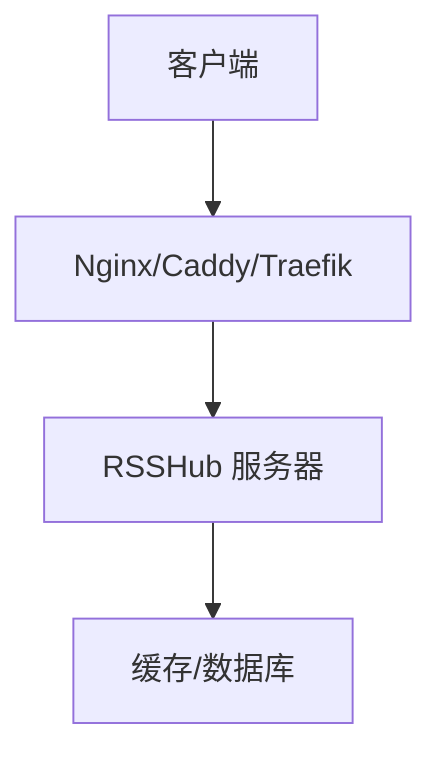
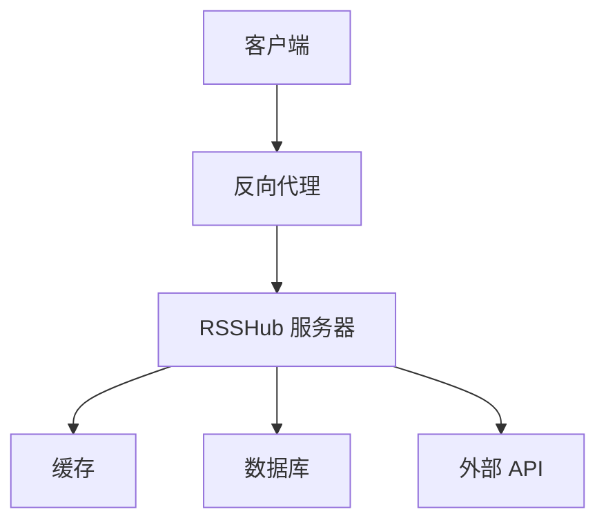
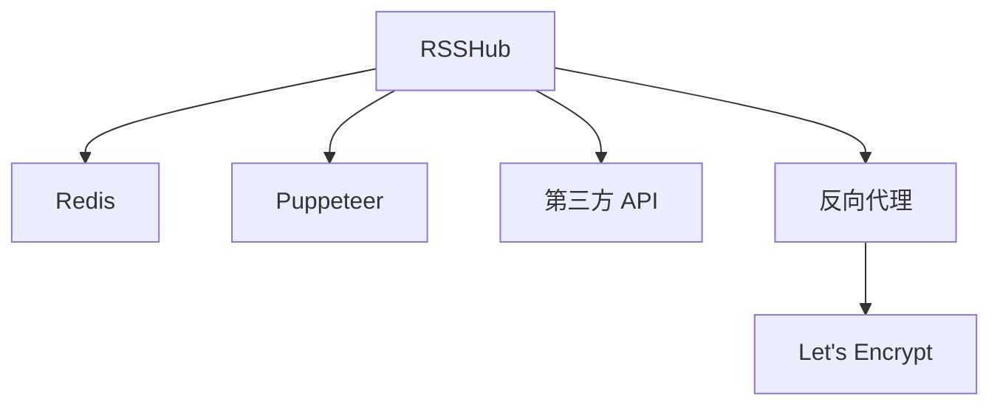

# 反向代理配置

<cite>
**本文档引用的文件**
- [config.ts](file://lib/config.ts)
- [access-control.ts](file://lib/middleware/access-control.ts)
- [header.ts](file://lib/middleware/header.ts)
- [multi-proxy.ts](file://lib/utils/proxy/multi-proxy.ts)
- [unify-proxy.ts](file://lib/utils/proxy/unify-proxy.ts)
- [pac-proxy.ts](file://lib/utils/proxy/pac-proxy.ts)
- [rsshub.Caddyfile](file://scripts/ansible/rsshub.Caddyfile)
- [Dockerfile](file://Dockerfile)
</cite>

## 目录
1. [简介](#简介)
2. [项目结构](#项目结构)
3. [核心组件](#核心组件)
4. [架构概述](#架构概述)
5. [详细组件分析](#详细组件分析)
6. [依赖分析](#依赖分析)
7. [性能考虑](#性能考虑)
8. [故障排除指南](#故障排除指南)
9. [结论](#结论)

## 简介
RSSHub 是一个开源的 RSS 生成器，通过反向代理配置可以增强其安全性、性能和可访问性。本文档详细说明如何使用 Nginx、Caddy 和 Traefik 等反向代理服务器配置 RSSHub，包括 SSL/TLS 证书的获取与配置（支持 Let's Encrypt 自动续期），HTTP/2 和 HTTP/3 协议的启用方法，安全 HTTP 头的设置（如 Content-Security-Policy、X-Frame-Options 等）。提供详细的配置示例，涵盖负载均衡、路径重写、请求限流和 DDoS 防护策略。解释如何通过反向代理实现访问控制和 IP 白名单功能，以及如何配置 WebSocket 支持。包含性能优化建议，如启用 Gzip 压缩、设置合适的缓冲区大小和连接超时时间。

## 项目结构
RSSHub 项目结构清晰，主要包含以下几个目录：
- `assets/`：静态资源文件
- `lib/`：核心逻辑代码
- `scripts/`：部署和自动化脚本
- `patches/`：补丁文件
- `plugins/`：插件文件

**Diagram sources**
- [rsshub.Caddyfile](file://scripts/ansible/rsshub.Caddyfile#L1-L3)

**Section sources**
- [rsshub.Caddyfile](file://scripts/ansible/rsshub.Caddyfile#L1-L3)

## 核心组件
RSSHub 的核心组件包括配置管理、中间件、路由和工具库。配置管理通过 `config.ts` 文件实现，中间件包括访问控制和头部设置，路由定义了各种 RSS 源的生成逻辑，工具库提供了代理、缓存等功能。

**Section sources**
- [config.ts](file://lib/config.ts#L1-L800)
- [access-control.ts](file://lib/middleware/access-control.ts#L1-L27)
- [header.ts](file://lib/middleware/header.ts#L1-L56)

## 架构概述
RSSHub 的架构基于 Node.js，使用 Hono 作为 Web 框架，支持多种部署方式，包括 Docker 和直接运行。反向代理服务器在客户端和 RSSHub 服务器之间起到桥梁作用，提供 SSL 终止、负载均衡、安全防护等功能。

**Diagram sources**
- [config.ts](file://lib/config.ts#L748-L767)
- [multi-proxy.ts](file://lib/utils/proxy/multi-proxy.ts#L1-L140)

## 详细组件分析
### 配置管理
RSSHub 的配置管理通过环境变量和 `config.ts` 文件实现，支持多种配置选项，包括端口、缓存、代理、访问控制等。

**Section sources**
- [config.ts](file://lib/config.ts#L1-L800)

### 访问控制
访问控制通过 `access-control.ts` 中间件实现，支持通过 `ACCESS_KEY` 进行身份验证，确保只有授权用户可以访问特定的 RSS 源。

**Section sources**
- [access-control.ts](file://lib/middleware/access-control.ts#L1-L27)

### 头部设置
头部设置通过 `header.ts` 中间件实现，设置安全相关的 HTTP 头，如 `Content-Security-Policy`、`X-Frame-Options` 等，增强安全性。

**Section sources**
- [header.ts](file://lib/middleware/header.ts#L1-L56)

### 代理管理
代理管理通过 `multi-proxy.ts` 和 `unify-proxy.ts` 实现，支持多种代理协议（HTTP、HTTPS、SOCKS），并提供健康检查和故障转移功能。

**Section sources**
- [multi-proxy.ts](file://lib/utils/proxy/multi-proxy.ts#L1-L140)
- [unify-proxy.ts](file://lib/utils/proxy/unify-proxy.ts#L1-L115)

## 依赖分析
RSSHub 依赖多种外部服务和库，包括 Redis 用于缓存，Puppeteer 用于浏览器自动化，以及各种第三方 API 用于数据获取。反向代理服务器依赖 Let's Encrypt 用于 SSL 证书的自动获取和续期。

**Diagram sources**
- [config.ts](file://lib/config.ts#L745-L747)
- [Dockerfile](file://Dockerfile#L1-L207)

**Section sources**
- [config.ts](file://lib/config.ts#L745-L747)
- [Dockerfile](file://Dockerfile#L1-L207)

## 性能考虑
为了优化 RSSHub 的性能，建议启用 Gzip 压缩，设置合适的缓冲区大小和连接超时时间。此外，使用反向代理服务器的缓存功能可以显著减少后端服务器的负载。

**Section sources**
- [config.ts](file://lib/config.ts#L735-L740)

## 故障排除指南
### 代理配置问题
如果代理配置不正确，可能会导致请求失败。检查 `PROXY_URI`、`PROXY_HOST`、`PROXY_PORT` 等环境变量是否正确设置。

**Section sources**
- [unify-proxy.ts](file://lib/utils/proxy/unify-proxy.ts#L34-L115)

### SSL 证书问题
如果 SSL 证书无法自动续期，检查反向代理服务器的配置，确保 Let's Encrypt 的 ACME 挑战能够成功完成。

**Section sources**
- [rsshub.Caddyfile](file://scripts/ansible/rsshub.Caddyfile#L1-L3)

## 结论
通过合理配置反向代理服务器，可以显著提升 RSSHub 的安全性、性能和可访问性。本文档提供了详细的配置示例和最佳实践，帮助用户更好地部署和管理 RSSHub 实例。