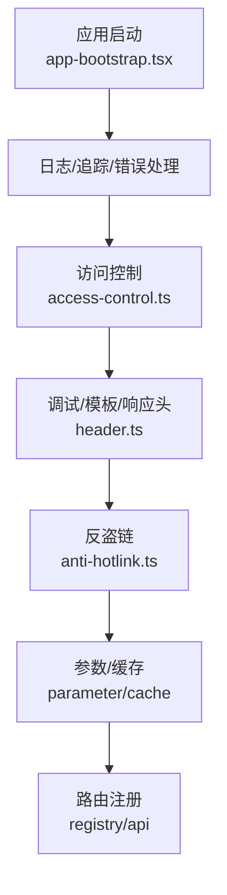
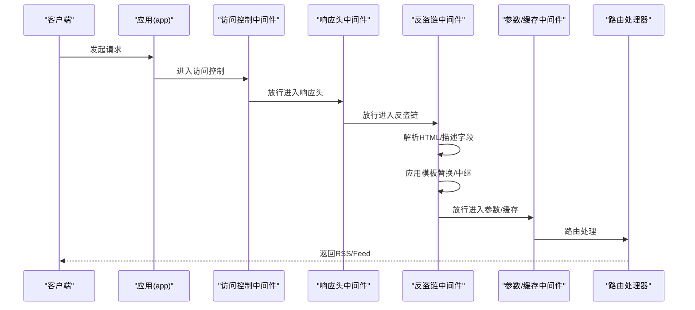
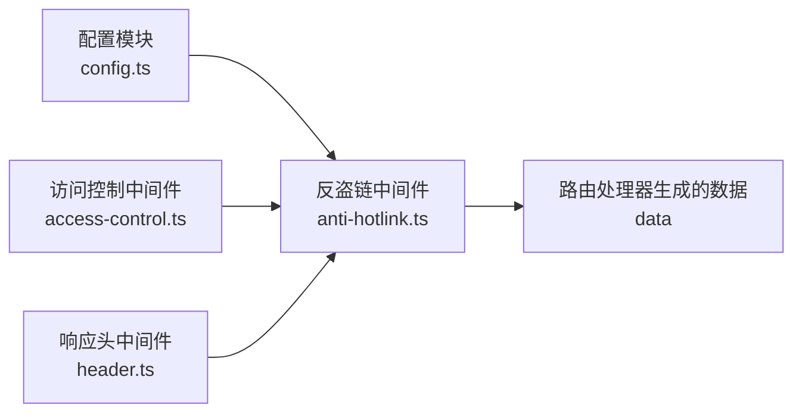
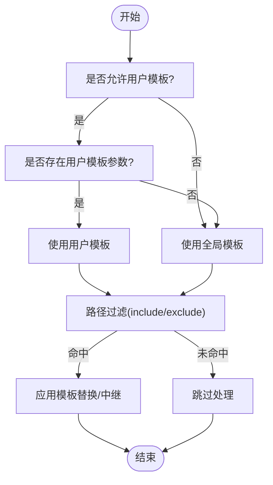

# 反盗链保护

<cite>
**本文引用的文件**
- [anti-hotlink.ts](file://lib/middleware/anti-hotlink.ts)
- [anti-hotlink.test.ts](file://lib/middleware/anti-hotlink.test.ts)
- [config.ts](file://lib/config.ts)
- [app-bootstrap.tsx](file://lib/app-bootstrap.tsx)
- [access-control.ts](file://lib/middleware/access-control.ts)
- [header.ts](file://lib/middleware/header.ts)
- [robots.txt.ts](file://lib/routes/robots.txt.ts)
- [header-generator.ts](file://lib/utils/header-generator.ts)
- [get.ts](file://lib/utils/request-rewriter/get.ts)
</cite>

## 目录
1. [简介](#简介)
2. [项目结构与入口](#项目结构与入口)
3. [核心组件](#核心组件)
4. [架构总览](#架构总览)
5. [组件详解](#组件详解)
6. [依赖关系分析](#依赖关系分析)
7. [性能考量](#性能考量)
8. [故障排查指南](#故障排查指南)
9. [结论](#结论)
10. [附录：配置清单与示例](#附录配置清单与示例)

## 简介
本文件系统性阐述 RSSHub 的反盗链保护机制，重点围绕以下方面展开：
- 反盗链实现原理：基于模板替换对媒体资源链接进行中继或改写，降低直接外链带来的带宽与版权风险。
- Referer 检查：当前实现未内置基于 Referer 的校验逻辑，但可通过路径级白名单/黑名单与用户模板开关实现“来源控制”的替代方案。
- 用户代理（User-Agent）过滤策略：通过生成器与 UA 规则过滤，阻断特定爬虫或恶意客户端；同时可结合访问控制中间件统一鉴权。
- 自定义 HTTP 头验证：通过中间件注入与请求重写，增强安全与合规性。
- 配置方法：热链模板、路径包含/排除、用户模板开关等。
- 性能优化：缓存与路径过滤减少不必要的处理。
- 常见问题：合法用户被误拦截的处理建议。

## 项目结构与入口
RSSHub 在应用启动阶段注册中间件链，反盗链中间件位于头部处理链靠后位置，确保在模板渲染与参数处理之后对数据进行二次加工。

图表来源
- [app-bootstrap.tsx](file://lib/app-bootstrap.tsx#L30-L46)

章节来源
- [app-bootstrap.tsx](file://lib/app-bootstrap.tsx#L30-L46)

## 核心组件
- 反盗链中间件：负责解析 RSS 内容中的图片与音视频链接，依据配置模板进行替换或中继，避免直接外链。
- 配置模块：读取环境变量 HOTLINK_TEMPLATE、HOTLINK_INCLUDE_PATHS、HOTLINK_EXCLUDE_PATHS、ALLOW_USER_HOTLINK_TEMPLATE，并将其映射到运行时配置对象。
- 访问控制中间件：提供基于密钥/签名的访问控制，可作为“来源合法性”的补充手段。
- 响应头中间件：设置标准安全与缓存头，辅助整体安全策略。
- 路由与 robots：通过 robots.txt 控制搜索引擎抓取范围，减少外部流量压力。

章节来源
- [anti-hotlink.ts](file://lib/middleware/anti-hotlink.ts#L102-L168)
- [config.ts](file://lib/config.ts#L785-L795)
- [access-control.ts](file://lib/middleware/access-control.ts#L11-L24)
- [header.ts](file://lib/middleware/header.ts#L8-L17)
- [robots.txt.ts](file://lib/routes/robots.txt.ts#L5-L11)

## 架构总览
反盗链工作流在中间件链中处于“模板处理 -> 响应头 -> 反盗链 -> 参数/缓存”的位置，确保在最终输出前完成媒体链接的替换。

图表来源
- [app-bootstrap.tsx](file://lib/app-bootstrap.tsx#L30-L46)
- [anti-hotlink.ts](file://lib/middleware/anti-hotlink.ts#L102-L168)

## 组件详解

### 反盗链中间件（anti-hotlink）
- 功能定位
  - 对 RSS 数据中的图片与音视频链接进行模板化替换或中继，避免直接外链。
  - 支持路径级包含/排除过滤，仅对目标路径生效。
  - 支持用户级模板开关（需显式开启），用于个人使用场景下的灵活替换。
- 关键实现要点
  - 模板语法：使用占位符对 URL 属性进行替换，支持对属性进行 URL 编码。
  - 允许的 URL 属性集合严格限定，防止注入非法属性。
  - HTML 解析：使用 Cheerio 加载 RSS 描述字段，遍历 img、video、audio 等节点进行替换。
  - 多媒体与图片分别处理：根据 enclosure 类型区分图片/音视频，分别应用不同模板。
  - 路径过滤：先判断是否命中 includePaths，再排除 excludePaths，最终决定是否处理。
  - 用户模板优先级：当用户查询参数存在且允许时，优先使用用户模板；否则回退到全局配置模板。
- 安全与健壮性
  - 模板属性校验：若模板包含不允许的 URL 属性，抛出错误，避免潜在注入风险。
  - 非 data 场景跳过：仅在上下文中存在 data 时才进行处理，避免无意义计算。
  - data-url 保护：对 data: 协议的资源不做替换，避免破坏内联资源。
- 性能影响
  - Cheerio 解析与遍历：对大型 RSS 描述字段会带来一定 CPU 开销。
  - 路径过滤：通过 include/exclude 提前短路，减少不必要处理。
  - 用户模板开关：默认关闭，避免因用户输入导致的额外解析与校验。

章节来源
- [anti-hotlink.ts](file://lib/middleware/anti-hotlink.ts#L9-L27)
- [anti-hotlink.ts](file://lib/middleware/anti-hotlink.ts#L29-L39)
- [anti-hotlink.ts](file://lib/middleware/anti-hotlink.ts#L49-L59)
- [anti-hotlink.ts](file://lib/middleware/anti-hotlink.ts#L61-L88)
- [anti-hotlink.ts](file://lib/middleware/anti-hotlink.ts#L90-L100)
- [anti-hotlink.ts](file://lib/middleware/anti-hotlink.ts#L102-L168)

### 配置模块（config）
- 热链配置项
  - HOTLINK_TEMPLATE：全局热链模板字符串，用于替换媒体链接。
  - HOTLINK_INCLUDE_PATHS：逗号分隔的路径列表，仅对匹配路径启用热链处理。
  - HOTLINK_EXCLUDE_PATHS：逗号分隔的路径列表，排除匹配路径的热链处理。
  - ALLOW_USER_HOTLINK_TEMPLATE：是否允许用户通过查询参数传入自定义模板。
- 配置加载与转换
  - 将环境变量转换为配置对象，支持布尔值与数组解析。
  - include/exclude 路径在加载时按逗号拆分，供路径匹配函数使用。

章节来源
- [config.ts](file://lib/config.ts#L54-L58)
- [config.ts](file://lib/config.ts#L785-L795)

### 访问控制中间件（access-control）
- 作用
  - 对非静态资源路径进行访问控制，要求提供有效的 key 或 code。
  - 对根路径、robots.txt、favicon.ico、logo.png 等特殊路径放行。
- 与反盗链的关系
  - 访问控制在反盗链之前执行，可作为“来源合法性”的第一道防线。
  - 结合反盗链的路径过滤，可进一步细化对不同路径的保护策略。

章节来源
- [access-control.ts](file://lib/middleware/access-control.ts#L11-L24)

### 响应头中间件（header）
- 作用
  - 设置标准安全与缓存头，如 X-Content-Type-Options、Cache-Control 等。
  - 注入 ETag/Last-Modified，配合客户端缓存策略，减少重复传输。
- 与反盗链的关系
  - 通过 ETag/If-None-Match 实现条件响应，间接降低无效请求带来的带宽消耗。

章节来源
- [header.ts](file://lib/middleware/header.ts#L8-L17)
- [header.ts](file://lib/middleware/header.ts#L18-L53)

### robots.txt 路由
- 作用
  - 当 disallowRobot 为真时返回“禁止所有抓取”，否则返回 404。
- 与反盗链的关系
  - 通过限制搜索引擎抓取范围，减少外部流量压力，间接降低盗链风险。

章节来源
- [robots.txt.ts](file://lib/routes/robots.txt.ts#L5-L11)

### 用户代理（User-Agent）过滤策略
- 生成器与规则
  - 提供 HeaderGenerator 与预设，生成符合现代浏览器特征的请求头。
  - 对特定 UA 字段进行过滤，屏蔽已知爬虫或自动化工具标识。
- 与反盗链的关系
  - 通过合理的 UA 生成与过滤，降低被目标站点识别为爬虫的概率，从而减少被封禁或限流的风险。
  - 可与访问控制中间件配合，形成多层防护。

章节来源
- [header-generator.ts](file://lib/utils/header-generator.ts#L1-L32)
- [get.ts](file://lib/utils/request-rewriter/get.ts#L1-L15)

## 依赖关系分析
- 中间件链依赖
  - 反盗链依赖于配置模块提供的模板与路径过滤规则。
  - 访问控制在反盗链之前执行，保证只有授权请求才会进入后续处理。
  - 响应头中间件在反盗链之后执行，确保输出的 RSS/Feed 带有安全与缓存头。
- 数据流依赖
  - 反盗链依赖路由处理器生成的 data 对象，仅在 data 存在时进行处理。
  - Cheerio 解析依赖 RSS 描述字段，对大型内容会产生额外开销。

图表来源
- [config.ts](file://lib/config.ts#L785-L795)
- [anti-hotlink.ts](file://lib/middleware/anti-hotlink.ts#L102-L168)
- [access-control.ts](file://lib/middleware/access-control.ts#L11-L24)
- [header.ts](file://lib/middleware/header.ts#L22-L53)

## 性能考量
- 路径过滤优先：通过 include/exclude 提前短路，避免对无关路径进行解析与替换。
- 模板校验与最小化处理：仅在命中模板或用户模板时进行解析，减少不必要的计算。
- 缓存与条件响应：利用 ETag/If-None-Match 实现条件响应，降低重复请求的带宽与 CPU 开销。
- Cheerio 解析成本：对于大型 RSS 描述字段，建议合理设置 includePaths，避免全站处理。
- 用户模板开关：默认关闭，避免因用户输入导致的额外解析与校验。

章节来源
- [anti-hotlink.ts](file://lib/middleware/anti-hotlink.ts#L23-L27)
- [anti-hotlink.ts](file://lib/middleware/anti-hotlink.ts#L102-L168)
- [header.ts](file://lib/middleware/header.ts#L18-L53)

## 故障排查指南
- 合法用户被误拦截
  - 检查访问控制配置：确认 key/code 是否正确传递，或临时关闭访问控制以定位问题。
  - 检查 robots.txt：确认是否被搜索引擎抓取策略限制。
  - 检查路径过滤：确认 include/exclude 路径是否覆盖了目标路径。
- 模板无效或报错
  - 模板属性不在允许集合内会导致错误，检查模板占位符是否使用允许的 URL 属性。
  - 若启用了用户模板，确认 ALLOW_USER_HOTLINK_TEMPLATE 已开启。
- 媒体链接未被替换
  - 确认数据中确实包含 image/description/item 等字段。
  - 确认 enclosures 的类型与模板匹配（image/video/audio）。
- 性能异常
  - 检查 RSS 描述字段大小，适当缩小 includePaths。
  - 启用缓存与条件响应，减少重复请求。

章节来源
- [anti-hotlink.test.ts](file://lib/middleware/anti-hotlink.test.ts#L337-L440)
- [access-control.ts](file://lib/middleware/access-control.ts#L11-L24)
- [robots.txt.ts](file://lib/routes/robots.txt.ts#L5-L11)

## 结论
RSSHub 的反盗链机制通过“模板替换 + 路径过滤 + 用户模板开关”的组合，实现了对媒体资源链接的可控中继与改写。虽然未内置基于 Referer 的校验，但可通过访问控制中间件与 robots.txt 等手段形成互补。配合 UA 生成与过滤、安全响应头与缓存策略，可在保障用户体验的同时有效降低盗链与带宽风险。

## 附录：配置清单与示例
- 环境变量
  - HOTLINK_TEMPLATE：全局热链模板字符串（例如：用于将外链替换为中继服务地址）。
  - HOTLINK_INCLUDE_PATHS：逗号分隔的路径列表，仅对匹配路径启用热链处理。
  - HOTLINK_EXCLUDE_PATHS：逗号分隔的路径列表，排除匹配路径的热链处理。
  - ALLOW_USER_HOTLINK_TEMPLATE：是否允许用户通过查询参数传入自定义模板（默认关闭）。
- 配置对象
  - config.hotlink.template：全局模板
  - config.hotlink.includePaths：包含路径数组
  - config.hotlink.excludePaths：排除路径数组
  - config.feature.allow_user_hotlink_template：用户模板开关
- 示例流程（概念图）

图表来源
- [config.ts](file://lib/config.ts#L785-L795)
- [anti-hotlink.ts](file://lib/middleware/anti-hotlink.ts#L102-L168)