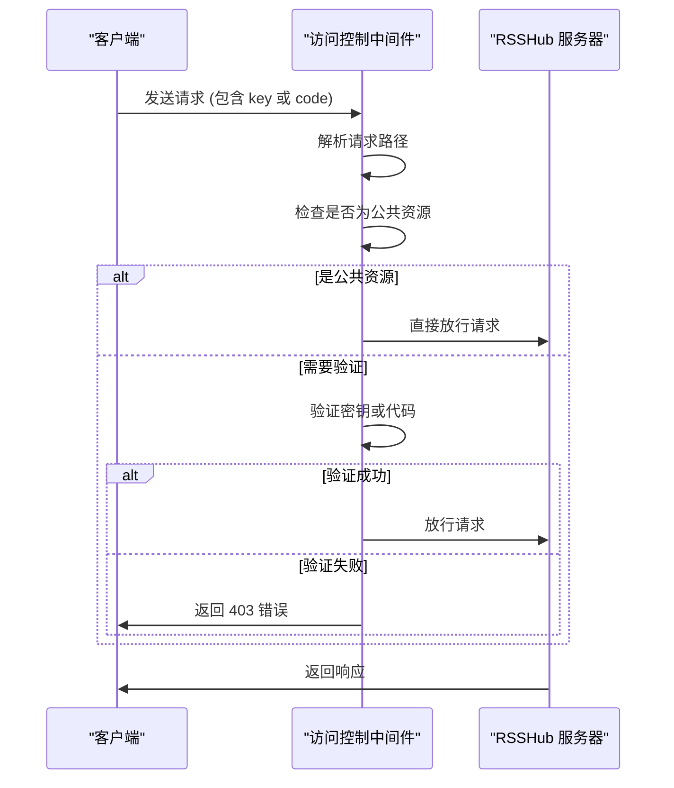
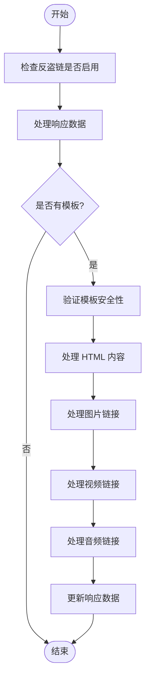
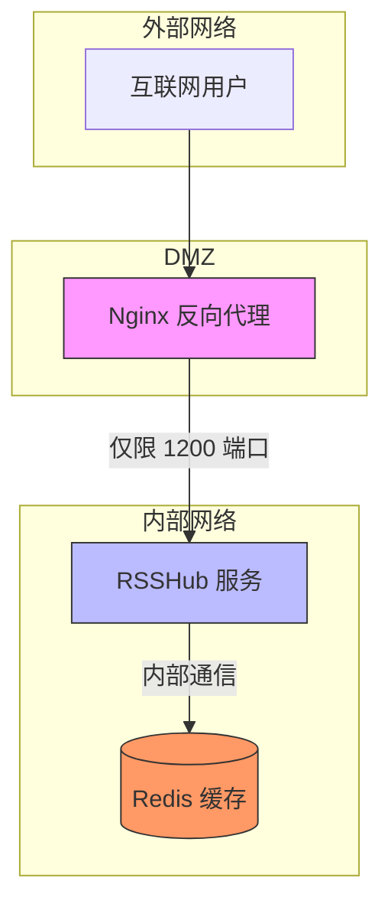
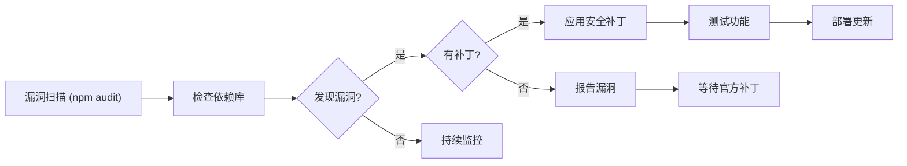
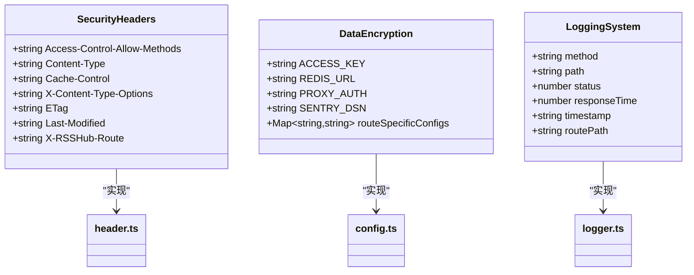
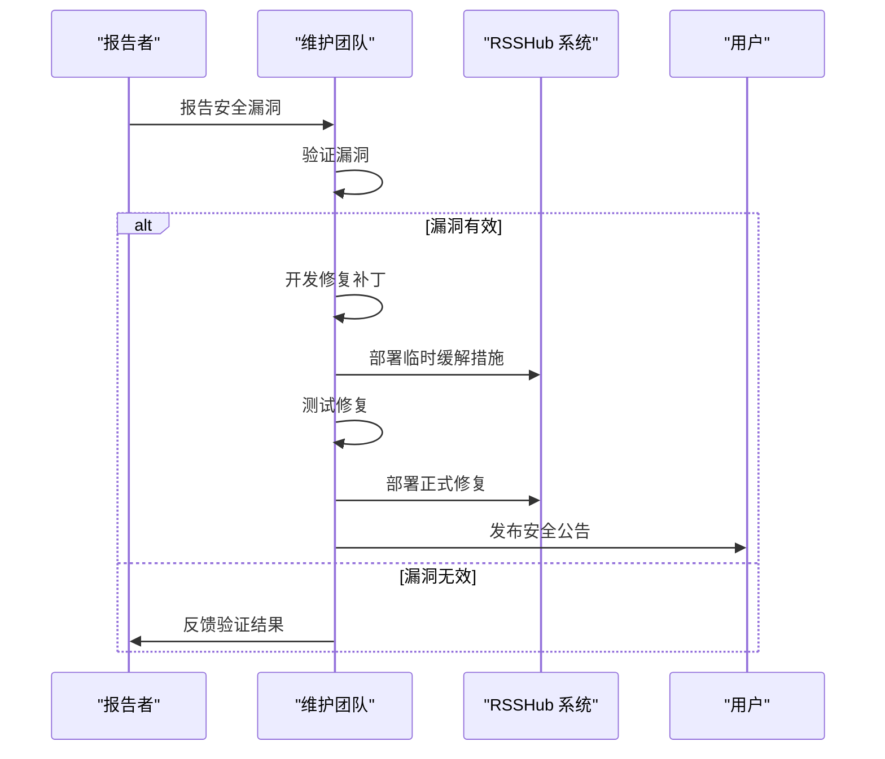

# 安全加固

<cite>
**本文档引用的文件**
- [access-control.ts](file://lib/middleware/access-control.ts)
- [anti-hotlink.ts](file://lib/middleware/anti-hotlink.ts)
- [config.ts](file://lib/config.ts)
- [header.ts](file://lib/middleware/header.ts)
- [sentry.ts](file://lib/middleware/sentry.ts)
- [logger.ts](file://lib/middleware/logger.ts)
- [SECURITY.md](file://SECURITY.md)
- [Dockerfile](file://Dockerfile)
- [docker-compose.yml](file://docker-compose.yml)
- [fly.toml](file://fly.toml)
- [flake.nix](file://flake.nix)
</cite>

## 目录
1. [简介](#简介)
2. [访问控制策略](#访问控制策略)
3. [反盗链机制](#反盗链机制)
4. [防火墙与网络配置](#防火墙与网络配置)
5. [安全漏洞管理](#安全漏洞管理)
6. [数据安全措施](#数据安全措施)
7. [安全事件响应](#安全事件响应)

## 简介
RSSHub 是一个开源的 RSS 生成器，旨在为各种网站提供 RSS 订阅功能。本安全加固文档系统性地介绍了 RSSHub 生产环境的安全防护措施，涵盖访问控制、反盗链、防火墙配置、漏洞管理、数据安全和应急响应等方面，以确保服务的安全性和稳定性。

## 访问控制策略

RSSHub 提供了基于 API 密钥的访问控制机制，通过配置访问密钥来限制对服务的未授权访问。该机制在 `lib/middleware/access-control.ts` 文件中实现，作为中间件拦截请求并验证身份。

访问控制支持两种验证方式：
1. **直接密钥验证**：通过 `key` 查询参数传递 API 密钥
2. **动态代码验证**：通过 `code` 查询参数传递基于路径和密钥生成的 MD5 哈希值

对于根路径、robots.txt、favicon.ico 和 logo.png 等公共资源，系统不会进行访问控制验证，允许直接访问。

**配置方法**：
在环境变量中设置 `ACCESS_KEY` 来启用访问控制。当此配置项存在时，所有非公共资源的请求都必须提供有效的密钥或代码。

**图源**
- [access-control.ts](file://lib/middleware/access-control.ts#L1-L27)

**本节源**
- [access-control.ts](file://lib/middleware/access-control.ts#L1-L27)
- [config.ts](file://lib/config.ts#L290-L292)

## 反盗链机制

RSSHub 实现了灵活的反盗链机制，防止资源被恶意盗用。该机制在 `lib/middleware/anti-hotlink.ts` 文件中实现，通过替换媒体资源 URL 来实现反向代理和访问控制。

反盗链机制的主要功能包括：
- 支持图片和多媒体资源的 URL 替换
- 可配置包含和排除的路径列表
- 支持用户自定义模板（可选启用）
- 对模板中的 URL 属性进行安全验证，防止 XSS 攻击

系统通过正则表达式 `${property}` 来匹配模板中的占位符，并支持 URL 编码后缀 `_ue`。允许的 URL 属性包括：hash、host、hostname、href、origin、password、pathname、port、protocol、search、searchParams、username。

**配置选项**：
- `HOTLINK_TEMPLATE`：全局热链接模板
- `HOTLINK_INCLUDE_PATHS`：需要处理反盗链的路径列表
- `HOTLINK_EXCLUDE_PATHS`：排除在反盗链处理之外的路径列表
- `ALLOW_USER_HOTLINK_TEMPLATE`：是否允许用户通过查询参数提供自定义模板

**图源**
- [anti-hotlink.ts](file://lib/middleware/anti-hotlink.ts#L1-L171)

**本节源**
- [anti-hotlink.ts](file://lib/middleware/anti-hotlink.ts#L1-L171)
- [config.ts](file://lib/config.ts#L307-L317)

## 防火墙与网络配置

RSSHub 提供了多种部署方式和网络配置选项，以增强服务的网络安全防护。通过合理的防火墙规则配置，可以限制不必要的端口暴露，提高系统的安全性。

### Docker 部署配置
在 `docker-compose.yml` 文件中，RSSHub 服务默认暴露 1200 端口，并配置了健康检查机制。Redis 服务运行在独立容器中，仅在内部网络暴露 6379 端口。

### Fly.io 部署配置
在 `fly.toml` 配置文件中，通过设置 `force_https = true` 强制使用 HTTPS 连接，确保数据传输的安全性。内部端口设置为 1200，并配置了自动暂停和启动机器的策略。

### NixOS 部署配置
在 `flake.nix` 文件中，提供了完整的系统服务配置，包括：
- 可配置的监听地址（默认 0.0.0.0）
- 防火墙端口开放选项
- 专用的用户和组账户
- 数据目录配置

系统服务配置了严格的安全加固措施：
- `NoNewPrivileges = true`：禁止进程获取新权限
- `PrivateTmp = true`：使用私有临时目录
- `ProtectSystem = "strict"`：严格保护系统目录
- `ProtectHome = true`：保护用户主目录
- `ProtectKernelTunables = true`：保护内核调优参数

**防火墙规则建议**：
1. 仅开放必要的服务端口（默认 1200）
2. 使用反向代理服务器（如 Nginx）处理 HTTPS 终止
3. 配置速率限制以防止 DDoS 攻击
4. 限制对管理接口的访问来源

**图源**
- [docker-compose.yml](file://docker-compose.yml#L1-L63)
- [fly.toml](file://fly.toml#L1-L16)
- [flake.nix](file://flake.nix#L122-L262)

**本节源**
- [docker-compose.yml](file://docker-compose.yml#L1-L63)
- [fly.toml](file://fly.toml#L1-L16)
- [flake.nix](file://flake.nix#L122-L262)
- [Dockerfile](file://Dockerfile#L1-L207)

## 安全漏洞管理

RSSHub 采用系统化的安全漏洞管理流程，确保依赖库的安全性和及时更新。

### 依赖库管理
项目使用 pnpm 作为包管理器，在 `package.json` 文件中明确列出了所有生产依赖。关键安全相关依赖包括：
- `@sentry/node`：错误监控和异常追踪
- `ioredis`：Redis 客户端，用于安全的缓存存储
- `tough-cookie`：安全的 Cookie 处理
- `cheerio`：服务器端的 HTML 解析
- `hono`：Web 框架，提供安全的中间件机制

### 安全补丁应用
项目通过以下方式确保安全补丁的及时应用：
1. 定期更新依赖库到最新稳定版本
2. 使用 `pnpm-lock.yaml` 锁定依赖版本，确保部署一致性
3. 在 `Dockerfile` 中使用多阶段构建，最小化最终镜像的攻击面

### 漏洞扫描工具
RSSHub 集成了多种安全工具：
- **Sentry 集成**：在 `lib/middleware/sentry.ts` 中实现，用于监控和报告异常
- **日志记录**：在 `lib/middleware/logger.ts` 中实现，记录所有请求和响应
- **OpenTelemetry**：支持指标收集和性能监控

定期安全检查包括：
1. 使用 `npm audit` 或 `pnpm audit` 扫描依赖漏洞
2. 监控安全公告和 CVE 报告
3. 定期进行代码安全审查

**图源**
- [package.json](file://package.json#L1-L249)
- [sentry.ts](file://lib/middleware/sentry.ts#L1-L29)
- [logger.ts](file://lib/middleware/logger.ts#L1-L46)

**本节源**
- [package.json](file://package.json#L1-L249)
- [sentry.ts](file://lib/middleware/sentry.ts#L1-L29)
- [logger.ts](file://lib/middleware/logger.ts#L1-L46)
- [config.ts](file://lib/config.ts#L300-L305)

## 数据安全措施

RSSHub 实施了多层次的数据安全措施，保护敏感信息和用户数据。

### 敏感信息加密存储
系统通过环境变量配置敏感信息，如 API 密钥、数据库凭证等。这些信息不应硬编码在源代码中，而应通过 `.env` 文件或环境变量注入。

在 `lib/config.ts` 中，所有敏感配置都从环境变量读取，确保配置信息与代码分离。对于特定服务的认证信息（如 GitHub、Twitter 等），使用专门的环境变量命名约定。

### 安全的备份传输
虽然项目本身不直接处理备份，但通过以下方式确保数据传输安全：
- 使用 HTTPS 协议获取源网站内容
- 在 `Dockerfile` 中配置安全的构建环境
- 使用安全的依赖包管理

### 访问日志审计
RSSHub 提供了详细的访问日志功能，用于安全审计和问题排查：
- 在 `lib/middleware/logger.ts` 中实现请求日志记录
- 记录请求方法、路径、状态码和响应时间
- 支持不同级别的日志输出（info、error 等）
- 可配置是否显示日志时间戳

日志记录包含以下安全相关信息：
- 请求来源（通过上下文获取）
- 请求路径和查询参数
- 响应状态码（用于识别异常访问）
- 处理时间（用于识别潜在的 DoS 攻击）

### HTTP 安全头
在 `lib/middleware/header.ts` 中，系统设置了关键的安全 HTTP 头：
- `X-Content-Type-Options: nosniff`：防止 MIME 类型嗅探攻击
- `Access-Control-Allow-Methods: GET`：限制允许的 HTTP 方法
- `Cache-Control`：控制缓存行为
- `ETag`：支持条件请求，减少带宽使用

**图源**
- [header.ts](file://lib/middleware/header.ts#L1-L56)
- [config.ts](file://lib/config.ts#L239-L800)
- [logger.ts](file://lib/middleware/logger.ts#L1-L46)

**本节源**
- [header.ts](file://lib/middleware/header.ts#L1-L56)
- [config.ts](file://lib/config.ts#L239-L800)
- [logger.ts](file://lib/middleware/logger.ts#L1-L46)

## 安全事件响应

RSSHub 建立了完善的安全事件响应流程和应急处理预案，确保能够快速有效地应对安全威胁。

### 安全报告渠道
根据 `SECURITY.md` 文件，RSSHub 提供了明确的安全漏洞报告流程：
- 可通过 GitHub 创建草稿安全公告
- 可发送邮件至 i@diygod.me 报告漏洞
- 承诺调查所有合法报告并尽快修复问题

### 监控与告警
系统通过以下机制实现安全监控：
- **Sentry 集成**：监控异常和错误，特别是路由超时情况
- **日志分析**：通过访问日志识别异常访问模式
- **健康检查**：通过 `/healthz` 端点监控服务状态

在 `lib/middleware/sentry.ts` 中，当请求处理时间超过配置的超时阈值时，会自动向 Sentry 上报超时异常，便于及时发现性能问题和潜在的 DoS 攻击。

### 应急处理预案
1. **漏洞确认**：收到报告后立即验证漏洞的存在和影响范围
2. **临时缓解**：在修复前实施临时安全措施（如限制访问）
3. **修复开发**：开发安全补丁并进行充分测试
4. **版本发布**：发布修复版本并通知用户
5. **事后分析**：进行根本原因分析，改进安全流程

### 灾难恢复
- 保持最新的依赖版本，减少已知漏洞风险
- 使用容器化部署，便于快速重建服务
- 定期备份配置和数据（如 Redis 数据）
- 准备应急配置模板，可快速切换到安全模式

**图源**
- [SECURITY.md](file://SECURITY.md#L1-L10)
- [sentry.ts](file://lib/middleware/sentry.ts#L1-L29)

**本节源**
- [SECURITY.md](file://SECURITY.md#L1-L10)
- [sentry.ts](file://lib/middleware/sentry.ts#L1-L29)