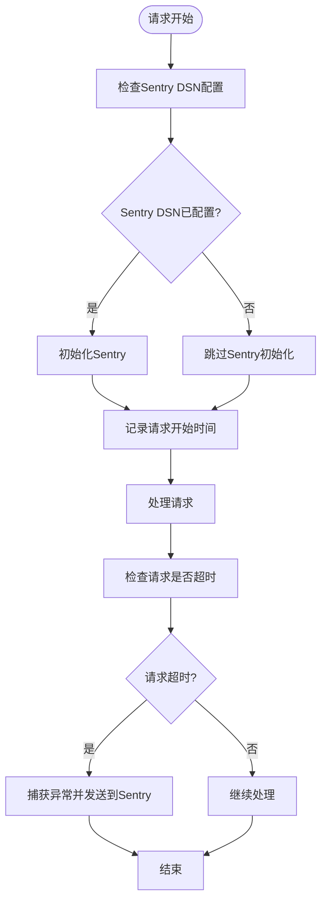

# 漏洞管理

<cite>
**本文档引用的文件**
- [SECURITY.md](file://SECURITY.md)
- [package.json](file://package.json)
- [config.ts](file://lib/config.ts)
- [sentry.ts](file://lib/middleware/sentry.ts)
- [logger.ts](file://lib/utils/logger.ts)
- [rss-parser@3.13.0.patch](file://patches/rss-parser@3.13.0.patch)
</cite>

## 目录
1. [简介](#简介)
2. [依赖库安全监控](#依赖库安全监控)
3. [Sentry集成方案](#sentry集成方案)
4. [安全补丁应用流程](#安全补丁应用流程)
5. [安全审计工具使用](#安全审计工具使用)
6. [安全事件响应计划](#安全事件响应计划)
7. [安全公告发布机制](#安全公告发布机制)

## 简介
RSSHub项目建立了完整的漏洞管理流程，旨在确保系统的安全性。项目通过多种机制来监控和管理安全风险，包括依赖库的安全监控、错误和异常的实时监控、安全补丁的应用以及安全事件的响应。本文档详细介绍了RSSHub的安全漏洞管理流程，涵盖了从漏洞报告到修复的各个环节。

**Section sources**
- [SECURITY.md](file://SECURITY.md#L1-L10)

## 依赖库安全监控
RSSHub通过pnpm包管理器管理项目依赖，并在package.json文件中明确列出了所有依赖项。项目使用@opentelemetry系列包进行监控和追踪，确保依赖库的安全性。通过pnpm的overrides和patchedDependencies配置，项目能够对特定依赖进行版本覆盖和补丁应用，以解决已知的安全漏洞。

**Section sources**
- [package.json](file://package.json#L59-L247)

## Sentry集成方案
RSSHub集成了Sentry进行错误和异常的实时监控与告警。在sentry.ts中间件中，通过配置Sentry DSN来初始化Sentry服务。当请求处理时间超过预设的超时阈值时，Sentry会捕获异常并记录路由超时事件。这种集成方案能够帮助开发团队及时发现和解决性能问题，提高系统的稳定性。

**Diagram sources**
- [sentry.ts](file://lib/middleware/sentry.ts#L8-L28)

**Section sources**
- [sentry.ts](file://lib/middleware/sentry.ts#L8-L28)
- [config.ts](file://lib/config.ts#L301-L304)

## 安全补丁应用流程
RSSHub通过补丁文件对依赖库进行安全修复。例如，对于rss-parser@3.13.0版本，项目在patches目录下提供了rss-parser@3.13.0.patch补丁文件。该补丁增加了对gzip压缩内容的解压支持，解决了潜在的安全问题。补丁应用流程包括测试、验证和部署三个步骤，确保补丁不会引入新的问题。

**Section sources**
- [rss-parser@3.13.0.patch](file://patches/rss-parser@3.13.0.patch#L1-L49)
- [package.json](file://package.json#L244-L246)

## 安全审计工具使用
RSSHub使用多种安全审计工具来保证代码质量。项目配置了ESLint和Prettier进行代码风格检查和格式化，通过lint-staged在提交时自动修复代码问题。此外，项目还使用了静态代码分析工具来检测潜在的安全漏洞。这些工具的结合使用，有助于在开发阶段发现和修复安全问题。

**Section sources**
- [package.json](file://package.json#L50-L58)
- [package.json](file://package.json#L174-L185)

## 安全事件响应计划
RSSHub制定了明确的安全事件响应计划。根据安全事件的严重程度，项目定义了不同的处理流程。对于严重的安全漏洞，项目维护者会立即进行调查并尽快修复。项目鼓励用户通过GitHub安全咨询或邮件报告安全漏洞，所有合法的报告都会被认真对待。这种透明的响应机制有助于建立用户信任，及时解决安全问题。

**Section sources**
- [SECURITY.md](file://SECURITY.md#L7-L10)

## 安全公告发布机制
RSSHub通过多种渠道发布安全公告，确保用户能够及时了解安全更新。项目在GitHub仓库中维护SECURITY.md文件，详细说明了安全策略和漏洞报告流程。当发现重要安全漏洞时，项目会通过GitHub发布安全公告，并提供详细的修复建议。此外，项目还通过RSS订阅等方式向用户推送安全更新信息，确保用户能够及时采取措施保护系统安全。

**Section sources**
- [SECURITY.md](file://SECURITY.md#L1-L10)