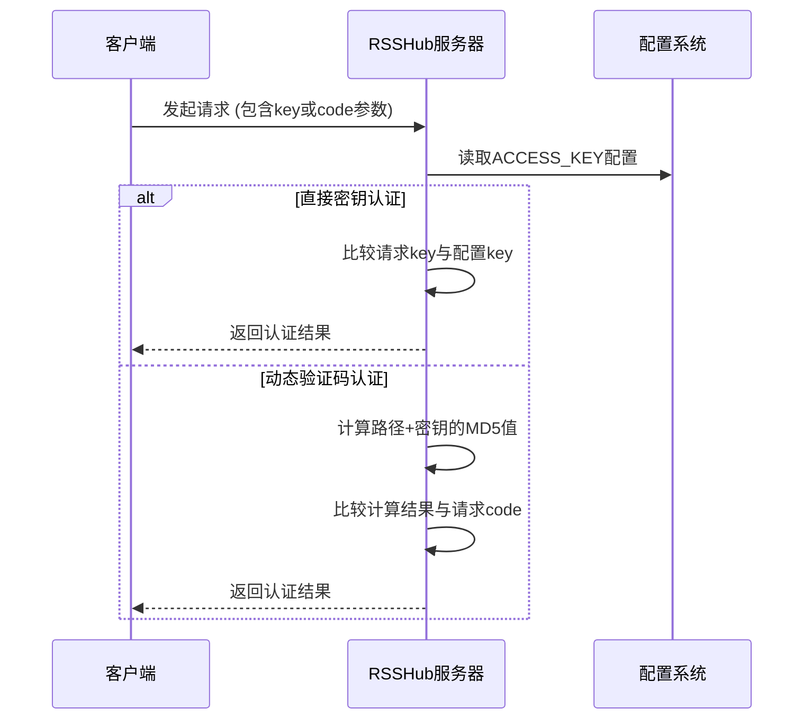
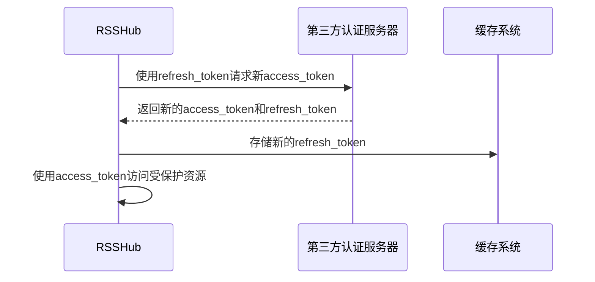
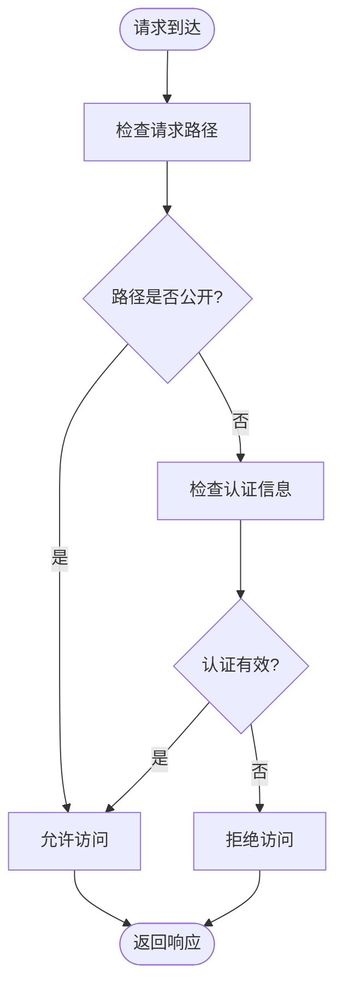
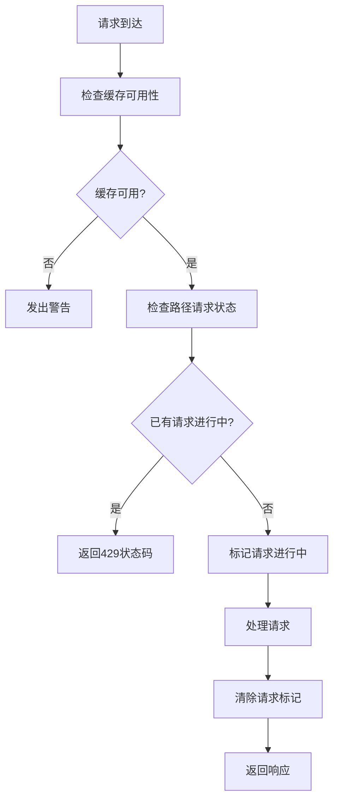

# 访问控制

<cite>
**本文档中引用的文件**   
- [access-control.ts](file://lib/middleware/access-control.ts)
- [config.ts](file://lib/config.ts)
- [access-control.test.ts](file://lib/middleware/access-control.test.ts)
</cite>

## 目录
1. [简介](#简介)
2. [IP白名单配置](#ip白名单配置)
3. [API密钥认证](#api密钥认证)
4. [OAuth2集成方案](#oauth2集成方案)
5. [基于路径的细粒度权限控制](#基于路径的细粒度权限控制)
6. [速率限制机制](#速率限制机制)
7. [安全最佳实践](#安全最佳实践)

## 简介
RSSHub 提供了多层次的访问控制机制，确保服务的安全性和可控性。系统通过中间件链实现访问控制，其中 `access-control` 中间件负责核心的认证逻辑。访问控制机制主要包括API密钥认证、路径级权限管理以及与第三方服务的OAuth2集成。系统通过环境变量进行配置，支持灵活的部署需求。

**Section sources**
- [access-control.ts](file://lib/middleware/access-control.ts#L1-L26)
- [config.ts](file://lib/config.ts#L42-L291)

## IP白名单配置
RSSHub 未直接实现IP白名单功能，但通过与其他安全机制结合可实现类似效果。系统主要依赖API密钥和路径控制来管理访问权限。对于需要IP限制的场景，建议在反向代理层（如Nginx）或云服务防火墙中配置IP白名单规则。这种方式不仅更安全，还能有效防止DDoS攻击。

## API密钥认证
RSSHub 的API密钥认证机制通过 `ACCESS_KEY` 环境变量进行配置。该机制支持两种认证方式：直接密钥认证和动态验证码认证。当配置了 `ACCESS_KEY` 后，所有非公开路径的请求都需要提供有效的认证信息。

**Diagram sources**
- [access-control.ts](file://lib/middleware/access-control.ts#L11-L23)
- [config.ts](file://lib/config.ts#L767-L768)

**Section sources**
- [access-control.ts](file://lib/middleware/access-control.ts#L11-L23)
- [config.ts](file://lib/config.ts#L767-L768)

## OAuth2集成方案
RSSHub 支持与多个第三方平台的OAuth2集成，包括Tumblr、Spotify、Twitter等。这些集成主要用于访问需要用户授权的私有内容。以Tumblr为例，系统需要配置 `TUMBLR_CLIENT_ID`、`TUMBLR_CLIENT_SECRET` 和 `TUMBLR_REFRESH_TOKEN` 三个环境变量。系统通过刷新令牌机制自动维护访问令牌的有效性，确保长期稳定的订阅服务。

**Diagram sources**
- [tumblr/utils.ts](file://lib/routes/tumblr/utils.ts#L76-L102)
- [spotify/utils.ts](file://lib/routes/spotify/utils.ts#L26-L47)

**Section sources**
- [tumblr/utils.ts](file://lib/routes/tumblr/utils.ts#L76-L102)
- [spotify/utils.ts](file://lib/routes/spotify/utils.ts#L26-L47)

## 基于路径的细粒度权限控制
RSSHub 实现了基于路径的细粒度权限控制机制。系统将某些路径（如根路径、robots.txt、favicon.ico等）设置为公开访问，无需认证。其他所有路径默认受保护，需要通过API密钥认证。这种设计既保证了基本功能的可用性，又确保了内容的安全性。

**Diagram sources**
- [access-control.ts](file://lib/middleware/access-control.ts#L16-L18)
- [access-control.test.ts](file://lib/middleware/access-control.test.ts#L24-L28)

**Section sources**
- [access-control.ts](file://lib/middleware/access-control.ts#L16-L18)
- [access-control.test.ts](file://lib/middleware/access-control.test.ts#L24-L28)

## 速率限制机制
RSSHub 通过缓存系统实现速率限制和并发控制。系统使用Redis或内存缓存来跟踪请求状态，防止同一路径的并发请求导致资源过度消耗。当缓存不可用时，系统会发出警告，因为这可能导致请求不受限制，进而引发服务滥用或DDoS攻击风险。

**Diagram sources**
- [cache.ts](file://lib/middleware/cache.ts#L13-L82)
- [index.ts](file://lib/utils/cache/index.ts#L16-L60)

**Section sources**
- [cache.ts](file://lib/middleware/cache.ts#L13-L82)
- [index.ts](file://lib/utils/cache/index.ts#L16-L60)

## 安全最佳实践
为确保RSSHub服务的安全性，建议遵循以下最佳实践：定期轮换API密钥，遵循最小权限原则，启用访问日志审计，以及使用反向代理层实现IP白名单和速率限制。同时，应避免在客户端暴露API密钥，建议在服务端安全存储和管理认证信息。对于敏感路由，应启用额外的认证层，并定期审查访问日志以发现异常行为。

**Section sources**
- [CLAUDE.md](file://CLAUDE.md#L271-L280)
- [SECURITY.md](file://SECURITY.md#L7-L9)