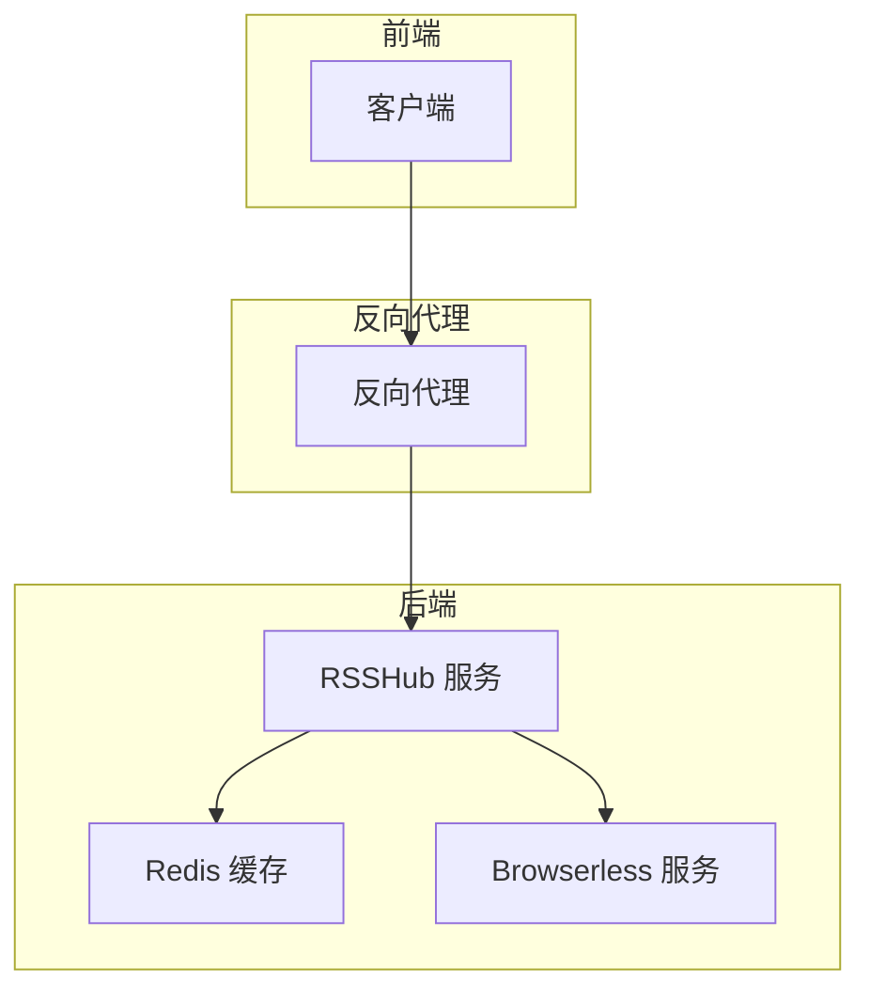
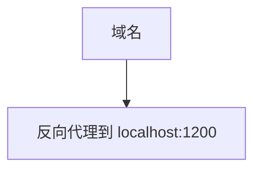
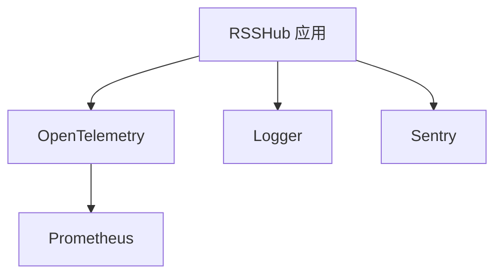
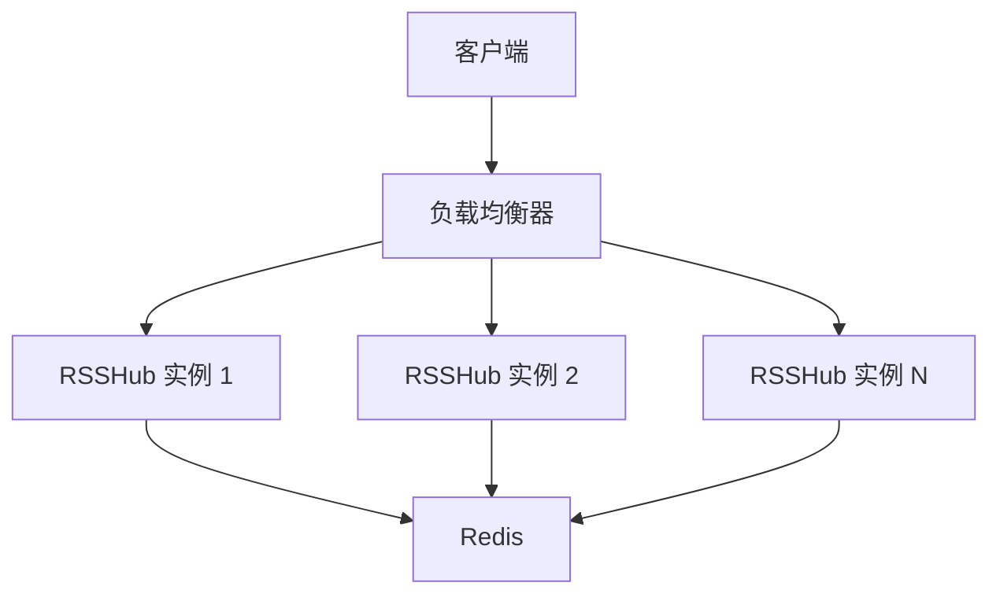
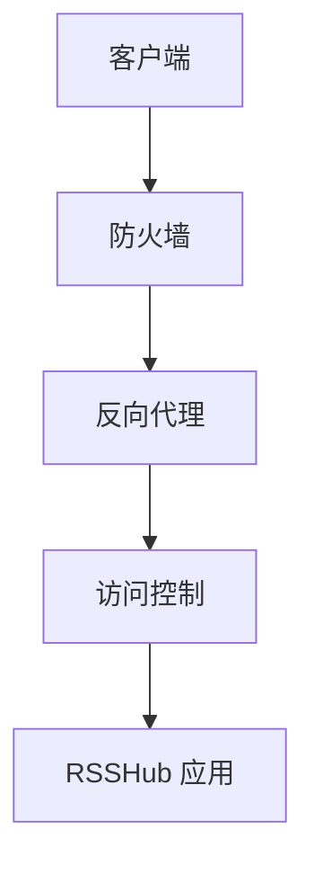
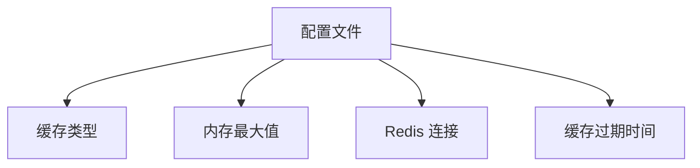
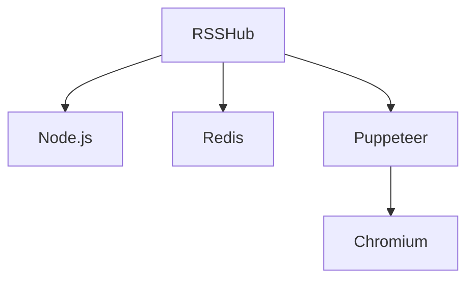

# 生产环境最佳实践

<cite>
**本文档引用的文件**
- [README.md](file://README.md)
- [Dockerfile](file://Dockerfile)
- [docker-compose.yml](file://docker-compose.yml)
- [fly.toml](file://fly.toml)
- [vercel.json](file://vercel.json)
- [lib/config.ts](file://lib/config.ts)
- [lib/middleware/access-control.ts](file://lib/middleware/access-control.ts)
- [lib/middleware/cache.ts](file://lib/middleware/cache.ts)
- [lib/middleware/header.ts](file://lib/middleware/header.ts)
- [lib/middleware/logger.ts](file://lib/middleware/logger.ts)
- [lib/middleware/sentry.ts](file://lib/middleware/sentry.ts)
- [lib/utils/cache/index.ts](file://lib/utils/cache/index.ts)
- [lib/utils/otel/metric.ts](file://lib/utils/otel/metric.ts)
- [scripts/ansible/rsshub.Caddyfile](file://scripts/ansible/rsshub.Caddyfile)
</cite>

## 目录
1. [简介](#简介)
2. [项目结构](#项目结构)
3. [核心组件](#核心组件)
4. [架构概述](#架构概述)
5. [详细组件分析](#详细组件分析)
6. [依赖分析](#依赖分析)
7. [性能考虑](#性能考虑)
8. [故障排除指南](#故障排除指南)
9. [结论](#结论)

## 简介
RSSHub 是一个开源的 RSS 生成器，可以为各种网站和在线服务创建 RSS 订阅源。本文档旨在为在生产环境中部署和运维 RSSHub 提供最佳实践指南。文档涵盖了反向代理配置、监控系统集成、高可用性架构设计、安全加固建议和性能调优指南。

## 项目结构
RSSHub 项目结构清晰，主要包含以下几个目录：
- `assets/`: 静态资源文件
- `eslint-plugins/`: ESLint 插件
- `lib/`: 核心代码库，包含 API、错误处理、中间件、路由、工具等
- `patches/`: 代码补丁
- `plugins/`: 构建插件
- `scripts/`: 各种脚本，包括 Ansible 部署脚本、Docker 脚本等

**Section sources**
- [README.md](file://README.md#L1-L62)

## 核心组件
RSSHub 的核心组件包括配置管理、中间件、路由和缓存系统。配置管理通过 `lib/config.ts` 文件实现，支持多种环境变量。中间件系统包括访问控制、缓存、日志记录和错误处理。路由系统负责处理各种 RSS 订阅请求。缓存系统支持内存缓存和 Redis 缓存。

**Section sources**
- [lib/config.ts](file://lib/config.ts#L1-L800)
- [lib/middleware/access-control.ts](file://lib/middleware/access-control.ts#L1-L27)
- [lib/middleware/cache.ts](file://lib/middleware/cache.ts#L1-L84)
- [lib/middleware/header.ts](file://lib/middleware/header.ts#L1-L56)
- [lib/middleware/logger.ts](file://lib/middleware/logger.ts#L1-L46)
- [lib/middleware/sentry.ts](file://lib/middleware/sentry.ts#L1-L29)

## 架构概述
RSSHub 采用微服务架构，通过 Docker 容器化部署。主应用容器运行 RSSHub 服务，端口为 1200。Redis 容器用于缓存数据。Browserless 容器用于处理需要浏览器渲染的页面。反向代理（如 Nginx 或 Caddy）位于前端，负责 SSL 终止、HTTP/2 支持和安全头设置。

**Diagram sources**
- [Dockerfile](file://Dockerfile#L1-L207)
- [docker-compose.yml](file://docker-compose.yml#L1-L63)

## 详细组件分析

### 反向代理配置
RSSHub 支持通过反向代理进行部署。Caddy 配置文件位于 `scripts/ansible/rsshub.Caddyfile`，配置简单，只需指定域名和反向代理地址即可。Nginx 配置需要手动设置，包括 SSL 证书配置、HTTP/2 支持和安全头设置。

#### Caddy 配置示例

**Diagram sources**
- [scripts/ansible/rsshub.Caddyfile](file://scripts/ansible/rsshub.Caddyfile#L1-L3)

### 监控系统集成
RSSHub 集成了多种监控系统。通过 `lib/utils/otel/metric.ts` 文件实现 OpenTelemetry 指标导出，支持 Prometheus 格式。日志记录通过 `lib/middleware/logger.ts` 实现，支持多种日志级别。Sentry 用于错误跟踪和告警设置。

#### 监控系统架构

**Diagram sources**
- [lib/utils/otel/metric.ts](file://lib/utils/otel/metric.ts#L1-L32)
- [lib/middleware/logger.ts](file://lib/middleware/logger.ts#L1-L46)
- [lib/middleware/sentry.ts](file://lib/middleware/sentry.ts#L1-L29)

### 高可用性架构设计
RSSHub 支持高可用性部署。通过 `docker-compose.yml` 文件定义多个服务实例，实现负载均衡和故障转移。Redis 用于共享缓存，确保数据一致性。定期备份策略可以通过外部脚本实现。

#### 高可用性架构

**Diagram sources**
- [docker-compose.yml](file://docker-compose.yml#L1-L63)
- [lib/utils/cache/index.ts](file://lib/utils/cache/index.ts#L1-L101)

### 安全加固建议
RSSHub 提供了多种安全加固选项。通过 `lib/middleware/access-control.ts` 实现访问控制，支持密钥认证。防火墙配置可以通过 Docker 网络策略实现。定期更新依赖包和漏洞管理是确保系统安全的重要措施。

#### 安全架构

**Diagram sources**
- [lib/middleware/access-control.ts](file://lib/middleware/access-control.ts#L1-L27)
- [Dockerfile](file://Dockerfile#L1-L207)

### 性能调优指南
RSSHub 的性能调优主要集中在内存使用、数据库连接和缓存策略上。通过 `lib/config.ts` 文件中的配置项可以调整缓存类型、内存最大值和 Redis 连接。合理设置缓存过期时间可以有效减少数据库查询次数。

#### 性能调优配置

**Diagram sources**
- [lib/config.ts](file://lib/config.ts#L1-L800)

## 依赖分析
RSSHub 的依赖关系清晰，主要依赖 Node.js 运行时、Redis 缓存和 Puppeteer 浏览器自动化工具。通过 `Dockerfile` 文件定义了构建和运行时依赖。`package.json` 文件列出了所有 npm 依赖。

**Diagram sources**
- [Dockerfile](file://Dockerfile#L1-L207)
- [package.json](file://package.json)

## 性能考虑
在生产环境中，RSSHub 的性能主要受内存使用、网络延迟和缓存效率的影响。建议使用 Redis 作为缓存后端，合理设置缓存过期时间。对于高并发场景，可以考虑使用负载均衡和多实例部署。

**Section sources**
- [lib/config.ts](file://lib/config.ts#L1-L800)
- [lib/utils/cache/index.ts](file://lib/utils/cache/index.ts#L1-L101)

## 故障排除指南
常见的故障包括缓存失效、网络连接问题和 Puppeteer 渲染失败。通过查看日志文件和监控指标可以快速定位问题。对于缓存问题，可以检查 Redis 连接状态。对于网络问题，可以检查代理设置和防火墙规则。

**Section sources**
- [lib/middleware/logger.ts](file://lib/middleware/logger.ts#L1-L46)
- [lib/middleware/sentry.ts](file://lib/middleware/sentry.ts#L1-L29)

## 结论
RSSHub 是一个功能强大的 RSS 生成器，通过合理的配置和部署，可以在生产环境中稳定运行。本文档提供的最佳实践指南涵盖了部署、监控、高可用性、安全和性能调优等方面，帮助用户构建一个高效、可靠的 RSSHub 服务。