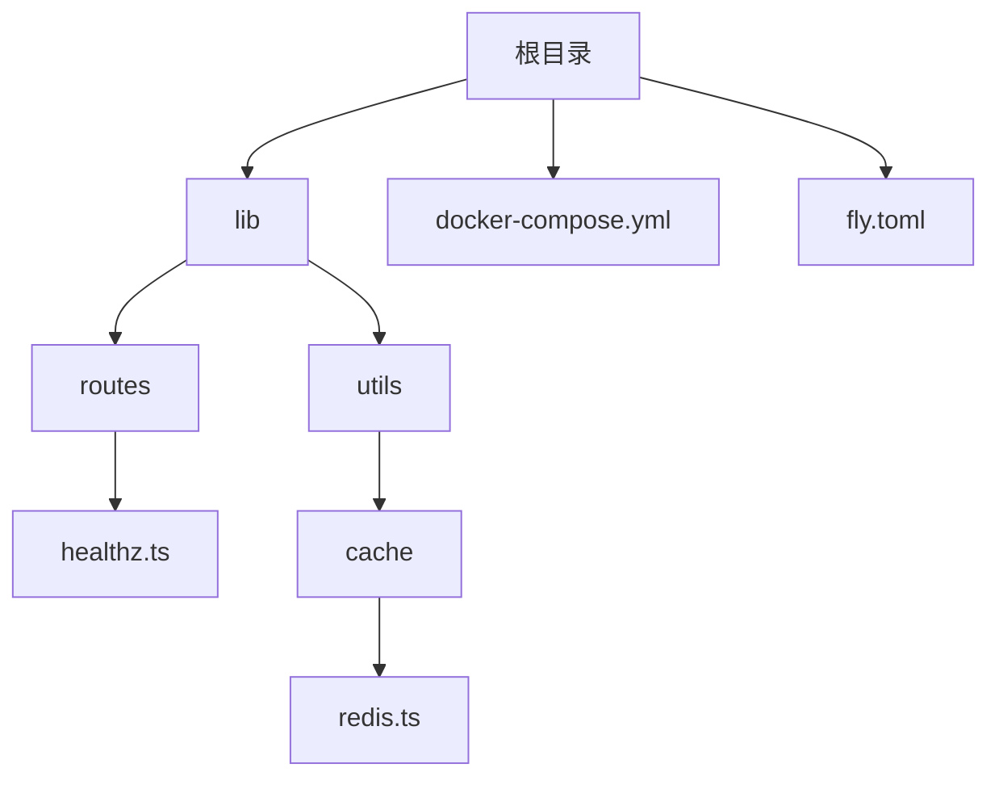
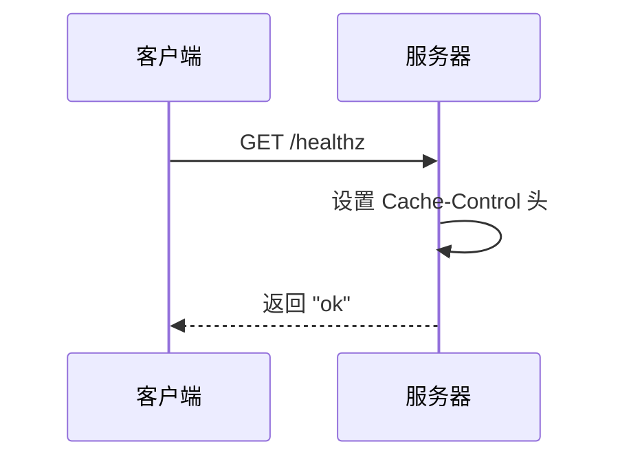
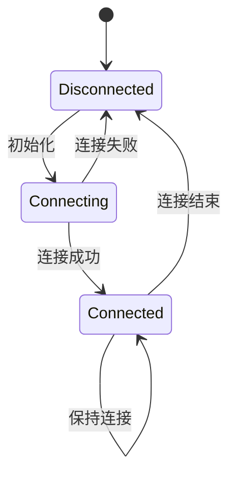

# 健康检查

<cite>
**本文档引用的文件**   
- [healthz.ts](file://lib/routes/healthz.ts)
- [registry.ts](file://lib/registry.ts)
- [redis.ts](file://lib/utils/cache/redis.ts)
- [docker-compose.yml](file://docker-compose.yml)
- [fly.toml](file://fly.toml)
- [cache.test.ts](file://lib/middleware/cache.test.ts)
- [cache/index.ts](file://lib/utils/cache/index.ts)
</cite>

## 目录
1. [简介](#简介)
2. [项目结构](#项目结构)
3. [核心组件](#核心组件)
4. [架构概述](#架构概述)
5. [详细组件分析](#详细组件分析)
6. [依赖分析](#依赖分析)
7. [性能考虑](#性能考虑)
8. [故障排除指南](#故障排除指南)
9. [结论](#结论)

## 简介
RSSHub 是一个开源的 RSS 生成器，为各种网站和在线资源提供 RSS 订阅功能。健康检查是确保 RSSHub 实例稳定运行的关键机制。本文档详细介绍了 RSSHub 的健康检查系统，包括 `/healthz` 端点的实现原理、依赖组件的连通性检查、与容器编排系统的集成方法，以及自定义健康检查逻辑的扩展指南。

## 项目结构
RSSHub 的项目结构清晰，主要组件分布在 `lib` 目录下。健康检查相关的代码主要位于 `lib/routes/healthz.ts` 和 `lib/registry.ts` 文件中。`docker-compose.yml` 和 `fly.toml` 文件包含了与容器编排系统集成的健康检查配置。



**Diagram sources**
- [healthz.ts](file://lib/routes/healthz.ts)
- [docker-compose.yml](file://docker-compose.yml)
- [fly.toml](file://fly.toml)

**Section sources**
- [lib](file://lib)
- [docker-compose.yml](file://docker-compose.yml)
- [fly.toml](file://fly.toml)

## 核心组件
RSSHub 的健康检查系统由多个核心组件构成，包括 `/healthz` 端点、Redis 缓存状态检查、以及与容器编排系统的集成配置。这些组件共同确保了系统的稳定性和可靠性。

**Section sources**
- [healthz.ts](file://lib/routes/healthz.ts)
- [redis.ts](file://lib/utils/cache/redis.ts)
- [docker-compose.yml](file://docker-compose.yml)

## 架构概述
RSSHub 的健康检查架构主要包括三个层次：应用层健康检查、依赖组件健康检查和容器编排层健康检查。应用层通过 `/healthz` 端点提供基本的健康状态，依赖组件层检查 Redis 等关键服务的连通性，容器编排层则通过 Docker Compose 和 Fly.io 等工具进行更全面的健康监控。

```mermaid
graph TD
A[客户端] --> B[/healthz 端点]
B --> C{健康检查逻辑}
C --> D[检查应用状态]
C --> E[检查 Redis 连接]
C --> F[返回健康状态]
G[Docker Compose] --> H[执行健康检查]
I[Fly.io] --> J[执行健康检查]
H --> B
J --> B
```

**Diagram sources**
- [healthz.ts](file://lib/routes/healthz.ts)
- [docker-compose.yml](file://docker-compose.yml)
- [fly.toml](file://fly.toml)

## 详细组件分析

### /healthz 端点分析
`/healthz` 端点是 RSSHub 健康检查的核心，它提供了一个简单的接口来检查应用的基本健康状态。

#### 实现原理


**Diagram sources**
- [healthz.ts](file://lib/routes/healthz.ts)

**Section sources**
- [healthz.ts](file://lib/routes/healthz.ts)

### Redis 连接检查分析
Redis 是 RSSHub 的关键依赖组件，其连接状态直接影响系统的正常运行。

#### 连接状态管理


**Diagram sources**
- [redis.ts](file://lib/utils/cache/redis.ts)

**Section sources**
- [redis.ts](file://lib/utils/cache/redis.ts)

## 依赖分析
RSSHub 的健康检查系统依赖于多个组件，包括 Hono 框架、Redis 客户端、Docker Compose 和 Fly.io 等。这些组件之间的依赖关系如下：

```mermaid
graph TD
A[Hono 框架] --> B[/healthz 端点]
C[Redis 客户端] --> D[Redis 连接检查]
E[Docker Compose] --> F[健康检查配置]
G[Fly.io] --> H[健康检查配置]
B --> I[健康检查逻辑]
D --> I
F --> I
H --> I
```

**Diagram sources**
- [registry.ts](file://lib/registry.ts)
- [redis.ts](file://lib/utils/cache/redis.ts)
- [docker-compose.yml](file://docker-compose.yml)
- [fly.toml](file://fly.toml)

**Section sources**
- [registry.ts](file://lib/registry.ts)
- [redis.ts](file://lib/utils/cache/redis.ts)
- [docker-compose.yml](file://docker-compose.yml)
- [fly.toml](file://fly.toml)

## 性能考虑
在设计健康检查系统时，需要考虑性能影响。频繁的健康检查可能会增加系统负载，因此需要合理设置检查间隔和超时时间。同时，健康检查应该尽量轻量，避免执行复杂的操作。

## 故障排除指南
当健康检查失败时，可以按照以下步骤进行排查：
1. 检查应用日志，查看是否有错误信息
2. 确认 Redis 服务是否正常运行
3. 检查网络连接，确保服务间通信正常
4. 验证健康检查配置是否正确

**Section sources**
- [cache.test.ts](file://lib/middleware/cache.test.ts)
- [redis.ts](file://lib/utils/cache/redis.ts)

## 结论
RSSHub 的健康检查系统通过 `/healthz` 端点、Redis 连接检查和容器编排集成，提供了一个全面的健康监控解决方案。通过合理配置和使用，可以有效确保 RSSHub 实例的稳定运行。