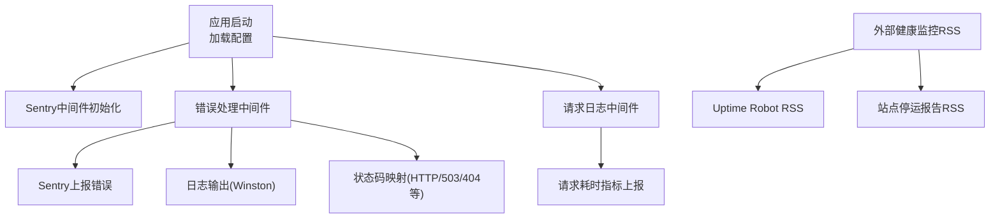
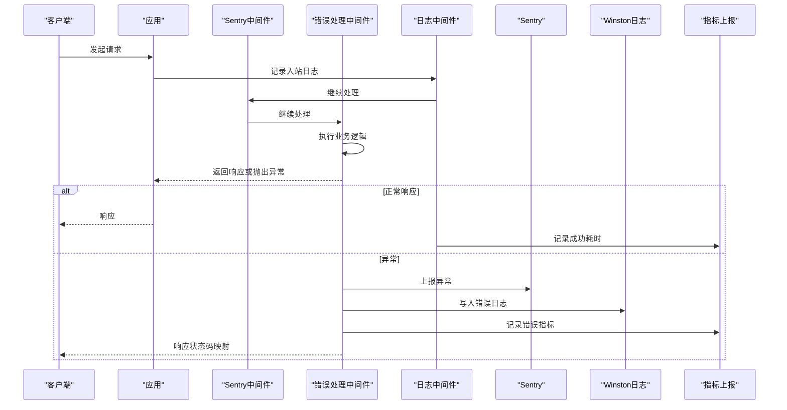
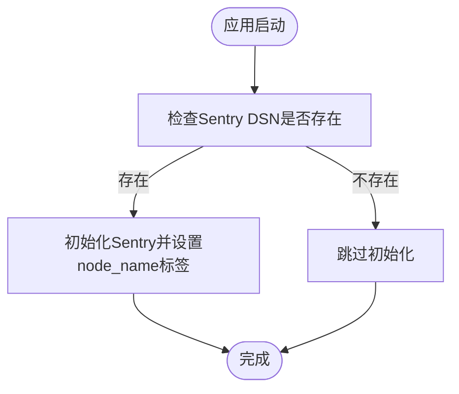
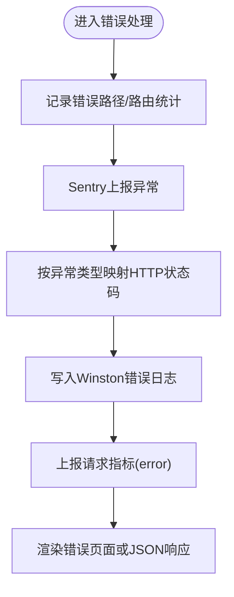
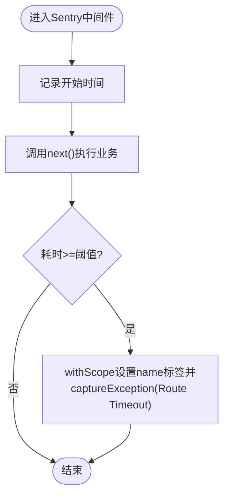
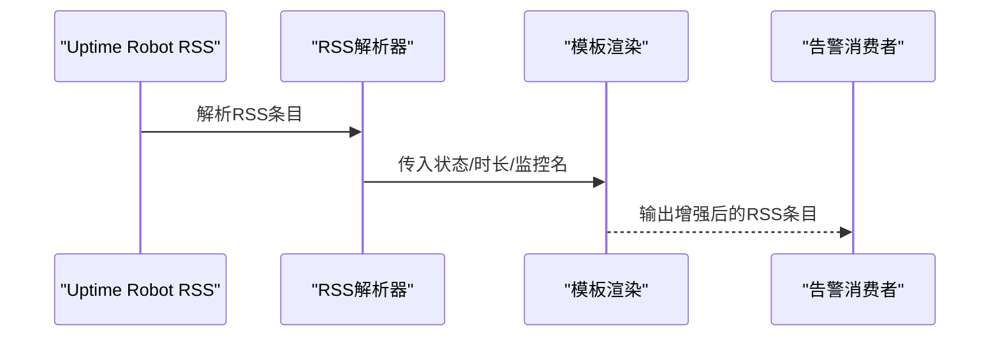
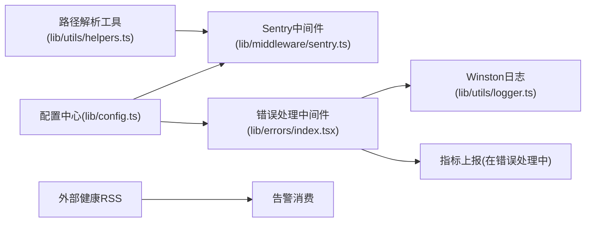

# 告警系统

<cite>
**本文引用的文件列表**
- [lib/middleware/sentry.ts](file://lib/middleware/sentry.ts)
- [lib/config.ts](file://lib/config.ts)
- [lib/errors/index.tsx](file://lib/errors/index.tsx)
- [lib/utils/logger.ts](file://lib/utils/logger.ts)
- [lib/middleware/logger.ts](file://lib/middleware/logger.ts)
- [lib/utils/helpers.ts](file://lib/utils/helpers.ts)
- [lib/errors/types/not-found.ts](file://lib/errors/types/not-found.ts)
- [lib/routes/uptimerobot/rss.ts](file://lib/routes/uptimerobot/rss.ts)
- [lib/routes/uptimerobot/templates/rss.art](file://lib/routes/uptimerobot/templates/rss.art)
- [lib/routes/uptimerobot/namespace.ts](file://lib/routes/uptimerobot/namespace.ts)
- [lib/routes/outagereport/index.ts](file://lib/routes/outagereport/index.ts)
- [lib/routes/mail/imap.ts](file://lib/routes/mail/imap.ts)
- [scripts/ansible/rsshub.env](file://scripts/ansible/rsshub.env)
</cite>

## 目录
1. [引言](#引言)
2. [项目结构与告警相关模块](#项目结构与告警相关模块)
3. [核心组件](#核心组件)
4. [架构总览](#架构总览)
5. [组件详解](#组件详解)
6. [依赖关系分析](#依赖关系分析)
7. [性能与可观测性](#性能与可观测性)
8. [告警规则与分级策略](#告警规则与分级策略)
9. [通知渠道配置指南](#通知渠道配置指南)
10. [故障排查与抑制去重最佳实践](#故障排查与抑制去重最佳实践)
11. [结论](#结论)

## 引言
本文件面向RSSHub运维与开发团队，系统化梳理RSSHub的错误监控与告警机制，重点覆盖以下方面：
- Sentry集成：DSN设置、环境标识、错误采样率与路由超时告警
- 错误处理与状态映射：HTTP错误码、异常类型到响应状态的映射
- 健康监控：基于外部服务的可用性RSS输出
- 通知渠道：邮件、Slack、企业微信等渠道的配置思路
- 告警规则与分级：按异常类型、HTTP状态、性能退化等维度制定
- 故障排查：标准化流程与告警抑制、去重策略

## 项目结构与告警相关模块
RSSHub的告警体系由“错误捕获与上报（Sentry）+ 日志记录（Winston）+ 错误处理中间件 + 外部健康监控RSS”构成。关键文件如下：
- 配置层：集中管理Sentry DSN、路由超时阈值、日志级别等
- 中间件层：Sentry初始化与路由超时告警；请求日志与指标上报
- 错误处理层：统一错误捕获、状态码映射、Sentry上报、日志输出
- 外部健康监控：Uptime Robot RSS增强、站点停运报告RSS

图表来源
- [lib/config.ts](file://lib/config.ts#L779-L782)
- [lib/middleware/sentry.ts](file://lib/middleware/sentry.ts#L8-L15)
- [lib/errors/index.tsx](file://lib/errors/index.tsx#L13-L81)
- [lib/middleware/logger.ts](file://lib/middleware/logger.ts#L29-L44)
- [lib/routes/uptimerobot/rss.ts](file://lib/routes/uptimerobot/rss.ts#L57-L86)
- [lib/routes/outagereport/index.ts](file://lib/routes/outagereport/index.ts#L34-L71)

章节来源
- [lib/config.ts](file://lib/config.ts#L779-L782)
- [lib/middleware/sentry.ts](file://lib/middleware/sentry.ts#L8-L26)
- [lib/errors/index.tsx](file://lib/errors/index.tsx#L13-L81)
- [lib/middleware/logger.ts](file://lib/middleware/logger.ts#L29-L44)
- [lib/routes/uptimerobot/rss.ts](file://lib/routes/uptimerobot/rss.ts#L57-L86)
- [lib/routes/outagereport/index.ts](file://lib/routes/outagereport/index.ts#L34-L71)

## 核心组件
- Sentry中间件：在应用启动时根据配置初始化，并对超过阈值的路由执行超时告警
- 错误处理中间件：统一捕获异常，进行状态码映射、Sentry上报、日志输出与指标上报
- 日志中间件：记录请求入站/出站、状态码与耗时，辅助定位性能问题
- 配置中心：集中管理Sentry DSN、路由超时阈值、日志级别等
- 外部健康监控：通过RSS聚合外部监控结果，便于统一告警

章节来源
- [lib/middleware/sentry.ts](file://lib/middleware/sentry.ts#L8-L26)
- [lib/errors/index.tsx](file://lib/errors/index.tsx#L13-L81)
- [lib/middleware/logger.ts](file://lib/middleware/logger.ts#L29-L44)
- [lib/config.ts](file://lib/config.ts#L779-L782)

## 架构总览
RSSHub的告警链路从“请求进入 -> 中间件处理 -> 错误捕获 -> 上报Sentry -> 记录日志 -> 指标上报 -> 外部健康RSS”，形成闭环。

图表来源
- [lib/middleware/sentry.ts](file://lib/middleware/sentry.ts#L17-L26)
- [lib/errors/index.tsx](file://lib/errors/index.tsx#L13-L81)
- [lib/middleware/logger.ts](file://lib/middleware/logger.ts#L29-L44)

## 组件详解

### Sentry集成与配置
- DSN设置：通过配置项读取并初始化Sentry
- 环境标识：设置node_name标签，便于区分实例
- 路由超时告警：当路由执行耗时达到阈值时，捕获“Route Timeout”异常并上报

图表来源
- [lib/middleware/sentry.ts](file://lib/middleware/sentry.ts#L8-L15)

章节来源
- [lib/middleware/sentry.ts](file://lib/middleware/sentry.ts#L8-L15)
- [lib/config.ts](file://lib/config.ts#L779-L782)

### 错误处理与状态映射
- 统一错误捕获：记录错误路径、路由统计、Sentry上报
- 状态码映射：根据异常类型映射到HTTP状态码（如503、403、404）
- 日志与指标：输出错误日志并上报请求指标

图表来源
- [lib/errors/index.tsx](file://lib/errors/index.tsx#L13-L81)

章节来源
- [lib/errors/index.tsx](file://lib/errors/index.tsx#L13-L81)
- [lib/errors/types/not-found.ts](file://lib/errors/types/not-found.ts#L1-L6)

### 路由超时告警
- 超时检测：在中间件中计算next()执行耗时，若超过阈值则上报“Route Timeout”
- 路由名称提取：使用工具函数从路径提取路由前缀作为标签

图表来源
- [lib/middleware/sentry.ts](file://lib/middleware/sentry.ts#L17-L26)
- [lib/utils/helpers.ts](file://lib/utils/helpers.ts#L6-L12)

章节来源
- [lib/middleware/sentry.ts](file://lib/middleware/sentry.ts#L17-L26)
- [lib/utils/helpers.ts](file://lib/utils/helpers.ts#L6-L12)

### 外部健康监控RSS
- Uptime Robot RSS增强：解析外部RSS，计算每个监控器的UP/DOWN累计时长，生成描述与百分比
- 站点停运报告RSS：抓取站点停运报告，仅在计数达到阈值时发出告警

图表来源
- [lib/routes/uptimerobot/rss.ts](file://lib/routes/uptimerobot/rss.ts#L87-L160)
- [lib/routes/uptimerobot/templates/rss.art](file://lib/routes/uptimerobot/templates/rss.art#L1-L20)

章节来源
- [lib/routes/uptimerobot/rss.ts](file://lib/routes/uptimerobot/rss.ts#L87-L160)
- [lib/routes/uptimerobot/templates/rss.art](file://lib/routes/uptimerobot/templates/rss.art#L1-L20)
- [lib/routes/outagereport/index.ts](file://lib/routes/outagereport/index.ts#L34-L71)

## 依赖关系分析
- 配置依赖：Sentry中间件与错误处理中间件均依赖配置中心提供的DSN与阈值
- 工具依赖：路由超时告警依赖路径解析工具提取路由名称
- 外部依赖：Uptime Robot RSS与站点停运报告RSS作为外部健康数据源

图表来源
- [lib/config.ts](file://lib/config.ts#L779-L782)
- [lib/middleware/sentry.ts](file://lib/middleware/sentry.ts#L8-L26)
- [lib/errors/index.tsx](file://lib/errors/index.tsx#L13-L81)
- [lib/utils/helpers.ts](file://lib/utils/helpers.ts#L6-L12)
- [lib/utils/logger.ts](file://lib/utils/logger.ts#L1-L49)

章节来源
- [lib/config.ts](file://lib/config.ts#L779-L782)
- [lib/middleware/sentry.ts](file://lib/middleware/sentry.ts#L8-L26)
- [lib/errors/index.tsx](file://lib/errors/index.tsx#L13-L81)
- [lib/utils/helpers.ts](file://lib/utils/helpers.ts#L6-L12)
- [lib/utils/logger.ts](file://lib/utils/logger.ts#L1-L49)

## 性能与可观测性
- 请求日志中间件：记录入站/出站、状态码与耗时，便于定位慢请求
- 指标上报：在错误处理与日志中间件中分别上报错误与成功耗时指标
- 路由超时阈值：通过配置项控制超时告警触发阈值

章节来源
- [lib/middleware/logger.ts](file://lib/middleware/logger.ts#L29-L44)
- [lib/errors/index.tsx](file://lib/errors/index.tsx#L70-L71)
- [lib/config.ts](file://lib/config.ts#L779-L782)

## 告警规则与分级策略
以下规则建议结合Sentry事件与外部健康RSS共同使用，实现“异常告警 + 可用性告警”的双轨监控。

- 异常类型分级
  - 严重：认证失败、网络不可达、上游服务返回5xx
  - 一般：参数校验失败、资源不存在
  - 低：路由超时（超过阈值）
- HTTP状态分级
  - 5xx：立即告警
  - 4xx：按路由统计阈值触发（如单路由连续错误次数超过阈值）
- 性能退化分级
  - 路由平均耗时超过阈值的N倍标准差
  - 路由P95/P99耗时超过阈值
- 外部健康分级
  - Uptime Robot DOWN持续时长超过阈值
  - 站点停运报告计数达到阈值

注：以上规则为通用建议，需结合实际业务与SLA制定。

## 通知渠道配置指南
RSSHub内置多种通知渠道的配置方式，适用于邮件、Slack、企业微信等场景。

- 邮件（IMAP）
  - 通过配置项读取邮箱主机、端口、用户名、密码等，实现IMAP收件箱RSS
  - 配置键命名遵循特定规范，缺失关键配置会抛出“配置未找到”异常
  - 参考路径：[lib/routes/mail/imap.ts](file://lib/routes/mail/imap.ts#L18-L29)

- Slack
  - 通过Slack Webhook或机器人令牌接入，将Sentry事件转发至Slack频道
  - 建议在Sentry中配置Slack集成，或在RSSHub侧通过Webhook适配器转发

- 企业微信
  - 通过企业微信API或Webhook，将告警事件推送至群聊或应用
  - 建议在Sentry中配置企业微信集成，或在RSSHub侧通过Webhook适配器转发

- 其他渠道
  - 钉钉、飞书、Telegram等可通过Webhook或官方SDK接入，流程类似

章节来源
- [lib/routes/mail/imap.ts](file://lib/routes/mail/imap.ts#L18-L29)

## 故障排查与抑制去重最佳实践
- 标准化排查流程
  - 确认Sentry是否初始化（检查DSN与node_name标签）
  - 查看错误处理中间件是否正确映射状态码
  - 检查日志中间件是否记录入站/出站与耗时
  - 使用外部健康RSS确认是否存在全局性可用性问题
- 告警抑制与去重
  - 对同一异常在短时间内重复上报进行抑制（如基于异常类型+路由+时间窗口）
  - 对路由超时类告警进行去重（同一路由同一批次的超时事件合并）
  - 对外部健康RSS的重复告警进行去重（基于监控器ID+状态+持续时长）

## 结论
RSSHub的告警体系以Sentry为核心，结合统一错误处理、日志与指标上报，以及外部健康RSS，形成完整的可观测闭环。通过合理配置Sentry DSN、路由超时阈值与通知渠道，可有效提升系统稳定性与故障响应效率。建议结合业务SLA制定细化的告警规则与分级策略，并持续优化抑制与去重策略，降低噪声，提高告警质量。