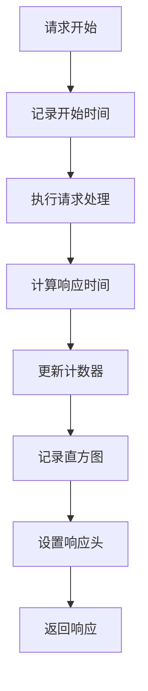
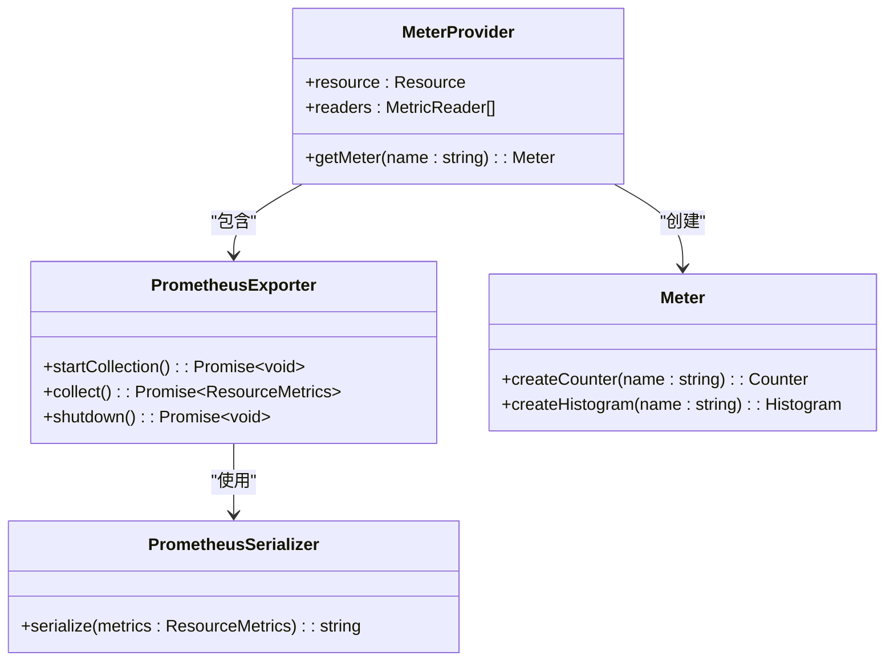
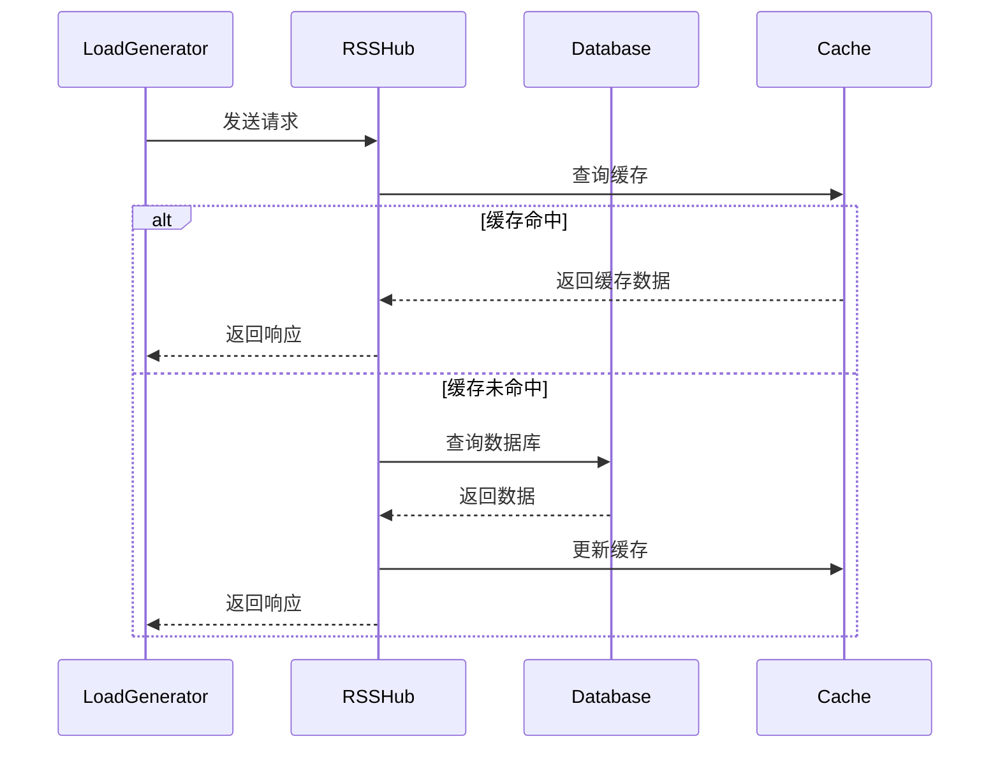
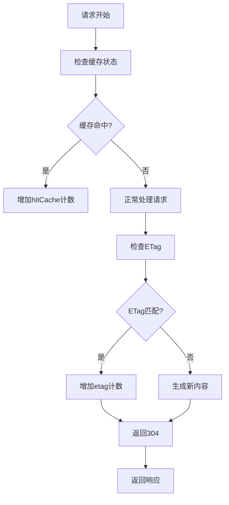

# 性能监控

<cite>
**本文档引用的文件**
- [metric.ts](file://lib/utils/otel/metric.ts)
- [config.ts](file://lib/config.ts)
- [metrics.ts](file://lib/routes/metrics.ts)
- [logger.ts](file://lib/middleware/logger.ts)
- [debug.ts](file://lib/middleware/debug.ts)
- [debug-info.ts](file://lib/utils/debug-info.ts)
- [index.tsx](file://lib/views/index.tsx)
</cite>

## 目录
1. [简介](#简介)
2. [指标采集系统架构](#指标采集系统架构)
3. [Prometheus指标配置](#prometheus指标配置)
4. [关键性能指标说明](#关键性能指标说明)
5. [Grafana仪表板配置](#grafana仪表板配置)
6. [OpenTelemetry集成](#opentelemetry集成)
7. [自定义业务指标](#自定义业务指标)
8. [性能基准测试](#性能基准测试)
9. [缓存命中率监控](#缓存命中率监控)
10. [结论](#结论)

## 简介

RSSHub作为全球最大的RSS网络，需要完善的性能监控系统来确保服务的稳定性和可扩展性。本文档全面介绍RSSHub的指标采集系统，包括Prometheus指标收集、OpenTelemetry集成、Grafana可视化以及性能基准测试等关键内容。

RSSHub的性能监控系统基于OpenTelemetry SDK构建，通过Prometheus导出器暴露指标端点，实现了对HTTP请求、响应时间、缓存命中率等关键性能指标的全面监控。系统设计遵循云原生监控最佳实践，为运维人员提供了丰富的性能数据支持。

**Section sources**
- [README.md](file://README.md#L1-L62)

## 指标采集系统架构

RSSHub的性能监控系统采用分层架构设计，由指标采集、指标处理和指标暴露三个主要组件构成。系统基于OpenTelemetry SDK实现，确保了监控数据的标准性和可扩展性。

```mermaid
graph TD
A[应用代码] --> B[OpenTelemetry SDK]
B --> C[MeterProvider]
C --> D[PrometheusExporter]
D --> E[/metrics端点]
E --> F[Grafana]
F --> G[可视化仪表板]
H[配置系统] --> C
I[中间件] --> B
```

**Diagram sources**
- [metric.ts](file://lib/utils/otel/metric.ts#L1-L68)
- [config.ts](file://lib/config.ts#L774-L777)

**Section sources**
- [metric.ts](file://lib/utils/otel/metric.ts#L1-L68)
- [config.ts](file://lib/config.ts#L774-L777)

## Prometheus指标配置

RSSHub通过环境变量配置Prometheus指标收集行为，用户可以根据实际需求调整指标采集的粒度和范围。系统默认启用了HTTP请求计数器和响应时间直方图等关键指标。

### 环境变量配置

| 环境变量 | 默认值 | 说明 |
|---------|-------|------|
| OTEL_SECONDS_BUCKET | 0.01,0.1,1,2,5,15,30,60 | 秒级响应时间直方图的桶边界 |
| OTEL_MILLISECONDS_BUCKET | 10,20,50,100,250,500,1000,5000,15000 | 毫秒级响应时间直方图的桶边界 |
| DEBUG_INFO | true | 是否显示调试信息 |

### 配置示例

```yaml
# docker-compose.yml
environment:
  - OTEL_SECONDS_BUCKET=0.01,0.1,1,5,10,30,60
  - OTEL_MILLISECONDS_BUCKET=10,50,100,500,1000,5000
  - DEBUG_INFO=true
```

**Section sources**
- [config.ts](file://lib/config.ts#L774-L777)

## 关键性能指标说明

RSSHub暴露了多个关键性能指标，这些指标对于监控系统健康状况和性能优化至关重要。

### HTTP请求指标



**Diagram sources**
- [logger.ts](file://lib/middleware/logger.ts#L29-L43)

#### 请求计数器

- `rsshub_request_total`: 成功请求总数，按方法、路径和状态码维度划分
- `rsshub_request_error_total`: 错误请求总数，按方法、路径和状态码维度划分

#### 响应时间直方图

- `rsshub_request_duration_seconds_bucket`: 秒级响应时间直方图
- `rsshub_request_duration_milliseconds_bucket`: 毫秒级响应时间直方图

**Section sources**
- [metric.ts](file://lib/utils/otel/metric.ts#L34-L45)
- [logger.ts](file://lib/middleware/logger.ts#L42)

## Grafana仪表板配置

RSSHub的指标可以通过Grafana进行可视化，为运维人员提供直观的性能监控视图。

### 仪表板配置示例

```json
{
  "panels": [
    {
      "title": "请求速率",
      "type": "graph",
      "targets": [
        {
          "expr": "rate(rsshub_request_total[5m])",
          "legendFormat": "{{method}} {{path}}"
        }
      ]
    },
    {
      "title": "P95响应时间",
      "type": "graph",
      "targets": [
        {
          "expr": "histogram_quantile(0.95, sum(rate(rsshub_request_duration_milliseconds_bucket[5m])) by (le, method, path))",
          "legendFormat": "{{method}} {{path}}"
        }
      ]
    },
    {
      "title": "错误率",
      "type": "graph",
      "targets": [
        {
          "expr": "rate(rsshub_request_error_total[5m]) / rate(rsshub_request_total[5m])",
          "legendFormat": "{{method}} {{path}}"
        }
      ]
    }
  ]
}
```

### 重要可视化指标

1. **请求速率**: 监控每分钟的请求数量，识别流量高峰
2. **P95/P99响应时间**: 了解大多数用户的实际体验
3. **错误率**: 及时发现服务异常
4. **缓存命中率**: 评估缓存策略的有效性

**Section sources**
- [metric.ts](file://lib/utils/otel/metric.ts#L34-L45)

## OpenTelemetry集成

RSSHub通过OpenTelemetry SDK实现了标准化的指标采集，确保了监控数据的兼容性和可扩展性。

### SDK初始化



**Diagram sources**
- [metric.ts](file://lib/utils/otel/metric.ts#L23-L32)

### 集成流程

1. 创建`MeterProvider`实例
2. 配置`PrometheusExporter`作为指标读取器
3. 获取`Meter`实例用于创建指标
4. 在应用代码中记录指标数据
5. 通过`/metrics`端点暴露指标

**Section sources**
- [metric.ts](file://lib/utils/otel/metric.ts#L23-L32)

## 自定义业务指标

除了系统内置的性能指标，RSSHub还支持自定义业务指标的上报，满足特定的监控需求。

### 自定义指标实现

```typescript
// 示例：自定义业务指标
const businessMetric = meter.createCounter('rsshub_business_event_total', {
    description: 'Business event counter'
});

// 上报业务事件
businessMetric.add(1, {
    eventType: 'user_subscription',
    userId: '12345'
});
```

### 最佳实践

1. 使用有意义的指标名称前缀
2. 合理选择指标类型（计数器、直方图、仪表等）
3. 避免过度使用标签维度，防止指标爆炸
4. 为指标添加清晰的描述信息

**Section sources**
- [metric.ts](file://lib/utils/otel/metric.ts#L34-L56)

## 性能基准测试

为了评估系统容量和识别性能瓶颈，建议进行定期的性能基准测试。

### 测试方法



**Diagram sources**
- [logger.ts](file://lib/middleware/logger.ts#L29-L43)
- [debug.ts](file://lib/middleware/debug.ts#L6-L37)

### 测试指标

- **吞吐量**: 每秒处理的请求数（RPS）
- **响应时间**: P50、P95、P99百分位
- **资源利用率**: CPU、内存、网络使用率
- **错误率**: 失败请求占总请求的比例

### 测试工具推荐

- **k6**: 现代化负载测试工具，支持脚本化测试
- **wrk**: 高性能HTTP基准测试工具
- **JMeter**: 功能全面的性能测试平台

**Section sources**
- [logger.ts](file://lib/middleware/logger.ts#L29-L43)
- [debug.ts](file://lib/middleware/debug.ts#L6-L37)

## 缓存命中率监控

缓存是RSSHub性能优化的关键组件，监控缓存命中率对于评估系统性能至关重要。

### 缓存命中率计算

```typescript
// 缓存命中率 = 缓存命中次数 / 总请求数
const cacheHitRatio = debug.hitCache / debug.request;
```

### 相关指标

- `hitCache`: 缓存命中次数
- `request`: 总请求数
- `etag`: ETag匹配次数

### 监控实现



**Diagram sources**
- [debug.ts](file://lib/middleware/debug.ts#L29-L35)
- [debug-info.ts](file://lib/utils/debug-info.ts#L1-L24)

**Section sources**
- [debug.ts](file://lib/middleware/debug.ts#L29-L35)
- [debug-info.ts](file://lib/utils/debug-info.ts#L1-L24)

## 结论

RSSHub的性能监控系统为运维人员提供了全面的性能数据支持，通过Prometheus指标采集、OpenTelemetry集成和Grafana可视化，可以有效监控系统健康状况，识别性能瓶颈，并进行容量规划。

建议用户根据实际需求配置合适的指标采集策略，定期进行性能基准测试，并利用Grafana仪表板进行持续监控，确保RSSHub服务的稳定性和高性能。

**Section sources**
- [metric.ts](file://lib/utils/otel/metric.ts#L1-L68)
- [config.ts](file://lib/config.ts#L774-L777)
- [metrics.ts](file://lib/routes/metrics.ts#L1-L13)