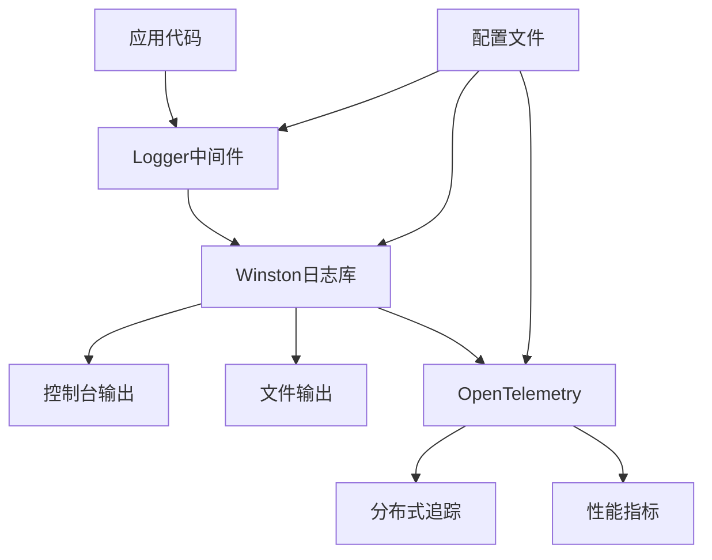
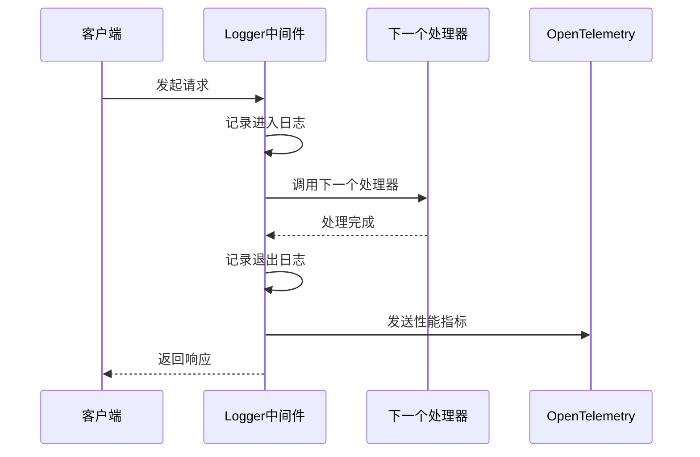
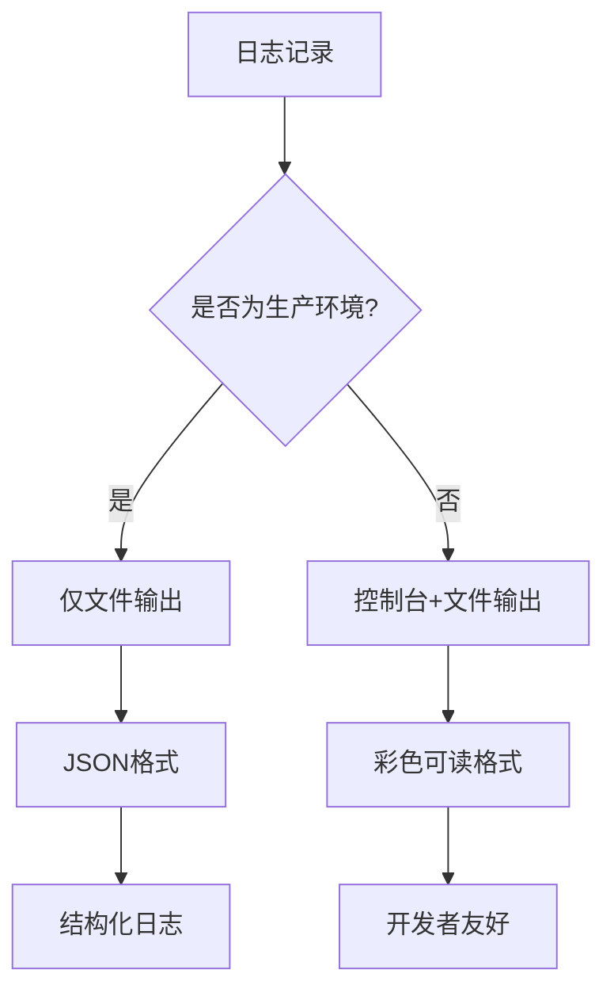
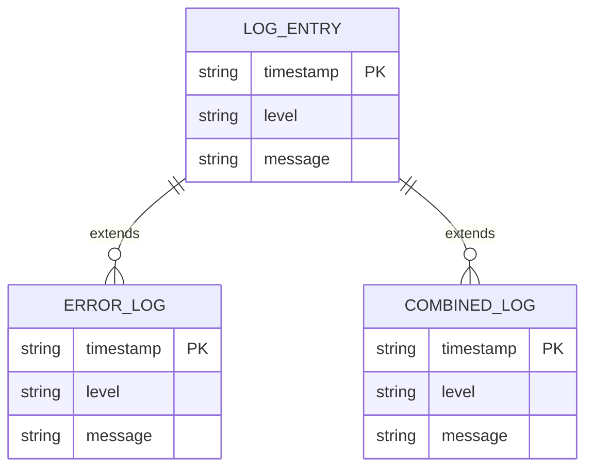
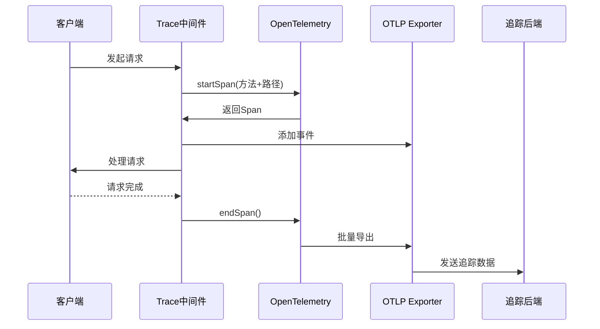
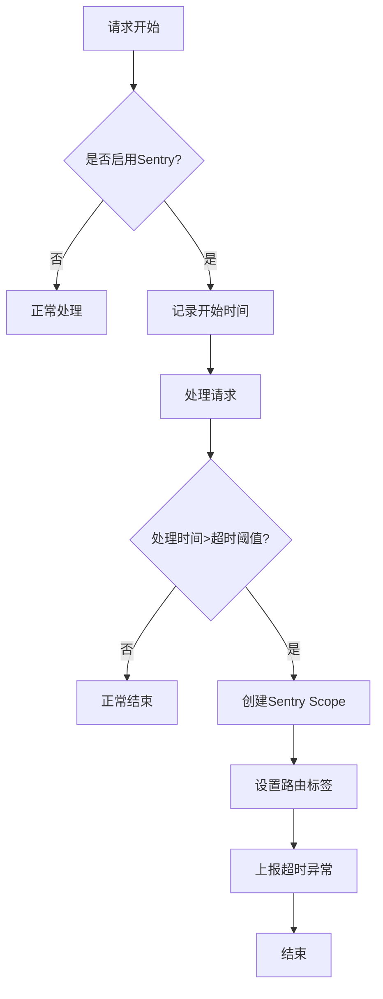

# 日志管理

<cite>
**本文档引用的文件**   
- [logger.ts](file://lib/middleware/logger.ts)
- [config.ts](file://lib/config.ts)
- [logger.ts](file://lib/utils/logger.ts)
- [trace.ts](file://lib/utils/otel/trace.ts)
- [metric.ts](file://lib/utils/otel/metric.ts)
- [sentry.ts](file://lib/middleware/sentry.ts)
</cite>

## 目录
1. [简介](#简介)
2. [日志系统架构](#日志系统架构)
3. [Logger中间件实现原理](#logger中间件实现原理)
4. [日志级别控制与格式化](#日志级别控制与格式化)
5. [结构化日志输出配置](#结构化日志输出配置)
6. [日志轮转与归档最佳实践](#日志轮转与归档最佳实践)
7. [敏感信息过滤配置](#敏感信息过滤配置)
8. [自定义日志处理器开发](#自定义日志处理器开发)
9. [分布式追踪上下文注入](#分布式追踪上下文注入)
10. [错误追踪集成](#错误追踪集成)

## 简介
RSSHub的日志系统为应用程序提供了全面的监控和调试能力。本文档详细介绍了RSSHub的日志管理架构，包括日志记录、级别控制、格式化输出、异步写入机制以及与外部监控系统的集成。系统采用Winston作为核心日志库，结合OpenTelemetry实现分布式追踪，为开发者提供了完整的可观测性解决方案。

## 日志系统架构
RSSHub的日志系统采用分层架构设计，由多个组件协同工作。系统核心是Winston日志库，负责日志的收集、格式化和输出。日志系统与OpenTelemetry集成，实现了分布式追踪和性能监控功能。整个架构通过中间件模式集成到Hono框架中，确保所有请求都能被有效记录和监控。

**图表来源**
- [logger.ts](file://lib/middleware/logger.ts#L1-L45)
- [logger.ts](file://lib/utils/logger.ts#L1-L48)
- [trace.ts](file://lib/utils/otel/trace.ts#L1-L28)

**本节来源**
- [logger.ts](file://lib/middleware/logger.ts#L1-L45)
- [logger.ts](file://lib/utils/logger.ts#L1-L48)

## Logger中间件实现原理
Logger中间件是RSSHub日志系统的核心组件，负责记录所有HTTP请求的生命周期。中间件采用异步处理机制，在请求开始时记录进入日志，在请求完成后记录退出日志，同时计算响应时间。这种设计确保了日志记录不会阻塞主请求处理流程。

中间件通过Hono框架的中间件机制集成，位于请求处理管道的早期阶段。它使用Winston日志库进行日志输出，并与OpenTelemetry集成以收集性能指标。中间件还实现了彩色状态码显示功能，通过ANSI转义序列在控制台输出中为不同状态码添加颜色标识。

**图表来源**
- [logger.ts](file://lib/middleware/logger.ts#L1-L45)
- [metric.ts](file://lib/utils/otel/metric.ts#L1-L69)

**本节来源**
- [logger.ts](file://lib/middleware/logger.ts#L1-L45)

## 日志级别控制与格式化
RSSHub的日志级别控制通过环境变量`LOGGER_LEVEL`实现，支持标准的日志级别：error、warn、info、http、verbose、debug和silly。系统默认级别为"info"，可以通过配置文件或环境变量进行调整。日志格式化采用JSON格式输出到文件，同时在控制台提供彩色可读格式。

日志格式包含时间戳、日志级别和消息内容三个核心字段。时间戳格式为"YYYY-MM-DD HH:mm:ss.SSS"，确保日志的精确排序和分析。系统还支持通过`SHOW_LOGGER_TIMESTAMP`环境变量控制是否在控制台输出中显示时间戳，为不同环境提供灵活的显示选项。

**图表来源**
- [logger.ts](file://lib/utils/logger.ts#L1-L48)
- [config.ts](file://lib/config.ts#L770-L778)

**本节来源**
- [logger.ts](file://lib/utils/logger.ts#L1-L48)
- [config.ts](file://lib/config.ts#L770-L778)

## 结构化日志输出配置
RSSHub的结构化日志输出配置支持与ELK Stack或Loki等现代日志系统的无缝集成。系统默认将日志输出为JSON格式，包含时间戳、日志级别和消息内容等标准字段。这种结构化格式便于日志的解析、索引和查询，为大规模日志分析提供了基础。

配置结构化日志输出主要通过`config.ts`文件中的日志相关设置实现。`NO_LOGFILES`环境变量控制是否生成日志文件，`LOGGER_LEVEL`设置日志级别，而日志格式由Winston的format配置决定。系统将错误日志和综合日志分别输出到不同的文件，便于问题排查和日常监控。

**图表来源**
- [logger.ts](file://lib/utils/logger.ts#L1-L48)
- [config.ts](file://lib/config.ts#L770-L778)

**本节来源**
- [logger.ts](file://lib/utils/logger.ts#L1-L48)
- [config.ts](file://lib/config.ts#L770-L778)

## 日志轮转与归档最佳实践
RSSHub的日志轮转与归档机制通过文件系统和外部工具协同实现。系统默认将日志输出到`logs/`目录下的`error.log`和`combined.log`文件中。虽然RSSHub本身不直接实现日志轮转功能，但其设计与常见的日志轮转工具（如logrotate）完全兼容。

最佳实践建议配置外部日志轮转工具，定期对日志文件进行轮转、压缩和归档。可以设置按大小或时间进行轮转，例如每天轮转一次或当文件达到100MB时轮转。归档的日志文件应保留适当时间，既满足审计要求，又避免占用过多存储空间。对于云环境部署，建议将日志直接输出到云日志服务，利用其内置的轮转和归档功能。

**本节来源**
- [logger.ts](file://lib/utils/logger.ts#L1-L48)
- [config.ts](file://lib/config.ts#L770-L778)

## 敏感信息过滤配置
RSSHub通过多层机制实现敏感信息过滤。首先，系统通过环境变量配置管理敏感信息，避免硬编码在代码中。其次，日志系统设计时考虑了信息脱敏，例如在记录请求信息时不会包含完整的请求体或响应体。

对于特定的敏感信息，如认证令牌、API密钥等，系统通过配置文件中的专门字段进行管理，并在日志记录时进行过滤。开发者可以通过自定义日志处理器实现更精细的过滤策略，例如使用正则表达式匹配和替换敏感信息模式。此外，系统支持通过`DEBUG_INFO`环境变量控制调试信息的显示，避免在生产环境中暴露过多内部细节。

**本节来源**
- [config.ts](file://lib/config.ts#L770-L778)
- [logger.ts](file://lib/utils/logger.ts#L1-L48)

## 自定义日志处理器开发
RSSHub的自定义日志处理器开发基于Winston的传输（transport）机制。开发者可以创建新的传输类，将日志发送到第三方服务，如Slack、Discord或自定义的监控平台。自定义处理器需要实现Winston传输接口，定义日志写入逻辑。

开发自定义处理器时，建议继承`winston.Transport`类并重写`log`方法。处理器可以配置为异步执行，避免阻塞主日志流程。通过`logger.add()`方法可以将自定义处理器添加到日志实例中，实现多目的地日志输出。配置方面，建议通过环境变量或配置文件传递第三方服务的连接信息，确保配置的灵活性和安全性。

**本节来源**
- [logger.ts](file://lib/utils/logger.ts#L1-L48)
- [config.ts](file://lib/config.ts#L770-L778)

## 分布式追踪上下文注入
RSSHub的分布式追踪上下文注入机制基于OpenTelemetry实现。系统通过`trace.ts`文件配置OpenTelemetry Tracer Provider，创建全局追踪器实例。追踪功能在`trace`中间件中激活，该中间件在调试模式下为每个请求创建新的Span。

上下文注入通过`tracer.startSpan()`方法实现，为每个HTTP请求创建独立的追踪上下文。Span包含请求方法和路径作为名称，并记录请求处理过程中的关键事件。追踪数据通过OTLP HTTP Exporter发送到外部追踪后端，支持与Jaeger、Zipkin等系统的集成。这种机制使开发者能够关联跨服务的请求链路，分析系统性能瓶颈。

**图表来源**
- [trace.ts](file://lib/utils/otel/trace.ts#L1-L28)
- [trace.ts](file://lib/middleware/trace.ts#L1-L26)

**本节来源**
- [trace.ts](file://lib/utils/otel/trace.ts#L1-L28)
- [trace.ts](file://lib/middleware/trace.ts#L1-L26)

## 错误追踪集成
RSSHub通过Sentry中间件实现错误追踪集成。当配置了Sentry DSN时，系统会初始化Sentry客户端并设置节点名称标签。Sentry中间件监控请求处理时间，当超过配置的超时阈值（默认30秒）时，会自动上报超时异常。

错误追踪机制不仅捕获超时错误，还通过Sentry的全局错误处理能力捕获未处理的异常。系统在初始化时记录"Sentry inited"日志，确认错误追踪已正确配置。这种集成提供了错误的堆栈跟踪、发生环境和频率统计，帮助开发者快速定位和修复问题。

**图表来源**
- [sentry.ts](file://lib/middleware/sentry.ts#L1-L28)
- [config.ts](file://lib/config.ts#L779-L782)

**本节来源**
- [sentry.ts](file://lib/middleware/sentry.ts#L1-L28)
- [config.ts](file://lib/config.ts#L779-L782)