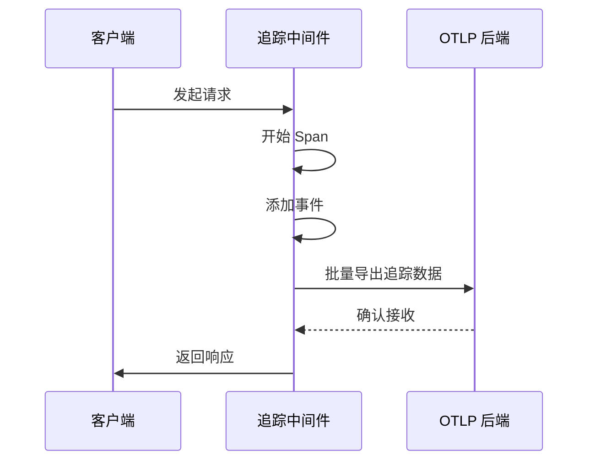

# 监控与告警

<cite>
**本文档中引用的文件**  
- [logger.ts](file://lib/middleware/logger.ts)
- [sentry.ts](file://lib/middleware/sentry.ts)
- [trace.ts](file://lib/middleware/trace.ts)
- [metric.ts](file://lib/utils/otel/metric.ts)
- [config.ts](file://lib/config.ts)
- [metrics.ts](file://lib/routes/metrics.ts)
- [healthz.ts](file://lib/routes/healthz.ts)
- [docker-compose.yml](file://docker-compose.yml)
</cite>

## 目录
1. [简介](#简介)
2. [日志收集系统配置](#日志收集系统配置)
3. [性能监控与可视化](#性能监控与可视化)
4. [告警规则配置](#告警规则配置)
5. [分布式追踪系统集成](#分布式追踪系统集成)
6. [健康检查与监控脚本](#健康检查与监控脚本)

## 简介
RSSHub 是一个开源的 RSS 聚合服务，支持从多种来源生成 RSS 订阅源。为了确保系统的稳定性和可维护性，RSSHub 集成了完整的监控与告警体系，涵盖日志记录、性能指标采集、分布式追踪和健康检查等功能。本文档详细说明如何配置和使用这些监控功能。

## 日志收集系统配置

RSSHub 使用内置的日志中间件进行结构化日志输出，支持多种日志级别和格式化选项。日志系统可通过环境变量进行灵活配置，适用于 ELK Stack 或 Loki 等主流日志收集平台。

### 日志格式与级别设置
日志中间件位于 `lib/middleware/logger.ts`，采用彩色输出格式，包含请求方法、路径、状态码和响应时间。日志级别由 `LOGGER_LEVEL` 环境变量控制，默认为 `info` 级别。

日志输出示例如下：
```
<-- GET /bilibili/user/video/123456
--> GET /bilibili/user/video/123456 200 123ms
```

### 结构化日志输出
通过设置 `SHOW_LOGGER_TIMESTAMP=true` 可在日志中显示时间戳，便于与外部日志系统对齐。日志内容包含完整的请求生命周期信息，适合导入 Elasticsearch 或 Loki 进行分析。

**Section sources**
- [logger.ts](file://lib/middleware/logger.ts#L1-L46)
- [config.ts](file://lib/config.ts#L293-L296)

## 性能监控与可视化

RSSHub 集成了 OpenTelemetry 指标系统，支持 Prometheus 格式的性能指标暴露，可用于 Grafana 可视化展示。

### 指标采集配置
性能指标由 `lib/utils/otel/metric.ts` 实现，主要采集以下关键指标：
- 请求总数 (`rsshub_request_total`)
- 错误请求总数 (`rsshub_request_error_total`)
- 请求延迟分布（毫秒和秒级直方图）

指标采集间隔和桶边界可通过 `OTEL_MILLISECONDS_BUCKET` 和 `OTEL_SECONDS_BUCKET` 环境变量自定义。

### 指标端点暴露
当 `DEBUG_INFO` 环境变量启用时，系统会暴露 `/metrics` 端点（由 `lib/routes/metrics.ts` 实现），返回 Prometheus 格式的指标数据。

Prometheus 配置示例：
```yaml
scrape_configs:
  - job_name: 'rsshub'
    static_configs:
      - targets: ['localhost:1200']
```

**Section sources**
- [metric.ts](file://lib/utils/otel/metric.ts#L1-L69)
- [metrics.ts](file://lib/routes/metrics.ts#L1-L14)
- [config.ts](file://lib/config.ts#L297-L299)

## 告警规则配置

RSSHub 支持通过 Sentry 实现错误追踪和告警通知，同时可通过 Prometheus 配置外部告警规则。

### Sentry 集成
在 `lib/middleware/sentry.ts` 中实现了 Sentry 中间件，当请求处理时间超过阈值时自动上报异常。配置参数包括：
- `SENTRY_DSN`: Sentry 项目 DSN
- `SENTRY_ROUTE_TIMEOUT`: 路由超时阈值（毫秒）

Sentry 会自动捕获超时请求并生成告警，支持邮件、Slack 等通知渠道。

### Prometheus 告警规则
建议配置以下告警规则：
```yaml
groups:
  - name: rsshub-alerts
    rules:
      - alert: HighErrorRate
        expr: rate(rsshub_request_error_total[5m]) > 0.1
        for: 10m
        labels:
          severity: warning
        annotations:
          summary: "高错误率"
          description: "RSSHub 错误请求率超过 10%"

      - alert: HighLatency
        expr: histogram_quantile(0.95, sum(rate(rsshub_request_duration_seconds_bucket[5m])) by (le)) > 5
        for: 10m
        labels:
          severity: warning
        annotations:
          summary: "高延迟"
          description: "RSSHub 95% 请求延迟超过 5 秒"
```

**Section sources**
- [sentry.ts](file://lib/middleware/sentry.ts#L1-L29)
- [config.ts](file://lib/config.ts#L301-L304)

## 分布式追踪系统集成

RSSHub 支持 OpenTelemetry 分布式追踪，帮助诊断性能瓶颈和请求链路问题。

### 追踪配置
追踪功能由 `lib/middleware/trace.ts` 实现，仅在 `DEBUG_INFO` 启用时激活。系统使用 OpenTelemetry SDK 将追踪数据导出到 OTLP 兼容的后端（如 Jaeger 或 Zipkin）。

关键配置参数：
- `OTEL_EXPORTER_OTLP_ENDPOINT`: OTLP 导出端点
- `DEBUG_INFO`: 启用调试模式以激活追踪

### 追踪数据结构
每个请求创建一个 span，包含以下属性：
- 操作名称：`HTTP 方法 + 路径`
- 属性：空
- 事件：`invoking handleRequest`

批量处理器每 30 秒发送一次数据，最大队列大小为 4096。



**Diagram sources**
- [trace.ts](file://lib/middleware/trace.ts#L1-L27)
- [config.ts](file://lib/config.ts#L293-L294)

**Section sources**
- [trace.ts](file://lib/middleware/trace.ts#L1-L27)
- [config.ts](file://lib/config.ts#L293-L294)

## 健康检查与监控脚本

RSSHub 提供了标准的健康检查端点和容器化部署支持，便于集成到各种监控系统中。

### 健康检查端点
系统暴露 `/healthz` 端点（由 `lib/routes/healthz.ts` 实现），返回简单的 "ok" 响应。该端点被配置为 Docker 容器的健康检查探针。

Docker Compose 配置示例：
```yaml
healthcheck:
    test: ['CMD', 'curl', '-f', 'http://localhost:1200/healthz']
    interval: 30s
    timeout: 10s
    retries: 3
```

### 监控脚本示例
以下是一个简单的健康检查脚本示例：

```bash
#!/bin/bash
HEALTH_CHECK_URL="http://localhost:1200/healthz"
RESPONSE=$(curl -s -o /dev/null -w "%{http_code}" $HEALTH_CHECK_URL)

if [ $RESPONSE -eq 200 ]; then
    echo "RSSHub 健康检查通过"
    exit 0
else
    echo "RSSHub 健康检查失败: HTTP $RESPONSE"
    exit 1
fi
```

**Section sources**
- [healthz.ts](file://lib/routes/healthz.ts)
- [docker-compose.yml](file://docker-compose.yml#L16-L21)