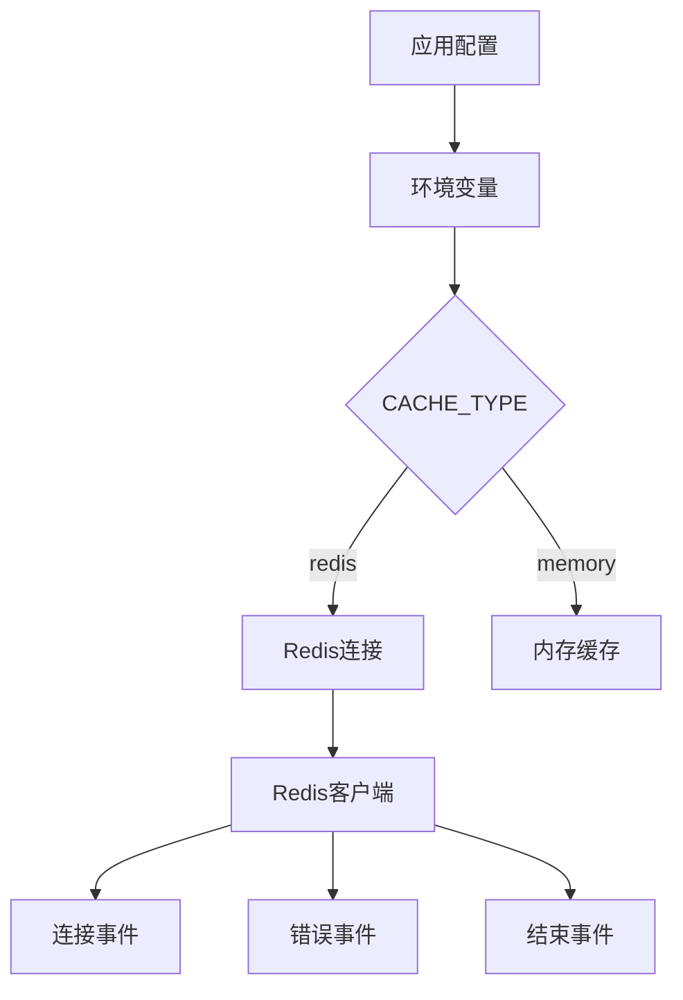
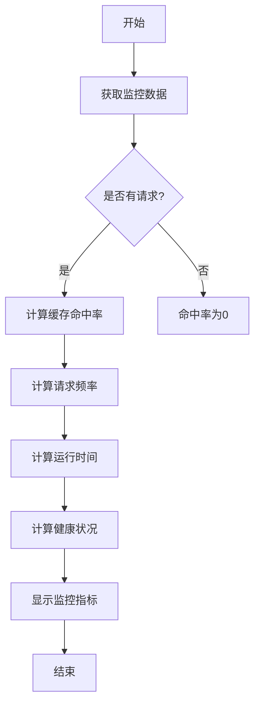
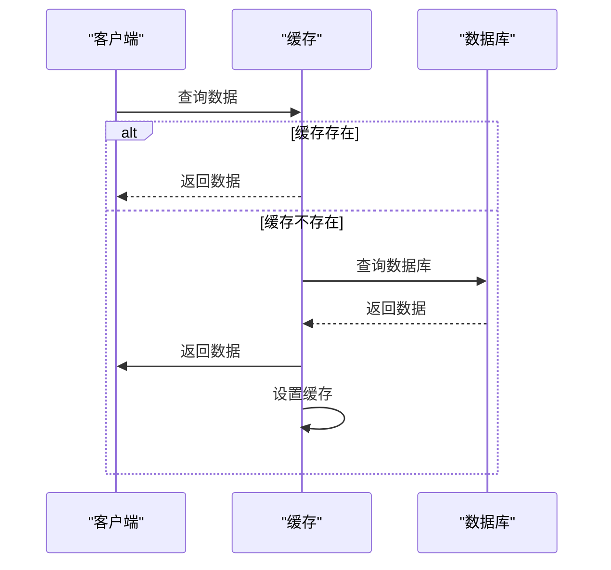

# 数据持久化

<cite>
**本文档引用的文件**   
- [config.ts](file://lib/config.ts)
- [redis.ts](file://lib/utils/cache/redis.ts)
- [index.ts](file://lib/utils/cache/index.ts)
- [base.ts](file://lib/utils/cache/base.ts)
- [memory.ts](file://lib/utils/cache/memory.ts)
- [rsshub.env](file://scripts/ansible/rsshub.env)
- [flake.nix](file://flake.nix)
</cite>

## 目录
1. [引言](#引言)
2. [Redis配置与管理](#redis配置与管理)
3. [持久化策略](#持久化策略)
4. [监控与性能指标](#监控与性能指标)
5. [集群扩展与维护](#集群扩展与维护)
6. [缓存问题解决方案](#缓存问题解决方案)
7. [结论](#结论)

## 引言

RSSHub 是一个全球最大的 RSS 网络，通过缓存机制提高内容聚合的效率。本项目支持多种缓存类型，包括内存缓存和 Redis 缓存，其中 Redis 提供了更强大的数据持久化和高可用性功能。本文档重点介绍 RSSHub 中 Redis 缓存的配置和管理方案，包括主从复制、哨兵模式、集群模式的配置方法，以及如何通过 RDB 和 AOF 实现数据持久化。

**Section sources**
- [README.md](file://README.md#L1-L62)

## Redis配置与管理

RSSHub 支持通过环境变量配置 Redis 缓存，主要配置项包括 `CACHE_TYPE` 和 `REDIS_URL`。当 `CACHE_TYPE` 设置为 `redis` 时，系统将使用 Redis 作为缓存后端。默认情况下，Redis 连接地址为 `redis://localhost:6379/`，可通过 `REDIS_URL` 环境变量进行自定义。

在 Ansible 部署配置中，可以通过 `rsshub.env` 文件设置 Redis 相关参数。Nix 配置文件 `flake.nix` 也提供了 Redis 的启用选项和本地实例创建功能，简化了部署流程。

Redis 客户端通过 ioredis 库实现连接管理，包含连接、错误和结束事件的监听。当连接成功时，系统会记录日志并标记缓存可用；当发生错误或连接中断时，系统会标记缓存不可用，确保应用程序的稳定性。



**Diagram sources **
- [config.ts](file://lib/config.ts#L243-L768)
- [redis.ts](file://lib/utils/cache/redis.ts#L21-L35)
- [rsshub.env](file://scripts/ansible/rsshub.env#L1-L4)
- [flake.nix](file://flake.nix#L152-L227)

**Section sources**
- [config.ts](file://lib/config.ts#L243-L768)
- [redis.ts](file://lib/utils/cache/redis.ts#L21-L35)
- [rsshub.env](file://scripts/ansible/rsshub.env#L1-L4)
- [flake.nix](file://flake.nix#L152-L227)

## 持久化策略

RSSHub 的 Redis 缓存支持两种持久化策略：RDB（快照）和 AOF（追加文件）。RDB 通过定期生成数据快照实现持久化，适合备份和灾难恢复；AOF 则记录每个写操作，提供更高的数据安全性。

在配置中，`CACHE_CONTENT_EXPIRE` 参数控制不变内容的缓存过期时间，默认为 1 小时。对于非默认的缓存过期时间，系统会专门存储 TTL（Time To Live）值，确保缓存策略的灵活性。

```mermaid
classDiagram
class RedisConfig {
+string type
+number requestTimeout
+number routeExpire
+number contentExpire
}
class RedisClient {
+Redis redisClient
+boolean available
+init() void
+get(key, refresh) Promise~string~
+set(key, value, maxAge) void
}
class CacheModule {
+init() void
+get(key, refresh) Promise~string~ | string | null
+set(key, value, maxAge) any
+status { available : boolean }
+clients { redisClient? : Redis, memoryCache? : LRUCache }
}
RedisConfig --> RedisClient : "配置"
RedisClient --> CacheModule : "实现"
```

**Diagram sources **
- [config.ts](file://lib/config.ts#L263-L268)
- [redis.ts](file://lib/utils/cache/redis.ts#L57-L73)
- [base.ts](file://lib/utils/cache/base.ts#L4-L15)

**Section sources**
- [config.ts](file://lib/config.ts#L263-L268)
- [redis.ts](file://lib/utils/cache/redis.ts#L57-L73)
- [base.ts](file://lib/utils/cache/base.ts#L4-L15)

## 监控与性能指标

RSSHub 提供了详细的缓存监控功能，包括缓存命中率、请求频率、运行时间等指标。这些指标可以通过调试页面查看，帮助开发者了解系统的运行状况。

缓存命中率是衡量缓存效果的重要指标，计算公式为命中次数除以总请求数。高命中率表明缓存策略有效，能够显著减少数据库查询压力。同时，系统还监控 ETag 匹配率和健康状况，确保服务的稳定性和可靠性。



**Diagram sources **
- [index.tsx](file://lib/views/index.tsx#L60-L95)
- [index.js](file://lib/routes-deprecated/index.js#L51-L98)

**Section sources**
- [index.tsx](file://lib/views/index.tsx#L60-L95)
- [index.js](file://lib/routes-deprecated/index.js#L51-L98)

## 集群扩展与维护

RSSHub 支持通过环境变量 `ENABLE_CLUSTER` 启用集群模式，提高系统的可扩展性和容错能力。在集群模式下，多个节点可以共享缓存数据，实现负载均衡和高可用性。

节点的添加和删除可以通过配置管理工具（如 Ansible 或 Nix）实现自动化。故障恢复机制依赖于 Redis 的主从复制和哨兵模式，当主节点发生故障时，哨兵会自动选举新的主节点，确保服务的连续性。

**Section sources**
- [config.ts](file://lib/config.ts#L246-L247)

## 缓存问题解决方案

### 缓存穿透

缓存穿透是指查询不存在的数据，导致每次请求都穿透到数据库。解决方案包括使用布隆过滤器或缓存空值，避免对不存在的数据进行频繁查询。

### 缓存雪崩

缓存雪崩是指大量缓存同时失效，导致数据库压力骤增。解决方案包括设置不同的缓存过期时间、使用分布式锁或预热缓存，分散缓存失效的时间点。

### 缓存击穿

缓存击穿是指热点数据在缓存失效的瞬间，大量请求同时访问数据库。解决方案包括使用互斥锁或永不过期策略，确保热点数据在失效时能够平滑过渡。



**Diagram sources **
- [redis.ts](file://lib/utils/cache/redis.ts#L36-L56)
- [index.ts](file://lib/utils/cache/index.ts#L75-L97)

**Section sources**
- [redis.ts](file://lib/utils/cache/redis.ts#L36-L56)
- [index.ts](file://lib/utils/cache/index.ts#L75-L97)

## 结论

RSSHub 通过灵活的缓存配置和管理机制，实现了高效的数据持久化和高可用性。Redis 作为主要的缓存后端，提供了丰富的功能和可靠的性能保障。通过合理的持久化策略、监控机制和问题解决方案，可以确保系统的稳定运行，满足大规模 RSS 网络的需求。