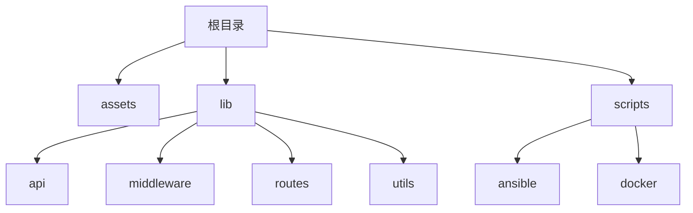
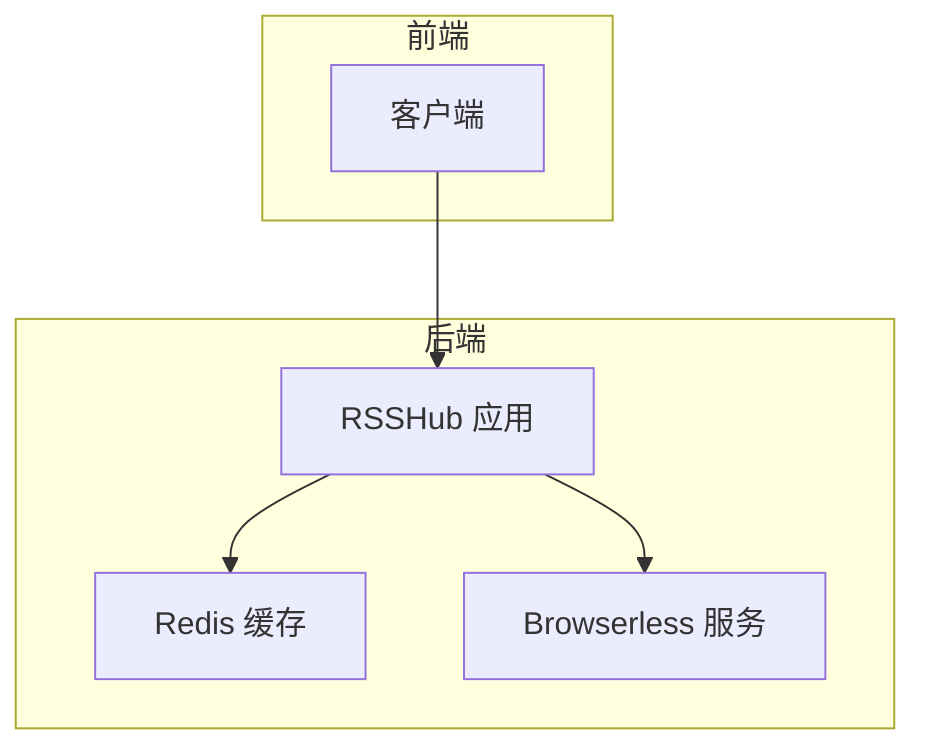
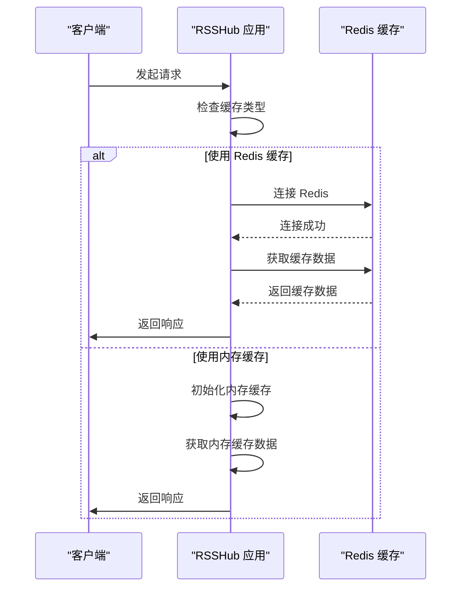
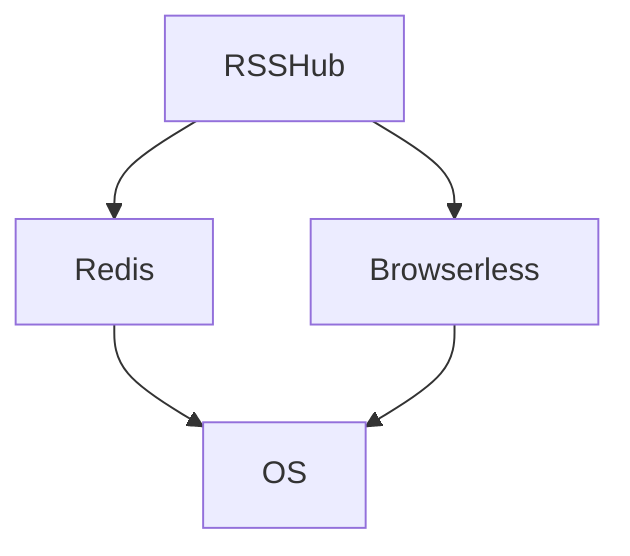

# 灾难恢复

<cite>
**本文档引用的文件**
- [config.ts](file://lib/config.ts)
- [redis.ts](file://lib/utils/cache/redis.ts)
- [docker-compose.yml](file://docker-compose.yml)
- [rsshub.yaml](file://scripts/ansible/rsshub.yaml)
- [rsshub.env](file://scripts/ansible/rsshub.env)
</cite>

## 目录
1. [引言](#引言)
2. [项目结构](#项目结构)
3. [核心组件](#核心组件)
4. [架构概述](#架构概述)
5. [详细组件分析](#详细组件分析)
6. [依赖分析](#依赖分析)
7. [性能考虑](#性能考虑)
8. [故障排除指南](#故障排除指南)
9. [结论](#结论)
10. [附录](#附录)（如有必要）

## 引言
RSSHub 是全球最大的 RSS 网络，由超过 5,000 个全球实例组成。本灾难恢复计划文档旨在为 RSSHub 提供完整的数据备份与恢复策略，确保系统在遭遇灾难性事件时能够快速恢复并保持数据完整性。文档涵盖了配置文件的版本控制和备份方案、缓存数据的备份方法、持久化存储的备份策略、灾难恢复的实施步骤、容灾演练的实施方法以及故障转移机制的设计。

## 项目结构
RSSHub 项目采用模块化设计，主要包含以下目录结构：
- `assets/`：静态资源文件
- `lib/`：核心代码库，包含 API、中间件、路由、工具等
- `scripts/`：部署和运维脚本
- 根目录包含各种配置文件，如 Docker、Ansible 等



**Diagram sources**
- [docker-compose.yml](file://docker-compose.yml#L1-L63)
- [rsshub.yaml](file://scripts/ansible/rsshub.yaml#L1-L111)

**Section sources**
- [README.md](file://README.md#L1-L62)
- [project_structure](file://project_structure#L1-L100)

## 核心组件
RSSHub 的核心组件包括配置系统、缓存系统、路由系统和中间件系统。配置系统通过 `config.ts` 文件集中管理所有环境变量和配置项。缓存系统支持内存和 Redis 两种模式，通过 `utils/cache` 模块实现。路由系统基于 Hono 框架，通过 `routes` 目录下的模块化设计实现。中间件系统提供请求处理、日志记录、错误处理等功能。

**Section sources**
- [config.ts](file://lib/config.ts#L1-L1188)
- [cache.ts](file://lib/utils/cache/index.ts#L1-L60)

## 架构概述
RSSHub 采用微服务架构，通过 Docker 容器化部署，主要组件包括 RSSHub 应用、Redis 缓存和浏览器服务。应用通过环境变量进行配置，支持集群部署。缓存系统作为核心组件，提供高性能的数据访问能力。系统通过 Ansible 实现自动化部署和配置管理。



**Diagram sources**
- [docker-compose.yml](file://docker-compose.yml#L1-L63)
- [rsshub.yaml](file://scripts/ansible/rsshub.yaml#L1-L111)

## 详细组件分析

### 配置系统分析
RSSHub 的配置系统通过 `config.ts` 文件实现，采用环境变量注入的方式，支持多种配置项的动态加载。配置项分为应用配置、网络配置、缓存配置、代理配置、访问控制、日志、Feed 配置和 OpenAI 配置等类别。

```mermaid
classDiagram
class Config {
+disallowRobot : boolean
+enableCluster? : string
+isPackage : boolean
+connect : { port : number }
+listenInaddrAny : boolean
+requestRetry : number
+requestTimeout : number
+ua : string
+cache : { type : string, requestTimeout : number, routeExpire : number, contentExpire : number }
+memory : { max : number }
+redis : { url : string }
+proxyUri? : string
+proxyUris? : string[]
+proxy : { protocol? : string, host? : string, port? : string, auth? : string, url_regex : string, strategy : 'on_retry' | 'all', failoverTimeout? : number, healthCheckInterval? : number }
+pacUri? : string
+pacScript? : string
+accessKey? : string
+debugInfo : string
+loggerLevel : string
+noLogfiles? : boolean
+sentry : { dsn? : string, routeTimeout : number }
+enableRemoteDebugging? : boolean
+hotlink : { template? : string, includePaths? : string[], excludePaths? : string[] }
+feature : { allow_user_hotlink_template : boolean, filter_regex_engine : string, allow_user_supply_unsafe_domain : boolean, disable_nsfw : boolean }
+suffix? : string
+titleLengthLimit : number
+openai : { apiKey? : string, model? : string, temperature? : number, maxTokens? : number, endpoint : string, inputOption : string, promptTitle : string, promptDescription : string }
+follow : { ownerUserId? : string, description? : string, price? : number, userLimit? : number }
}
```

**Diagram sources**
- [config.ts](file://lib/config.ts#L1-L1188)

**Section sources**
- [config.ts](file://lib/config.ts#L1-L1188)

### 缓存系统分析
RSSHub 的缓存系统支持内存和 Redis 两种模式，通过 `utils/cache` 模块实现。Redis 缓存通过 `redis.ts` 文件配置，支持连接状态监控和错误处理。



**Diagram sources**
- [redis.ts](file://lib/utils/cache/redis.ts#L1-L77)
- [cache.ts](file://lib/utils/cache/index.ts#L1-L60)

**Section sources**
- [redis.ts](file://lib/utils/cache/redis.ts#L1-L77)
- [cache.ts](file://lib/utils/cache/index.ts#L1-L60)

## 依赖分析
RSSHub 的主要依赖包括 Redis 缓存、Browserless 浏览器服务和各种第三方 API。通过 `docker-compose.yml` 文件定义了服务间的依赖关系，确保服务按正确顺序启动。



**Diagram sources**
- [docker-compose.yml](file://docker-compose.yml#L1-L63)

**Section sources**
- [docker-compose.yml](file://docker-compose.yml#L1-L63)

## 性能考虑
RSSHub 的性能主要受缓存策略、请求重试机制和并发处理能力的影响。通过合理配置缓存过期时间和内存限制，可以有效提升系统性能。使用 Redis 缓存可以显著提高数据访问速度，但需要确保 Redis 服务的高可用性。

## 故障排除指南
当 RSSHub 遇到问题时，首先检查日志文件和健康检查端点。对于缓存相关问题，检查 Redis 服务状态和连接配置。对于路由问题，检查配置文件和环境变量设置。

**Section sources**
- [config.ts](file://lib/config.ts#L1-L1188)
- [docker-compose.yml](file://docker-compose.yml#L1-L63)

## 结论
RSSHub 的灾难恢复计划通过完善的配置管理、缓存策略和部署方案，确保了系统的高可用性和数据安全性。通过定期进行容灾演练和监控系统状态，可以及时发现和解决潜在问题，保障服务的稳定运行。

## 附录
### 配置文件示例
```env
# rsshub.env 示例
CACHE_TYPE=redis
REDIS_URL=redis://redis:6379/
PUPPETEER_WS_ENDPOINT=ws://browserless:3000
```

**Section sources**
- [rsshub.env](file://scripts/ansible/rsshub.env#L1-L10)