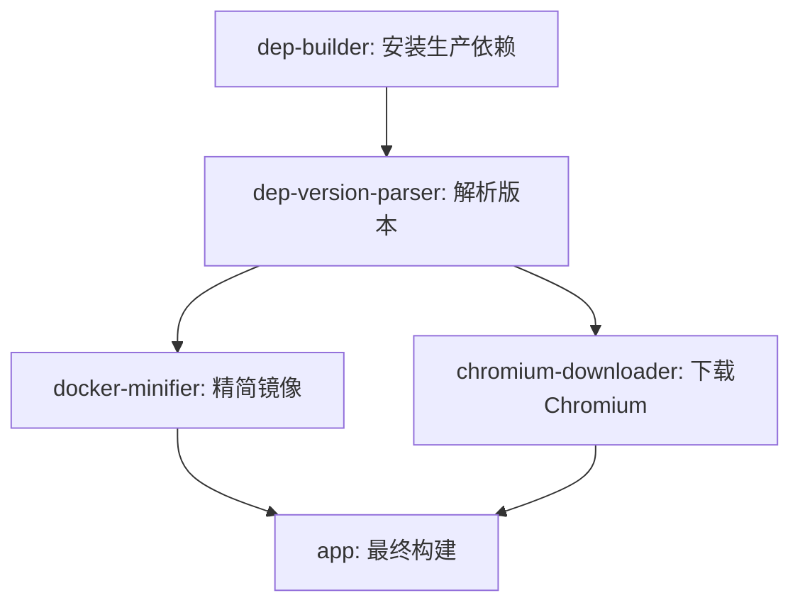
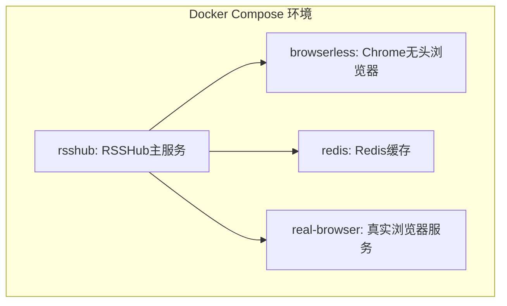
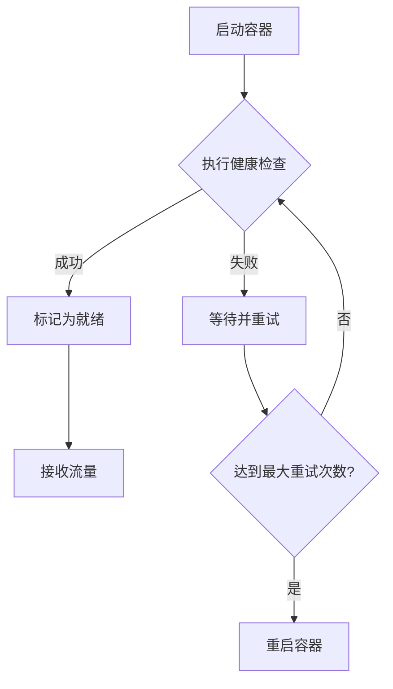
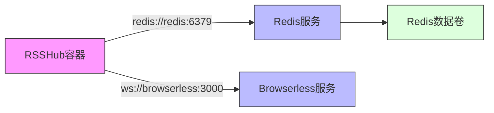

# 集群部署

<cite>
**本文档中引用的文件**  
- [Dockerfile](file://Dockerfile)
- [docker-compose.yml](file://docker-compose.yml)
- [README.md](file://README.md)
- [lib/routes/healthz.ts](file://lib/routes/healthz.ts)
- [lib/registry.ts](file://lib/registry.ts)
- [scripts/docker/minify-docker.js](file://scripts/docker/minify-docker.js)
- [fly.toml](file://fly.toml)
</cite>

## 目录
1. [简介](#简介)
2. [Docker镜像构建最佳实践](#docker镜像构建最佳实践)
3. [Docker Compose配置详解](#docker-compose配置详解)
4. [Kubernetes部署配置](#kubernetes部署配置)
5. [健康检查与就绪探针](#健康检查与就绪探针)
6. [服务发现与网络配置](#服务发现与网络配置)
7. [滚动更新策略](#滚动更新策略)
8. [资源限制与请求配置](#资源限制与请求配置)
9. [总结](#总结)

## 简介

RSSHub 是一个开源、易于使用且可扩展的 RSS 聚合服务，支持从各种来源聚合内容。本文档详细说明如何使用 Docker 和 Kubernetes 实现 RSSHub 的容器化集群部署。涵盖 Docker 镜像构建、docker-compose.yml 配置、Kubernetes YAML 配置、健康检查、服务发现、滚动更新和资源管理等关键方面。

**Section sources**
- [README.md](file://README.md#L1-L62)

## Docker镜像构建最佳实践

RSSHub 的 Dockerfile 采用多阶段构建策略，优化镜像大小和构建效率。构建过程分为五个阶段：依赖构建、版本解析、镜像精简、Chromium 下载和最终应用构建。

第一阶段 `dep-builder` 使用完整的 Node.js 镜像安装生产依赖，避免构建时缺少编译工具。第二阶段 `dep-version-parser` 从 package.json 提取关键依赖版本，减少缓存失效范围。第三阶段 `docker-minifier` 使用 `@vercel/nft` 分析实际需要的文件，进一步减小镜像体积。第四阶段 `chromium-downloader` 专门处理 Chromium 浏览器的下载，提高构建并发性。最后阶段 `app` 整合所有组件，安装必要的系统依赖并构建最终镜像。

这种分阶段方法确保了构建缓存的最大化利用，特别是在 amd64 架构上自动下载并验证 Chromium 的完整性。



**Diagram sources**
- [Dockerfile](file://Dockerfile#L1-L207)

**Section sources**
- [Dockerfile](file://Dockerfile#L1-L207)
- [scripts/docker/minify-docker.js](file://scripts/docker/minify-docker.js#L1-L26)

## Docker Compose配置详解

docker-compose.yml 文件定义了 RSSHub 服务及其依赖组件，包括 Redis 缓存、browserless 浏览器服务和可选的真实浏览器服务。

主服务 `rsshub` 暴露 1200 端口，配置了 Redis 作为缓存后端，并通过环境变量 `PUPPETEER_WS_ENDPOINT` 连接到 browserless 服务。文件中明确标注了启用 Puppeteer 的两种方式：使用预捆绑 Chromium 的镜像或保留当前配置。

`browserless` 服务运行在独立容器中，配置了核心转储限制（ulimits）以提高稳定性。`redis` 服务使用 alpine 镜像并挂载命名卷 `redis-data` 实现数据持久化。

所有服务均配置了健康检查机制，确保容器在就绪前不会接收流量。例如，RSSHub 通过 `/healthz` 端点进行健康检查，该端点返回简单的 "ok" 响应。



**Diagram sources**
- [docker-compose.yml](file://docker-compose.yml#L1-L63)

**Section sources**
- [docker-compose.yml](file://docker-compose.yml#L1-L63)
- [lib/routes/healthz.ts](file://lib/routes/healthz.ts#L1-L9)

## Kubernetes部署配置

虽然项目未直接提供 Kubernetes 配置文件，但可以根据 Docker Compose 配置推导出等效的 Kubernetes 部署方案。以下是一个典型的 RSSHub Kubernetes 部署示例：

```yaml
apiVersion: apps/v1
kind: Deployment
metadata:
  name: rsshub
spec:
  replicas: 3
  selector:
    matchLabels:
      app: rsshub
  template:
    metadata:
      labels:
        app: rsshub
    spec:
      containers:
      - name: rsshub
        image: diygod/rsshub
        ports:
        - containerPort: 1200
        env:
        - name: CACHE_TYPE
          value: redis
        - name: REDIS_URL
          value: redis://redis-service:6379
        - name: PUPPETEER_WS_ENDPOINT
          value: ws://browserless-service:3000
        resources:
          requests:
            memory: "512Mi"
            cpu: "500m"
          limits:
            memory: "1Gi"
            cpu: "1000m"
        readinessProbe:
          httpGet:
            path: /healthz
            port: 1200
          initialDelaySeconds: 30
          periodSeconds: 10
        livenessProbe:
          httpGet:
            path: /healthz
            port: 1200
          initialDelaySeconds: 60
          periodSeconds: 30
```

此配置定义了包含三个副本的 Deployment，设置了合理的资源请求和限制，并配置了就绪和存活探针。

**Section sources**
- [docker-compose.yml](file://docker-compose.yml#L1-L63)
- [Dockerfile](file://Dockerfile#L1-L207)

## 健康检查与就绪探针

RSSHub 内置了健康检查端点 `/healthz`，该端点由 `lib/routes/healthz.ts` 文件实现，返回简单的文本响应 "ok"。这一端点被用于多种部署环境的健康检查。

在 Docker Compose 配置中，rsshub 服务的 healthcheck 使用 curl 命令检测本地 1200 端口的 `/healthz` 路径。browserless 服务则检测其自身的 `/pressure` 端点。Redis 服务使用 redis-cli ping 命令进行健康检查。

在 Fly.io 部署配置（fly.toml）中，也定义了类似的健康检查，通过 GET 请求 `/healthz` 路径，间隔 30 秒，超时 5 秒。

这些分层的健康检查机制确保了服务在真正就绪前不会接收生产流量，提高了系统的整体稳定性。



**Diagram sources**
- [docker-compose.yml](file://docker-compose.yml#L16-L20)
- [fly.toml](file://fly.toml#L10-L15)
- [lib/routes/healthz.ts](file://lib/routes/healthz.ts#L1-L9)

**Section sources**
- [docker-compose.yml](file://docker-compose.yml#L16-L20)
- [fly.toml](file://fly.toml#L10-L15)
- [lib/routes/healthz.ts](file://lib/routes/healthz.ts#L1-L9)
- [lib/registry.ts](file://lib/registry.ts#L254)

## 服务发现与网络配置

RSSHub 的容器化部署依赖于容器编排平台的服务发现机制。在 Docker Compose 环境中，服务通过服务名称进行发现和通信，如 `redis` 服务可通过主机名 `redis` 访问。

环境变量 `REDIS_URL: 'redis://redis:6379/'` 和 `PUPPETEER_WS_ENDPOINT: 'ws://browserless:3000'` 展示了服务发现的实际应用。容器内的应用程序使用这些逻辑主机名而非 IP 地址，由 Docker 的内建 DNS 服务解析。

在 Kubernetes 环境中，这对应于 Service 资源，其中 `redis-service` 和 `browserless-service` 作为稳定的网络端点，即使后端 Pod 发生变化，服务名称保持不变。

这种基于 DNS 的服务发现机制解耦了应用程序与具体网络拓扑，支持动态扩展和故障恢复。



**Diagram sources**
- [docker-compose.yml](file://docker-compose.yml#L11-L15)

**Section sources**
- [docker-compose.yml](file://docker-compose.yml#L11-L15)

## 滚动更新策略

RSSHub 的容器化部署支持无缝的滚动更新。通过在 Kubernetes Deployment 或 Docker Compose 中配置适当的更新策略，可以实现服务不中断的更新。

在 Kubernetes 中，Deployment 的默认策略就是滚动更新，逐步用新版本的 Pod 替换旧版本的 Pod，确保服务持续可用。可以通过配置 `maxSurge` 和 `maxUnavailable` 参数来控制更新速度和可用性。

在 Docker Compose 环境中，使用 `docker-compose up --detach` 命令会自动执行滚动更新，先启动新容器，待其通过健康检查后，再停止旧容器。

结合就绪探针，滚动更新策略确保只有真正健康的实例才会被加入服务负载均衡池，最大限度地减少对用户的影响。

**Section sources**
- [docker-compose.yml](file://docker-compose.yml#L7)
- [Dockerfile](file://Dockerfile#L184)

## 资源限制与请求配置

合理的资源管理对 RSSHub 集群的稳定运行至关重要。虽然 Docker Compose 文件未显式配置资源限制，但在生产环境的 Kubernetes 部署中应明确设置。

建议为 RSSHub 容器配置以下资源：

- **内存请求**: 512Mi，确保有足够的内存处理常规请求
- **内存限制**: 1Gi，防止内存泄漏导致节点不稳定
- **CPU请求**: 500m，保证基本的处理能力
- **CPU限制**: 1000m，限制峰值CPU使用

对于 browserless 容器，由于运行完整的 Chromium 浏览器，需要更高的资源配额，建议内存限制至少 2Gi。

在 Docker Compose 中，可以通过 `deploy.resources` 配置这些限制；在 Kubernetes 中，则在容器规范中设置 resources 字段。

**Section sources**
- [docker-compose.yml](file://docker-compose.yml#L39-L42)
- [Dockerfile](file://Dockerfile#L140-L159)

## 总结

RSSHub 提供了完善的容器化部署支持，通过多阶段 Docker 构建、详细的 docker-compose 配置和内置的健康检查机制，为集群部署奠定了良好基础。结合 Kubernetes 的强大编排能力，可以实现高可用、可扩展的 RSSHub 集群，通过合理的资源管理、服务发现和滚动更新策略，确保服务的稳定性和连续性。