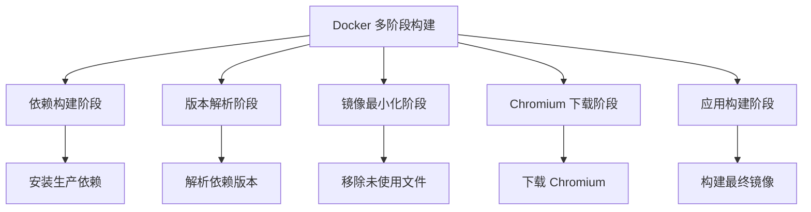
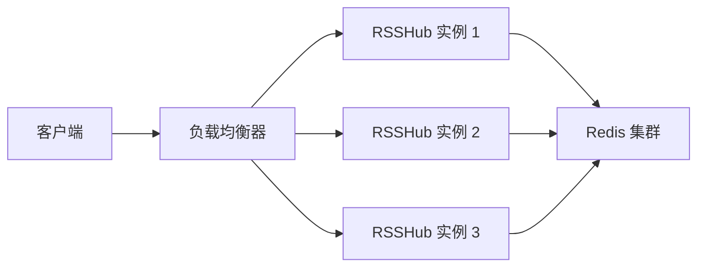
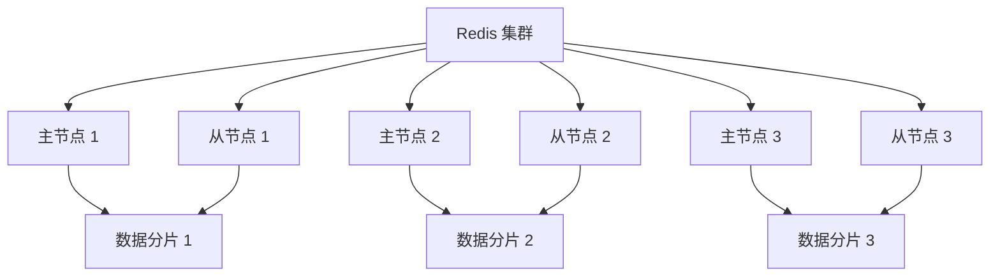
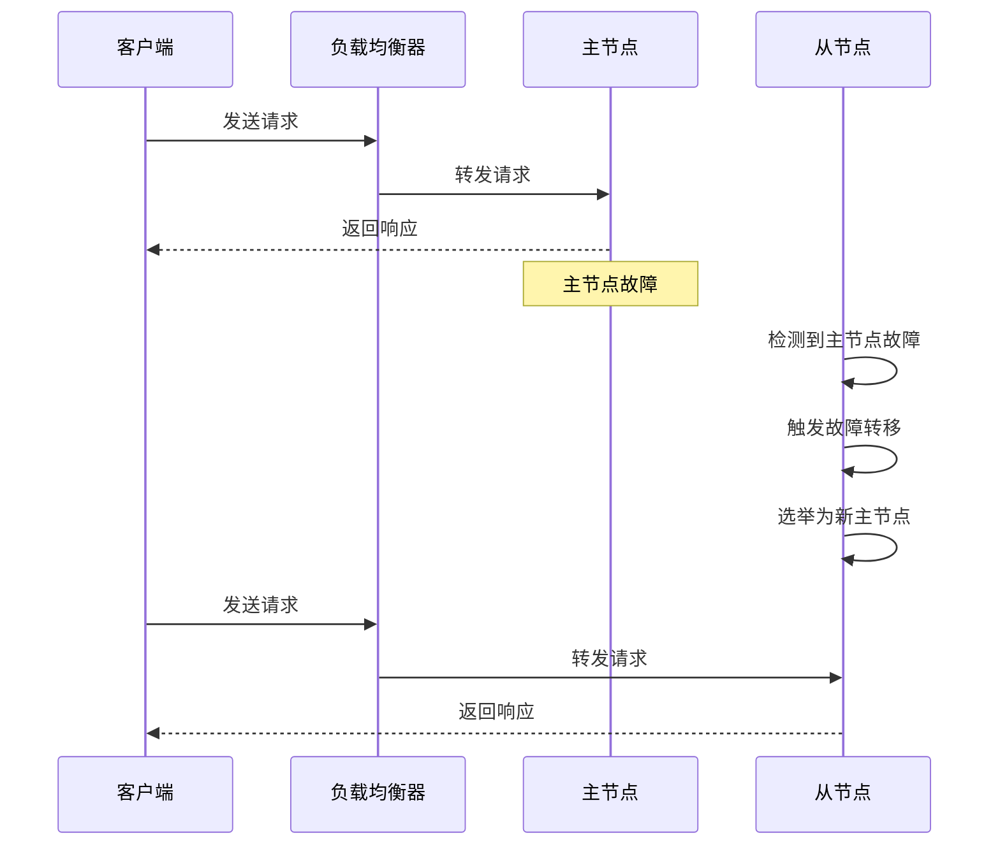
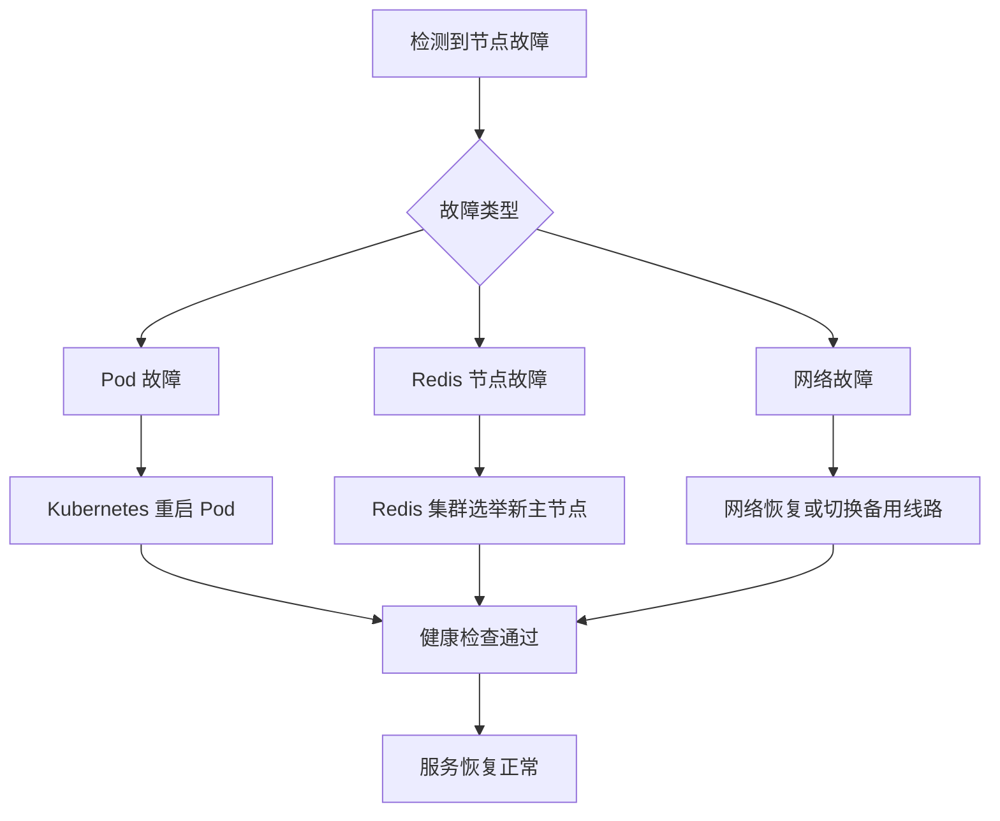
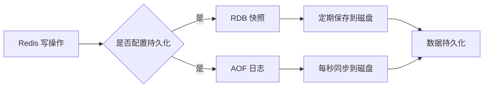
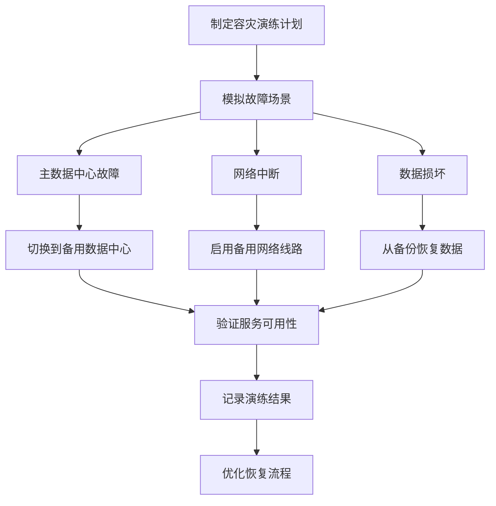

# 高可用性设计

<cite>
**本文档引用的文件**  
- [README.md](file://README.md)
- [Dockerfile](file://Dockerfile)
- [docker-compose.yml](file://docker-compose.yml)
- [lib/config.ts](file://lib/config.ts)
- [lib/utils/cache/redis.ts](file://lib/utils/cache/redis.ts)
- [lib/utils/cache/index.ts](file://lib/utils/cache/index.ts)
- [lib/middleware/cache.ts](file://lib/middleware/cache.ts)
- [lib/index.ts](file://lib/index.ts)
- [flake.nix](file://flake.nix)
- [scripts/ansible/rsshub.yaml](file://scripts/ansible/rsshub.yaml)
- [scripts/ansible/rsshub.service](file://scripts/ansible/rsshub.service)
- [fly.toml](file://fly.toml)
</cite>

## 目录
1. [简介](#简介)
2. [容器化部署方案](#容器化部署方案)
3. [负载均衡配置](#负载均衡配置)
4. [Redis集群配置](#redis集群配置)
5. [故障转移机制](#故障转移机制)
6. [数据备份与恢复策略](#数据备份与恢复策略)
7. [灾难恢复计划](#灾难恢复计划)
8. [健康检查与监控](#健康检查与监控)
9. [配置管理](#配置管理)

## 简介

RSSHub 是一个开源的 RSS 聚合器，支持通过 Docker 和 Kubernetes 实现高可用性集群部署。本设计文档详细说明了如何构建一个高可用的 RSSHub 集群，包括容器化部署、负载均衡、Redis 缓存集群、故障转移、数据备份与恢复等关键组件的配置和管理。

**Section sources**
- [README.md](file://README.md#L1-L62)

## 容器化部署方案

RSSHub 提供了完整的 Docker 支持，可以通过 Docker 和 Kubernetes 实现容器化部署。Dockerfile 采用多阶段构建策略，优化了镜像大小和构建效率。



**Diagram sources**
- [Dockerfile](file://Dockerfile#L1-L207)

在 Kubernetes 环境中，可以使用以下 Pod 配置来部署 RSSHub：

```yaml
apiVersion: apps/v1
kind: Deployment
metadata:
  name: rsshub
spec:
  replicas: 3
  selector:
    matchLabels:
      app: rsshub
  template:
    metadata:
      labels:
        app: rsshub
    spec:
      containers:
      - name: rsshub
        image: diygod/rsshub
        ports:
        - containerPort: 1200
        env:
        - name: CACHE_TYPE
          value: "redis"
        - name: REDIS_URL
          value: "redis://redis-cluster:6379"
        readinessProbe:
          httpGet:
            path: /healthz
            port: 1200
          initialDelaySeconds: 30
          periodSeconds: 10
        livenessProbe:
          httpGet:
            path: /healthz
            port: 1200
          initialDelaySeconds: 60
          periodSeconds: 20
```

**Section sources**
- [Dockerfile](file://Dockerfile#L1-L207)
- [docker-compose.yml](file://docker-compose.yml#L1-L63)

## 负载均衡配置

为了实现高可用性，需要配置负载均衡器来分发请求到多个 RSSHub 实例。可以使用 HAProxy 或云服务商提供的负载均衡服务。

### HAProxy 配置示例

```haproxy
global
    log /dev/log local0
    log /dev/log local1 notice
    chroot /var/lib/haproxy
    stats socket /run/haproxy/admin.sock mode 660 level admin expose-fd listeners
    maxconn 4000
    user haproxy
    group haproxy
    daemon

defaults
    log global
    mode http
    option httplog
    option dontlognull
    timeout connect 5000
    timeout client 50000
    timeout server 50000
    errorfile 400 /etc/haproxy/errors/400.http
    errorfile 403 /etc/haproxy/errors/403.http
    errorfile 408 /etc/haproxy/errors/408.http
    errorfile 500 /etc/haproxy/errors/500.http
    errorfile 502 /etc/haproxy/errors/502.http
    errorfile 503 /etc/haproxy/errors/503.http
    errorfile 504 /etc/haproxy/errors/504.http

frontend rsshub_frontend
    bind *:1200
    default_backend rsshub_backend

backend rsshub_backend
    balance roundrobin
    option httpchk GET /healthz
    server rsshub1 192.168.1.101:1200 check
    server rsshub2 192.168.1.102:1200 check
    server rsshub3 192.168.1.103:1200 check
```

### 云服务商负载均衡配置

在云环境中，可以使用云服务商提供的负载均衡服务，如 AWS ELB、Google Cloud Load Balancer 或 Azure Load Balancer。这些服务通常提供自动扩展、健康检查和故障转移功能。



**Diagram sources**
- [docker-compose.yml](file://docker-compose.yml#L1-L63)
- [lib/config.ts](file://lib/config.ts#L243-L791)

**Section sources**
- [docker-compose.yml](file://docker-compose.yml#L1-L63)
- [lib/config.ts](file://lib/config.ts#L243-L791)

## Redis集群配置

RSSHub 使用 Redis 作为缓存后端，确保缓存数据的高可用性和持久化。通过配置 Redis 集群，可以实现数据的分布式存储和故障转移。

### Redis 配置

在 `docker-compose.yml` 中，Redis 服务配置如下：

```yaml
redis:
  image: redis:alpine
  restart: always
  volumes:
    - redis-data:/data
  healthcheck:
    test: ['CMD', 'redis-cli', 'ping']
    interval: 30s
    timeout: 10s
    retries: 5
    start_period: 5s
```

### Redis 集群模式

为了实现高可用性，建议使用 Redis 集群模式而不是单实例。Redis 集群提供了数据分片、故障转移和高可用性。



**Diagram sources**
- [docker-compose.yml](file://docker-compose.yml#L49-L62)
- [lib/utils/cache/redis.ts](file://lib/utils/cache/redis.ts#L1-L77)

**Section sources**
- [docker-compose.yml](file://docker-compose.yml#L49-L62)
- [lib/utils/cache/redis.ts](file://lib/utils/cache/redis.ts#L1-L77)
- [lib/config.ts](file://lib/config.ts#L745-L747)

## 故障转移机制

RSSHub 的高可用性设计包括主备切换和自动恢复流程，确保在节点故障时服务能够继续运行。

### 主备切换

当主节点发生故障时，Redis 集群会自动选举新的主节点，确保服务不中断。Kubernetes 的 Pod 副本集也会自动创建新的 Pod 实例来替代故障的实例。



**Diagram sources**
- [lib/utils/cache/redis.ts](file://lib/utils/cache/redis.ts#L1-L77)
- [lib/index.ts](file://lib/index.ts#L26-L63)

### 自动恢复流程

RSSHub 集群中的各个组件都配置了健康检查，确保故障节点能够被及时发现并恢复。



**Diagram sources**
- [docker-compose.yml](file://docker-compose.yml#L17-L21)
- [lib/middleware/cache.ts](file://lib/middleware/cache.ts#L1-L26)

**Section sources**
- [docker-compose.yml](file://docker-compose.yml#L17-L21)
- [lib/middleware/cache.ts](file://lib/middleware/cache.ts#L1-L26)

## 数据备份与恢复策略

为了确保数据安全，需要制定完整的数据备份与恢复策略，包括配置文件、缓存数据和持久化存储的备份。

### 配置文件备份

配置文件是 RSSHub 运行的关键，需要定期备份。

```bash
# 备份配置文件
tar -czf rsshub-config-backup-$(date +%Y%m%d).tar.gz .env docker-compose.yml config/

# 恢复配置文件
tar -xzf rsshub-config-backup-20240101.tar.gz
```

### Redis 数据持久化

Redis 配置了 RDB 和 AOF 两种持久化方式，确保数据不会丢失。



**Diagram sources**
- [docker-compose.yml](file://docker-compose.yml#L52-L53)
- [lib/utils/cache/redis.ts](file://lib/utils/cache/redis.ts#L1-L77)

### 备份策略

| 备份类型 | 频率 | 保留周期 | 存储位置 |
|---------|------|---------|---------|
| 配置文件 | 每日 | 30天 | 本地和云存储 |
| Redis 数据 | 每小时 | 7天 | 云存储 |
| 日志文件 | 每日 | 90天 | 云存储 |

**Section sources**
- [docker-compose.yml](file://docker-compose.yml#L52-L53)
- [lib/utils/cache/redis.ts](file://lib/utils/cache/redis.ts#L1-L77)
- [lib/config.ts](file://lib/config.ts#L737-L747)

## 灾难恢复计划

灾难恢复计划是高可用性设计的重要组成部分，确保在重大故障或灾难发生时能够快速恢复服务。

### 容灾演练

定期进行容灾演练，验证灾难恢复计划的有效性。



### 恢复步骤

1. **评估故障**：确定故障范围和影响
2. **启动备用系统**：激活备用数据中心或云环境
3. **恢复数据**：从最近的备份恢复配置文件和数据
4. **验证服务**：测试关键功能是否正常
5. **切换流量**：将用户流量切换到恢复后的系统
6. **监控运行**：持续监控系统性能和稳定性

**Section sources**
- [docker-compose.yml](file://docker-compose.yml#L1-L63)
- [lib/config.ts](file://lib/config.ts#L737-L791)

## 健康检查与监控

健康检查是确保系统高可用性的关键，通过定期检查各个组件的状态，及时发现和处理问题。

### 健康检查配置

RSSHub 的各个组件都配置了健康检查：

```yaml
# RSSHub 健康检查
healthcheck:
  test: ['CMD', 'curl', '-f', 'http://localhost:1200/healthz']
  interval: 30s
  timeout: 10s
  retries: 3

# Redis 健康检查
healthcheck:
  test: ['CMD', 'redis-cli', 'ping']
  interval: 30s
  timeout: 10s
  retries: 5
  start_period: 5s
```

### 监控指标

| 指标 | 说明 | 告警阈值 |
|------|------|---------|
| CPU 使用率 | Pod CPU 使用情况 | >80% 持续5分钟 |
| 内存使用率 | Pod 内存使用情况 | >85% 持续5分钟 |
| 请求延迟 | API 请求响应时间 | P95 > 2秒 |
| 错误率 | HTTP 5xx 错误比例 | >1% 持续1分钟 |
| Redis 连接数 | Redis 客户端连接数 | >最大连接数的80% |

**Section sources**
- [docker-compose.yml](file://docker-compose.yml#L17-L21)
- [fly.toml](file://fly.toml#L10-L15)

## 配置管理

RSSHub 的配置管理通过环境变量实现，支持灵活的部署和运行时配置。

### 环境变量配置

```typescript
// lib/config.ts 中的配置结构
export type Config = {
    // 缓存配置
    cache: {
        type: string;
        requestTimeout: number;
        routeExpire: number;
        contentExpire: number;
    };
    // Redis 配置
    redis: {
        url: string;
    };
    // 代理配置
    proxy: {
        strategy: 'on_retry' | 'all';
        failoverTimeout?: number;
        healthCheckInterval?: number;
    };
};
```

### 配置示例

```yaml
# docker-compose.yml 中的环境变量
environment:
  NODE_ENV: production
  CACHE_TYPE: redis
  REDIS_URL: 'redis://redis:6379/'
  PUPPETEER_WS_ENDPOINT: 'ws://browserless:3000'
```

**Section sources**
- [lib/config.ts](file://lib/config.ts#L243-L791)
- [docker-compose.yml](file://docker-compose.yml#L10-L16)
- [flake.nix](file://flake.nix#L152-L188)