# 启动方式

<cite>
**本文档引用的文件**
- [lib/app.ts](file://lib/app.ts)
- [lib/server.ts](file://lib/server.ts)
- [lib/index.ts](file://lib/index.ts)
- [lib/app-bootstrap.tsx](file://lib/app-bootstrap.tsx)
- [lib/config.ts](file://lib/config.ts)
- [package.json](file://package.json)
- [docker-compose.yml](file://docker-compose.yml)
</cite>

## 目录
1. [简介](#简介)
2. [启动方式概述](#启动方式概述)
3. [核心启动文件分析](#核心启动文件分析)
4. [配置参数详解](#配置参数详解)
5. [健康检查与就绪探针](#健康检查与就绪探针)
6. [常见错误及解决方案](#常见错误及解决方案)
7. [总结](#总结)

## 简介
RSSHub 是一个强大的 RSS 生成器，支持多种启动方式。本文档详细介绍了 RSSHub 的各种启动方法，包括开发模式和生产模式的区别，核心启动文件的作用和调用关系，以及自定义启动参数的配置方法。

## 启动方式概述

RSSHub 提供了多种启动方式，主要通过 pnpm 命令来执行。根据不同的环境需求，可以选择开发模式或生产模式启动应用。

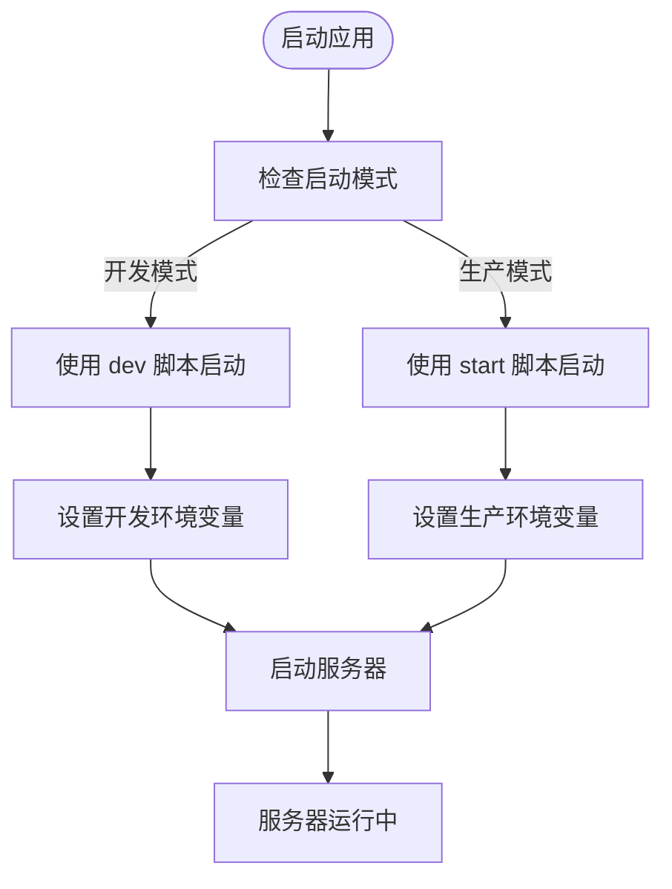

**Diagram sources**
- [package.json](file://package.json#L34-L43)

### 开发模式启动
在开发模式下，可以使用以下命令启动 RSSHub：

```bash
pnpm dev
```

此命令会执行 package.json 中定义的 dev 脚本，设置开发环境变量并启动服务器。开发模式的特点包括：
- 启用调试信息输出
- 使用 tsx 工具进行热重载
- 设置较大的 HTTP 头部大小限制

### 生产模式启动
在生产环境中，应使用以下命令启动 RSSHub：

```bash
pnpm start
```

此命令会执行 package.json 中定义的 start 脚本，设置生产环境变量并启动编译后的服务器。生产模式的特点包括：
- 性能优化
- 错误处理更加严格
- 日志记录更加详细

**Section sources**
- [package.json](file://package.json#L34-L43)

## 核心启动文件分析

RSSHub 的启动过程涉及多个核心文件，它们之间有明确的调用关系。理解这些文件的作用对于掌握 RSSHub 的启动机制至关重要。

### lib/app.ts 文件
`lib/app.ts` 文件是应用的主要入口点之一。它的主要作用是确保请求重写器在应用启动前运行。

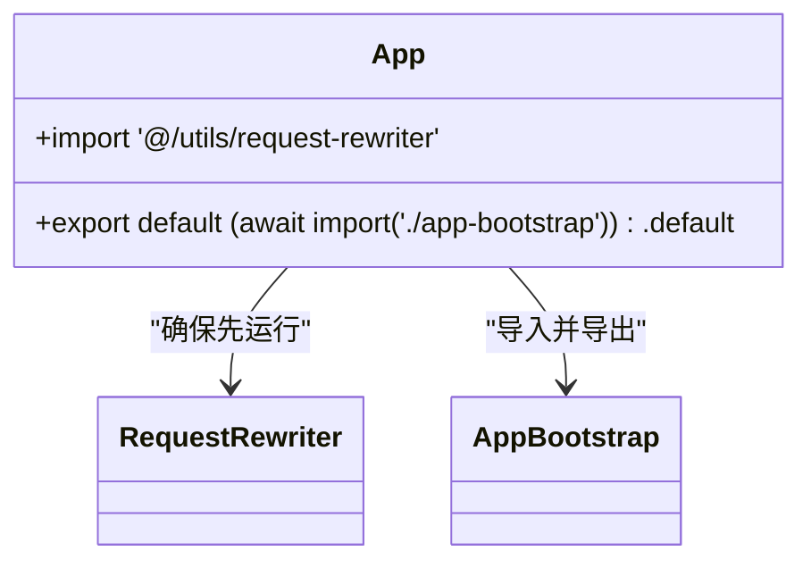

**Diagram sources**
- [lib/app.ts](file://lib/app.ts#L1-L5)

### lib/server.ts 文件
`lib/server.ts` 文件主要用于兼容 Vercel 部署环境。它与 `lib/app.ts` 类似，但采用了不同的导入方式。

```mermaid
classDiagram
class Server {
+import '@/utils/request-rewriter'
+export { default } from './app-bootstrap'
}
Server --> RequestRewriter : "确保先运行"
Server --> AppBootstrap : "直接导出"
```

**Diagram sources**
- [lib/server.ts](file://lib/server.ts#L1-L5)

### lib/app-bootstrap.tsx 文件
`lib/app-bootstrap.tsx` 文件是应用的核心配置文件，负责初始化 Hono 应用实例并配置中间件。

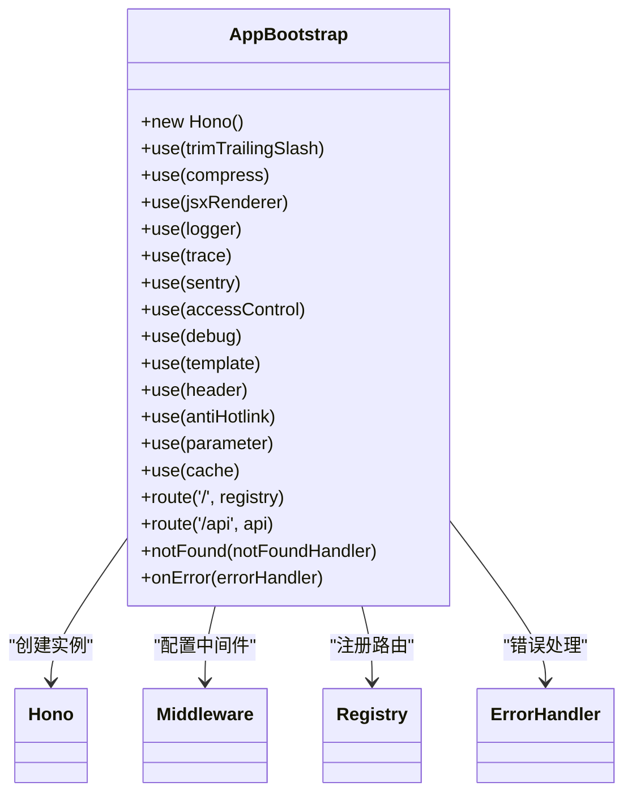

**Diagram sources**
- [lib/app-bootstrap.tsx](file://lib/app-bootstrap.tsx#L1-L54)

### 调用关系分析
这些核心文件之间的调用关系如下：

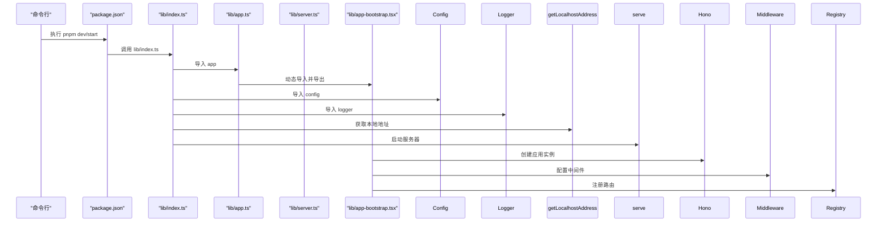

**Diagram sources**
- [lib/index.ts](file://lib/index.ts#L1-L64)
- [lib/app.ts](file://lib/app.ts#L1-L5)
- [lib/server.ts](file://lib/server.ts#L1-L5)
- [lib/app-bootstrap.tsx](file://lib/app-bootstrap.tsx#L1-L54)

**Section sources**
- [lib/index.ts](file://lib/index.ts#L1-L64)
- [lib/app.ts](file://lib/app.ts#L1-L5)
- [lib/server.ts](file://lib/server.ts#L1-L5)
- [lib/app-bootstrap.tsx](file://lib/app-bootstrap.tsx#L1-L54)

## 配置参数详解

RSSHub 提供了丰富的配置选项，可以通过环境变量进行自定义设置。这些配置主要在 `lib/config.ts` 文件中定义和处理。

### 端口和主机绑定
可以通过以下环境变量配置服务器的监听端口和主机：

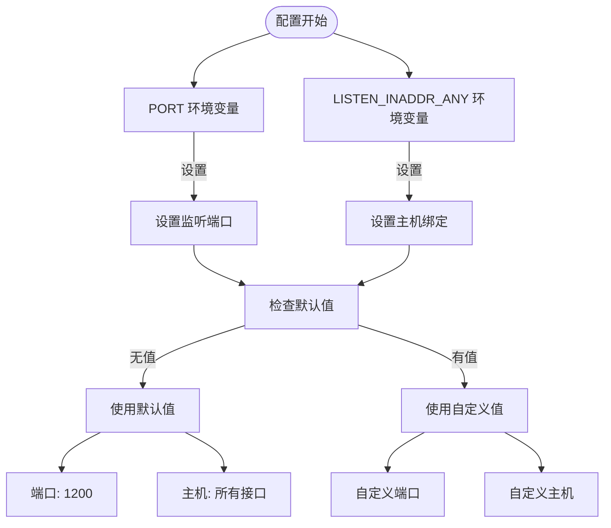

相关配置项：
- **PORT**: 设置服务器监听端口，默认值为 1200
- **LISTEN_INADDR_ANY**: 是否允许公网连接，取值为 0 或 1，默认为 1（允许）

**Section sources**
- [lib/config.ts](file://lib/config.ts#L23-L25)

### 日志级别配置
日志系统提供了详细的配置选项，可以控制日志的输出级别和格式：

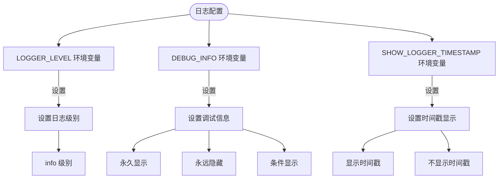

相关配置项：
- **LOGGER_LEVEL**: 日志级别，可选值包括 'info'、'error' 等
- **DEBUG_INFO**: 是否显示调试信息，取值 'true' 永久显示，'false' 永远隐藏，或指定字符串条件显示
- **SHOW_LOGGER_TIMESTAMP**: 是否显示日志时间戳

**Section sources**
- [lib/config.ts](file://lib/config.ts#L44-L50)

### 缓存配置
缓存系统支持多种缓存类型和策略配置：

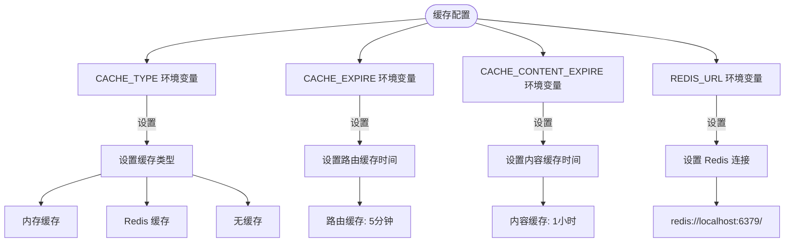

相关配置项：
- **CACHE_TYPE**: 缓存类型，支持 'memory' 和 'redis'，设为空可以禁止缓存
- **CACHE_EXPIRE**: 路由缓存时间，单位为秒，默认 5 分钟
- **CACHE_CONTENT_EXPIRE**: 不变内容缓存时间，单位为秒，默认 1 小时
- **REDIS_URL**: Redis 连接地址，默认为 'redis://localhost:6379/'

**Section sources**
- [lib/config.ts](file://lib/config.ts#L22-L28)

## 健康检查与就绪探针

RSSHub 支持通过 Docker Compose 配置健康检查和就绪探针，确保服务的稳定运行。

### Docker 健康检查配置
在 `docker-compose.yml` 文件中，可以为各个服务配置健康检查：

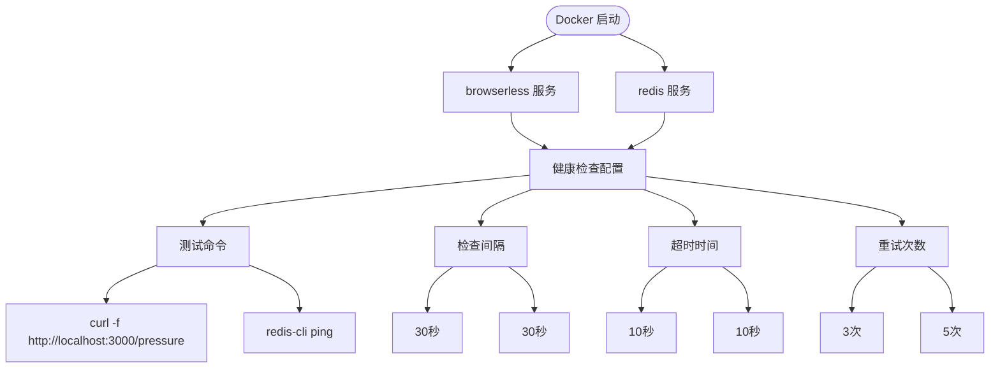

具体配置示例：
- **browserless 服务**: 使用 curl 命令检查 /pressure 端点
- **redis 服务**: 使用 redis-cli ping 命令检查 Redis 状态
- 检查间隔均为 30 秒，超时时间为 10 秒

**Section sources**
- [docker-compose.yml](file://docker-compose.yml#L36-L62)

### 代理健康检查
对于代理服务，RSSHub 还实现了专门的健康检查机制：

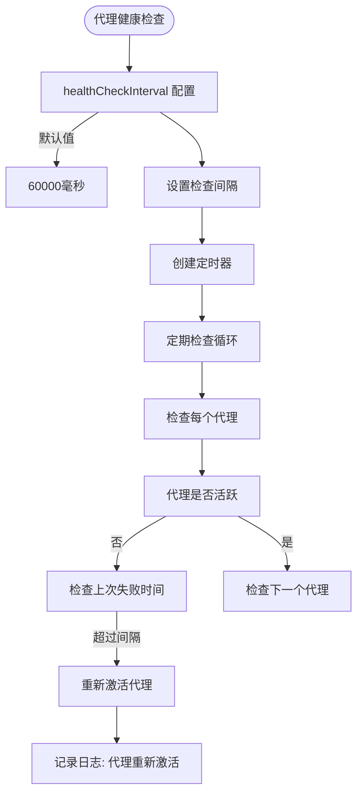

相关配置项：
- **PROXY_HEALTH_CHECK_INTERVAL**: 代理健康检查间隔，默认 60000 毫秒
- 健康检查会定期检查所有代理的状态，并在满足条件时重新激活失败的代理

**Section sources**
- [lib/utils/proxy/multi-proxy.ts](file://lib/utils/proxy/multi-proxy.ts#L52-L67)

## 常见错误及解决方案

在启动 RSSHub 时可能会遇到各种问题，以下是常见错误及其解决方案。

### 端口冲突
当指定的端口已被其他进程占用时，会出现端口冲突错误。

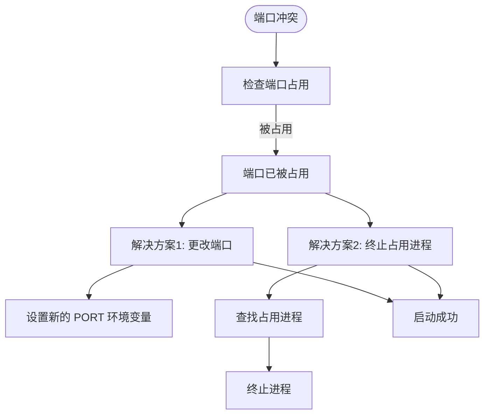

解决方案：
1. 更改端口：通过设置 PORT 环境变量使用其他端口
2. 终止占用进程：使用系统命令查找并终止占用该端口的进程

**Section sources**
- [lib/config.ts](file://lib/config.ts#L23-L25)

### 依赖缺失
当必要的依赖项未正确安装时，会导致启动失败。

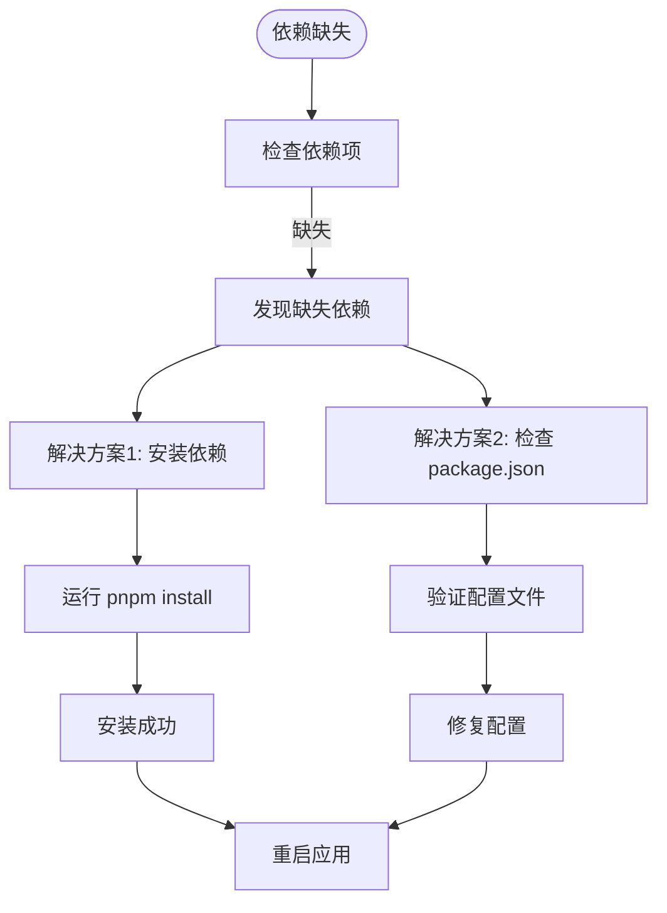

解决方案：
1. 安装依赖：运行 `pnpm install` 命令安装所有依赖
2. 检查配置：确认 package.json 文件中的依赖项是否完整

**Section sources**
- [package.json](file://package.json#L59-L147)

### 配置文件错误
当环境变量配置不正确时，可能导致应用无法正常启动。

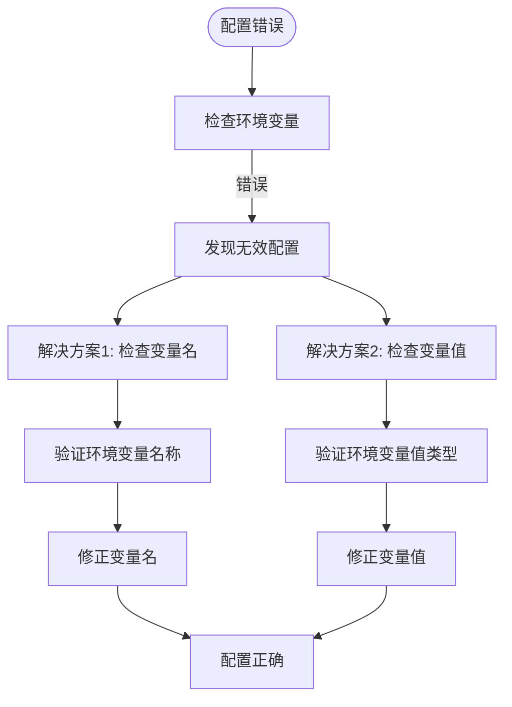

解决方案：
1. 检查变量名：确保环境变量名称拼写正确
2. 检查变量值：确保环境变量值的类型和格式正确

**Section sources**
- [lib/config.ts](file://lib/config.ts#L5-L237)

## 总结
RSSHub 提供了灵活多样的启动方式和丰富的配置选项。通过理解核心启动文件的作用和调用关系，可以更好地掌握应用的启动机制。合理配置各种参数，设置适当的健康检查，能够确保 RSSHub 稳定可靠地运行。遇到问题时，可以根据具体的错误类型采取相应的解决方案。