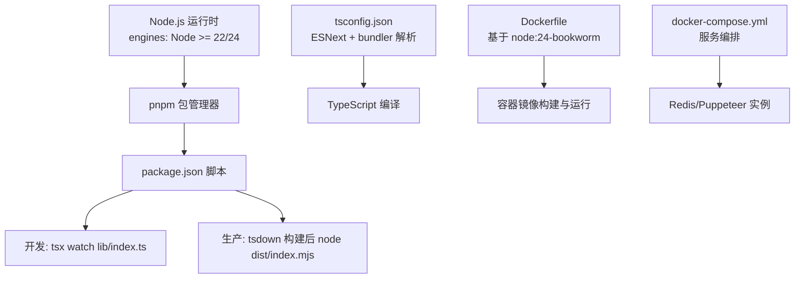
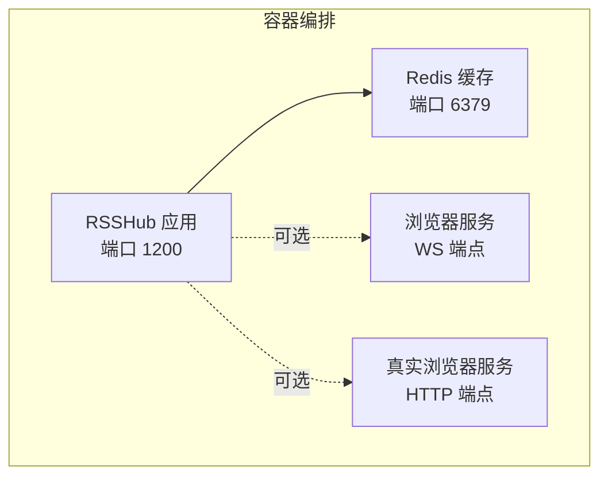
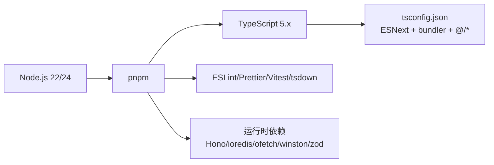

# 环境配置

<cite>
**本文引用的文件**
- [package.json](file://package.json)
- [tsconfig.json](file://tsconfig.json)
- [Dockerfile](file://Dockerfile)
- [docker-compose.yml](file://docker-compose.yml)
- [lib/config.ts](file://lib/config.ts)
- [.prettierrc](file://.prettierrc)
- [scripts/ansible/rsshub.env](file://scripts/ansible/rsshub.env)
- [devenv.nix](file://devenv.nix)
</cite>

## 目录
1. [简介](#简介)
2. [项目结构与入口](#项目结构与入口)
3. [核心组件与职责](#核心组件与职责)
4. [架构总览](#架构总览)
5. [详细组件分析](#详细组件分析)
6. [依赖关系分析](#依赖关系分析)
7. [性能与构建优化](#性能与构建优化)
8. [故障排查指南](#故障排查指南)
9. [结论](#结论)

## 简介
本文件面向部署 RSSHub 的运维与开发者，系统化说明 Node.js 环境配置要求、依赖与脚本差异、TypeScript 编译配置、环境变量与缓存/安全配置，以及常见问题排查方法。重点依据仓库内的 package.json、tsconfig.json、Dockerfile、docker-compose.yml、lib/config.ts 等关键文件进行说明，并结合 .prettierrc、scripts/ansible/rsshub.env、devenv.nix 提供可操作的实践建议。

## 项目结构与入口
- Node.js 运行时与包管理器：使用 pnpm 作为包管理器，引擎要求为 Node.js 22 或 24（满足 engines 字段），Dockerfile 默认基于 node:24-bookworm。
- 构建与运行入口：
  - 开发模式：通过 tsx watch 启动，监听 lib/index.ts。
  - 生产模式：先构建产物，再以 node dist/index.mjs 启动。
- TypeScript 配置：tsconfig.json 指定 ESNext 目标与模块解析策略，启用严格模式与增量编译，配合路径别名 @/* 指向 lib/*。

图表来源
- [package.json](file://package.json#L207-L210)
- [Dockerfile](file://Dockerfile#L1-L10)
- [tsconfig.json](file://tsconfig.json#L1-L24)
- [docker-compose.yml](file://docker-compose.yml#L1-L63)

章节来源
- [package.json](file://package.json#L207-L210)
- [Dockerfile](file://Dockerfile#L1-L10)
- [tsconfig.json](file://tsconfig.json#L1-L24)
- [docker-compose.yml](file://docker-compose.yml#L1-L63)

## 核心组件与职责
- Node.js 版本与兼容性
  - engines 字段要求 Node.js 22 或 24；Dockerfile 使用 node:24-bookworm，确保镜像内 Node 版本一致。
  - 若本地使用 nvm/Node 安装，请选择 22.x 或 24.x，避免与镜像版本不一致导致的二进制依赖差异。
- 依赖与脚本
  - dependencies 为运行期依赖，devDependencies 为开发期工具链（TypeScript、ESLint、Prettier、Vitest 等）。
  - 脚本涵盖构建、开发、测试、格式化、覆盖率等，区分 NODE_ENV=development/production 与调试参数。
- TypeScript 编译
  - 目标与模块：ESNext；模块解析：bundler；路径映射：@/* -> lib/*。
  - 增量编译、跳过库检查、隔离模块等选项提升开发体验与构建性能。
- 环境变量与配置
  - lib/config.ts 统一读取环境变量，支持缓存类型（memory/redis）、Redis URL、代理、日志、Sentry、OpenAI 等大量配置项。
  - docker-compose.yml 提供默认的 Redis 连接示例与健康检查。
- 容器化与部署
  - Dockerfile 多阶段构建，最小化镜像体积；支持按平台安装 Chromium 或使用浏览器服务（Puppeteer WS/Real Browser）。
  - docker-compose.yml 将 RSSHub、Redis、可选浏览器服务编排为一组服务。

章节来源
- [package.json](file://package.json#L149-L206)
- [package.json](file://package.json#L28-L49)
- [tsconfig.json](file://tsconfig.json#L1-L24)
- [lib/config.ts](file://lib/config.ts#L1-L120)
- [docker-compose.yml](file://docker-compose.yml#L1-L63)
- [Dockerfile](file://Dockerfile#L1-L120)

## 架构总览
下图展示 RSSHub 在容器环境下的典型部署拓扑，以及与 Redis、可选浏览器服务的关系。

图表来源
- [docker-compose.yml](file://docker-compose.yml#L1-L63)

章节来源
- [docker-compose.yml](file://docker-compose.yml#L1-L63)

## 详细组件分析

### Node.js 版本与兼容性
- 引擎要求
  - engines 字段明确要求 Node.js 22 或 24。
  - Dockerfile 使用 node:24-bookworm，保证镜像内 Node 版本稳定。
- 兼容性建议
  - 本地开发与 CI/CD 建议统一 Node 版本，避免因二进制扩展或原生模块差异导致构建/运行异常。
  - 如需在旧版 Node 上验证兼容性，优先参考 engines 字段与 Dockerfile 的基础镜像版本。

章节来源
- [package.json](file://package.json#L207-L210)
- [Dockerfile](file://Dockerfile#L1-L10)

### 依赖与脚本配置（开发 vs 生产）
- 依赖分类
  - dependencies：运行期依赖（如 Hono、ioredis、ofetch、winston 等）。
  - devDependencies：开发期工具（TypeScript、ESLint、Prettier、Vitest、tsdown 等）。
- 脚本差异
  - 开发脚本：设置 NODE_ENV=development，启用调试参数（如 --inspect、--max-http-header-size），使用 tsx watch 监听文件变化。
  - 生产脚本：设置 NODE_ENV=production，构建产物后以 node dist/index.mjs 启动。
  - 测试脚本：结合 Vitest 与覆盖率生成，支持全路由测试输出到 assets/build/test-full-routes.json。
- 工具链
  - TypeScript：5.x；ESLint/Prettier/Vitest 等均在 devDependencies 中定义。
  - 格式化配置：.prettierrc 控制缩进、引号、尾随逗号等风格。

章节来源
- [package.json](file://package.json#L149-L206)
- [package.json](file://package.json#L28-L49)
- [.prettierrc](file://.prettierrc#L1-L8)

### TypeScript 编译配置（tsconfig.json）
- 关键设置
  - 目标与模块：ESNext；模块解析：bundler；便于打包器处理模块与路径映射。
  - 路径映射：@/* -> lib/*，简化导入路径，提升可维护性。
  - 严格模式：开启 strict；跳过库检查：skipLibCheck；隔离模块：isolatedModules；增量编译：incremental。
  - 其他：noImplicitAny 放宽；resolveJsonModule、jsx/react-jsx 等按项目 JSX 需求配置。
- 性能建议
  - 增量编译与隔离模块有助于快速热更新与构建稳定性。
  - 路径映射减少深层相对路径，降低维护成本。

章节来源
- [tsconfig.json](file://tsconfig.json#L1-L24)

### 环境变量配置（缓存、代理、安全等）
- 加载机制
  - lib/config.ts 通过 dotenv 加载 .env 文件，随后从 process.env 读取配置项并转换为强类型对象。
- 缓存与 Redis
  - CACHE_TYPE 支持 memory/redis；默认 memory；可通过 REDIS_URL 指向 Redis 实例。
  - docker-compose.yml 提供默认 REDIS_URL=redis://redis:6379/ 并挂载卷 redis-data。
- 代理与网络
  - 支持单/多代理 URI、协议/主机/端口/认证、URL 正则匹配、故障转移与健康检查间隔。
- 日志与监控
  - LOGGER_LEVEL、DEBUG_INFO、SENTRY、OTEL 指标桶配置等。
- 安全与访问控制
  - ACCESS_KEY 可用于接口鉴权；ALLOW_ORIGIN 控制跨域；UA/NO_RANDOM_UA 控制请求 UA。
- 其他常用项
  - PORT/LISTEN_INADDR_ANY、REQUEST_RETRY/REQUEST_TIMEOUT、TITLE_LENGTH_LIMIT、SUFFIX 等。
- 示例与参考
  - scripts/ansible/rsshub.env 提供 NODE_ENV=production、CACHE_TYPE=redis、PUPPETEER_WS_ENDPOINT 示例。
  - devenv.nix 自动加载 .env（dotenv.enable=true），便于本地开发。

章节来源
- [lib/config.ts](file://lib/config.ts#L1-L120)
- [lib/config.ts](file://lib/config.ts#L720-L760)
- [docker-compose.yml](file://docker-compose.yml#L1-L63)
- [scripts/ansible/rsshub.env](file://scripts/ansible/rsshub.env#L1-L4)
- [devenv.nix](file://devenv.nix#L102-L109)

### 容器化与部署要点（Dockerfile 与 docker-compose）
- Dockerfile 多阶段构建
  - 依赖构建阶段：启用 pnpm，按需切换国内镜像源，安装生产依赖并执行清理。
  - 最小化镜像阶段：移除未使用的目录，仅保留运行所需文件。
  - 浏览器相关：支持在 amd64 平台下载 Chromium，或在非 amd64 平台安装系统 Chromium；通过环境变量 CHROMIUM_EXECUTABLE_PATH 指定可执行路径。
  - 入口：dumb-init 作为 PID 1，CMD 执行 npm run start。
- docker-compose.yml
  - rsshub 服务：暴露 1200 端口，依赖 redis；可选 browserless 或 real-browser 服务。
  - redis：持久化数据卷 redis-data，健康检查 ping。
  - 健康检查：rsshub 通过 /healthz 探活。

章节来源
- [Dockerfile](file://Dockerfile#L1-L207)
- [docker-compose.yml](file://docker-compose.yml#L1-L63)

## 依赖关系分析
- Node.js 与包管理器
  - engines 指定 Node 版本；Dockerfile 使用 node:24-bookworm；pnpm 作为包管理器。
- TypeScript 与工具链
  - TypeScript 5.x；ESLint、Prettier、Vitest、tsdown 等在 devDependencies 中。
- 运行时依赖
  - Hono、ioredis、ofetch、winston、zod 等构成核心运行时能力。
- 路径映射与模块解析
  - tsconfig.json 的 @/* -> lib/* 与 bundler 解析策略，配合打包器使用更高效。

图表来源
- [package.json](file://package.json#L149-L206)
- [package.json](file://package.json#L207-L210)
- [tsconfig.json](file://tsconfig.json#L1-L24)

章节来源
- [package.json](file://package.json#L149-L206)
- [package.json](file://package.json#L207-L210)
- [tsconfig.json](file://tsconfig.json#L1-L24)

## 性能与构建优化
- TypeScript 编译
  - 启用增量编译与隔离模块，提升开发体验与构建稳定性。
  - 路径映射减少深层相对路径，降低维护成本。
- 构建与运行
  - 生产构建使用 tsdown，结合 Docker 多阶段最小化镜像体积。
  - 通过环境变量调整 HTTP 头大小限制（NODE_OPTIONS）以适配高负载场景。
- 测试与覆盖率
  - Vitest 集成覆盖率与报告输出，支持全路由测试与持续集成。

章节来源
- [tsconfig.json](file://tsconfig.json#L1-L24)
- [package.json](file://package.json#L28-L49)
- [Dockerfile](file://Dockerfile#L1-L120)

## 故障排查指南
- Node.js 版本不匹配
  - 症状：构建失败或运行时报错，提示二进制依赖不兼容。
  - 处理：确保本地 Node 版本与 engines 一致（22 或 24），或使用 Docker 镜像。
- Redis 连接失败
  - 症状：启动后缓存不可用，路由报错。
  - 处理：确认 REDIS_URL 与 docker-compose 中的 redis 服务连通；检查网络与防火墙；查看 redis 健康检查状态。
- Puppeteer/Chromium 启动问题
  - 症状：headless 启动失败、共享库缺失。
  - 处理：在 amd64 平台使用内置 Chromium 下载；在非 amd64 平台安装系统 Chromium 并设置 CHROMIUM_EXECUTABLE_PATH；检查依赖库是否满足。
- 端口占用与权限
  - 症状：端口被占用或权限不足。
  - 处理：修改 PORT 或释放端口；以非 root 用户运行时注意权限与 ulimit 设置。
- 环境变量未生效
  - 症状：配置项未按预期生效。
  - 处理：确认 .env 文件已加载（devenv.nix 已启用 dotenv），或在 docker-compose 中正确注入环境变量；核对键名大小写与拼写。

章节来源
- [lib/config.ts](file://lib/config.ts#L1-L120)
- [docker-compose.yml](file://docker-compose.yml#L1-L63)
- [Dockerfile](file://Dockerfile#L120-L207)
- [devenv.nix](file://devenv.nix#L102-L109)

## 结论
RSSHub 的环境配置围绕 Node.js 22/24、pnpm、TypeScript 与容器化展开。通过 engines 与 Dockerfile 保证运行时一致性，tsconfig.json 优化编译性能，lib/config.ts 提供全面的环境变量配置能力，docker-compose.yml 则提供了可复用的服务编排模板。遵循本文档的版本与配置建议，可显著降低部署与运维复杂度，并提升稳定性与可维护性。