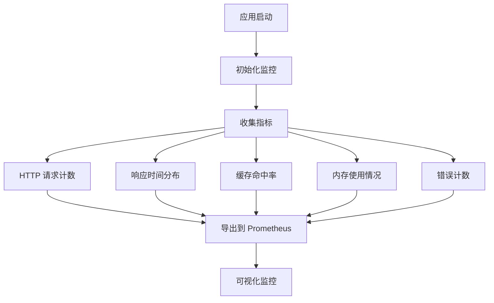
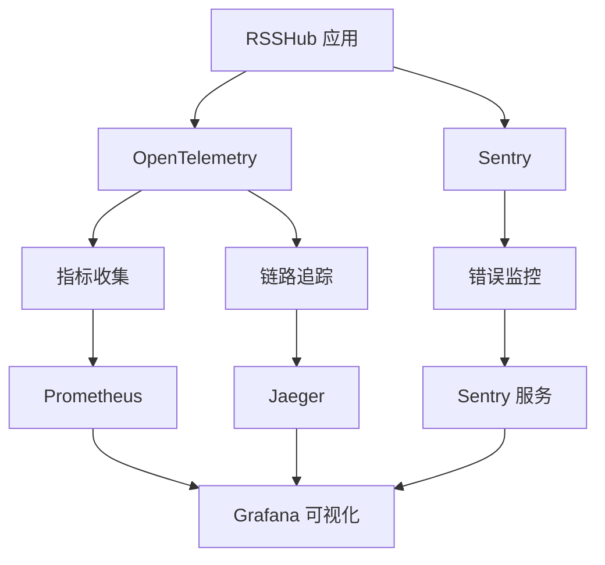

# 进程管理

<cite>
**本文档引用的文件**
- [package.json](file://package.json)
- [Dockerfile](file://Dockerfile)
- [docker-compose.yml](file://docker-compose.yml)
- [fly.toml](file://fly.toml)
- [vercel.json](file://vercel.json)
- [lib/index.ts](file://lib/index.ts)
- [lib/config.ts](file://lib/config.ts)
- [lib/utils/logger.ts](file://lib/utils/logger.ts)
- [scripts/ansible/rsshub.service](file://scripts/ansible/rsshub.service)
- [scripts/ansible/rsshub.yaml](file://scripts/ansible/rsshub.yaml)
- [scripts/ansible/rsshub.env](file://scripts/ansible/rsshub.env)
- [flake.nix](file://flake.nix)
</cite>

## 目录
1. [简介](#简介)
2. [部署方案概览](#部署方案概览)
3. [PM2进程管理配置](#pm2进程管理配置)
4. [系统服务（systemd）配置](#系统服务systemd配置)
5. [进程监控与日志管理](#进程监控与日志管理)
6. [多实例部署与负载均衡](#多实例部署与负载均衡)
7. [性能监控与资源优化](#性能监控与资源优化)
8. [健康检查与自动恢复](#健康检查与自动恢复)
9. [结论](#结论)

## 简介

RSSHub 是一个开源的 RSS 聚合器，支持多种部署方式。本文档详细介绍了在生产环境中管理 RSSHub 进程的各种方案，包括使用 PM2、systemd 等进程管理工具的配置方法，以及如何确保服务的高可用性和稳定性。

RSSHub 提供了灵活的进程管理选项，支持单实例运行、集群模式、Docker 容器化部署以及云平台部署。通过合理的配置，可以实现应用的自动启动、故障恢复、日志轮转和性能监控。

**Section sources**
- [package.json](file://package.json)
- [lib/index.ts](file://lib/index.ts)

## 部署方案概览

RSSHub 支持多种部署方案，每种方案都有其适用场景和优势。主要的部署方式包括：

### 1. 直接运行模式
通过 Node.js 直接运行 RSSHub 应用，适用于开发和测试环境。

### 2. PM2 进程管理
使用 PM2 作为进程管理器，提供进程守护、自动重启、集群模式等功能。

### 3. Docker 容器化部署
通过 Docker 容器部署，确保环境一致性，便于在不同平台间迁移。

### 4. systemd 系统服务
将 RSSHub 配置为系统服务，随系统启动自动运行。

### 5. 云平台部署
支持在 Vercel、Fly.io 等云平台部署，利用平台提供的自动扩展和高可用性功能。

每种部署方案都可以根据具体需求进行配置，选择最适合生产环境的方案。

**Section sources**
- [package.json](file://package.json)
- [Dockerfile](file://Dockerfile)
- [docker-compose.yml](file://docker-compose.yml)
- [fly.toml](file://fly.toml)
- [vercel.json](file://vercel.json)

## PM2进程管理配置

PM2 是 Node.js 应用的高级进程管理器，可以实现应用的守护、监控和集群管理。以下是 RSSHub 的 PM2 配置示例：

```javascript
module.exports = {
    apps: [
        {
            name: 'RSSHub',
            script: './dist/index.mjs',
            instances: 'max',
            exec_mode: 'cluster',
            watch: false,
            ignore_watch: ['logs', 'node_modules'],
            max_memory_restart: '1G',
            env: {
                NODE_ENV: 'production',
                CACHE_TYPE: 'redis',
                REDIS_URL: 'redis://127.0.0.1:6379/',
                PUPPETEER_WS_ENDPOINT: 'ws://localhost:3000'
            },
            error_file: 'logs/pm2-error.log',
            out_file: 'logs/pm2-out.log',
            log_file: 'logs/pm2-combined.log',
            time: true
        }
    ]
};
```

### 配置说明

| 配置项 | 说明 |
|--------|------|
| `name` | 应用名称，用于在 PM2 中标识应用 |
| `script` | 启动脚本路径 |
| `instances` | 实例数量，'max' 表示使用所有 CPU 核心 |
| `exec_mode` | 执行模式，'cluster' 表示集群模式 |
| `watch` | 是否监视文件变化并自动重启 |
| `max_memory_restart` | 内存使用超过指定值时自动重启 |
| `env` | 环境变量配置 |
| `error_file` | 错误日志文件路径 |
| `out_file` | 输出日志文件路径 |
| `log_file` | 综合日志文件路径 |
| `time` | 是否在日志中添加时间戳 |

### 常用管理命令

```bash
# 启动应用
pm2 start ecosystem.config.js

# 停止应用
pm2 stop RSSHub

# 重启应用
pm2 restart RSSHub

# 查看应用状态
pm2 list

# 查看实时日志
pm2 logs RSSHub

# 保存当前进程列表
pm2 save

# 设置 PM2 开机自启
pm2 startup
```

**Section sources**
- [package.json](file://package.json)
- [lib/index.ts](file://lib/index.ts)
- [lib/config.ts](file://lib/config.ts)

## 系统服务（systemd）配置

将 RSSHub 配置为 systemd 服务，可以确保应用随系统启动自动运行，并在崩溃时自动重启。

### systemd 服务文件

```ini
[Unit]
Description=RSSHub is an open source, easy to use, and extensible RSS feed aggregator
After=network.target
Requires=redis.service

[Service]
Type=simple
User=rsshub
Group=rsshub
WorkingDirectory=/home/rsshub/app
EnvironmentFile=/home/rsshub/app/.env
ExecStart=/usr/bin/npm run start
Restart=on-failure
RestartSec=5s

# 安全加固
NoNewPrivileges=true
PrivateTmp=true
ProtectSystem=strict
ProtectHome=true
ReadWritePaths=/home/rsshub/app/logs
ProtectKernelTunables=true
ProtectKernelModules=true
ProtectControlGroups=true

[Install]
WantedBy=multi-user.target
```

### Ansible 部署配置

RSSHub 提供了 Ansible 部署脚本，可以自动化配置 systemd 服务：

```yaml
- name: Create rsshub user
  user:
    name: rsshub
    create_home: true
    shell: /bin/bash
- name: Clone the repo
  git:
    repo: https://github.com/DIYgod/RSSHub.git
    dest: /home/rsshub/app
    update: yes
- name: Install repo dependencies
  command: yarn install --production
  args:
    chdir: /home/rsshub/app
  environment:
    PUPPETEER_SKIP_DOWNLOAD: true
- name: Copy configuration
  copy:
    src: rsshub.env
    dest: /home/rsshub/app/.env
- name: Install the systemd unit
  copy:
    src: rsshub.service
    dest: /etc/systemd/system/rsshub.service
- name: Start the systemd service
  systemd:
    state: restarted
    enabled: yes
    name: rsshub
    daemon_reload: yes
```

### NixOS 配置

对于 NixOS 用户，可以通过 flake.nix 配置 RSSHub 服务：

```nix
systemd.services.rsshub = {
  description = "RSSHub - Everything is RSSible";
  wantedBy = [ "multi-user.target" ];
  after = [ "network.target" ] ++ optional (cfg.redis.enable && cfg.redis.createLocally) "redis-rsshub.service";
  requires = optional (cfg.redis.enable && cfg.redis.createLocally) "redis-rsshub.service";

  serviceConfig = {
    Type = "simple";
    User = cfg.user;
    Group = cfg.group;
    WorkingDirectory = cfg.dataDir;
    EnvironmentFile = environmentFile;
    ExecStart = "${cfg.package}/bin/rsshub";
    Restart = "on-failure";
    RestartSec = "5s";

    # 安全加固
    NoNewPrivileges = true;
    PrivateTmp = true;
    ProtectSystem = "strict";
    ProtectHome = true;
    ReadWritePaths = [ cfg.dataDir ];
    ProtectKernelTunables = true;
    ProtectKernelModules = true;
    ProtectControlGroups = true;
  };
};
```

### 服务管理命令

```bash
# 启动服务
sudo systemctl start rsshub

# 停止服务
sudo systemctl stop rsshub

# 重启服务
sudo systemctl restart rsshub

# 设置开机自启
sudo systemctl enable rsshub

# 查看服务状态
sudo systemctl status rsshub

# 查看服务日志
sudo journalctl -u rsshub -f
```

**Section sources**
- [scripts/ansible/rsshub.service](file://scripts/ansible/rsshub.service)
- [scripts/ansible/rsshub.yaml](file://scripts/ansible/rsshub.yaml)
- [flake.nix](file://flake.nix)

## 进程监控与日志管理

有效的进程监控和日志管理是确保 RSSHub 稳定运行的关键。

### 日志配置

RSSHub 使用 Winston 作为日志记录器，支持多种日志级别和输出方式：

```typescript
import winston from 'winston';
import { config } from '@/config';

let transports: (typeof winston.transports.File)[] = [];
if (!config.noLogfiles && !process.env.VERCEL) {
    transports = [
        new winston.transports.File({
            filename: path.resolve('logs/error.log'),
            level: 'error',
        }),
        new winston.transports.File({ filename: path.resolve('logs/combined.log') }),
    ];
}
const logger = winston.createLogger({
    level: config.loggerLevel,
    format: winston.format.combine(
        winston.format.timestamp({ format: 'YYYY-MM-DD HH:mm:ss.SSS' }),
        winston.format.printf((info) =>
            JSON.stringify({
                timestamp: info.timestamp,
                level: info.level,
                message: info.message,
            })
        )
    ),
    transports,
});
```

### 日志轮转

建议使用 logrotate 配置日志轮转，防止日志文件过大：

```bash
# /etc/logrotate.d/rsshub
/home/rsshub/app/logs/*.log {
    daily
    missingok
    rotate 30
    compress
    delaycompress
    notifempty
    create 0644 rsshub rsshub
    sharedscripts
    postrotate
        systemctl reload rsshub > /dev/null 2>&1 || true
    endscript
}
```

### 监控指标

RSSHub 集成了 OpenTelemetry，提供详细的性能监控指标：



**Diagram sources**
- [lib/utils/logger.ts](file://lib/utils/logger.ts)
- [lib/routes/metrics.ts](file://lib/routes/metrics.ts)

**Section sources**
- [lib/utils/logger.ts](file://lib/utils/logger.ts)
- [lib/config.ts](file://lib/config.ts)

## 多实例部署与负载均衡

为了提高 RSSHub 的可用性和性能，可以部署多个实例并通过负载均衡器分发请求。

### 集群模式配置

RSSHub 支持内置的集群模式，可以充分利用多核 CPU：

```typescript
import cluster from 'node:cluster';
import os from 'node:os';

if (config.enableCluster) {
    if (cluster.isPrimary) {
        logger.info(`Primary ${process.pid} is running`);
        const numCPUs = os.availableParallelism();
        for (let i = 0; i < numCPUs; i++) {
            cluster.fork();
        }
    } else {
        logger.info(`Worker ${process.pid} is running`);
        serve({
            fetch: app.fetch,
            hostname: config.listenInaddrAny ? '::' : '127.0.0.1',
            port,
        });
    }
}
```

### Docker Compose 多实例配置

使用 Docker Compose 部署多个 RSSHub 实例：

```yaml
version: '3'
services:
    rsshub-1:
        image: diygod/rsshub
        ports:
            - '12001:1200'
        environment:
            NODE_ENV: production
            CACHE_TYPE: redis
            REDIS_URL: 'redis://redis:6379/'
        depends_on:
            - redis

    rsshub-2:
        image: diygod/rsshub
        ports:
            - '12002:1200'
        environment:
            NODE_ENV: production
            CACHE_TYPE: redis
            REDIS_URL: 'redis://redis:6379/'
        depends_on:
            - redis

    redis:
        image: redis:alpine
        volumes:
            - redis-data:/data

volumes:
    redis-data:
```

### Nginx 负载均衡配置

使用 Nginx 作为反向代理和负载均衡器：

```nginx
upstream rsshub_backend {
    server 127.0.0.1:12001;
    server 127.0.0.1:12002;
    server 127.0.0.1:12003;
    keepalive 32;
}

server {
    listen 80;
    server_name rsshub.example.com;

    location / {
        proxy_pass http://rsshub_backend;
        proxy_http_version 1.1;
        proxy_set_header Connection "";
        proxy_set_header Host $host;
        proxy_set_header X-Real-IP $remote_addr;
        proxy_set_header X-Forwarded-For $proxy_add_x_forwarded_for;
        proxy_set_header X-Forwarded-Proto $scheme;

        # 超时设置
        proxy_connect_timeout 30s;
        proxy_send_timeout 30s;
        proxy_read_timeout 30s;

        # 缓存设置
        proxy_cache rsshub_cache;
        proxy_cache_valid 200 302 10m;
        proxy_cache_valid 404 1m;
    }

    # 健康检查
    location /healthz {
        proxy_pass http://rsshub_backend/healthz;
        access_log off;
    }
}

# 缓存配置
proxy_cache_path /var/cache/nginx/rsshub levels=1:2 keys_zone=rsshub_cache:10m max_size=1g inactive=60m use_temp_path=off;
```

### 负载均衡策略

| 策略 | 说明 | 适用场景 |
|------|------|----------|
| 轮询（Round Robin） | 依次将请求分发到各个服务器 | 请求处理时间相近的场景 |
| 加权轮询 | 根据服务器权重分配请求 | 服务器性能不同的场景 |
| IP 哈希 | 根据客户端 IP 地址分配服务器 | 需要会话保持的场景 |
| 最少连接 | 将请求分配给连接数最少的服务器 | 请求处理时间差异大的场景 |

**Section sources**
- [lib/index.ts](file://lib/index.ts)
- [docker-compose.yml](file://docker-compose.yml)
- [lib/config.ts](file://lib/config.ts)

## 性能监控与资源优化

有效的性能监控和资源优化可以确保 RSSHub 在高负载下稳定运行。

### 性能监控配置

RSSHub 集成了多种监控工具，包括 OpenTelemetry 和 Sentry：



**Diagram sources**
- [lib/config.ts](file://lib/config.ts)
- [lib/middleware/sentry.ts](file://lib/middleware/sentry.ts)

### 资源使用优化

#### 内存优化

```typescript
// 配置内存缓存大小
memory: {
    max: 500, // MB
},
```

#### 缓存策略

RSSHub 支持多种缓存类型：

```typescript
if (config.cache.type === 'redis') {
    cacheModule = redis;
    cacheModule.init();
} else if (config.cache.type === 'memory') {
    cacheModule = memory;
    cacheModule.init();
} else {
    logger.error('Cache not available, concurrent requests are not limited.');
}
```

#### 代理配置

支持多代理轮换和故障转移：

```typescript
const createMultiProxy = (proxyUris: string[], proxyObj: Config['proxy']): MultiProxyResult => {
    const proxies: ProxyState[] = [];
    let currentProxyIndex = 0;

    for (const uri of proxyUris) {
        const unifiedProxy = unifyProxy(uri, proxyObj);
        if (unifiedProxy.proxyUri) {
            proxies.push({
                uri: unifiedProxy.proxyUri,
                isActive: true,
                failureCount: 0,
                urlHandler: unifiedProxy.proxyUrlHandler,
            });
        }
    }

    const healthCheckInterval = proxyObj?.healthCheckInterval || 60000;
    const maxFailures = 3;

    const healthCheck = () => {
        const now = Date.now();
        for (const proxy of proxies) {
            if (!proxy.isActive && proxy.lastFailureTime && now - proxy.lastFailureTime > healthCheckInterval) {
                proxy.isActive = true;
                proxy.failureCount = 0;
                delete proxy.lastFailureTime;
            }
        }
    };

    setInterval(healthCheck, healthCheckInterval);
};
```

### 性能调优建议

1. **启用集群模式**：充分利用多核 CPU，提高并发处理能力
2. **使用 Redis 缓存**：相比内存缓存，Redis 可以持久化数据，重启后不丢失
3. **配置适当的缓存过期时间**：平衡数据新鲜度和性能
4. **监控内存使用**：设置合理的内存限制，避免 OOM
5. **优化数据库查询**：如果使用数据库，确保查询语句高效
6. **使用 CDN**：对于静态资源，使用 CDN 加速访问

**Section sources**
- [lib/config.ts](file://lib/config.ts)
- [lib/utils/cache/index.ts](file://lib/utils/cache/index.ts)
- [lib/utils/proxy/index.ts](file://lib/utils/proxy/index.ts)

## 健康检查与自动恢复

健康检查是确保服务高可用性的关键机制。

### 健康检查端点

RSSHub 提供了内置的健康检查端点：

```typescript
const handler: Handler = (ctx) => {
    ctx.header('Cache-Control', 'no-cache');
    return ctx.text('ok');
};
```

### Docker 健康检查

在 Docker 配置中定义健康检查：

```yaml
healthcheck:
    test: ['CMD', 'curl', '-f', 'http://localhost:1200/healthz']
    interval: 30s
    timeout: 10s
    retries: 3
```

### Fly.io 健康检查

在 Fly.io 配置中定义健康检查：

```toml
[[http_service.checks]]
grace_period = "10s"
interval = "30s"
method = "GET"
timeout = "5s"
path = "/healthz"
```

### 自动恢复机制

#### 进程管理器自动重启

无论是 PM2 还是 systemd，都支持进程崩溃后的自动重启：

```ini
[Service]
Restart=on-failure
RestartSec=5s
```

#### 多级故障转移

1. **进程级**：进程崩溃后由进程管理器重启
2. **实例级**：单个实例故障时，负载均衡器将其从服务池中移除
3. **集群级**：整个集群故障时，可以快速切换到备用集群
4. **DNS级**：通过 DNS 故障转移，将流量导向备用站点

#### 健康检查策略

| 检查类型 | 频率 | 超时 | 重试次数 | 说明 |
|---------|------|------|----------|------|
| 主动检查 | 30秒 | 10秒 | 3次 | 定期检查服务状态 |
| 被动检查 | 实时 | - | - | 根据请求失败率判断 |
| 启动检查 | 5秒 | 10秒 | 5次 | 服务启动时的健康检查 |
| 维护检查 | 手动 | - | - | 维护期间的特殊检查 |

**Section sources**
- [docker-compose.yml](file://docker-compose.yml)
- [fly.toml](file://fly.toml)
- [lib/routes/healthz.ts](file://lib/routes/healthz.ts)

## 结论

RSSHub 提供了多种进程管理方案，可以根据具体需求选择最适合的部署方式。无论是使用 PM2、systemd 还是容器化部署，都可以实现高可用性和稳定性。

关键要点总结：

1. **选择合适的部署方案**：根据基础设施和运维能力选择最合适的部署方式
2. **配置自动重启**：确保进程崩溃后能够自动恢复
3. **实施健康检查**：及时发现和隔离故障实例
4. **优化资源使用**：合理配置内存、缓存等资源
5. **监控和告警**：建立完善的监控体系，及时发现和解决问题
6. **日志管理**：配置适当的日志级别和轮转策略
7. **安全加固**：遵循最小权限原则，限制服务的权限

通过合理的配置和管理，RSSHub 可以在生产环境中稳定运行，为用户提供可靠的 RSS 服务。