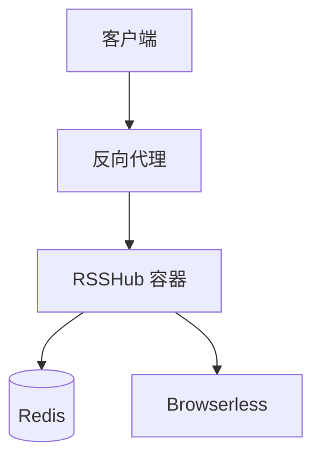
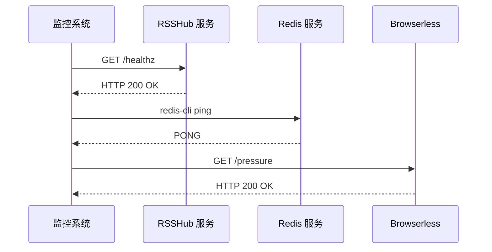
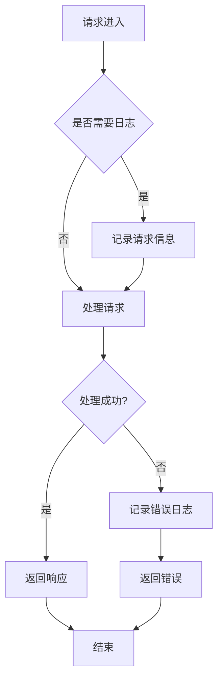
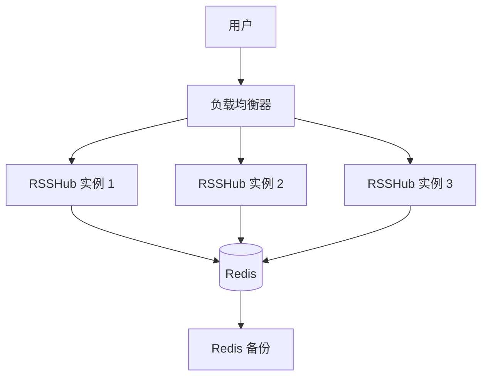

# 部署方案

<cite>
**本文档中引用的文件**  
- [README.md](file://README.md)
- [Dockerfile](file://Dockerfile)
- [docker-compose.yml](file://docker-compose.yml)
- [fly.toml](file://fly.toml)
- [app.json](file://app.json)
- [lib/config.ts](file://lib/config.ts)
- [lib/registry.ts](file://lib/registry.ts)
</cite>

## 目录
1. [简介](#简介)
2. [Docker 部署](#docker-部署)
3. [Docker Compose 部署](#docker-compose-部署)
4. [云平台部署](#云平台部署)
5. [直接运行部署](#直接运行部署)
6. [生产环境最佳实践](#生产环境最佳实践)
7. [性能调优建议](#性能调优建议)

## 简介

RSSHub 是一个开源的 RSS 生成器，支持将各种网站内容转换为 RSS 订阅源。本部署方案文档详细介绍了 RSSHub 的多种部署方式，包括 Docker 部署、Docker Compose 部署、云平台部署以及直接运行部署。文档还涵盖了生产环境的最佳实践和性能调优建议，以确保服务的稳定性和高可用性。

**Section sources**
- [README.md](file://README.md#L17-L23)

## Docker 部署

### 镜像构建

RSSHub 提供了官方的 Docker 镜像，支持多种架构。Dockerfile 采用多阶段构建策略，优化了镜像大小和构建效率。构建过程分为多个阶段：依赖构建、版本解析、镜像精简和 Chromium 下载。

构建命令：
```bash
docker build -t rsshub .
```

构建参数：
- `USE_CHINA_NPM_REGISTRY=1`：使用中国 npm 镜像源
- `PUPPETEER_SKIP_DOWNLOAD=1`：跳过 Puppeteer 的 Chromium 下载

**Section sources**
- [Dockerfile](file://Dockerfile#L1-L207)

### 容器运行

运行 RSSHub 容器的基本命令：
```bash
docker run -d --name rsshub -p 1200:1200 diygod/rsshub
```

容器运行时环境变量：
- `NODE_ENV=production`：设置为生产环境
- `CACHE_TYPE=redis`：使用 Redis 作为缓存
- `REDIS_URL=redis://redis:6379/`：Redis 连接地址
- `PUPPETEER_WS_ENDPOINT=ws://browserless:3000`：Puppeteer WebSocket 端点

**Section sources**
- [Dockerfile](file://Dockerfile#L123-L124)
- [docker-compose.yml](file://docker-compose.yml#L10-L15)

### 网络配置

RSSHub 容器默认暴露 1200 端口。在生产环境中，建议通过反向代理服务器（如 Nginx）将 80/443 端口转发到 1200 端口，以实现 HTTPS 访问。



**Diagram sources**
- [Dockerfile](file://Dockerfile#L181)
- [docker-compose.yml](file://docker-compose.yml#L9)

## Docker Compose 部署

### 多容器应用管理

docker-compose.yml 文件定义了 RSSHub 及其依赖服务的完整配置，包括 RSSHub 主服务、Redis 缓存、Browserless 浏览器服务和真实浏览器服务。

```yaml
services:
    rsshub:
        image: diygod/rsshub
        restart: always
        ports:
            - '1200:1200'
        environment:
            NODE_ENV: production
            CACHE_TYPE: redis
            REDIS_URL: 'redis://redis:6379/'
            PUPPETEER_WS_ENDPOINT: 'ws://browserless:3000'
        depends_on:
            - redis
            - browserless
    browserless:
        image: browserless/chrome
        restart: always
    redis:
        image: redis:alpine
        restart: always
        volumes:
            - redis-data:/data
volumes:
    redis-data:
```

启动命令：
```bash
docker-compose up -d
```

**Section sources**
- [docker-compose.yml](file://docker-compose.yml#L1-L63)

### 服务健康检查

所有服务都配置了健康检查机制，确保服务的可用性：

- RSSHub：检查 `/healthz` 端点
- Redis：执行 `redis-cli ping` 命令
- Browserless：检查 `/pressure` 端点



**Diagram sources**
- [docker-compose.yml](file://docker-compose.yml#L17-L20)
- [fly.toml](file://fly.toml#L14)

## 云平台部署

### Fly.io 部署

fly.toml 文件为 Fly.io 平台提供了部署配置：

```toml
app = "rsshub"

[http_service]
internal_port = 1200
force_https = true
auto_stop_machines = "suspend"
auto_start_machines = true
min_machines_running = 1

[[http_service.checks]]
grace_period = "10s"
interval = "30s"
method = "GET"
timeout = "5s"
path = "/healthz"
```

部署步骤：
1. 安装 flyctl 命令行工具
2. 登录 Fly.io 账户
3. 运行 `fly launch` 初始化应用
4. 使用 `fly deploy` 部署应用

**Section sources**
- [fly.toml](file://fly.toml#L1-L16)

### Heroku 部署

app.json 文件为 Heroku 平台提供了部署配置：

```json
{
    "name": "RSSHub",
    "description": "Everything is RSSible",
    "repository": "https://github.com/DIYgod/RSSHub",
    "env": {
        "NODE_MODULES_CACHE": {
            "value": "false",
            "required": true
        },
        "PORT": {
            "value": "80",
            "required": false
        },
        "PUPPETEER_SKIP_DOWNLOAD": {
            "value": "1",
            "required": false
        }
    }
}
```

部署步骤：
1. 在 Heroku 官网创建新应用
2. 连接 GitHub 仓库
3. 启用自动部署
4. 设置环境变量
5. 手动或自动部署

**Section sources**
- [app.json](file://app.json#L1-L23)

## 直接运行部署

### 环境准备

对于没有容器环境的场景，可以直接运行 RSSHub。首先需要安装 Node.js 18+ 和 pnpm：

```bash
# 克隆仓库
git clone https://github.com/DIYgod/RSSHub.git
cd RSSHub

# 安装依赖
pnpm install

# 构建项目
pnpm build
```

### 配置文件

通过环境变量或 .env 文件进行配置：

```env
NODE_ENV=production
PORT=1200
CACHE_TYPE=redis
REDIS_URL=redis://localhost:6379/
PUPPETEER_SKIP_DOWNLOAD=1
```

启动命令：
```bash
npm run start
```

**Section sources**
- [lib/config.ts](file://lib/config.ts#L5-L200)
- [package.json](file://package.json)

## 生产环境最佳实践

### 反向代理配置

建议使用 Nginx 作为反向代理，提供 HTTPS 支持和负载均衡：

```nginx
server {
    listen 80;
    server_name rsshub.example.com;
    return 301 https://$server_name$request_uri;
}

server {
    listen 443 ssl http2;
    server_name rsshub.example.com;
    
    ssl_certificate /path/to/cert.pem;
    ssl_certificate_key /path/to/key.pem;
    
    location / {
        proxy_pass http://127.0.0.1:1200;
        proxy_set_header Host $host;
        proxy_set_header X-Real-IP $remote_addr;
        proxy_set_header X-Forwarded-For $proxy_add_x_forwarded_for;
        proxy_set_header X-Forwarded-Proto $scheme;
    }
}
```

### SSL 证书设置

使用 Let's Encrypt 获取免费 SSL 证书：

```bash
# 安装 certbot
sudo apt-get install certbot

# 获取证书
sudo certbot certonly --nginx -d rsshub.example.com

# 配置自动续期
sudo crontab -e
# 添加：0 12 * * * /usr/bin/certbot renew --quiet
```

### 监控和日志管理

RSSHub 内置了健康检查端点 `/healthz` 和指标端点 `/metrics`（调试模式下可用）。

日志配置：
- 日志级别：通过 `LOGGER_LEVEL` 环境变量设置
- 日志文件：错误日志和综合日志分别存储
- 日志时间戳：通过 `SHOW_LOGGER_TIMESTAMP` 控制



**Section sources**
- [lib/registry.ts](file://lib/registry.ts#L254)
- [lib/utils/logger.ts](file://lib/utils/logger.ts#L1-L48)

## 性能调优建议

### 缓存策略

合理配置缓存可以显著提升性能：

- 内存缓存：通过 `MEMORY_MAX` 限制内存使用
- Redis 缓存：设置合适的过期时间
- 内容缓存：通过 `CACHE_CONTENT_EXPIRE` 控制内容缓存时间

### 资源限制

在容器环境中设置资源限制：

```yaml
services:
    rsshub:
        deploy:
            resources:
                limits:
                    cpus: '0.5'
                    memory: 512M
                reservations:
                    cpus: '0.25'
                    memory: 256M
```

### 高可用性

通过以下方式确保服务的高可用性：

- 多实例部署：运行多个 RSSHub 实例
- 负载均衡：使用反向代理分发请求
- 自动重启：配置容器或服务的自动重启策略
- 健康检查：定期检查服务状态



**Section sources**
- [lib/config.ts](file://lib/config.ts#L764-L791)
- [docker-compose.yml](file://docker-compose.yml#L7)