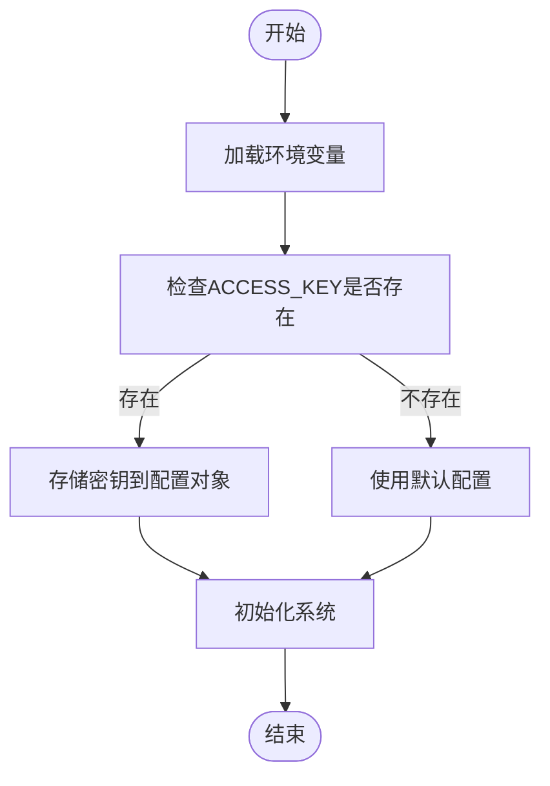
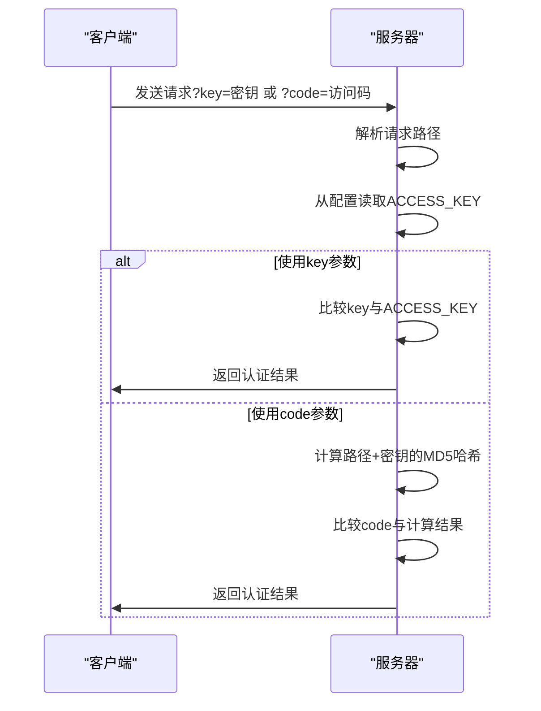

# API安全

<cite>
**本文档引用的文件**  
- [config.ts](file://lib/config.ts)
- [access-control.ts](file://lib/middleware/access-control.ts)
- [access-control.test.ts](file://lib/middleware/access-control.test.ts)
- [app-bootstrap.tsx](file://lib/app-bootstrap.tsx)
- [md5.ts](file://lib/utils/md5.ts)
- [SECURITY.md](file://SECURITY.md)
</cite>

## 目录
1. [简介](#简介)
2. [API密钥管理](#api密钥管理)
3. [认证机制](#认证机制)
4. [请求验证流程](#请求验证流程)
5. [安全最佳实践](#安全最佳实践)
6. [安全审计与应急响应](#安全审计与应急响应)

## 简介
RSSHub是一个开源的RSS生成器，为各种网站和在线服务提供RSS订阅支持。本API安全文档详细介绍了RSSHub的API密钥管理和认证机制，包括密钥的生成、配置、存储安全、轮换策略和撤销机制。文档还解释了API密钥在请求中的传递方式和验证流程，讨论了API版本控制和向后兼容性策略，提供了防止API滥用的措施，以及API安全最佳实践。

**Section sources**
- [SECURITY.md](file://SECURITY.md#L1-L10)

## API密钥管理

### 密钥生成与配置
RSSHub的API密钥通过环境变量`ACCESS_KEY`进行配置。系统在启动时从环境变量中读取该值，并将其存储在配置对象中。密钥的生成和配置过程确保了密钥的安全性和可管理性。



**Diagram sources**
- [config.ts](file://lib/config.ts#L768)
- [app-bootstrap.tsx](file://lib/app-bootstrap.tsx#L8)

**Section sources**
- [config.ts](file://lib/config.ts#L768)
- [app-bootstrap.tsx](file://lib/app-bootstrap.tsx#L8)

### 密钥存储安全
RSSHub将API密钥存储在环境变量中，而不是硬编码在源代码中。这种做法符合安全最佳实践，可以防止密钥意外泄露。系统在启动时读取环境变量，并将其存储在内存中的配置对象里，确保密钥不会被写入日志文件或其他持久化存储。

### 密钥轮换与撤销
RSSHub支持通过更新环境变量来实现密钥轮换。当需要轮换密钥时，只需更新`ACCESS_KEY`环境变量的值，然后重启服务即可。旧的密钥将立即失效，新的密钥开始生效。这种机制简单有效，可以快速响应安全事件。

## 认证机制

### 双重认证方式
RSSHub实现了双重认证机制，支持两种方式验证API请求：

1. **直接密钥认证**：通过`key`查询参数传递API密钥
2. **访问码认证**：通过`code`查询参数传递基于MD5哈希的访问码

这种双重机制提供了灵活性，允许在不暴露原始密钥的情况下进行认证。



**Diagram sources**
- [access-control.ts](file://lib/middleware/access-control.ts#L13-L20)
- [md5.ts](file://lib/utils/md5.ts#L3-L5)

**Section sources**
- [access-control.ts](file://lib/middleware/access-control.ts#L13-L20)
- [md5.ts](file://lib/utils/md5.ts#L3-L5)

### 访问控制中间件
RSSHub使用Hono框架的中间件机制实现访问控制。`access-control`中间件在请求处理链中执行，负责验证每个请求的认证信息。该中间件对根路径、robots.txt、favicon.ico和logo.png等公共资源不进行认证，而对其他所有路径实施严格的访问控制。

## 请求验证流程

### 验证逻辑
API请求验证流程如下：

1. 提取请求路径
2. 获取`key`和`code`查询参数
3. 检查是否为免认证路径
4. 验证密钥或访问码
5. 允许或拒绝请求

```mermaid
flowchart TD
A[接收请求] --> B{路径是否为<br>根路径/robots.txt/<br>favicon.ico/logo.png?}
B --> |是| C[跳过认证]
B --> |否| D{ACCESS_KEY是否配置?}
D --> |否| E[允许访问]
D --> |是| F{key参数是否<br>等于ACCESS_KEY?}
F --> |是| G[允许访问]
F --> |否| H{code参数是否等于<br>MD5(路径+ACCESS_KEY)?}
H --> |是| G
H --> |否| I[拒绝访问]
C --> J[继续处理]
E --> J
G --> J
I --> K[返回403错误]
```

**Diagram sources**
- [access-control.ts](file://lib/middleware/access-control.ts#L11-L23)

**Section sources**
- [access-control.ts](file://lib/middleware/access-control.ts#L11-L23)

### 访问码生成
访问码是通过MD5哈希算法生成的，计算公式为：`MD5(请求路径 + ACCESS_KEY)`。这种方式确保了即使攻击者截获了某个请求的访问码，也无法推导出原始密钥，也无法为其他路径生成有效的访问码。

## 安全最佳实践

### 最小权限原则
RSSHub遵循最小权限原则，只对需要认证的API端点实施访问控制。公共资源如首页、robots.txt等不需要认证即可访问，减少了不必要的认证开销。

### 防止API滥用
RSSHub通过以下措施防止API滥用：

- **请求频率限制**：通过缓存机制限制并发请求
- **输入验证**：对所有请求参数进行验证
- **错误处理**：统一的错误处理机制，避免泄露敏感信息

### 敏感操作保护
虽然RSSHub主要提供只读的RSS服务，但其认证机制为未来可能的敏感操作提供了安全基础。任何需要修改数据或执行敏感操作的API端点都可以基于现有的认证框架进行保护。

## 安全审计与应急响应

### 安全策略
RSSHub维护了明确的安全策略，鼓励用户报告安全漏洞。项目提供了安全公告渠道，用户可以通过创建安全咨询或发送邮件到指定地址报告漏洞。

### 应急响应流程
当发现安全漏洞时，应遵循以下应急响应流程：

1. 立即通知项目维护者
2. 提供详细的漏洞描述和复现步骤
3. 等待维护者确认和修复
4. 验证修复效果

**Section sources**
- [SECURITY.md](file://SECURITY.md#L7-L10)