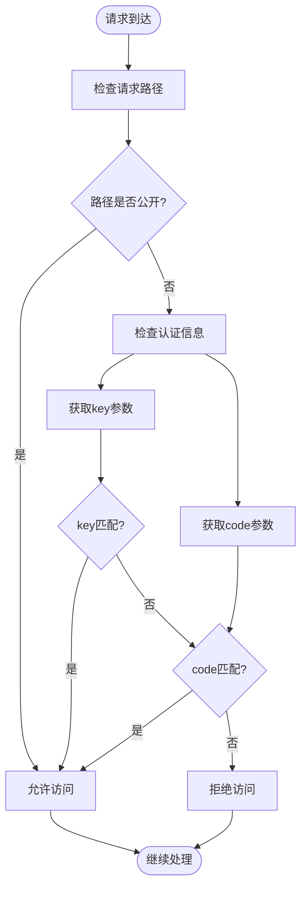

# API密钥管理

<cite>
**本文档引用的文件**
- [config.ts](file://lib/config.ts#L43-L44)
- [access-control.ts](file://lib/middleware/access-control.ts#L1-L27)
- [access-control.test.ts](file://lib/middleware/access-control.test.ts#L1-L49)
- [md5.ts](file://lib/utils/md5.ts#L1-L6)
</cite>

## 目录
1. [API密钥配置](#api密钥配置)
2. [密钥存储与安全措施](#密钥存储与安全措施)
3. [密钥验证机制](#密钥验证机制)
4. [密钥轮换与撤销](#密钥轮换与撤销)
5. [最佳实践](#最佳实践)
6. [应急响应](#应急响应)
7. [安全审计](#安全审计)

## API密钥配置

RSSHub的API密钥通过环境变量进行配置，主要配置项为`ACCESS_KEY`。该密钥用于保护API路由，防止未授权访问。配置可以在`.env`文件或环境变量中设置，当`ACCESS_KEY`被设置后，所有API请求都需要提供有效的密钥或访问码才能访问。

在配置文件中，API密钥作为访问控制的核心配置项，与其他网络、缓存和日志配置并列。通过环境变量`ACCESS_KEY`设置密钥值后，系统会在启动时读取该值并应用于访问控制中间件。

**Section sources**
- [config.ts](file://lib/config.ts#L43-L44)
- [config.ts](file://lib/config.ts#L768)

## 密钥存储与安全措施

RSSHub的API密钥存储在环境变量中，这是推荐的安全实践，避免了将密钥硬编码在源代码中。系统通过`process.env.ACCESS_KEY`读取密钥值，并在内存中使用，不会将密钥写入日志或响应中。

除了基本的API密钥，RSSHub还支持远程配置功能，通过`REMOTE_CONFIG`和`REMOTE_CONFIG_AUTH`环境变量从远程服务器获取配置。远程配置请求使用Basic认证，其中`REMOTE_CONFIG_AUTH`作为认证凭据，增加了配置传输的安全性。

系统还实现了多层安全措施，包括对敏感信息的保护和安全的加密操作。例如，MD5哈希函数用于生成访问码，确保密钥不会在传输过程中暴露。

**Section sources**
- [config.ts](file://lib/config.ts#L1160-L1178)
- [md5.ts](file://lib/utils/md5.ts#L1-L6)

## 密钥验证机制

RSSHub的API密钥验证通过中间件实现，位于`lib/middleware/access-control.ts`文件中。验证机制支持两种认证方式：直接密钥认证和访问码认证。

直接密钥认证要求请求包含`key`查询参数，其值必须与配置的`ACCESS_KEY`完全匹配。访问码认证则使用基于路径和密钥的MD5哈希值作为`code`查询参数，提供了额外的安全层，防止密钥在URL中直接暴露。

验证流程首先检查请求路径，对根路径、robots.txt等公共路径不做验证。对于需要保护的路径，系统检查是否存在有效的密钥或访问码。访问码通过`md5(requestPath + config.accessKey)`生成，确保每个路径的访问码唯一。

**Diagram sources**
- [access-control.ts](file://lib/middleware/access-control.ts#L11-L23)

**Section sources**
- [access-control.ts](file://lib/middleware/access-control.ts#L11-L23)

## 密钥轮换与撤销

RSSHub的密钥轮换机制简单而有效：通过更改环境变量`ACCESS_KEY`的值即可完成密钥轮换。由于系统在启动时读取环境变量，因此需要重启服务才能使新密钥生效。

密钥撤销同样通过更改或删除`ACCESS_KEY`环境变量实现。一旦密钥被更改或删除，之前生成的所有访问码都将失效，立即阻止使用旧密钥的访问。

系统还支持通过远程配置动态更新密钥。当配置了`REMOTE_CONFIG`时，系统会定期从远程服务器获取最新配置，包括可能更新的密钥，实现了无需重启服务的密钥更新机制。

**Section sources**
- [config.ts](file://lib/config.ts#L1159-L1178)

## 最佳实践

### 密钥长度与复杂度
API密钥应具有足够的长度和复杂度以防止暴力破解。建议使用至少16个字符的随机字符串，包含大小写字母、数字和特殊字符的组合。避免使用有意义的单词或常见模式。

### 定期更新策略
建议定期轮换API密钥，推荐周期为90天。在轮换过程中，应先更新服务端密钥，然后通知所有合法用户更新他们的配置。可以使用远程配置功能实现平滑过渡。

### 环境隔离
不同环境（开发、测试、生产）应使用不同的API密钥。生产环境的密钥应特别保护，限制访问权限。

### 最小权限原则
虽然RSSHub的API密钥是全局性的，但应遵循最小权限原则，只授予必要的访问权限。对于需要不同权限级别的场景，可以考虑部署多个实例并使用不同的密钥。

**Section sources**
- [config.ts](file://lib/config.ts#L768)
- [access-control.ts](file://lib/middleware/access-control.ts#L19)

## 应急响应

当怀疑API密钥泄露时，应立即采取以下步骤：

1. **立即撤销密钥**：更改`ACCESS_KEY`环境变量的值并重启服务，或通过远程配置更新密钥。
2. **检查日志**：审查访问日志，识别异常访问模式和潜在的滥用行为。
3. **通知相关方**：通知所有合法用户密钥已更新，并提供新密钥。
4. **调查泄露源**：确定密钥是如何泄露的，并修复安全漏洞。
5. **加强监控**：增加对API使用情况的监控，设置异常使用警报。

对于远程配置泄露，应立即更改`REMOTE_CONFIG_AUTH`的值，防止攻击者获取最新的配置信息。

**Section sources**
- [config.ts](file://lib/config.ts#L1165)
- [access-control.ts](file://lib/middleware/access-control.ts#L20)

## 安全审计

定期进行安全审计是确保API密钥安全的重要措施。审计应包括：

- **密钥强度检查**：验证API密钥是否符合复杂度要求。
- **访问模式分析**：监控API使用情况，识别异常访问模式。
- **配置审查**：检查环境变量配置，确保没有将密钥硬编码在代码中。
- **依赖项安全**：定期检查项目依赖项的安全性，及时更新有漏洞的包。
- **权限审查**：确保只有授权人员可以访问和修改API密钥。

通过自动化工具定期扫描代码库，查找可能意外提交的密钥。使用专门的密钥扫描工具可以帮助发现潜在的安全风险。

**Section sources**
- [config.ts](file://lib/config.ts#L43)
- [access-control.ts](file://lib/middleware/access-control.ts#L1-L27)