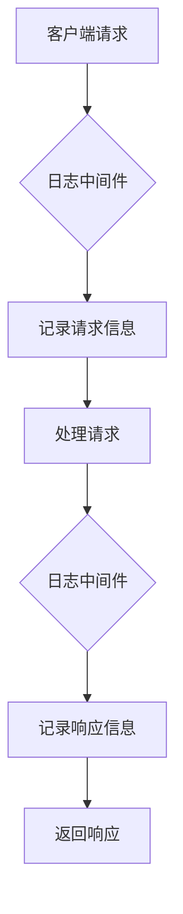
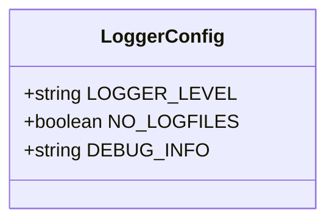
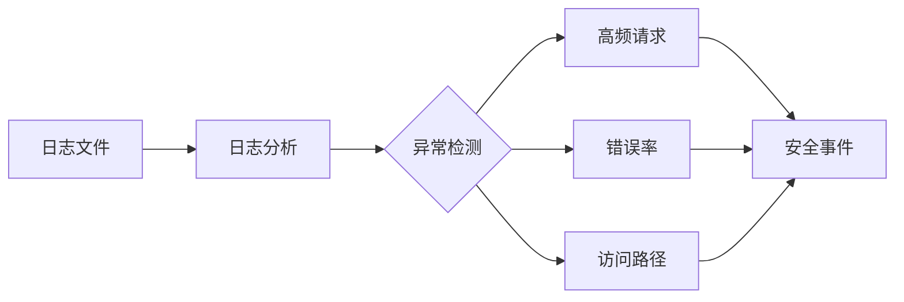
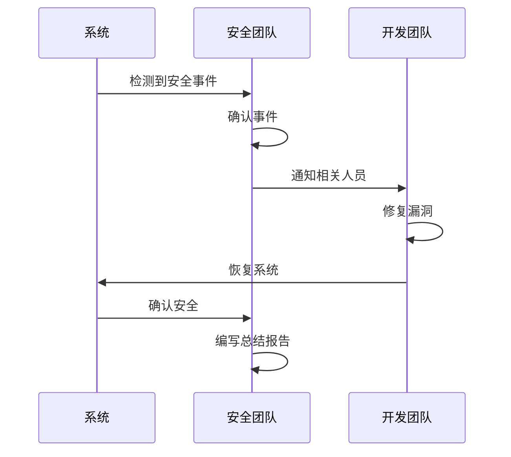

# 安全审计

<cite>
**本文档引用的文件**  
- [logger.ts](file://lib/middleware/logger.ts)
- [config.ts](file://lib/config.ts)
- [logger.ts](file://lib/utils/logger.ts)
- [sentry.ts](file://lib/middleware/sentry.ts)
- [access-control.ts](file://lib/middleware/access-control.ts)
</cite>

## 目录
1. [简介](#简介)
2. [日志记录机制](#日志记录机制)
3. [日志配置与过滤](#日志配置与过滤)
4. [日志分析与异常检测](#日志分析与异常检测)
5. [安全事件响应流程](#安全事件响应流程)
6. [审计报告生成指南](#审计报告生成指南)

## 简介
RSSHub 通过集成多种安全审计机制来确保系统的安全性和可追溯性。本文档详细说明了 RSSHub 的安全日志记录机制，包括 API 请求和操作的记录、日志格式和存储位置、日志级别和敏感信息过滤的配置方法，以及日志分析和安全事件响应流程。

**Section sources**
- [logger.ts](file://lib/middleware/logger.ts)
- [config.ts](file://lib/config.ts)

## 日志记录机制
RSSHub 使用中间件系统来记录所有 API 请求和操作。日志记录主要由 `logger.ts` 文件中的中间件处理，该中间件在请求进入和响应返回时记录相关信息。

### 记录的 API 请求和操作
- **请求信息**：包括请求方法（GET、POST 等）、请求路径、请求时间。
- **响应信息**：包括响应状态码、响应时间、请求处理耗时。
- **错误信息**：当请求处理失败时，记录错误详情。

### 日志格式
日志采用 JSON 格式，包含以下字段：
- `timestamp`：日志记录的时间戳。
- `level`：日志级别（info、error 等）。
- `message`：日志消息，包括请求和响应的详细信息。

### 存储位置
日志文件默认存储在 `logs` 目录下，具体文件包括：
- `error.log`：记录错误级别的日志。
- `combined.log`：记录所有级别的日志。

**Diagram sources**
- [logger.ts](file://lib/middleware/logger.ts)

**Section sources**
- [logger.ts](file://lib/middleware/logger.ts)
- [logger.ts](file://lib/utils/logger.ts)

## 日志配置与过滤
RSSHub 提供了多种配置选项来控制日志记录的行为，包括日志级别和敏感信息过滤。

### 配置日志级别
通过环境变量 `LOGGER_LEVEL` 可以设置日志级别，支持的级别包括：
- `info`：记录一般信息。
- `error`：仅记录错误信息。
- `debug`：记录详细的调试信息。

### 敏感信息过滤
通过配置 `NO_LOGFILES` 环境变量，可以禁用日志文件的生成，从而避免敏感信息的泄露。此外，`DEBUG_INFO` 环境变量可以控制调试信息的显示，取值为 `true` 时永久显示，取值为 `false` 时永远隐藏，取值为特定字符串时请求带上 `?debug=特定字符串` 显示。

**Diagram sources**
- [config.ts](file://lib/config.ts)

**Section sources**
- [config.ts](file://lib/config.ts)

## 日志分析与异常检测
通过分析日志文件，可以检测异常行为和安全事件。常见的分析方法包括：
- **频率分析**：检测短时间内大量请求的异常行为。
- **错误分析**：分析错误日志，找出系统中的潜在问题。
- **访问模式分析**：分析用户的访问模式，识别异常访问。

### 异常检测
- **高频请求**：通过统计请求频率，识别可能的爬虫或攻击行为。
- **错误率**：监控错误率，及时发现系统故障。
- **访问路径**：分析访问路径，识别未授权的访问尝试。

**Diagram sources**
- [logger.ts](file://lib/middleware/logger.ts)

**Section sources**
- [logger.ts](file://lib/middleware/logger.ts)

## 安全事件响应流程
当检测到安全事件时，应立即采取以下措施：
1. **确认事件**：通过日志分析确认安全事件的性质和范围。
2. **隔离受影响的系统**：防止事件进一步扩散。
3. **通知相关人员**：通知开发团队和安全团队。
4. **修复漏洞**：根据事件的性质修复系统中的漏洞。
5. **恢复系统**：在确认安全后恢复系统正常运行。
6. **总结报告**：编写安全事件总结报告，记录事件的处理过程和经验教训。

**Diagram sources**
- [sentry.ts](file://lib/middleware/sentry.ts)

**Section sources**
- [sentry.ts](file://lib/middleware/sentry.ts)

## 审计报告生成指南
审计报告应包含以下内容：
- **事件概述**：简要描述安全事件的性质和影响。
- **检测方法**：说明如何通过日志分析检测到该事件。
- **处理过程**：详细记录事件的处理步骤。
- **修复措施**：列出采取的修复措施。
- **预防建议**：提出防止类似事件再次发生的建议。

**Section sources**
- [sentry.ts](file://lib/middleware/sentry.ts)
- [access-control.ts](file://lib/middleware/access-control.ts)