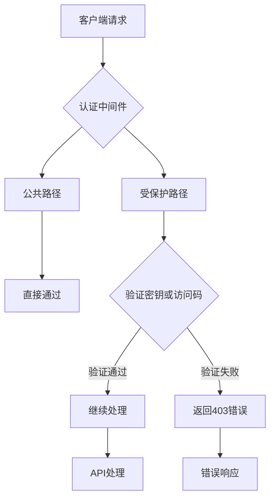
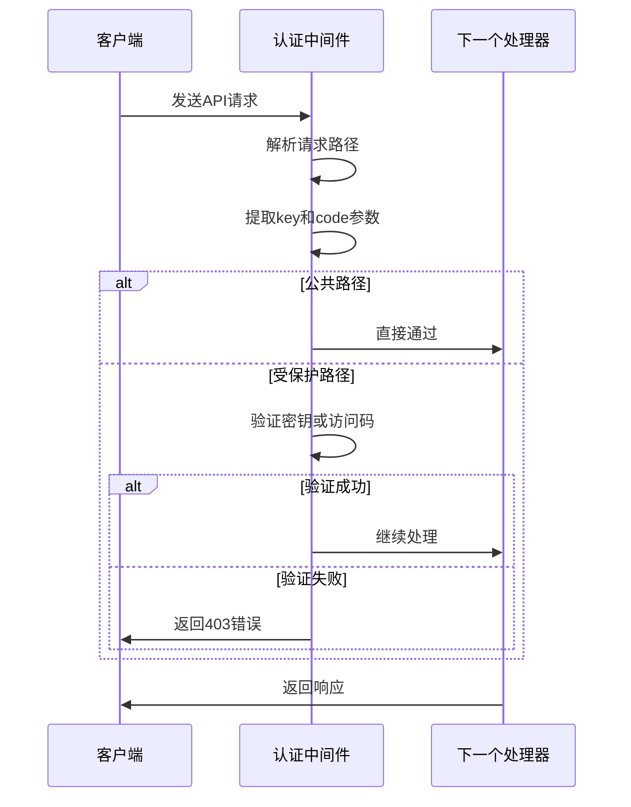
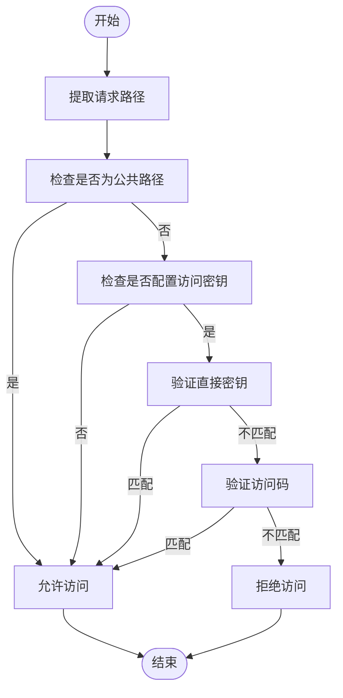
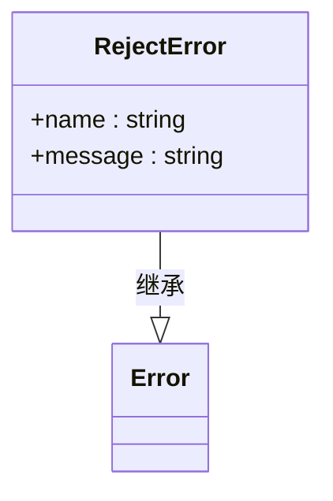

# 认证机制

<cite>
**本文档引用的文件**
- [access-control.ts](file://lib/middleware/access-control.ts)
- [config.ts](file://lib/config.ts)
- [reject.ts](file://lib/errors/types/reject.ts)
- [errors.tsx](file://lib/errors/index.tsx)
- [app-bootstrap.tsx](file://lib/app-bootstrap.tsx)
- [md5.ts](file://lib/utils/md5.ts)
</cite>

## 目录
1. [简介](#简介)
2. [认证机制概述](#认证机制概述)
3. [认证中间件分析](#认证中间件分析)
4. [请求验证逻辑](#请求验证逻辑)
5. [错误处理机制](#错误处理机制)
6. [安全性考虑](#安全性考虑)
7. [配置与部署](#配置与部署)
8. [扩展与自定义](#扩展与自定义)

## 简介
RSSHub的认证机制为API访问提供了安全控制，通过基于API密钥的认证流程保护系统资源。本文档深入分析RSSHub的认证系统，包括认证中间件的工作原理、请求验证逻辑、错误处理策略以及安全性考虑。认证机制确保只有经过授权的请求才能访问受保护的API端点，同时为公共访问提供例外处理。

## 认证机制概述
RSSHub的认证系统采用基于API密钥的访问控制机制，通过中间件模式在请求处理流程中进行拦截和验证。系统支持两种认证方式：直接API密钥和基于路径的访问码。认证中间件在应用启动时被注册，对所有进入的请求进行检查，确保只有经过验证的请求才能继续处理。

认证机制的主要特点包括：
- 基于环境变量配置的API密钥
- 支持直接密钥和加密访问码两种认证方式
- 对特定公共路径的免认证访问
- 统一的错误处理和响应策略
- 与Hono框架的中间件系统深度集成

**Diagram sources**
- [access-control.ts](file://lib/middleware/access-control.ts#L1-L26)
- [app-bootstrap.tsx](file://lib/app-bootstrap.tsx#L39)

## 认证中间件分析
认证中间件是RSSHub认证系统的核心组件，负责拦截和验证所有进入的API请求。中间件实现为Hono框架的`MiddlewareHandler`类型，通过异步函数处理请求上下文和下一个处理程序。

中间件的主要工作流程包括：
1. 解析请求路径
2. 提取查询参数中的密钥和访问码
3. 判断是否为公共路径
4. 验证密钥或访问码的有效性
5. 根据验证结果决定是否继续处理或拒绝请求

**Diagram sources**
- [access-control.ts](file://lib/middleware/access-control.ts#L11-L26)
- [app-bootstrap.tsx](file://lib/app-bootstrap.tsx#L39)

**Section sources**
- [access-control.ts](file://lib/middleware/access-control.ts#L1-L26)

## 请求验证逻辑
RSSHub的请求验证逻辑实现了双重认证机制，支持直接API密钥和基于路径的访问码两种方式。验证逻辑在`access-control.ts`文件中实现，通过配置的访问密钥对请求进行验证。

### 认证方式
系统支持两种认证方式：
1. **直接密钥认证**：通过`key`查询参数传递API密钥
2. **访问码认证**：通过`code`查询参数传递基于路径和密钥生成的MD5哈希值

### 验证流程
验证流程遵循以下步骤：
1. 获取请求路径
2. 从查询参数中提取`key`和`code`值
3. 检查是否为公共路径（根路径、robots.txt等）
4. 如果配置了访问密钥，则验证直接密钥或访问码
5. 根据验证结果决定是否继续处理

**Diagram sources**
- [access-control.ts](file://lib/middleware/access-control.ts#L16-L22)
- [config.ts](file://lib/config.ts#L768)

**Section sources**
- [access-control.ts](file://lib/middleware/access-control.ts#L1-L26)

## 错误处理机制
RSSHub的错误处理机制为认证失败提供了统一的响应策略。当认证验证失败时，系统会抛出特定的错误类型，并由全局错误处理器进行处理。

### 错误类型
系统定义了`RejectError`作为认证失败的错误类型，继承自JavaScript的`Error`类。该错误在认证中间件中被抛出，表示访问被拒绝。

**Diagram sources**
- [reject.ts](file://lib/errors/types/reject.ts#L1-L5)
- [access-control.ts](file://lib/middleware/access-control.ts#L7-L9)

### 错误响应
全局错误处理器根据错误类型设置相应的HTTP状态码和响应内容。对于`RejectError`，系统会返回403 Forbidden状态码，并提供详细的错误信息。

错误处理流程：
1. 认证中间件抛出`RejectError`
2. 全局错误处理器捕获错误
3. 根据错误类型设置HTTP状态码
4. 生成JSON或HTML格式的错误响应
5. 返回给客户端

**Section sources**
- [reject.ts](file://lib/errors/types/reject.ts#L1-L5)
- [errors.tsx](file://lib/errors/index.tsx#L57-L59)

## 安全性考虑
RSSHub的认证机制在设计时考虑了多个安全性方面，确保API访问的安全性和可靠性。

### 认证安全性
- **密钥保密性**：API密钥通过环境变量配置，避免硬编码在源代码中
- **访问码生成**：访问码基于请求路径和密钥生成，防止简单的密钥猜测攻击
- **双重认证**：支持两种认证方式，增加攻击者破解的难度

### 防御机制
系统通过以下机制增强安全性：
- **路径绑定**：访问码与特定请求路径绑定，防止重放攻击
- **无状态验证**：认证过程不依赖服务器端会话，减少服务器负担
- **公共路径例外**：对必要的公共资源提供免认证访问

### 潜在安全风险
尽管当前机制提供了基本的安全保护，但仍存在一些潜在风险：
- **无时间戳验证**：当前机制不包含时间戳验证，可能存在重放攻击风险
- **无速率限制**：缺乏对认证尝试的速率限制，可能遭受暴力破解攻击
- **MD5哈希**：使用MD5哈希算法，虽然对于此用例足够，但不是最安全的哈希算法选择

**Section sources**
- [access-control.ts](file://lib/middleware/access-control.ts#L19-L21)
- [md5.ts](file://lib/utils/md5.ts#L3-L5)

## 配置与部署
RSSHub的认证机制通过环境变量进行配置，便于在不同部署环境中灵活调整。

### 配置方式
认证功能通过`ACCESS_KEY`环境变量启用和配置：
- 设置`ACCESS_KEY`环境变量以启用认证
- 留空或不设置则禁用认证功能
- 密钥值应为足够复杂的字符串以确保安全性

### 部署建议
在生产环境中部署时，建议：
- 使用安全的密钥管理方案存储API密钥
- 定期轮换API密钥
- 监控认证失败的请求以检测潜在的攻击行为
- 结合其他安全措施如IP白名单、速率限制等

**Section sources**
- [config.ts](file://lib/config.ts#L768)
- [access-control.ts](file://lib/middleware/access-control.ts#L3)

## 扩展与自定义
RSSHub的模块化设计允许开发者根据需要扩展和自定义认证逻辑。

### 扩展方式
可以通过以下方式扩展认证功能：
- 实现更复杂的认证机制，如JWT令牌
- 添加时间戳验证防止重放攻击
- 集成第三方身份验证服务
- 实现基于角色的访问控制

### 自定义实现
要自定义认证逻辑，可以：
1. 创建新的中间件文件
2. 实现自定义的验证逻辑
3. 在`app-bootstrap.tsx`中注册新的中间件
4. 替换或补充现有的认证中间件

示例扩展方向：
- 添加请求频率限制
- 实现多因素认证
- 集成OAuth2.0认证
- 添加IP地址白名单功能

**Section sources**
- [app-bootstrap.tsx](file://lib/app-bootstrap.tsx#L39)
- [access-control.ts](file://lib/middleware/access-control.ts#L11-L26)