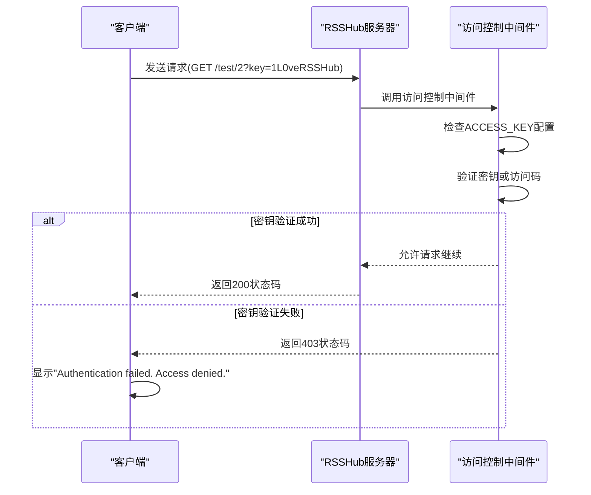
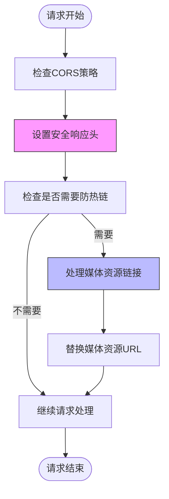
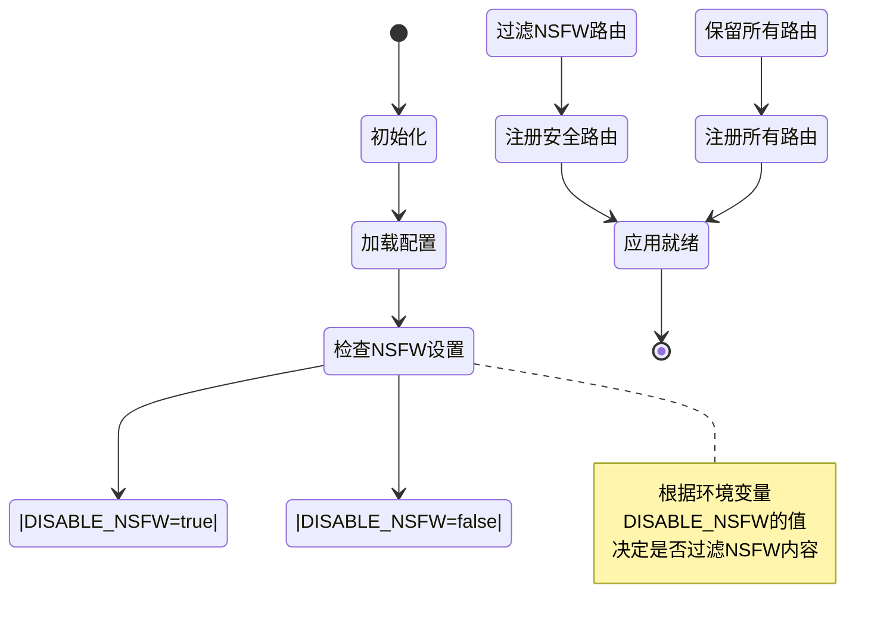
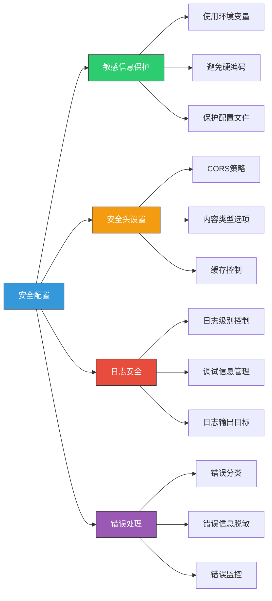
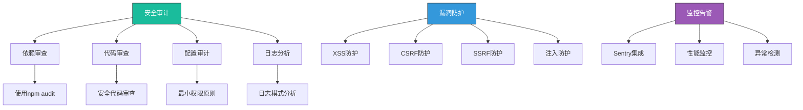

# 安全配置

<cite>
**本文档引用的文件**
- [config.ts](file://lib/config.ts)
- [access-control.ts](file://lib/middleware/access-control.ts)
- [header.ts](file://lib/middleware/header.ts)
- [anti-hotlink.ts](file://lib/middleware/anti-hotlink.ts)
- [cache.ts](file://lib/middleware/cache.ts)
- [sentry.ts](file://lib/middleware/sentry.ts)
- [SECURITY.md](file://SECURITY.md)
- [rsshub.env](file://scripts/ansible/rsshub.env)
</cite>

## 目录
1. [简介](#简介)
2. [访问控制与API密钥管理](#访问控制与api密钥管理)
3. [CORS策略与内容安全策略](#cors策略与内容安全策略)
4. [IP白名单/黑名单与请求频率限制](#ip白名单黑名单与请求频率限制)
5. [敏感路由保护](#敏感路由保护)
6. [HTTPS配置与证书管理](#https配置与证书管理)
7. [安全最佳实践](#安全最佳实践)
8. [安全审计建议与漏洞防护](#安全审计建议与漏洞防护)
9. [安全事件应急响应流程](#安全事件应急响应流程)
10. [附录](#附录)

## 简介
RSSHub是一个开源的RSS生成器，本安全配置文档全面涵盖了RSSHub所有安全相关的配置选项。文档详细说明了访问控制、API密钥管理、CORS策略、内容安全策略等配置方法。同时解释了如何配置IP白名单/黑名单、请求频率限制、敏感路由保护等安全措施。提供了HTTPS配置和证书管理指南，讨论了安全最佳实践，包括敏感信息保护、安全头设置、日志安全等。包含安全审计建议和常见安全漏洞的防护措施，以及安全事件的应急响应流程。

## 访问控制与API密钥管理

RSSHub提供了基于访问密钥的访问控制机制，通过配置ACCESS_KEY环境变量来实现API密钥管理。当设置了ACCESS_KEY时，所有非公开路径的请求都需要提供有效的访问密钥或访问码才能访问。

访问控制支持两种验证方式：
1. **直接密钥验证**：通过`key`查询参数传递与配置中相同的密钥
2. **动态访问码验证**：通过`code`查询参数传递基于路径和密钥生成的MD5哈希值

公开路径（如根路径、robots.txt、favicon.ico、logo.png）不受访问控制限制，可以直接访问。这种双重验证机制既提供了简单的密钥验证，又通过动态访问码增强了安全性，防止密钥在URL中直接暴露。



**Diagram sources**
- [access-control.ts](file://lib/middleware/access-control.ts#L11-L26)
- [access-control.test.ts](file://lib/middleware/access-control.test.ts#L17-L48)

**Section sources**
- [config.ts](file://lib/config.ts#L42-L43)
- [access-control.ts](file://lib/middleware/access-control.ts#L1-L27)

## CORS策略与内容安全策略

RSSHub通过配置ALLOW_ORIGIN环境变量来设置CORS（跨域资源共享）策略。如果未设置ALLOW_ORIGIN，则默认允许来自请求主机的跨域访问。这一策略通过在响应头中设置"Access-Control-Allow-Origin"来实现。

在内容安全方面，RSSHub设置了多个安全相关的HTTP响应头：
- "Access-Control-Allow-Methods"：限制允许的HTTP方法为GET
- "Content-Type"：设置内容类型为application/xml; charset=utf-8
- "Cache-Control"：设置公共缓存策略和最大缓存时间
- "X-Content-Type-Options"：设置为"nosniff"，防止MIME类型嗅探攻击

此外，系统还实现了防热链（anti-hotlink）中间件，用于保护媒体资源不被其他网站直接引用。通过配置HOTLINK_TEMPLATE、HOTLINK_INCLUDE_PATHS和HOTLINK_EXCLUDE_PATHS等参数，可以灵活控制哪些路径的媒体资源需要进行热链保护。



**Diagram sources**
- [header.ts](file://lib/middleware/header.ts#L8-L56)
- [anti-hotlink.ts](file://lib/middleware/anti-hotlink.ts#L1-L171)

**Section sources**
- [config.ts](file://lib/config.ts#L21-L22)
- [header.ts](file://lib/middleware/header.ts#L1-L56)
- [anti-hotlink.ts](file://lib/middleware/anti-hotlink.ts#L1-L171)

## IP白名单/黑名单与请求频率限制

RSSHub通过缓存机制和中间件实现了请求频率限制和并发控制。系统使用Redis或内存缓存来跟踪请求状态，防止同一路径的并发请求导致服务器资源过度消耗。

当一个请求正在处理时，系统会在缓存中设置一个控制键（controlKey），标记该路径正在被请求。后续的相同路径请求会检查这个控制键，如果发现请求正在进行，会等待一段时间后重试。如果在指定的重试次数内仍然无法获取到结果，系统会返回"Request in progress"错误。

这种机制有效地限制了请求频率，防止了恶意用户通过快速重复请求来消耗服务器资源。同时，通过配置CACHE_REQUEST_TIMEOUT参数，可以控制请求等待的最长时间，避免长时间的资源锁定。

```mermaid
graph TD
A[新请求] --> B{缓存可用?}
B --> |否| C[直接处理请求]
B --> |是| D{路径在bypassList?}
D --> |是| C
D --> |否| E[生成缓存键和控制键]
E --> F{控制键值为"1"?}
F --> |是| G[等待并重试]
G --> H{重试次数>0?}
H --> |是| G
H --> |否| I[抛出RequestInProgressError]
F --> |否| J{缓存值存在?}
J --> |是| K[返回缓存内容]
J --> |否| L[设置控制键为"1"]
L --> M[处理请求]
M --> N[存储缓存结果]
N --> O[设置控制键为"0"]
O --> P[返回响应]
style C fill:#f96,stroke:#333
style I fill:#f66,stroke:#333
style P fill:#6f9,stroke:#333
```

**Diagram sources**
- [cache.ts](file://lib/middleware/cache.ts#L1-L84)
- [index.ts](file://lib/utils/cache/index.ts#L16-L60)

**Section sources**
- [config.ts](file://lib/config.ts#L23-L28)
- [cache.ts](file://lib/middleware/cache.ts#L1-L84)

## 敏感路由保护

RSSHub提供了多种机制来保护敏感路由和内容。首先，通过ACCESS_KEY机制可以保护所有非公开路径，确保只有授权用户才能访问特定的RSS源。

其次，系统提供了DISABLE_NSFW配置选项，用于禁用所有包含成人内容（NSFW）的路由。当设置DISABLE_NSFW=true时，系统会自动过滤掉所有标记为NSFW的路由，防止用户访问不当内容。

此外，RSSHub还实现了路由注册表（registry）机制，在应用启动时根据配置动态加载路由，确保只有符合安全策略的路由才会被注册和暴露。



**Diagram sources**
- [registry.test.ts](file://lib/registry.test.ts#L42-L64)
- [config.ts](file://lib/config.ts#L60-L61)

**Section sources**
- [config.ts](file://lib/config.ts#L60-L61)
- [registry.test.ts](file://lib/registry.test.ts#L42-L64)

## HTTPS配置与证书管理

RSSHub本身不直接处理HTTPS配置和证书管理，而是依赖于前端代理服务器（如Nginx、Apache）或云服务（如Cloudflare）来处理SSL/TLS终止。这种架构设计使得RSSHub可以专注于核心功能，而将复杂的证书管理和HTTPS配置交给专门的工具或服务。

在生产环境中，建议使用反向代理服务器来为RSSHub提供HTTPS支持。代理服务器可以配置SSL证书、处理HTTP到HTTPS的重定向，并提供额外的安全功能如WAF（Web应用防火墙）。

通过环境变量LISTEN_INADDR_ANY可以控制RSSHub是否允许外部连接。在与反向代理配合使用时，通常将RSSHub配置为只监听本地回环接口，由反向代理负责外部通信，这样可以增加一层安全隔离。

**Section sources**
- [config.ts](file://lib/config.ts#L16-L17)
- [server.ts](file://lib/server.ts)

## 安全最佳实践

### 敏感信息保护
RSSHub通过环境变量管理所有敏感信息，如API密钥、认证凭据等。这些信息不应硬编码在代码中，而应通过环境变量或配置文件注入。建议使用dotenv文件来管理环境变量，并确保这些文件不被提交到版本控制系统中。

### 安全头设置
除了CORS相关的安全头外，RSSHub还设置了ETag和Last-Modified头来支持缓存验证，减少不必要的数据传输。通过X-RSSHub-Route头可以标识请求的路由路径，便于调试和监控。

### 日志安全
RSSHub提供了详细的日志记录功能，通过LOGGER_LEVEL控制日志级别，DEBUG_INFO控制调试信息的显示。建议在生产环境中将日志级别设置为"info"或更高，避免泄露敏感信息。同时，可以通过NO_LOGFILES禁用日志文件，将日志输出到标准输出，便于与容器化环境集成。



**Diagram sources**
- [config.ts](file://lib/config.ts#L44-L53)
- [logger.ts](file://lib/middleware/logger.ts#L1-L46)

**Section sources**
- [config.ts](file://lib/config.ts#L44-L53)
- [logger.ts](file://lib/middleware/logger.ts#L1-L46)

## 安全审计建议与漏洞防护

### 安全审计建议
1. **定期审查依赖项**：使用工具检查项目依赖是否存在已知漏洞
2. **代码审查**：定期进行安全代码审查，重点关注输入验证和输出编码
3. **配置审计**：定期检查生产环境的配置，确保没有不必要的功能开启
4. **日志分析**：监控日志中的异常模式，及时发现潜在的安全事件

### 常见漏洞防护
- **XSS防护**：通过正确设置Content-Type头和使用安全的模板引擎防止跨站脚本攻击
- **CSRF防护**：虽然RSSHub主要是API服务，但仍需注意防止跨站请求伪造
- **SSRF防护**：在处理外部URL时进行验证，防止服务器端请求伪造
- **注入攻击防护**：对所有用户输入进行验证和清理，防止各种注入攻击

### 监控与告警
RSSHub集成了Sentry错误监控，通过SENTRY环境变量配置DSN可以启用错误跟踪。系统会在路由处理时间超过阈值时发送告警，帮助及时发现性能问题和潜在的拒绝服务攻击。



**Diagram sources**
- [sentry.ts](file://lib/middleware/sentry.ts#L1-L29)
- [config.ts](file://lib/config.ts#L51-L53)

**Section sources**
- [sentry.ts](file://lib/middleware/sentry.ts#L1-L29)
- [SECURITY.md](file://SECURITY.md)

## 安全事件应急响应流程

当发现安全漏洞或安全事件时，应遵循以下应急响应流程：

1. **立即报告**：通过GitHub安全咨询或发送邮件到i@diygod.me报告漏洞
2. **临时缓解**：根据漏洞性质，采取临时措施如关闭相关功能、更新防火墙规则等
3. **深入调查**：分析漏洞的根本原因和影响范围
4. **修复开发**：开发安全补丁或修复代码
5. **测试验证**：在安全环境中测试修复效果
6. **部署更新**：将修复部署到生产环境
7. **通知用户**：向用户通报安全事件和修复情况
8. **事后总结**：分析事件原因，改进安全流程

RSSHub项目维护者承诺会及时调查所有合法的安全报告，并尽快修复问题。建议用户保持RSSHub版本更新，以获得最新的安全补丁。

**Section sources**
- [SECURITY.md](file://SECURITY.md)

## 结论
RSSHub提供了全面的安全配置选项，通过合理的配置可以有效保护RSSHub实例的安全。建议用户根据实际需求配置访问控制、CORS策略、缓存机制等安全功能，并遵循安全最佳实践。定期进行安全审计，及时响应安全事件，确保RSSHub服务的稳定和安全。

## 附录

### 环境变量配置示例
```env
# 访问控制
ACCESS_KEY=your_secret_key

# CORS策略
ALLOW_ORIGIN=https://example.com

# 缓存配置
CACHE_TYPE=redis
CACHE_EXPIRE=300
REDIS_URL=redis://localhost:6379/

# 日志配置
LOGGER_LEVEL=info
DEBUG_INFO=false

# 安全功能
DISABLE_NSFW=true
ALLOW_USER_SUPPLY_UNSAFE_DOMAIN=false

# 监控
SENTRY=https://your-sentry-dsn
```

**Section sources**
- [rsshub.env](file://scripts/ansible/rsshub.env)