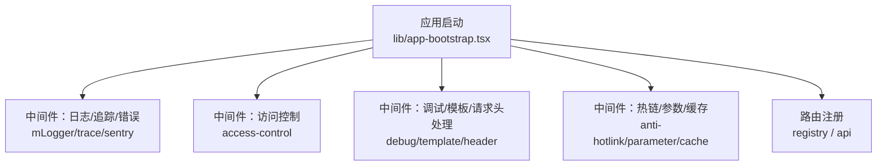
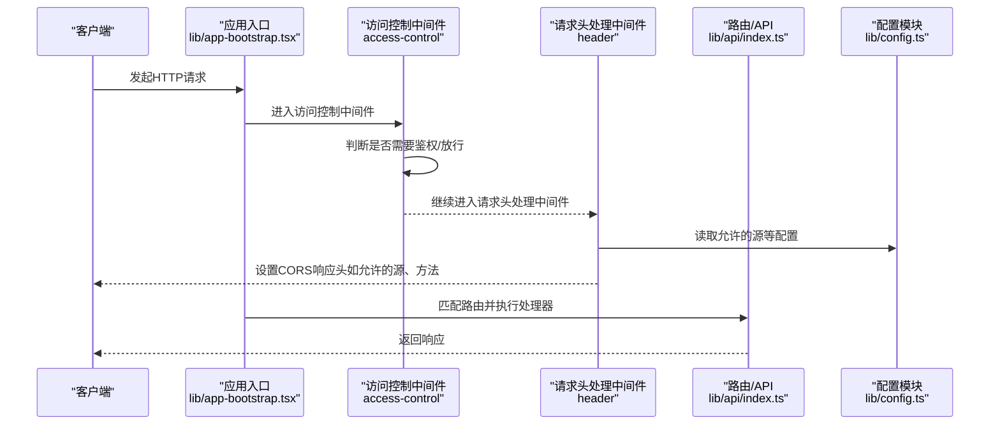
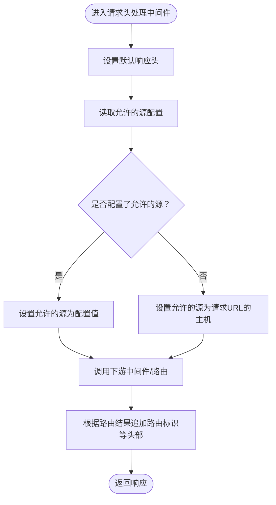
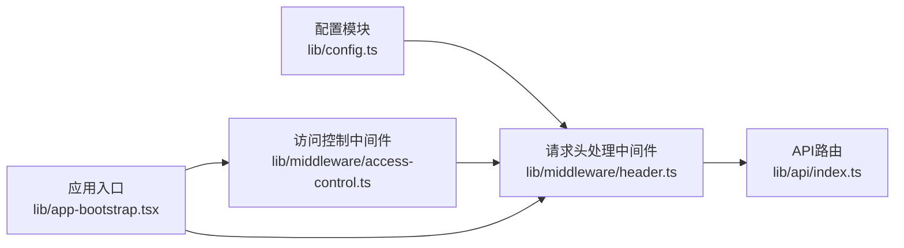

# CORS配置

<cite>
**本文引用的文件**
- [lib/middleware/header.ts](file://lib/middleware/header.ts)
- [lib/config.ts](file://lib/config.ts)
- [lib/app-bootstrap.tsx](file://lib/app-bootstrap.tsx)
- [lib/middleware/access-control.ts](file://lib/middleware/access-control.ts)
- [lib/errors/index.tsx](file://lib/errors/index.tsx)
- [lib/middleware/header.test.ts](file://lib/middleware/header.test.ts)
- [lib/api/index.ts](file://lib/api/index.ts)
</cite>

## 目录
1. [引言](#引言)
2. [项目结构](#项目结构)
3. [核心组件](#核心组件)
4. [架构总览](#架构总览)
5. [详细组件分析](#详细组件分析)
6. [依赖关系分析](#依赖关系分析)
7. [性能考量](#性能考量)
8. [故障排查指南](#故障排查指南)
9. [结论](#结论)
10. [附录](#附录)

## 引言
本文件面向RSSHub的部署与运维人员，提供一份系统化的CORS（跨域资源共享）配置指南。RSSHub基于Hono框架构建，通过中间件链路统一处理HTTP请求与响应头。当前实现中，CORS相关能力主要由“请求头处理”中间件完成，同时结合全局配置项与访问控制中间件共同作用。本文将解释CORS工作原理、在Web安全中的重要性，并给出可操作的配置步骤、预检请求处理机制说明、安全最佳实践以及常见问题的调试方法。

## 项目结构
RSSHub采用中间件驱动的请求处理模型，CORS相关逻辑集中在“请求头处理”中间件中，全局CORS配置来源于配置模块，应用启动时按固定顺序挂载中间件。

图表来源
- [lib/app-bootstrap.tsx](file://lib/app-bootstrap.tsx#L25-L54)

章节来源
- [lib/app-bootstrap.tsx](file://lib/app-bootstrap.tsx#L25-L54)

## 核心组件
- 请求头处理中间件：负责设置CORS相关响应头，包括允许的源、允许的方法等。
- 全局配置模块：提供允许的源配置项，供请求头处理中间件读取。
- 访问控制中间件：对特定路径进行访问控制，影响CORS策略的生效范围。
- 错误处理：统一返回状态码与错误信息，便于前端识别CORS相关异常。

章节来源
- [lib/middleware/header.ts](file://lib/middleware/header.ts#L1-L56)
- [lib/config.ts](file://lib/config.ts#L241-L336)
- [lib/middleware/access-control.ts](file://lib/middleware/access-control.ts#L1-L27)
- [lib/errors/index.tsx](file://lib/errors/index.tsx#L1-L83)

## 架构总览
下图展示了RSSHub中与CORS相关的组件交互与数据流。

图表来源
- [lib/app-bootstrap.tsx](file://lib/app-bootstrap.tsx#L25-L54)
- [lib/middleware/access-control.ts](file://lib/middleware/access-control.ts#L1-L27)
- [lib/middleware/header.ts](file://lib/middleware/header.ts#L1-L56)
- [lib/config.ts](file://lib/config.ts#L241-L336)
- [lib/api/index.ts](file://lib/api/index.ts#L1-L36)

## 详细组件分析

### 请求头处理中间件（CORS相关）
该中间件负责：
- 设置默认响应头（如内容类型、缓存控制、安全头等）
- 动态设置“允许的源”响应头
- 仅在匹配到具体路由时追加“路由标识”等头部

关键点：
- 允许的方法：当前固定为“GET”
- 允许的源：优先使用配置项；若未配置，则回退到请求URL的主机部分
- 其他安全与性能相关头部也会在此阶段统一设置

图表来源
- [lib/middleware/header.ts](file://lib/middleware/header.ts#L1-L56)

章节来源
- [lib/middleware/header.ts](file://lib/middleware/header.ts#L1-L56)

### 全局配置模块（CORS相关配置项）
- 允许的源：通过配置项提供，供请求头处理中间件读取
- 其他网络与缓存配置：影响响应头中的缓存控制等

章节来源
- [lib/config.ts](file://lib/config.ts#L241-L336)

### 访问控制中间件（与CORS的关系）
- 对特定路径进行访问控制，可能影响CORS策略的生效范围
- 当前实现中，对静态资源路径放行，其余路径进行鉴权校验

章节来源
- [lib/middleware/access-control.ts](file://lib/middleware/access-control.ts#L1-L27)

### 错误处理（与CORS异常识别）
- 统一错误处理会根据错误类型设置状态码
- 前端可通过状态码与错误信息识别CORS相关问题（例如403、404、503等）

章节来源
- [lib/errors/index.tsx](file://lib/errors/index.tsx#L1-L83)

## 依赖关系分析
- 应用启动时按顺序挂载中间件，请求头处理中间件位于访问控制之后，确保在鉴权通过后再设置CORS响应头
- 请求头处理中间件依赖配置模块提供的允许的源配置
- API路由通过OpenAPI注册，CORS策略对所有路由生效

图表来源
- [lib/app-bootstrap.tsx](file://lib/app-bootstrap.tsx#L25-L54)
- [lib/middleware/access-control.ts](file://lib/middleware/access-control.ts#L1-L27)
- [lib/middleware/header.ts](file://lib/middleware/header.ts#L1-L56)
- [lib/config.ts](file://lib/config.ts#L241-L336)
- [lib/api/index.ts](file://lib/api/index.ts#L1-L36)

章节来源
- [lib/app-bootstrap.tsx](file://lib/app-bootstrap.tsx#L25-L54)
- [lib/middleware/access-control.ts](file://lib/middleware/access-control.ts#L1-L27)
- [lib/middleware/header.ts](file://lib/middleware/header.ts#L1-L56)
- [lib/config.ts](file://lib/config.ts#L241-L336)
- [lib/api/index.ts](file://lib/api/index.ts#L1-L36)

## 性能考量
- 响应头处理中间件在每个请求上都会设置默认头部，属于轻量操作
- 若启用ETag与条件请求，可减少不必要的数据传输，间接提升跨域场景下的用户体验
- 缓存控制头由配置模块计算，合理设置可降低重复请求成本

章节来源
- [lib/middleware/header.ts](file://lib/middleware/header.ts#L1-L56)
- [lib/config.ts](file://lib/config.ts#L241-L336)

## 故障排查指南
- 验证CORS响应头是否正确设置
  - 可通过测试用例或本地请求验证“允许的源”“允许的方法”等响应头
  - 示例参考：[测试用例](file://lib/middleware/header.test.ts#L1-L40)
- 检查允许的源配置
  - 确认配置项已正确设置，且与前端域名一致
  - 参考：[允许的源配置读取](file://lib/middleware/header.ts#L22-L30)、[配置项定义](file://lib/config.ts#L241-L336)
- 预检请求（OPTIONS）处理
  - 当前实现中，请求头处理中间件仅设置默认响应头，未显式处理OPTIONS方法
  - 若前端发起复杂跨域请求（含自定义头或非简单方法），需确认浏览器是否收到预检响应
  - 可通过抓包工具观察OPTIONS请求是否得到预期响应头
- 访问控制与CORS冲突
  - 若访问控制中间件拒绝某些路径，这些路径不会进入后续中间件链，自然也不会设置CORS头
  - 参考：[访问控制逻辑](file://lib/middleware/access-control.ts#L1-L27)

章节来源
- [lib/middleware/header.test.ts](file://lib/middleware/header.test.ts#L1-L40)
- [lib/middleware/header.ts](file://lib/middleware/header.ts#L1-L56)
- [lib/config.ts](file://lib/config.ts#L241-L336)
- [lib/middleware/access-control.ts](file://lib/middleware/access-control.ts#L1-L27)

## 结论
RSSHub当前的CORS实现以“请求头处理中间件”为核心，通过配置模块提供允许的源，确保在鉴权通过后为跨域请求返回必要的响应头。当前实现默认允许的方法为“GET”，允许的源优先使用配置，未显式处理OPTIONS预检请求。建议在生产环境中：
- 明确限定允许的源，避免使用通配符
- 如需支持复杂跨域请求，考虑在应用层增加对OPTIONS的显式处理
- 结合访问控制策略，确保敏感接口不被跨域滥用

## 附录

### CORS工作原理与在Web安全中的重要性
- CORS通过服务器在响应头中声明允许的源、方法与头，浏览器据此决定是否放行跨域请求
- 合理配置可有效降低CSRF、点击劫持等风险，避免将服务暴露给不受信任的域

### 配置允许的源（origins）
- 在配置模块中设置允许的源，请求头处理中间件会将其写入响应头
- 若未设置，将回退到请求URL的主机部分

章节来源
- [lib/config.ts](file://lib/config.ts#L241-L336)
- [lib/middleware/header.ts](file://lib/middleware/header.ts#L22-L30)

### 配置允许的HTTP方法与请求头
- 当前实现默认允许的方法为“GET”
- 自定义方法或请求头需结合路由与中间件扩展，但RSSHub当前未提供集中式的“允许方法/请求头”配置项

章节来源
- [lib/middleware/header.ts](file://lib/middleware/header.ts#L8-L12)

### 预检请求（preflight requests）处理机制
- 当前中间件链未显式处理OPTIONS方法
- 若前端发起复杂跨域请求，浏览器会先发送OPTIONS预检；请确认预检请求是否得到正确的响应头

章节来源
- [lib/middleware/header.ts](file://lib/middleware/header.ts#L1-L56)

### 安全最佳实践
- 避免使用通配符作为允许的源
- 严格限定允许的源列表，仅允许受信域名
- 仅在必要时开放复杂方法与自定义请求头
- 对敏感接口启用访问控制中间件，避免跨域滥用

章节来源
- [lib/middleware/access-control.ts](file://lib/middleware/access-control.ts#L1-L27)
- [lib/middleware/header.ts](file://lib/middleware/header.ts#L1-L56)

### 实际配置示例与调试方法
- 设置允许的源
  - 参考：[允许的源配置读取](file://lib/middleware/header.ts#L22-L30)、[配置项定义](file://lib/config.ts#L241-L336)
- 验证CORS响应头
  - 参考测试用例：[header测试](file://lib/middleware/header.test.ts#L1-L40)
- 预检请求调试
  - 使用浏览器开发者工具或抓包工具观察OPTIONS请求与响应头
  - 确认响应头中包含允许的源与方法

章节来源
- [lib/middleware/header.test.ts](file://lib/middleware/header.test.ts#L1-L40)
- [lib/middleware/header.ts](file://lib/middleware/header.ts#L1-L56)
- [lib/config.ts](file://lib/config.ts#L241-L336)