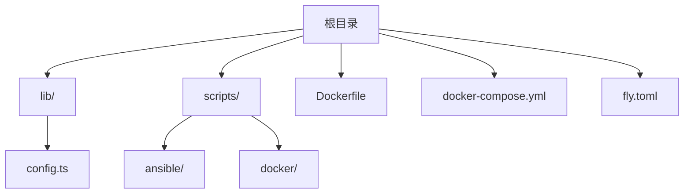
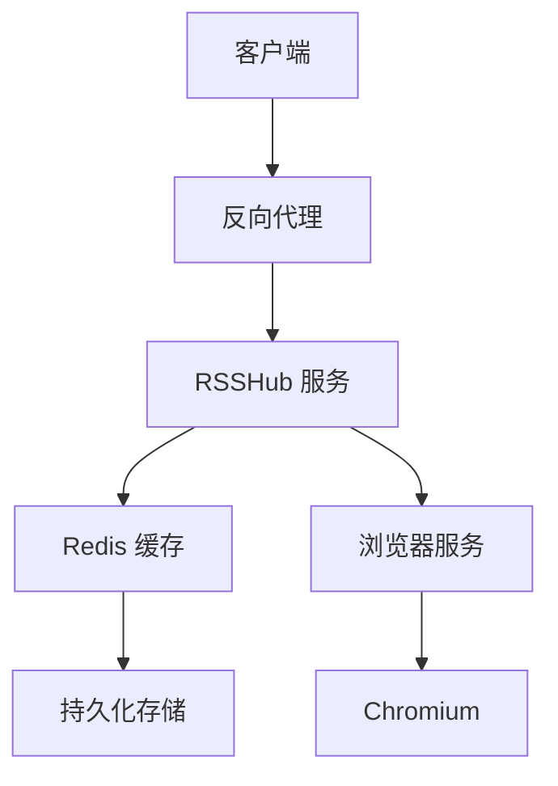
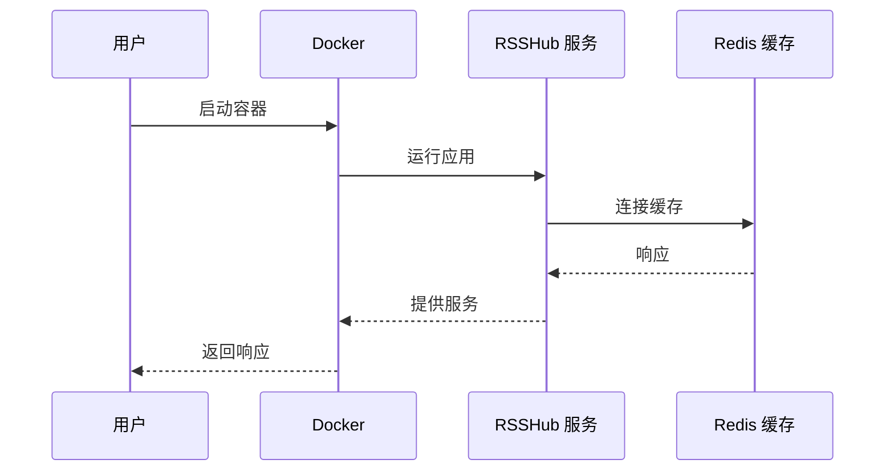
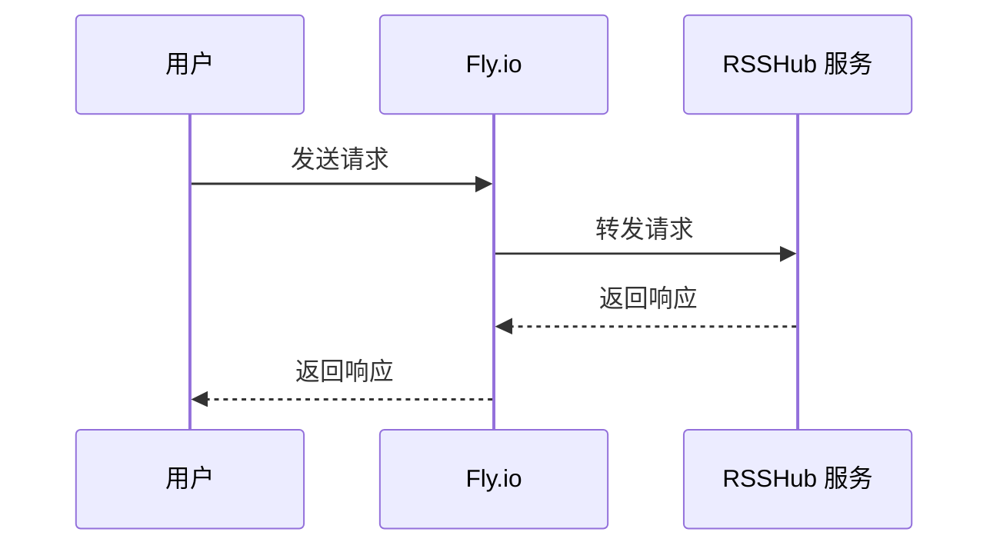
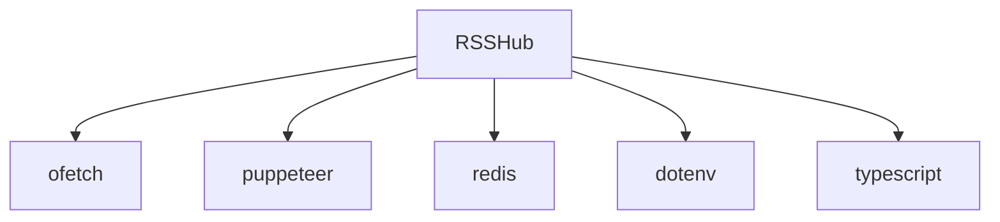

# HTTPS配置

<cite>
**本文档中引用的文件**  
- [config.ts](file://lib/config.ts)
- [Dockerfile](file://Dockerfile)
- [docker-compose.yml](file://docker-compose.yml)
- [fly.toml](file://fly.toml)
- [vercel.json](file://vercel.json)
</cite>

## 目录
1. [简介](#简介)
2. [项目结构](#项目结构)
3. [核心组件](#核心组件)
4. [架构概述](#架构概述)
5. [详细组件分析](#详细组件分析)
6. [依赖分析](#依赖分析)
7. [性能考虑](#性能考虑)
8. [故障排除指南](#故障排除指南)
9. [结论](#结论)

## 简介
RSSHub 是一个开源的 RSS 生成器，支持将各种内容源转换为 RSS 订阅。为了确保服务的安全性，配置 HTTPS 加密是部署过程中的关键步骤。本文档详细说明了如何为 RSSHub 配置 HTTPS，包括获取 SSL/TLS 证书、在不同环境中部署以及证书的自动续期策略。

## 项目结构
RSSHub 项目的结构清晰，主要分为以下几个部分：
- `lib/`：包含核心逻辑和路由处理。
- `scripts/`：包含自动化脚本，如 Docker 和 Ansible 配置。
- 根目录下的配置文件，如 `Dockerfile`、`docker-compose.yml` 和 `fly.toml`，用于不同部署环境的配置。



**Diagram sources**
- [Dockerfile](file://Dockerfile#L1-L207)
- [docker-compose.yml](file://docker-compose.yml#L1-L63)
- [fly.toml](file://fly.toml#L1-L16)

**Section sources**
- [Dockerfile](file://Dockerfile#L1-L207)
- [docker-compose.yml](file://docker-compose.yml#L1-L63)
- [fly.toml](file://fly.toml#L1-L16)

## 核心组件
RSSHub 的核心组件包括配置管理、网络服务和缓存机制。`lib/config.ts` 文件定义了所有可配置的环境变量，这些变量控制着应用的行为，如端口、缓存类型和代理设置。

**Section sources**
- [config.ts](file://lib/config.ts#L1-L1188)

## 架构概述
RSSHub 的架构设计支持多种部署方式，包括 Docker、直接运行和云平台。通过 `Dockerfile` 和 `docker-compose.yml`，可以轻松地在容器化环境中部署 RSSHub。此外，`fly.toml` 文件支持在 Fly.io 上进行一键部署。



**Diagram sources**
- [Dockerfile](file://Dockerfile#L1-L207)
- [docker-compose.yml](file://docker-compose.yml#L1-L63)
- [fly.toml](file://fly.toml#L1-L16)

## 详细组件分析
### 配置管理分析
RSSHub 使用 `lib/config.ts` 文件来管理所有配置项。该文件通过读取环境变量来初始化配置，支持多种配置选项，如端口、缓存类型和代理设置。

#### 配置类图
```mermaid
classDiagram
class Config {
+disallowRobot : boolean
+enableCluster : string
+isPackage : boolean
+connect : { port : number }
+listenInaddrAny : boolean
+requestRetry : number
+requestTimeout : number
+ua : string
+trueUA : string
+allowOrigin : string
+cache : { type : string, requestTimeout : number, routeExpire : number, contentExpire : number }
+memory : { max : number }
+redis : { url : string }
+proxyUri : string
+proxyUris : string[]
+proxy : { protocol : string, host : string, port : string, auth : string, url_regex : string, strategy : string, failoverTimeout : number, healthCheckInterval : number }
+pacUri : string
+pacScript : string
+accessKey : string
+debugInfo : string
+loggerLevel : string
+noLogfiles : boolean
+otel : { seconds_bucket : string, milliseconds_bucket : string }
+showLoggerTimestamp : boolean
+sentry : { dsn : string, routeTimeout : number }
+enableRemoteDebugging : boolean
+hotlink : { template : string, includePaths : string[], excludePaths : string[] }
+feature : { allow_user_hotlink_template : boolean, filter_regex_engine : string, allow_user_supply_unsafe_domain : boolean, disable_nsfw : boolean }
+suffix : string
+titleLengthLimit : number
+openai : { apiKey : string, model : string, temperature : number, maxTokens : number, endpoint : string, inputOption : string, promptTitle : string, promptDescription : string }
+follow : { ownerUserId : string, description : string, price : number, userLimit : number }
}
```

**Diagram sources**
- [config.ts](file://lib/config.ts#L1-L1188)

**Section sources**
- [config.ts](file://lib/config.ts#L1-L1188)

### 部署环境分析
RSSHub 支持多种部署环境，每种环境都有其特定的配置文件。

#### Docker 部署
使用 `Dockerfile` 和 `docker-compose.yml` 可以轻松地在 Docker 环境中部署 RSSHub。`Dockerfile` 定义了构建镜像的步骤，而 `docker-compose.yml` 定义了服务的依赖关系和网络配置。



**Diagram sources**
- [Dockerfile](file://Dockerfile#L1-L207)
- [docker-compose.yml](file://docker-compose.yml#L1-L63)

#### Fly.io 部署
`fly.toml` 文件用于在 Fly.io 上部署 RSSHub。该文件配置了内部端口、HTTPS 强制和健康检查等选项。



**Diagram sources**
- [fly.toml](file://fly.toml#L1-L16)

**Section sources**
- [Dockerfile](file://Dockerfile#L1-L207)
- [docker-compose.yml](file://docker-compose.yml#L1-L63)
- [fly.toml](file://fly.toml#L1-L16)

## 依赖分析
RSSHub 的依赖关系主要通过 `package.json` 和 `pnpm-lock.yaml` 文件管理。核心依赖包括 `ofetch` 用于 HTTP 请求，`puppeteer` 用于浏览器自动化，以及 `redis` 用于缓存。



**Diagram sources**
- [package.json](file://package.json#L1-L100)
- [pnpm-lock.yaml](file://pnpm-lock.yaml#L1-L100)

**Section sources**
- [package.json](file://package.json#L1-L100)
- [pnpm-lock.yaml](file://pnpm-lock.yaml#L1-L100)

## 性能考虑
RSSHub 的性能优化主要集中在缓存机制和请求重试策略上。通过配置 `CACHE_TYPE` 和 `CACHE_EXPIRE`，可以有效减少重复请求，提高响应速度。同时，`REQUEST_RETRY` 和 `REQUEST_TIMEOUT` 设置可以增强服务的稳定性。

## 故障排除指南
### 证书过期
如果遇到证书过期问题，可以通过以下步骤解决：
1. 检查证书的有效期。
2. 更新证书并重启服务。
3. 确保自动续期脚本正常运行。

### 域名不匹配
如果出现域名不匹配错误，需要确认：
1. 证书中的域名与实际使用的域名一致。
2. DNS 解析正确无误。
3. 反向代理配置正确。

**Section sources**
- [config.ts](file://lib/config.ts#L1-L1188)
- [Dockerfile](file://Dockerfile#L1-L207)
- [docker-compose.yml](file://docker-compose.yml#L1-L63)
- [fly.toml](file://fly.toml#L1-L16)

## 结论
通过本文档，您应该能够成功为 RSSHub 配置 HTTPS 加密，并在不同的部署环境中运行。确保定期更新证书并监控服务状态，以保证服务的持续安全和稳定。