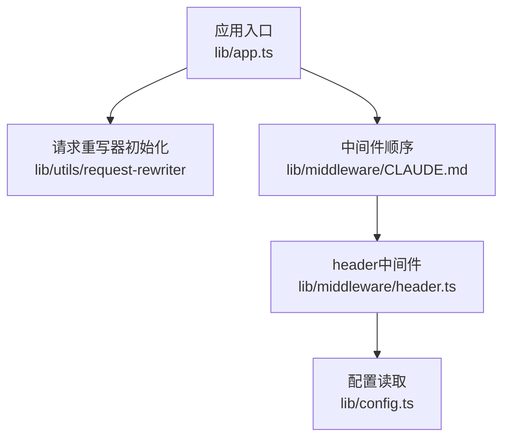
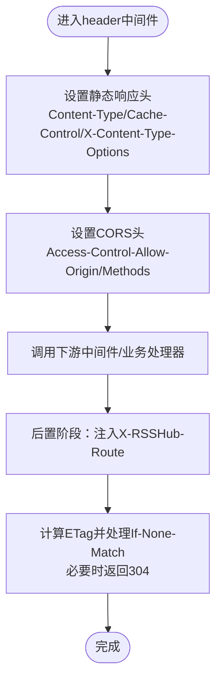
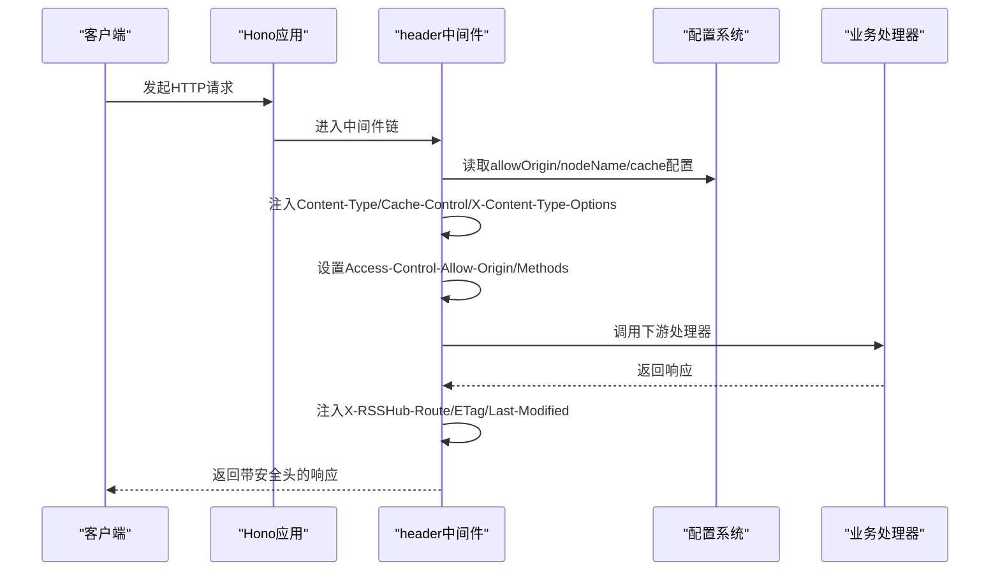
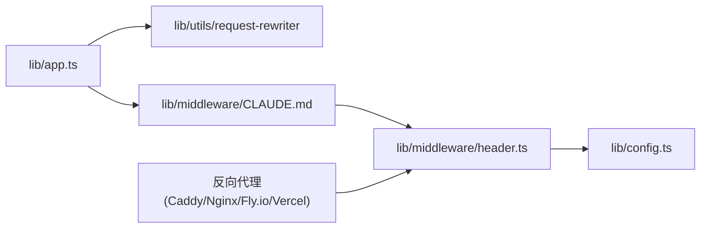

# 安全头配置

<cite>
**本文引用的文件**
- [lib/middleware/header.ts](file://lib/middleware/header.ts)
- [lib/middleware/header.test.ts](file://lib/middleware/header.test.ts)
- [lib/middleware/CLAUDE.md](file://lib/middleware/CLAUDE.md)
- [lib/config.ts](file://lib/config.ts)
- [lib/app.ts](file://lib/app.ts)
- [lib/utils/header-generator.ts](file://lib/utils/header-generator.ts)
- [scripts/ansible/rsshub.Caddyfile](file://scripts/ansible/rsshub.Caddyfile)
- [fly.toml](file://fly.toml)
- [Dockerfile](file://Dockerfile)
- [vercel.json](file://vercel.json)
</cite>

## 目录
1. [简介](#简介)
2. [项目结构与入口](#项目结构与入口)
3. [核心组件：安全头中间件](#核心组件安全头中间件)
4. [架构总览](#架构总览)
5. [详细组件分析](#详细组件分析)
6. [依赖关系分析](#依赖关系分析)
7. [性能与安全特性](#性能与安全特性)
8. [部署场景与反向代理配置建议](#部署场景与反向代理配置建议)
9. [验证安全头是否生效](#验证安全头是否生效)
10. [故障排查](#故障排查)
11. [结论](#结论)

## 简介
本文件面向RSSHub运维与开发者，系统化梳理RSSHub当前已实现的安全头配置现状，并给出在不同部署场景下的加固建议。重点覆盖以下安全头：
- X-Content-Type-Options：阻止浏览器对响应进行MIME类型嗅探，降低MIME混淆攻击风险
- X-Frame-Options：限制页面被嵌入到其他站点的iframe中，防范点击劫持
- X-XSS-Protection：启用浏览器内置XSS过滤（在现代浏览器中已逐步弃用）
- HSTS：强制HTTPS传输，提升会话与证书固定安全性

同时，结合RSSHub现有中间件与配置，说明如何在应用层与反向代理层协同实现安全头的统一治理，并提供验证方法与常见问题排查路径。

## 项目结构与入口
RSSHub基于Hono框架，应用启动前会加载请求重写器，随后按中间件顺序执行。安全相关头主要由“请求头处理”中间件统一注入，部分环境变量可影响跨域与节点标识等头字段。

图表来源
- [lib/app.ts](file://lib/app.ts#L1-L6)
- [lib/middleware/CLAUDE.md](file://lib/middleware/CLAUDE.md#L76-L92)
- [lib/middleware/header.ts](file://lib/middleware/header.ts#L1-L55)
- [lib/config.ts](file://lib/config.ts#L720-L740)

章节来源
- [lib/app.ts](file://lib/app.ts#L1-L6)
- [lib/middleware/CLAUDE.md](file://lib/middleware/CLAUDE.md#L76-L92)

## 核心组件：安全头中间件
RSSHub当前在header中间件中默认注入了若干响应头，其中与安全强相关的是X-Content-Type-Options。该中间件还负责：
- 统一设置Content-Type、Cache-Control等通用头
- 注入Access-Control-Allow-Origin与Access-Control-Allow-Methods
- 在路由匹配后注入X-RSSHub-Route与RSSHub-Node（当配置存在时）
- 基于ETag机制实现条件请求与304响应

图表来源
- [lib/middleware/header.ts](file://lib/middleware/header.ts#L8-L55)

章节来源
- [lib/middleware/header.ts](file://lib/middleware/header.ts#L8-L55)
- [lib/middleware/header.test.ts](file://lib/middleware/header.test.ts#L13-L40)

## 架构总览
下图展示RSSHub在中间件链路中如何注入安全相关头，以及与配置系统的交互。

图表来源
- [lib/middleware/header.ts](file://lib/middleware/header.ts#L8-L55)
- [lib/config.ts](file://lib/config.ts#L720-L740)
- [lib/middleware/CLAUDE.md](file://lib/middleware/CLAUDE.md#L76-L92)

## 详细组件分析

### X-Content-Type-Options
- 当前状态：RSSHub已在header中间件中默认注入X-Content-Type-Options: nosniff，有效阻止浏览器对响应进行MIME类型嗅探，降低MIME混淆攻击风险。
- 配置位置：见header中间件中的静态头集合。
- 影响范围：所有经由该中间件的响应均携带此头。

章节来源
- [lib/middleware/header.ts](file://lib/middleware/header.ts#L8-L13)

### X-Frame-Options
- 当前状态：RSSHub未在header中间件中显式注入X-Frame-Options。
- 建议：可在header中间件或反向代理层添加X-Frame-Options以防范点击劫持；若使用现代浏览器，推荐优先采用Content-Security-Policy的frame-ancestors指令替代。
- 注意：X-Frame-Options在部分现代浏览器中已被弃用，建议结合CSP使用。

章节来源
- [lib/middleware/header.ts](file://lib/middleware/header.ts#L8-L13)

### X-XSS-Protection
- 当前状态：RSSHub未在header中间件中显式注入X-XSS-Protection。
- 建议：现代浏览器已不再依赖该头，建议通过严格的CSP策略与输入输出转义来抵御XSS，而非依赖该头。
- 注意：该头在新版本浏览器中可能被忽略或移除。

章节来源
- [lib/middleware/header.ts](file://lib/middleware/header.ts#L8-L13)

### HSTS
- 当前状态：RSSHub未在header中间件中显式注入Strict-Transport-Security。
- 建议：在反向代理层（如Caddy/Nginx/Fly.io）启用HSTS，确保所有子域名与路径强制走HTTPS；同时配合HSTS预加载清单（如需）。
- 注意：HSTS必须在HTTPS环境下生效，且需谨慎设置max-age与includeSubDomains。

章节来源
- [lib/middleware/header.ts](file://lib/middleware/header.ts#L8-L13)

### CORS与安全头协同
- Access-Control-Allow-Origin与Access-Control-Allow-Methods由header中间件统一注入，可与安全头协同工作，避免跨域滥用。
- 允许源可通过配置项动态设置，测试用例验证了该行为。

章节来源
- [lib/middleware/header.ts](file://lib/middleware/header.ts#L23-L27)
- [lib/middleware/header.test.ts](file://lib/middleware/header.test.ts#L13-L27)
- [lib/config.ts](file://lib/config.ts#L720-L740)

## 依赖关系分析
- header中间件依赖配置系统以决定CORS与节点标识等头字段。
- 应用入口先加载请求重写器，再启动Hono应用，确保上游请求头改写与安全头注入的顺序可控。
- 反向代理层（Caddy/Nginx/Fly.io/Vercel）可作为HSTS与X-Frame-Options/CSP等安全头的补充与统一出口。

图表来源
- [lib/app.ts](file://lib/app.ts#L1-L6)
- [lib/middleware/CLAUDE.md](file://lib/middleware/CLAUDE.md#L76-L92)
- [lib/middleware/header.ts](file://lib/middleware/header.ts#L8-L55)
- [lib/config.ts](file://lib/config.ts#L720-L740)

## 性能与安全特性
- ETag与304缓存：header中间件在后置阶段计算ETag并根据If-None-Match返回304，减少带宽与CPU开销，同时提升响应速度。
- Cache-Control：header中间件设置公共缓存策略，结合路由过期时间，平衡新鲜度与性能。
- 安全头注入成本低：仅在响应头层面增加少量键值对，对性能影响可忽略。

章节来源
- [lib/middleware/header.ts](file://lib/middleware/header.ts#L35-L55)

## 部署场景与反向代理配置建议

### 反向代理（Caddy）
- 示例：仓库提供了Caddyfile片段，可作为HSTS与全局安全头的补充出口。
- 建议：在Caddy中启用HSTS、X-Frame-Options、X-Content-Type-Options、X-XSS-Protection（视浏览器兼容需求），并结合CSP策略。

章节来源
- [scripts/ansible/rsshub.Caddyfile](file://scripts/ansible/rsshub.Caddyfile#L1-L3)

### Fly.io
- 配置：内部端口为1200，强制HTTPS，适合在反向代理层集中注入安全头。
- 建议：在Fly.io的边缘层或Caddy/Nginx中统一设置HSTS与X-Frame-Options等。

章节来源
- [fly.toml](file://fly.toml#L1-L16)

### Docker容器
- 容器暴露1200端口，生产环境通常通过反向代理对外提供服务。
- 建议：在容器外层统一注入安全头，避免在容器内重复实现。

章节来源
- [Dockerfile](file://Dockerfile#L179-L184)

### Vercel
- 配置：框架为Hono，输出目录与函数映射已配置。
- 建议：在Vercel边缘层或自定义边缘函数中注入HSTS与X-Frame-Options等安全头。

章节来源
- [vercel.json](file://vercel.json#L1-L17)

## 验证安全头是否生效
- 单元测试验证：header中间件的单元测试覆盖了关键响应头（如X-Content-Type-Options、Cache-Control、Access-Control-Allow-Origin等）与ETag行为，可用于确认安全头是否按预期注入。
- 手动验证：使用浏览器开发者工具或curl命令查看响应头，确认各安全头是否存在且值正确。
- ETag验证：通过If-None-Match条件请求验证304响应与ETag一致性。

章节来源
- [lib/middleware/header.test.ts](file://lib/middleware/header.test.ts#L13-L40)
- [lib/middleware/header.ts](file://lib/middleware/header.ts#L35-L55)

## 故障排查
- 安全头缺失
  - 检查header中间件是否在中间件链中执行顺序靠前。
  - 确认配置项（如ALLOW_ORIGIN、NODE_NAME）是否按预期设置。
- CORS相关问题
  - 若前端跨域失败，检查Access-Control-Allow-Origin与Access-Control-Allow-Methods是否符合预期。
- ETag导致的304误触发
  - 确保数据结构稳定，避免ETag因无关字段变化而频繁更新。
- 反向代理覆盖
  - 若反向代理覆盖了安全头，需调整代理层配置以保留或合并RSSHub注入的安全头。

章节来源
- [lib/middleware/CLAUDE.md](file://lib/middleware/CLAUDE.md#L76-L92)
- [lib/middleware/header.ts](file://lib/middleware/header.ts#L23-L27)
- [lib/middleware/header.test.ts](file://lib/middleware/header.test.ts#L13-L40)

## 结论
- RSSHub已在header中间件中默认注入X-Content-Type-Options，有助于抵御MIME嗅探类攻击。
- 对于X-Frame-Options、X-XSS-Protection与HSTS，建议在反向代理层（Caddy/Nginx/Fly.io/Vercel）集中实施，以获得更一致与可控的安全治理。
- 结合CSP策略与严格的输入输出处理，可进一步提升整体安全性。
- 通过单元测试与手动验证相结合的方式，可确保安全头在不同部署场景下正确生效。