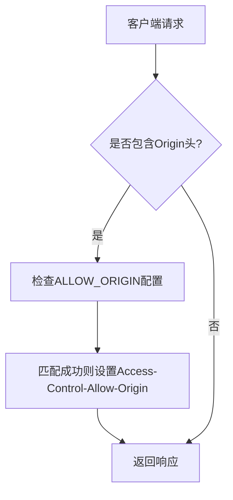
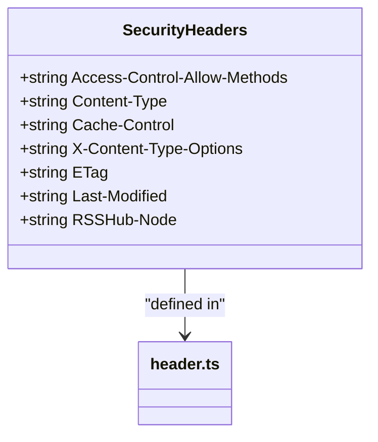
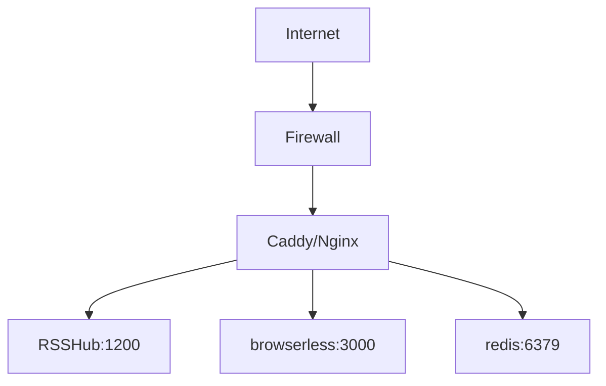

# 网络安全

<cite>
**本文档中引用的文件**  
- [config.ts](file://lib/config.ts)
- [header.ts](file://lib/middleware/header.ts)
- [access-control.ts](file://lib/middleware/access-control.ts)
- [anti-hotlink.ts](file://lib/middleware/anti-hotlink.ts)
- [Dockerfile](file://Dockerfile)
- [docker-compose.yml](file://docker-compose.yml)
- [rsshub.Caddyfile](file://scripts/ansible/rsshub.Caddyfile)
</cite>

## 目录
1. [引言](#引言)
2. [HTTPS配置](#https配置)
3. [CORS策略配置](#cors策略配置)
4. [内容安全策略（CSP）](#内容安全策略csp)
5. [安全头配置](#安全头配置)
6. [防火墙与反向代理配置](#防火墙与反向代理配置)
7. [网络流量监控与异常检测](#网络流量监控与异常检测)

## 引言

RSSHub 是一个全球最大的 RSS 网络，支持从各种来源聚合内容。为了确保服务的安全性，必须对网络层面的安全配置进行严格管理。本文档详细说明了如何配置 HTTPS、CORS、内容安全策略（CSP）、安全头以及防火墙和反向代理，以增强 RSSHub 的整体安全性。

## HTTPS配置

RSSHub 本身不直接处理 HTTPS 请求，而是依赖于反向代理服务器（如 Nginx 或 Caddy）来实现 SSL/TLS 加密。用户可以通过配置反向代理来启用 HTTPS，并集成 Let's Encrypt 实现自动证书获取与更新。

在生产环境中，推荐使用 Caddy 或 Nginx 作为反向代理。例如，在 `scripts/ansible/rsshub.Caddyfile` 中定义了简单的反向代理规则，将请求转发到本地 1200 端口的 RSSHub 服务。Caddy 支持自动申请和续期 Let's Encrypt 证书，只需配置域名即可。

对于 Docker 部署，`docker-compose.yml` 文件展示了如何通过 `browserless` 和 `redis` 等服务构建完整的服务栈，而 HTTPS 应在外部代理层配置。

**Section sources**
- [rsshub.Caddyfile](file://scripts/ansible/rsshub.Caddyfile#L1-L4)
- [docker-compose.yml](file://docker-compose.yml#L1-L63)

## CORS策略配置

跨域资源共享（CORS）策略用于控制哪些外部域名可以访问 RSSHub 的 API 接口。RSSHub 通过中间件 `header.ts` 设置了基本的 CORS 头信息。

在 `lib/middleware/header.ts` 中，设置了 `Access-Control-Allow-Origin` 头，其值由配置项 `ALLOW_ORIGIN` 决定。如果未设置该配置，则默认使用请求的主机名。此外，仅允许 GET 方法，并通过 `Access-Control-Allow-Methods` 头指定。

此配置确保只有受信任的源可以访问 API，防止恶意网站发起跨域请求。



**Diagram sources**
- [header.ts](file://lib/middleware/header.ts#L8-L27)

**Section sources**
- [header.ts](file://lib/middleware/header.ts#L8-L27)

## 内容安全策略（CSP）

虽然 RSSHub 当前未显式设置内容安全策略（Content Security Policy, CSP），但可通过反向代理添加相应的 HTTP 头来实现。CSP 可有效防止 XSS 攻击，限制脚本、样式、图片等资源的加载来源。

建议在 Nginx 或 Caddy 配置中添加如下头信息：
```
Content-Security-Policy: default-src 'self'; script-src 'self'; style-src 'self' 'unsafe-inline'; img-src 'self' data: *; font-src 'self'; object-src 'none'; frame-ancestors 'none';
```

此策略禁止内联脚本执行，阻止 iframe 嵌套，仅允许同源资源加载，从而显著提升安全性。

## 安全头配置

RSSHub 在响应头中设置了多个安全相关的 HTTP 头，以增强防护能力。这些头信息在 `lib/middleware/header.ts` 中定义。

关键安全头包括：
- `X-Content-Type-Options: nosniff`：防止浏览器 MIME 类型嗅探，避免执行非预期类型的文件。
- `Cache-Control`：控制缓存行为，防止敏感数据被缓存。
- `ETag` 和 `Last-Modified`：支持条件请求，减少带宽消耗。
- `Access-Control-Allow-Methods: GET`：限制允许的 HTTP 方法，仅开放 GET 请求。

此外，`config.ts` 中的配置允许设置节点名称，通过 `RSSHub-Node` 头暴露节点信息，可用于调试或监控。



**Diagram sources**
- [header.ts](file://lib/middleware/header.ts#L8-L13)

**Section sources**
- [header.ts](file://lib/middleware/header.ts#L8-L56)

## 防火墙与反向代理配置

推荐使用 Nginx 或 Caddy 作为反向代理，结合防火墙规则来保护 RSSHub 服务。`Dockerfile` 和 `docker-compose.yml` 提供了容器化部署的基础架构。

在 `Dockerfile` 中，应用运行在非特权模式下，暴露 1200 端口。建议在宿主机防火墙中仅开放 80 和 443 端口，由反向代理接收外部流量并转发至容器。

`docker-compose.yml` 示例中展示了多服务协同工作的方式，包括 Redis 缓存、Browserless 浏览器服务等。反向代理应配置 SSL 终止、速率限制、IP 黑名单等功能。

Caddy 配置示例（`rsshub.Caddyfile`）简洁明了，仅需域名和反向代理指令即可自动启用 HTTPS。



**Diagram sources**
- [Dockerfile](file://Dockerfile#L1-L207)
- [docker-compose.yml](file://docker-compose.yml#L1-L63)
- [rsshub.Caddyfile](file://scripts/ansible/rsshub.Caddyfile#L1-L4)

**Section sources**
- [Dockerfile](file://Dockerfile#L1-L207)
- [docker-compose.yml](file://docker-compose.yml#L1-L63)

## 网络流量监控与异常检测

RSSHub 提供健康检查接口 `/healthz`，可用于监控服务状态。在 `docker-compose.yml` 中已配置健康检查命令，定期检测服务可用性。

建议结合 Prometheus 和 Grafana 进行指标采集与可视化。通过日志分析工具（如 ELK Stack）收集访问日志，识别异常请求模式，如高频访问、恶意 User-Agent、异常参数等。

在 `config.ts` 中可配置日志级别（`LOGGER_LEVEL`）和是否显示调试信息（`DEBUG_INFO`），便于问题排查。同时，通过 `SENTRY` 集成可实现错误追踪与告警。

此外，利用反向代理的日志功能记录所有入站请求，结合 Fail2ban 等工具实现自动封禁恶意 IP。

**Section sources**
- [docker-compose.yml](file://docker-compose.yml#L17-L21)
- [config.ts](file://lib/config.ts#L44-L54)