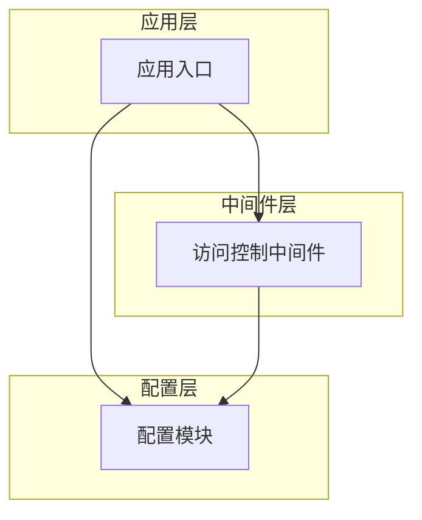
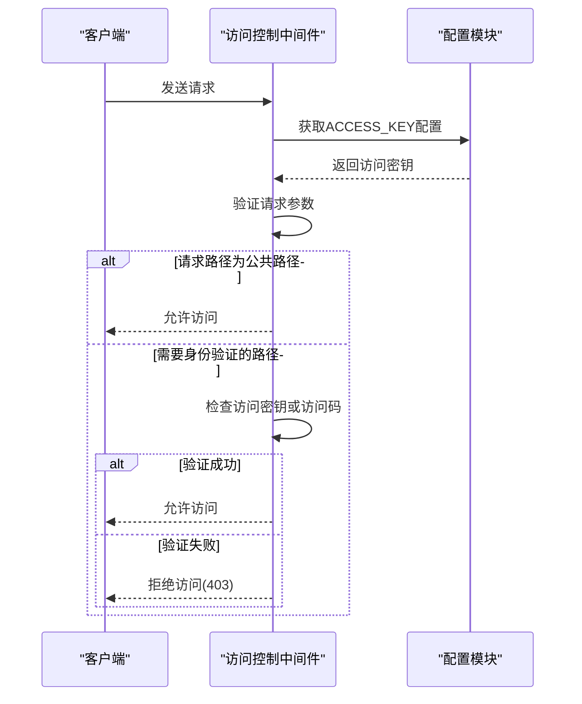
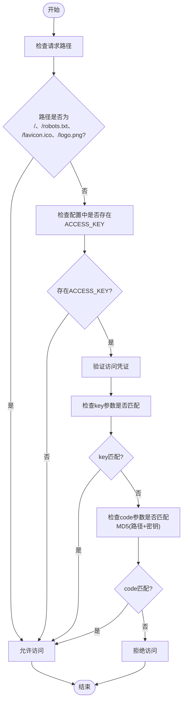
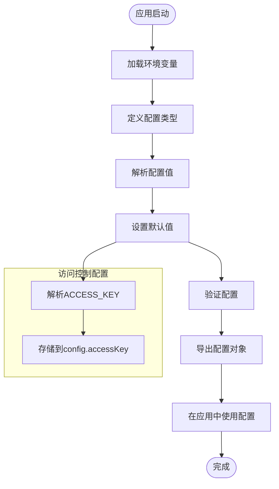
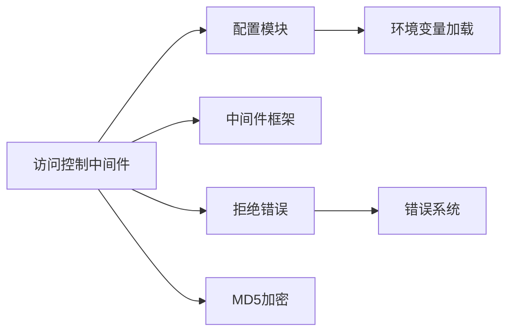

# IP访问控制

<cite>
**本文档引用的文件**
- [access-control.ts](file://lib/middleware/access-control.ts)
- [config.ts](file://lib/config.ts)
</cite>

## 目录
1. [简介](#简介)
2. [项目结构](#项目结构)
3. [核心组件](#核心组件)
4. [架构概述](#架构概述)
5. [详细组件分析](#详细组件分析)
6. [依赖分析](#依赖分析)
7. [性能考虑](#性能考虑)
8. [故障排除指南](#故障排除指南)
9. [结论](#结论)
10. [附录](#附录)（如有必要）

## 简介
本文档深入解释RSSHub的IP访问控制机制，详细说明如何通过配置文件设置访问权限，包括IP白名单和黑名单的配置方法、支持的IP格式、匹配优先级规则以及在代理环境下获取真实IP地址的机制。

## 项目结构
RSSHub的IP访问控制功能主要分布在中间件和配置模块中。访问控制逻辑通过中间件实现，而相关配置则通过环境变量和配置文件进行管理。



**图表来源**
- [access-control.ts](file://lib/middleware/access-control.ts#L1-L27)
- [config.ts](file://lib/config.ts#L1-L1188)

**章节来源**
- [access-control.ts](file://lib/middleware/access-control.ts#L1-L27)
- [config.ts](file://lib/config.ts#L1-L1188)

## 核心组件
RSSHub的访问控制核心是基于中间件模式实现的，通过检查请求中的访问密钥来控制对特定路由的访问。该机制允许配置全局访问密钥，对除特定公共路径外的所有请求进行身份验证。

**章节来源**
- [access-control.ts](file://lib/middleware/access-control.ts#L1-L27)
- [config.ts](file://lib/config.ts#L767-L768)

## 架构概述
RSSHub的访问控制架构采用分层设计，将配置管理与访问验证逻辑分离。配置模块负责从环境变量中读取和解析访问控制相关设置，而中间件模块则负责在请求处理流程中执行实际的访问验证。



**图表来源**
- [access-control.ts](file://lib/middleware/access-control.ts#L11-L24)
- [config.ts](file://lib/config.ts#L768)

## 详细组件分析
### 访问控制中间件分析
访问控制中间件是RSSHub安全体系的核心组件，负责在请求处理流程中验证客户端的身份。该中间件通过检查请求中的访问密钥或访问码来决定是否允许访问受保护的资源。

#### 访问控制逻辑


**图表来源**
- [access-control.ts](file://lib/middleware/access-control.ts#L11-L24)

**章节来源**
- [access-control.ts](file://lib/middleware/access-control.ts#L1-L27)

### 配置系统分析
RSSHub的配置系统通过环境变量提供灵活的配置选项，允许用户在不修改代码的情况下调整应用行为。访问控制相关的配置主要通过ACCESS_KEY环境变量进行设置。

#### 配置处理流程


**图表来源**
- [config.ts](file://lib/config.ts#L42-L43)
- [config.ts](file://lib/config.ts#L768)

**章节来源**
- [config.ts](file://lib/config.ts#L1-L1188)

## 依赖分析
访问控制功能依赖于多个核心模块，包括配置管理、中间件框架和错误处理系统。这些模块协同工作，确保访问控制逻辑能够正确执行。



**图表来源**
- [access-control.ts](file://lib/middleware/access-control.ts#L3-L5)
- [config.ts](file://lib/config.ts#L1-L2)

**章节来源**
- [access-control.ts](file://lib/middleware/access-control.ts#L1-L27)
- [config.ts](file://lib/config.ts#L1-L1188)

## 性能考虑
访问控制中间件的设计考虑了性能因素，对公共路径（如根路径、robots.txt等）的请求直接放行，避免不必要的验证开销。对于需要验证的请求，采用轻量级的密钥匹配和MD5哈希验证，确保验证过程高效。

## 故障排除指南
### 常见问题及解决方案
1. **问题：设置了ACCESS_KEY但无法访问受保护的路由**
   - 检查环境变量名称是否正确（应为ACCESS_KEY）
   - 确认密钥值没有多余的空格或特殊字符
   - 验证请求中是否正确传递了key或code参数

2. **问题：访问码(code)验证失败**
   - 确认code参数的计算方式：MD5(请求路径 + ACCESS_KEY)
   - 检查路径是否包含查询参数（不应包含）
   - 验证MD5哈希算法的实现是否一致

3. **问题：公共路径被错误地要求验证**
   - 确认请求路径是否准确匹配白名单路径（/, /robots.txt, /favicon.ico, /logo.png）
   - 检查路径大小写是否正确

**章节来源**
- [access-control.ts](file://lib/middleware/access-control.ts#L16-L18)
- [access-control.test.ts](file://lib/middleware/access-control.test.ts#L24-L28)

## 结论
RSSHub的访问控制机制通过简洁而有效的设计，为应用提供了基本的安全保护。通过配置ACCESS_KEY环境变量，用户可以轻松地为RSSHub实例添加访问控制，防止未授权的访问。该机制结合了直接的密钥匹配和基于路径的动态码验证，提供了灵活的访问控制选项。

## 附录
### 配置示例
```env
# 启用访问控制
ACCESS_KEY=your-secret-key

# 其他相关配置
DEBUG_INFO=true
LOGGER_LEVEL=info
```

### 测试用例
```typescript
// 测试公共路径无需验证
await app.request('/'); // 应返回200

// 测试受保护路径需要验证
await app.request('/test/2'); // 无凭证应返回403
await app.request('/test/2?key=your-secret-key'); // 正确密钥应返回200
await app.request('/test/2?code=generated-code'); // 正确访问码应返回200
```