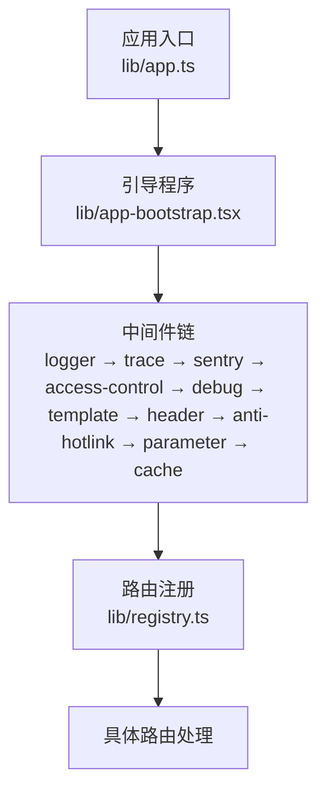
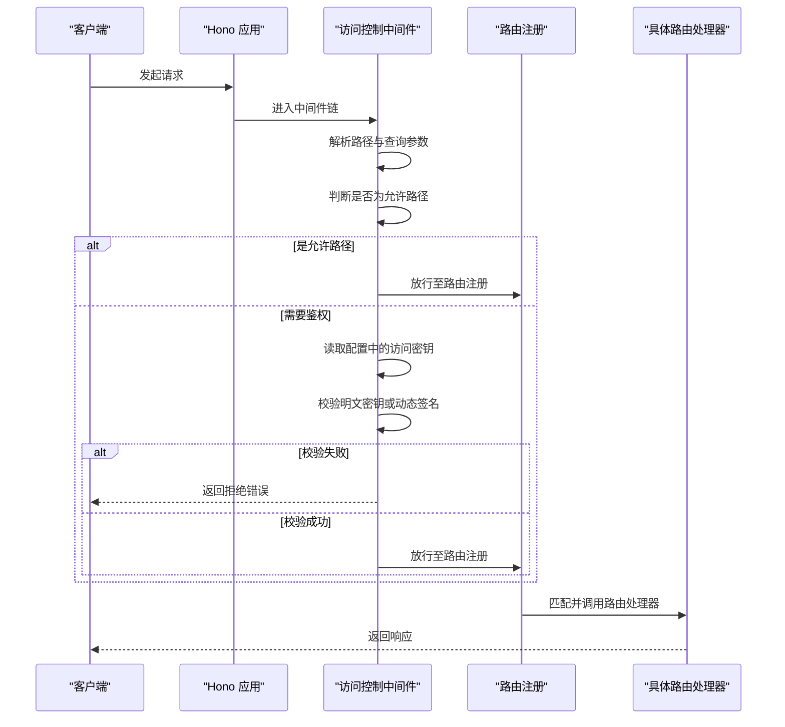
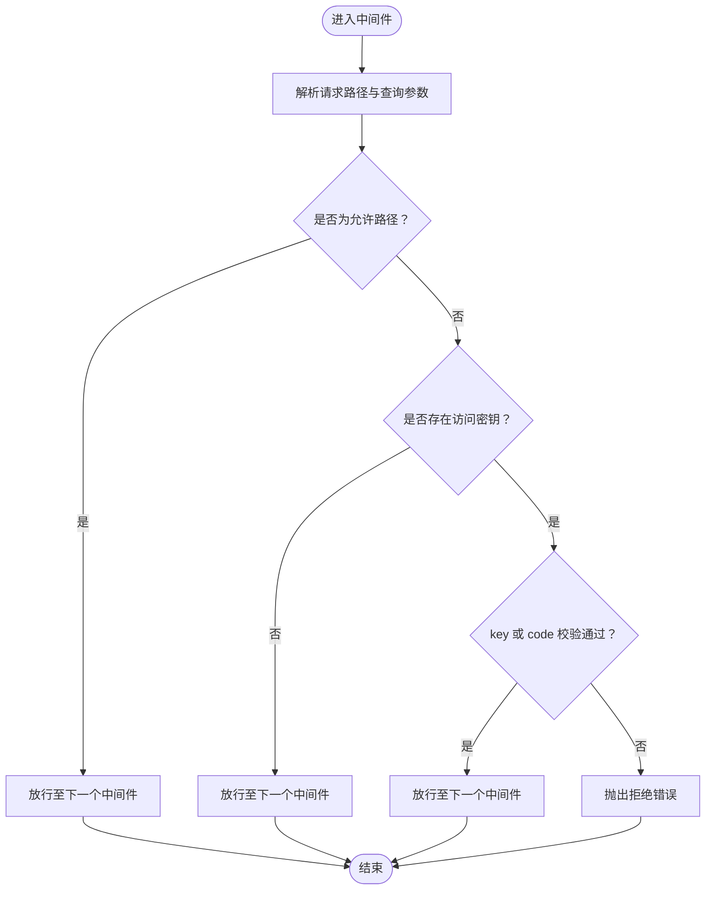
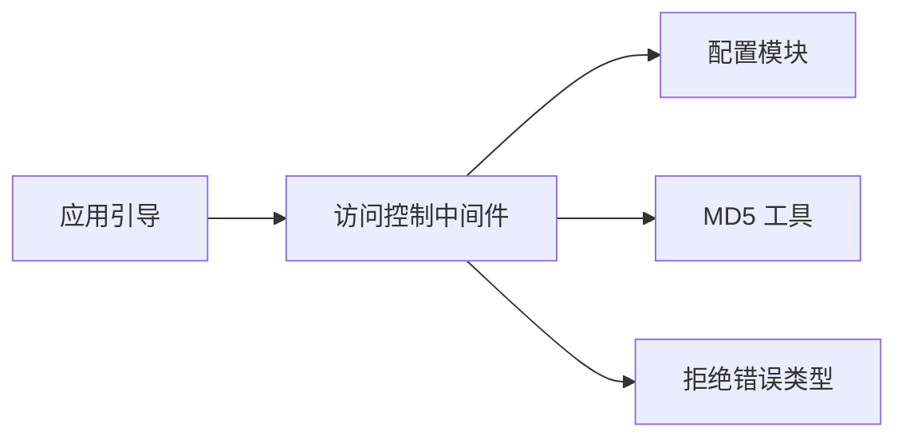

# 访问控制

<cite>
**本文引用的文件列表**
- [lib/middleware/access-control.ts](file://lib/middleware/access-control.ts)
- [lib/config.ts](file://lib/config.ts)
- [lib/app-bootstrap.tsx](file://lib/app-bootstrap.tsx)
- [lib/middleware/access-control.test.ts](file://lib/middleware/access-control.test.ts)
- [lib/errors/types/reject.ts](file://lib/errors/types/reject.ts)
- [lib/registry.ts](file://lib/registry.ts)
- [lib/utils/cache/index.ts](file://lib/utils/cache/index.ts)
</cite>

## 目录
1. [简介](#简介)
2. [项目结构与入口](#项目结构与入口)
3. [核心组件](#核心组件)
4. [架构总览](#架构总览)
5. [组件详解](#组件详解)
6. [依赖关系分析](#依赖关系分析)
7. [性能与并发特性](#性能与并发特性)
8. [故障排查指南](#故障排查指南)
9. [结论](#结论)
10. [附录：配置示例与最佳实践](#附录配置示例与最佳实践)

## 简介
本文件面向 RSSHub 的运维与开发者，系统性阐述访问控制机制，重点覆盖以下方面：
- 认证与授权：基于密钥与动态签名的访问控制
- IP 白名单/黑名单：当前实现与扩展建议
- 请求频率限制：当前实现与可选方案
- 敏感路由保护：通过配置开关与路由特征进行保护
- 完整工作流：从请求进入应用到路由处理的中间件链路
- 常见问题与排障：误拦截、配置不生效等

## 项目结构与入口
RSSHub 使用 Hono 作为 Web 框架，访问控制中间件在应用启动阶段被注册到全局中间件链中，随后按顺序执行。

图表来源
- [lib/app.ts](file://lib/app.ts#L1-L6)
- [lib/app-bootstrap.tsx](file://lib/app-bootstrap.tsx#L1-L54)
- [lib/registry.ts](file://lib/registry.ts#L192-L224)

章节来源
- [lib/app.ts](file://lib/app.ts#L1-L6)
- [lib/app-bootstrap.tsx](file://lib/app-bootstrap.tsx#L1-L54)
- [lib/registry.ts](file://lib/registry.ts#L192-L224)

## 核心组件
- 访问控制中间件：负责对除首页与静态资源外的路径进行认证校验
- 配置模块：读取环境变量并生成运行时配置对象，其中包含访问密钥字段
- 错误类型：统一的拒绝错误类型用于中断请求并返回相应状态
- 路由注册：将命名空间下的路由挂载到子路径，供访问控制中间件拦截

章节来源
- [lib/middleware/access-control.ts](file://lib/middleware/access-control.ts#L1-L27)
- [lib/config.ts](file://lib/config.ts#L243-L305)
- [lib/errors/types/reject.ts](file://lib/errors/types/reject.ts#L1-L6)
- [lib/registry.ts](file://lib/registry.ts#L192-L224)

## 架构总览
访问控制中间件位于中间件链的早期位置，确保在路由处理前完成鉴权。其判定逻辑如下：
- 允许的路径：根路径、robots.txt、favicon.ico、logo.png
- 其他路径：若配置了访问密钥，则必须满足“明文密钥匹配”或“动态签名匹配”，否则拒绝

图表来源
- [lib/app-bootstrap.tsx](file://lib/app-bootstrap.tsx#L30-L46)
- [lib/middleware/access-control.ts](file://lib/middleware/access-control.ts#L11-L24)
- [lib/registry.ts](file://lib/registry.ts#L192-L224)

## 组件详解

### 访问控制中间件（access-control）
- 功能要点
  - 忽略路径：根路径、robots.txt、favicon.ico、logo.png
  - 鉴权条件：当配置存在访问密钥时，请求需满足以下任一条件：
    - 查询参数 key 等于配置中的访问密钥
    - 查询参数 code 等于 md5(请求路径 + 访问密钥)
- 错误处理：校验失败抛出拒绝错误，交由全局错误处理器统一处理

图表来源
- [lib/middleware/access-control.ts](file://lib/middleware/access-control.ts#L11-L24)
- [lib/errors/types/reject.ts](file://lib/errors/types/reject.ts#L1-L6)

章节来源
- [lib/middleware/access-control.ts](file://lib/middleware/access-control.ts#L1-L27)
- [lib/errors/types/reject.ts](file://lib/errors/types/reject.ts#L1-L6)

### 配置模块（config）
- 关键字段
  - 访问密钥：ACCESS_KEY（字符串），用于访问控制中间件的鉴权
- 其他相关字段（与访问控制间接相关）
  - 缓存类型与过期：影响并发请求的处理与缓存行为
  - 日志与监控：便于审计与问题定位

章节来源
- [lib/config.ts](file://lib/config.ts#L243-L305)
- [lib/config.ts](file://lib/config.ts#L767-L769)

### 路由注册与命名空间
- 路由注册会遍历命名空间并挂载到子路径，访问控制中间件在路由匹配前即已生效
- 该机制天然支持对敏感路由的保护，因为所有非允许路径都会经过鉴权

章节来源
- [lib/registry.ts](file://lib/registry.ts#L192-L224)

### 测试用例（access-control）
- 覆盖场景
  - 未设置访问密钥：所有请求均可访问（除允许路径）
  - 设置访问密钥：仅当 key 或 code 正确时才放行
  - 允许路径：不受访问密钥影响

章节来源
- [lib/middleware/access-control.test.ts](file://lib/middleware/access-control.test.ts#L1-L49)

## 依赖关系分析
- 中间件链顺序
  - logger → trace → sentry → access-control → debug → template → header → anti-hotlink → parameter → cache
- 访问控制中间件依赖
  - 配置模块：读取 ACCESS_KEY
  - MD5 工具：生成动态签名
  - 拒绝错误类型：统一错误处理

图表来源
- [lib/app-bootstrap.tsx](file://lib/app-bootstrap.tsx#L30-L46)
- [lib/middleware/access-control.ts](file://lib/middleware/access-control.ts#L1-L27)
- [lib/config.ts](file://lib/config.ts#L767-L769)
- [lib/errors/types/reject.ts](file://lib/errors/types/reject.ts#L1-L6)

章节来源
- [lib/app-bootstrap.tsx](file://lib/app-bootstrap.tsx#L30-L46)
- [lib/middleware/access-control.ts](file://lib/middleware/access-control.ts#L1-L27)
- [lib/config.ts](file://lib/config.ts#L767-L769)
- [lib/errors/types/reject.ts](file://lib/errors/types/reject.ts#L1-L6)

## 性能与并发特性
- 并发请求限制
  - 当缓存类型为 redis/memory 时，系统具备并发请求的协调能力；当缓存不可用时，会记录警告，可能导致并发请求不受限
- 影响因素
  - 缓存类型与可用性
  - 路由过期时间与请求超时
- 与访问控制的关系
  - 访问控制中间件本身不直接限制并发，但配合缓存与路由过期策略，可减少重复计算与资源占用

章节来源
- [lib/utils/cache/index.ts](file://lib/utils/cache/index.ts#L16-L60)
- [lib/config.ts](file://lib/config.ts#L737-L740)

## 故障排查指南
- 误拦截
  - 症状：正常访问被拒绝
  - 排查步骤
    - 确认请求路径是否属于允许路径（根路径、robots.txt、favicon.ico、logo.png）
    - 确认 ACCESS_KEY 是否正确设置
    - 确认 key 或 code 参数是否正确传递
    - 参考测试用例中的断言与期望，核对参数格式与取值
- 配置不生效
  - 症状：修改 ACCESS_KEY 后仍无法放行
  - 排查步骤
    - 确认环境变量加载顺序与优先级
    - 确认应用重启后配置已重新计算
    - 检查中间件链顺序是否被意外调整
- 并发异常
  - 症状：高并发下出现重复请求或资源竞争
  - 排查步骤
    - 检查缓存类型与可用性
    - 调整路由过期时间与请求超时
    - 观察日志与监控指标

章节来源
- [lib/middleware/access-control.test.ts](file://lib/middleware/access-control.test.ts#L1-L49)
- [lib/app-bootstrap.tsx](file://lib/app-bootstrap.tsx#L30-L46)
- [lib/utils/cache/index.ts](file://lib/utils/cache/index.ts#L16-L60)

## 结论
RSSHub 的访问控制以“明文密钥 + 动态签名”的方式实现，简单可靠且易于集成。当前实现未内置 IP 白名单/黑名单与集中式频率限制，但可通过以下方式扩展：
- IP 白名单/黑名单：在现有中间件链中插入自定义中间件，基于请求源地址进行过滤
- 频率限制：结合缓存与计数器实现滑动窗口或固定窗口限流，或引入专用中间件
- 敏感路由保护：利用命名空间与路由特征，结合访问密钥与可选的额外中间件实现更细粒度的保护

## 附录：配置示例与最佳实践
- 访问密钥配置
  - 设置环境变量 ACCESS_KEY 为你的密钥值
  - 请求时携带查询参数 key=你的密钥 或 code=md5(请求路径 + 密钥)
- IP 白名单/黑名单（扩展建议）
  - 在中间件链中插入自定义中间件，读取客户端真实 IP（如通过代理头），根据白名单/黑名单决定放行或拒绝
  - 注意：当前仓库未内置该功能，需自行实现
- 请求频率限制（扩展建议）
  - 基于 Redis 或内存计数器实现滑动窗口限流
  - 可按路径维度或用户维度进行限流
  - 注意：当前仓库未内置该功能，需自行实现
- 敏感路由保护
  - 通过命名空间与路由特征识别敏感路由
  - 结合访问密钥与可选中间件实现差异化保护
- 实际组合示例（概念性说明）
  - 中间件链顺序建议：logger → trace → sentry → access-control → ip-whitelist → rate-limit → debug → template → header → anti-hotlink → parameter → cache
  - 将 IP 白名单/黑名单与频率限制中间件置于 access-control 之后，以便在鉴权通过后再进行更严格的控制

[本节为概念性说明，不直接对应具体代码文件，故无图表来源与章节来源]