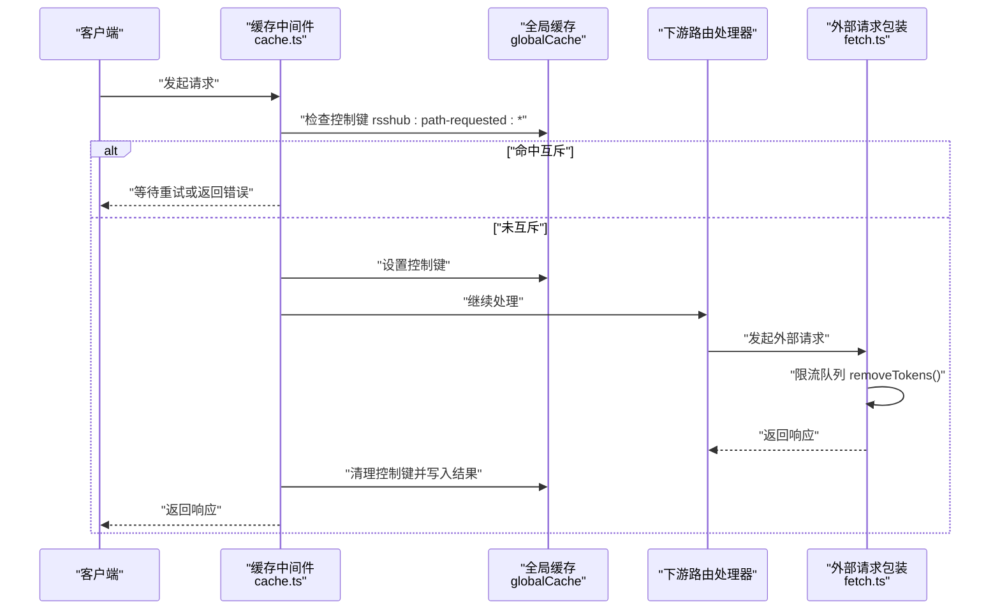
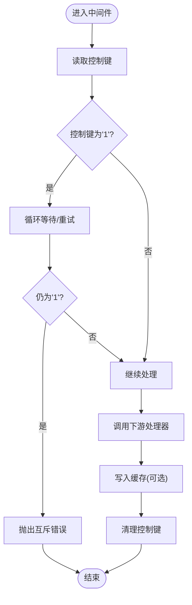
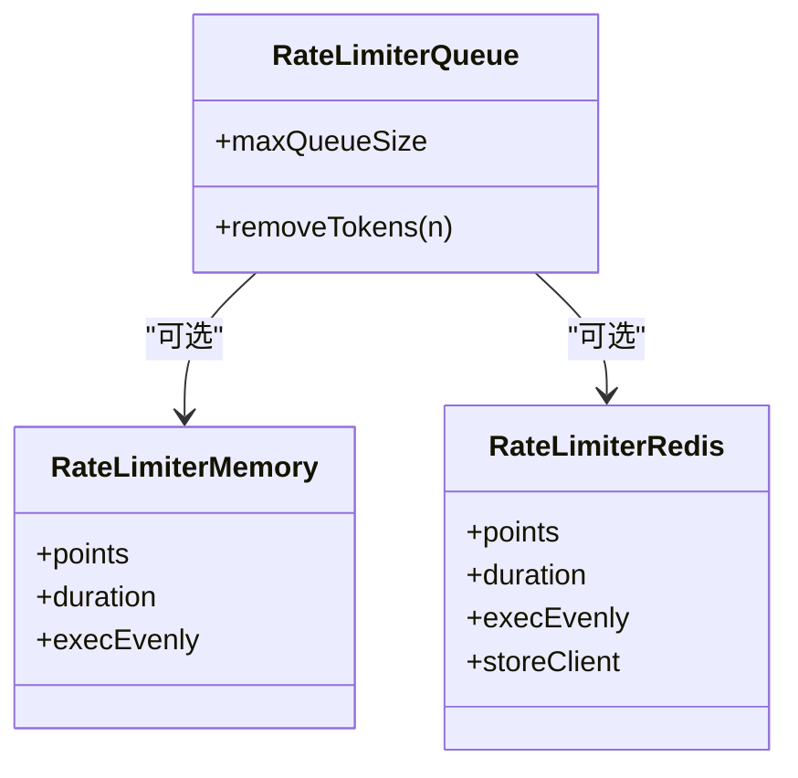
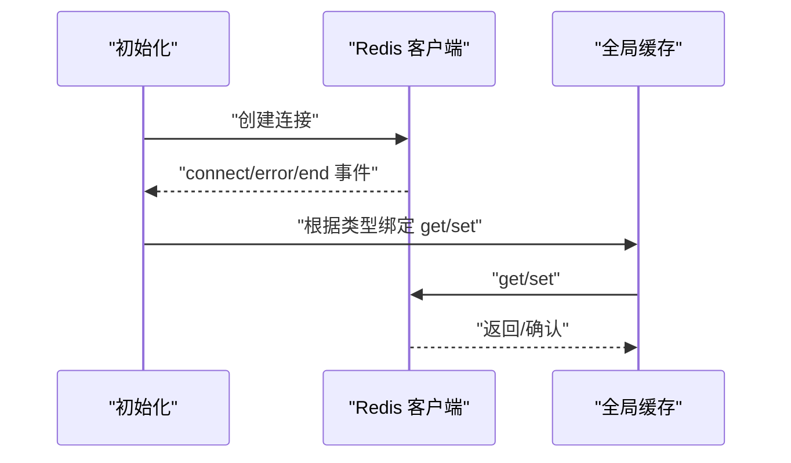
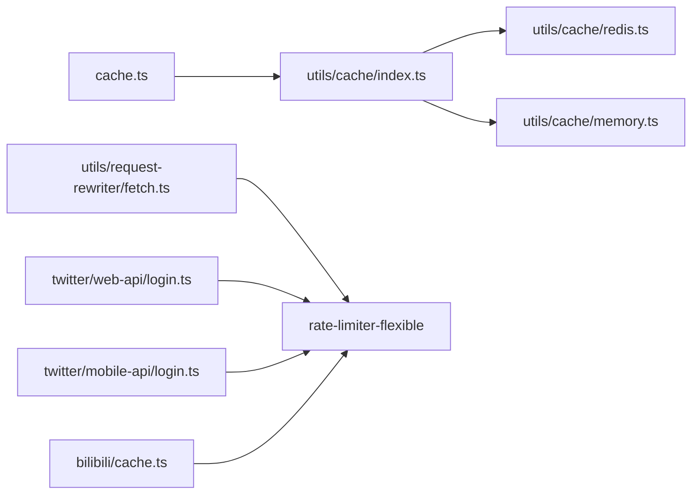

# 请求频率限制

<cite>
**本文引用的文件**
- [lib/config.ts](file://lib/config.ts)
- [lib/middleware/cache.ts](file://lib/middleware/cache.ts)
- [lib/utils/cache/index.ts](file://lib/utils/cache/index.ts)
- [lib/utils/cache/redis.ts](file://lib/utils/cache/redis.ts)
- [lib/utils/cache/memory.ts](file://lib/utils/cache/memory.ts)
- [lib/utils/request-rewriter/fetch.ts](file://lib/utils/request-rewriter/fetch.ts)
- [lib/routes/twitter/api/mobile-api/login.ts](file://lib/routes/twitter/api/mobile-api/login.ts)
- [lib/routes/twitter/api/web-api/login.ts](file://lib/routes/twitter/api/web-api/login.ts)
- [lib/routes/bilibili/cache.ts](file://lib/routes/bilibili/cache.ts)
- [lib/errors/types/request-in-progress.ts](file://lib/errors/types/request-in-progress.ts)
- [lib/middleware/CLAUDE.md](file://lib/middleware/CLAUDE.md)
</cite>

## 目录
1. [简介](#简介)
2. [项目结构与定位](#项目结构与定位)
3. [核心组件与机制](#核心组件与机制)
4. [架构总览](#架构总览)
5. [详细组件分析](#详细组件分析)
6. [依赖关系分析](#依赖关系分析)
7. [性能与并发特性](#性能与并发特性)
8. [配置指南](#配置指南)
9. [常见问题与排障](#常见问题与排障)
10. [结论](#结论)

## 简介
本文件系统化梳理 RSSHub 的请求频率限制与并发控制机制，重点覆盖：
- 基于 Redis 的分布式计数器与全局并发控制
- 全局限制、IP 级别限制、路由级别的策略设计思路
- rate_limit 参数与配额/时间窗口的配置方式
- 实际使用示例：为 API 接口设置每分钟 100 次请求限制；为敏感路由设置更严格限制
- 常见问题：Redis 连接失败导致限流失效、突发流量处理等

## 项目结构与定位
RSSHub 在中间件层通过“缓存控制键”实现对同一路径的并发请求进行互斥与节流，同时在外部依赖访问层引入 rate-limiter-flexible 对上游请求进行速率控制。整体围绕“路径级并发互斥 + 外部请求速率限制”的双层策略展开。

```mermaid
graph TB
subgraph "中间件层"
MCache["缓存中间件<br/>cache.ts"]
RCtrl["请求互斥控制键<br/>rsshub:path-requested:*"]
end
subgraph "缓存后端"
Redis["Redis 客户端<br/>redis.ts"]
Memory["内存缓存<br/>memory.ts"]
end
subgraph "外部请求层"
RLWrap["外部请求包装<br/>request-rewriter/fetch.ts"]
TwitterMem["Twitter 内存限流<br/>twitter/web-api/login.ts"]
TwitterRedis["Twitter Redis 限流<br/>twitter/mobile-api/login.ts"]
Bili["B站子标题限流<br/>bilibili/cache.ts"]
end
MCache -- "读写控制键" --> RCtrl
RCtrl -- "Redis/Memory" --> Redis
RCtrl -- "Redis/Memory" --> Memory
RLWrap -- "限流队列" --> |removeTokens| 外部服务
TwitterMem -- "限流队列" --> 外部服务
TwitterRedis -- "限流队列" --> 外部服务
Bili -- "限流队列" --> 外部服务
```

图表来源
- [lib/middleware/cache.ts](file://lib/middleware/cache.ts#L1-L84)
- [lib/utils/cache/index.ts](file://lib/utils/cache/index.ts#L1-L100)
- [lib/utils/cache/redis.ts](file://lib/utils/cache/redis.ts#L1-L77)
- [lib/utils/cache/memory.ts](file://lib/utils/cache/memory.ts#L1-L44)
- [lib/utils/request-rewriter/fetch.ts](file://lib/utils/request-rewriter/fetch.ts#L1-L128)
- [lib/routes/twitter/api/mobile-api/login.ts](file://lib/routes/twitter/api/mobile-api/login.ts#L1-L215)
- [lib/routes/twitter/api/web-api/login.ts](file://lib/routes/twitter/api/web-api/login.ts#L1-L75)
- [lib/routes/bilibili/cache.ts](file://lib/routes/bilibili/cache.ts#L1-L390)

章节来源
- [lib/middleware/cache.ts](file://lib/middleware/cache.ts#L1-L84)
- [lib/utils/cache/index.ts](file://lib/utils/cache/index.ts#L1-L100)
- [lib/utils/cache/redis.ts](file://lib/utils/cache/redis.ts#L1-L77)
- [lib/utils/cache/memory.ts](file://lib/utils/cache/memory.ts#L1-L44)
- [lib/utils/request-rewriter/fetch.ts](file://lib/utils/request-rewriter/fetch.ts#L1-L128)
- [lib/routes/twitter/api/mobile-api/login.ts](file://lib/routes/twitter/api/mobile-api/login.ts#L1-L215)
- [lib/routes/twitter/api/web-api/login.ts](file://lib/routes/twitter/api/web-api/login.ts#L1-L75)
- [lib/routes/bilibili/cache.ts](file://lib/routes/bilibili/cache.ts#L1-L390)

## 核心组件与机制
- 路径级并发互斥（全局限制）
  - 中间件通过“控制键”标记当前路径是否正在处理，其他并发请求在超时重试后若仍处于互斥状态则抛出特定错误，避免重复计算与资源争用。
- 外部请求速率限制（路由级别/敏感路由）
  - 使用 rate-limiter-flexible 提供的内存或 Redis 限流器，结合队列对上游请求进行削峰和平滑。
- 缓存后端一致性
  - Redis 作为分布式计数器与互斥状态存储，保证多实例下的一致性；内存模式仅适用于单实例场景。

章节来源
- [lib/middleware/cache.ts](file://lib/middleware/cache.ts#L1-L84)
- [lib/utils/cache/index.ts](file://lib/utils/cache/index.ts#L1-L100)
- [lib/utils/cache/redis.ts](file://lib/utils/cache/redis.ts#L1-L77)
- [lib/utils/request-rewriter/fetch.ts](file://lib/utils/request-rewriter/fetch.ts#L1-L128)
- [lib/routes/twitter/api/mobile-api/login.ts](file://lib/routes/twitter/api/mobile-api/login.ts#L1-L215)
- [lib/routes/twitter/api/web-api/login.ts](file://lib/routes/twitter/api/web-api/login.ts#L1-L75)
- [lib/routes/bilibili/cache.ts](file://lib/routes/bilibili/cache.ts#L1-L390)

## 架构总览
下面的序列图展示了“路径级并发互斥 + 外部请求限流”的典型调用流程。



图表来源
- [lib/middleware/cache.ts](file://lib/middleware/cache.ts#L1-L84)
- [lib/utils/cache/index.ts](file://lib/utils/cache/index.ts#L1-L100)
- [lib/utils/request-rewriter/fetch.ts](file://lib/utils/request-rewriter/fetch.ts#L1-L128)

## 详细组件分析

### 组件一：路径级并发互斥（全局限制）
- 关键点
  - 控制键命名：rsshub:path-requested:{xxhash(path+format+limit)}
  - 互斥逻辑：若控制键存在且值为“1”，后续请求等待若干轮次后仍为“1”，则判定当前路径正在处理，抛出特定错误。
  - 清理策略：成功写入缓存或异常时均需清除控制键，避免死锁。
- 适用范围
  - 全局限制：同一路径在同一时刻只允许一个请求在处理，其他请求被阻塞或快速失败，从而避免重复计算与资源竞争。



图表来源
- [lib/middleware/cache.ts](file://lib/middleware/cache.ts#L1-L84)
- [lib/errors/types/request-in-progress.ts](file://lib/errors/types/request-in-progress.ts#L1-L6)

章节来源
- [lib/middleware/cache.ts](file://lib/middleware/cache.ts#L1-L84)
- [lib/errors/types/request-in-progress.ts](file://lib/errors/types/request-in-progress.ts#L1-L6)

### 组件二：外部请求速率限制（路由级别/敏感路由）
- 组件概览
  - request-rewriter/fetch.ts：对外部请求进行限速，避免对上游服务造成冲击。
  - twitter/web-api/login.ts：使用内存限流器，适合轻量场景。
  - twitter/mobile-api/login.ts：优先使用 Redis 限流器，实现跨实例一致的速率控制。
  - bilibili/cache.ts：对子标题获取等高频操作使用限流队列，平滑突发请求。
- 限流器选择
  - Redis 限流器：分布式一致性，适合高并发与多实例部署。
  - 内存限流器：单实例性能更好，但不跨实例共享状态。
- 队列与突发
  - 通过 RateLimiterQueue 的 maxQueueSize 可控突发排队长度，避免瞬时洪峰直接打到上游。



图表来源
- [lib/utils/request-rewriter/fetch.ts](file://lib/utils/request-rewriter/fetch.ts#L1-L128)
- [lib/routes/twitter/api/web-api/login.ts](file://lib/routes/twitter/api/web-api/login.ts#L1-L75)
- [lib/routes/twitter/api/mobile-api/login.ts](file://lib/routes/twitter/api/mobile-api/login.ts#L1-L215)
- [lib/routes/bilibili/cache.ts](file://lib/routes/bilibili/cache.ts#L1-L390)

章节来源
- [lib/utils/request-rewriter/fetch.ts](file://lib/utils/request-rewriter/fetch.ts#L1-L128)
- [lib/routes/twitter/api/web-api/login.ts](file://lib/routes/twitter/api/web-api/login.ts#L1-L75)
- [lib/routes/twitter/api/mobile-api/login.ts](file://lib/routes/twitter/api/mobile-api/login.ts#L1-L215)
- [lib/routes/bilibili/cache.ts](file://lib/routes/bilibili/cache.ts#L1-L390)

### 组件三：缓存后端与分布式一致性
- Redis 客户端初始化与状态监听
  - 连接建立、错误与断开事件会更新可用状态，影响全局缓存读写。
- 全局缓存封装
  - 根据配置选择 Redis 或内存实现，统一 get/set 接口。
- 控制键与缓存键
  - 控制键用于互斥，缓存键用于结果缓存，二者分别使用不同的 TTL 策略。



图表来源
- [lib/utils/cache/redis.ts](file://lib/utils/cache/redis.ts#L1-L77)
- [lib/utils/cache/index.ts](file://lib/utils/cache/index.ts#L1-L100)
- [lib/middleware/cache.ts](file://lib/middleware/cache.ts#L1-L84)

章节来源
- [lib/utils/cache/redis.ts](file://lib/utils/cache/redis.ts#L1-L77)
- [lib/utils/cache/index.ts](file://lib/utils/cache/index.ts#L1-L100)
- [lib/middleware/cache.ts](file://lib/middleware/cache.ts#L1-L84)

## 依赖关系分析
- 中间件依赖全局缓存模块，全局缓存再依赖 Redis 或内存实现。
- 外部请求包装依赖 rate-limiter-flexible，并可选择 Redis 作为限流器存储。
- Twitter 登录路由分别演示了内存与 Redis 两种限流器的使用。



图表来源
- [lib/middleware/cache.ts](file://lib/middleware/cache.ts#L1-L84)
- [lib/utils/cache/index.ts](file://lib/utils/cache/index.ts#L1-L100)
- [lib/utils/cache/redis.ts](file://lib/utils/cache/redis.ts#L1-L77)
- [lib/utils/cache/memory.ts](file://lib/utils/cache/memory.ts#L1-L44)
- [lib/utils/request-rewriter/fetch.ts](file://lib/utils/request-rewriter/fetch.ts#L1-L128)
- [lib/routes/twitter/api/web-api/login.ts](file://lib/routes/twitter/api/web-api/login.ts#L1-L75)
- [lib/routes/twitter/api/mobile-api/login.ts](file://lib/routes/twitter/api/mobile-api/login.ts#L1-L215)
- [lib/routes/bilibili/cache.ts](file://lib/routes/bilibili/cache.ts#L1-L390)

章节来源
- [lib/middleware/cache.ts](file://lib/middleware/cache.ts#L1-L84)
- [lib/utils/cache/index.ts](file://lib/utils/cache/index.ts#L1-L100)
- [lib/utils/cache/redis.ts](file://lib/utils/cache/redis.ts#L1-L77)
- [lib/utils/cache/memory.ts](file://lib/utils/cache/memory.ts#L1-L44)
- [lib/utils/request-rewriter/fetch.ts](file://lib/utils/request-rewriter/fetch.ts#L1-L128)
- [lib/routes/twitter/api/web-api/login.ts](file://lib/routes/twitter/api/web-api/login.ts#L1-L75)
- [lib/routes/twitter/api/mobile-api/login.ts](file://lib/routes/twitter/api/mobile-api/login.ts#L1-L215)
- [lib/routes/bilibili/cache.ts](file://lib/routes/bilibili/cache.ts#L1-L390)

## 性能与并发特性
- 并发互斥
  - 通过控制键实现路径级互斥，避免重复计算；等待重试期间不会占用下游资源。
- 限流削峰
  - 外部请求限流器将突发请求平滑为恒定速率，降低上游抖动风险。
- 缓存 TTL 策略
  - 控制键与缓存键采用不同 TTL，控制键短 TTL 保障互斥及时释放，缓存键长 TTL 提升命中率。
- Redis 可用性
  - 当 Redis 不可用时，全局缓存降级为不可用，互斥与缓存功能将失效，需要通过环境配置与健康检查规避。

章节来源
- [lib/middleware/cache.ts](file://lib/middleware/cache.ts#L1-L84)
- [lib/utils/cache/index.ts](file://lib/utils/cache/index.ts#L1-L100)
- [lib/utils/cache/redis.ts](file://lib/utils/cache/redis.ts#L1-L77)
- [lib/utils/request-rewriter/fetch.ts](file://lib/utils/request-rewriter/fetch.ts#L1-L128)

## 配置指南

### 1) rate_limit 参数与配额/时间窗口
- 当前仓库未提供通用的“rate_limit”配置项。RSSHub 的限流主要通过以下方式实现：
  - 路径级并发互斥：由中间件控制，不涉及用户可配置的配额/窗口。
  - 外部请求限流：通过 rate-limiter-flexible 的 points/duration/execEvenly 等参数在各路由中自定义。
- 若需为“API 接口设置每分钟 100 次请求限制”，建议：
  - 在路由内部使用 RateLimiterMemory/RateLimiterRedis，并将 removeTokens 调用前置到请求处理前。
  - 将 points 设置为 100，duration 设置为 60 秒；如需跨实例一致，使用 Redis 限流器。
- 若需为“敏感路由设置更严格限制”，建议：
  - 将 points 设置更低（例如 1），duration 设置更短（例如 20 秒），并启用 execEvenly 以均匀分布请求。

章节来源
- [lib/utils/request-rewriter/fetch.ts](file://lib/utils/request-rewriter/fetch.ts#L1-L128)
- [lib/routes/twitter/api/mobile-api/login.ts](file://lib/routes/twitter/api/mobile-api/login.ts#L1-L215)
- [lib/routes/twitter/api/web-api/login.ts](file://lib/routes/twitter/api/web-api/login.ts#L1-L75)
- [lib/routes/bilibili/cache.ts](file://lib/routes/bilibili/cache.ts#L1-L390)

### 2) Redis 分布式计数器与一致性
- 控制键与互斥状态
  - 控制键格式：rsshub:path-requested:{xxhash(path+format+limit)}，值为“1”表示互斥中，“0”表示可释放。
  - TTL 由 requestTimeout 控制，确保即使异常也不会长期占用互斥。
- 缓存键与结果缓存
  - 结果缓存键格式：rsshub:koa-redis-cache:{xxhash(...)}，TTL 由 routeExpire 控制。
- Redis 客户端状态
  - 连接错误、断开事件会将可用状态置为 false，阻止后续读写，避免脏数据。

章节来源
- [lib/middleware/cache.ts](file://lib/middleware/cache.ts#L1-L84)
- [lib/utils/cache/index.ts](file://lib/utils/cache/index.ts#L1-L100)
- [lib/utils/cache/redis.ts](file://lib/utils/cache/redis.ts#L1-L77)
- [lib/config.ts](file://lib/config.ts#L243-L302)

### 3) 不同粒度的限制策略
- 全局限制（路径级互斥）
  - 通过中间件的控制键实现，适用于所有路由，避免重复计算。
- IP 级别限制
  - 本仓库未提供内置的 IP 级别限流实现。可在路由层基于请求头（如 X-Forwarded-For）自行实现限流器。
- 路由级别限制
  - 在具体路由内部引入 RateLimiterMemory/RateLimiterRedis，针对该路由的外部请求进行限速。
  - 示例参考：twitter/web-api/login.ts（内存）、twitter/mobile-api/login.ts（Redis）、bilibili/cache.ts（子标题限流）。

章节来源
- [lib/middleware/cache.ts](file://lib/middleware/cache.ts#L1-L84)
- [lib/routes/twitter/api/web-api/login.ts](file://lib/routes/twitter/api/web-api/login.ts#L1-L75)
- [lib/routes/twitter/api/mobile-api/login.ts](file://lib/routes/twitter/api/mobile-api/login.ts#L1-L215)
- [lib/routes/bilibili/cache.ts](file://lib/routes/bilibili/cache.ts#L1-L390)

### 4) 实际配置示例（文字说明）
- 为 API 接口设置每分钟 100 次请求限制
  - 在路由处理函数入口处创建限流器：points=100，duration=60，execEvenly=true。
  - 使用 RateLimiterQueue.removeTokens(1) 在真正发起外部请求前消耗配额。
  - 如需跨实例一致，使用 Redis 限流器并传入 storeClient。
- 为敏感路由设置更严格限制
  - 将 points 设为较小值（如 1），duration 设为较短时间（如 20 秒），并启用 execEvenly。
  - 在路由内部使用 tryGet 缓存登录态，避免频繁触发限流。

章节来源
- [lib/utils/request-rewriter/fetch.ts](file://lib/utils/request-rewriter/fetch.ts#L1-L128)
- [lib/routes/twitter/api/mobile-api/login.ts](file://lib/routes/twitter/api/mobile-api/login.ts#L1-L215)
- [lib/routes/twitter/api/web-api/login.ts](file://lib/routes/twitter/api/web-api/login.ts#L1-L75)
- [lib/routes/bilibili/cache.ts](file://lib/routes/bilibili/cache.ts#L1-L390)

## 常见问题与排障

### 1) Redis 连接失败导致限流失效
- 现象
  - Redis 客户端报错或断开，可用状态变为 false，全局缓存 get/set 返回空或不生效。
- 影响
  - 路径级互斥控制键无法写入/读取，可能导致重复请求并发执行。
- 处理
  - 检查 REDIS_URL 环境变量与网络连通性。
  - 在中间件层增加降级策略：当缓存不可用时，可选择不进行互斥或快速失败。
  - 使用健康检查与重试策略，确保 Redis 恢复后自动恢复。

章节来源
- [lib/utils/cache/redis.ts](file://lib/utils/cache/redis.ts#L1-L77)
- [lib/utils/cache/index.ts](file://lib/utils/cache/index.ts#L1-L100)
- [lib/middleware/cache.ts](file://lib/middleware/cache.ts#L1-L84)

### 2) 突发流量处理
- 现象
  - 短时间内大量请求涌入，可能触发限流或互斥等待。
- 处理
  - 使用 RateLimiterQueue 的 maxQueueSize 控制排队长度，避免洪峰直接打到上游。
  - 合理设置 points/duration，使限流曲线平滑。
  - 对热点路由启用结果缓存，减少上游请求次数。

章节来源
- [lib/utils/request-rewriter/fetch.ts](file://lib/utils/request-rewriter/fetch.ts#L1-L128)
- [lib/middleware/cache.ts](file://lib/middleware/cache.ts#L1-L84)

### 3) 互斥等待与错误
- 现象
  - 同一路径并发请求时，部分请求可能因互斥而等待或快速失败。
- 处理
  - 根据业务容忍度调整等待轮次与间隔。
  - 对关键路径启用互斥，非关键路径可考虑放宽或移除。

章节来源
- [lib/middleware/cache.ts](file://lib/middleware/cache.ts#L1-L84)
- [lib/errors/types/request-in-progress.ts](file://lib/errors/types/request-in-progress.ts#L1-L6)

## 结论
RSSHub 的限流与并发控制由“路径级互斥 + 外部请求限流”构成：
- 路径级互斥通过 Redis/Memory 控制键实现，保证同一路径的串行处理，避免重复计算。
- 外部请求限流通过 rate-limiter-flexible 的内存/Redis 限流器与队列实现，支持跨实例一致的速率控制。
- 由于仓库未提供通用的 rate_limit 配置项，建议在路由层按需引入限流器，并结合 Redis 实现分布式一致性。