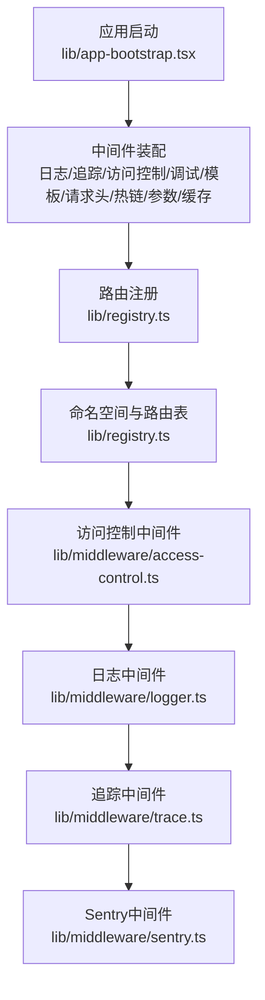
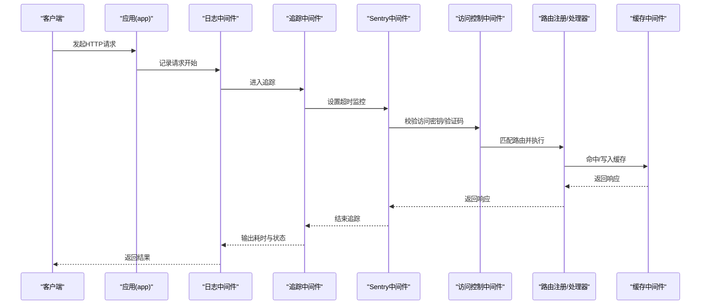
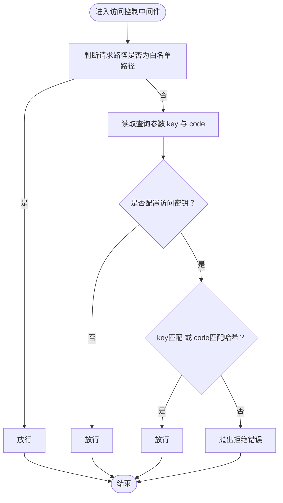
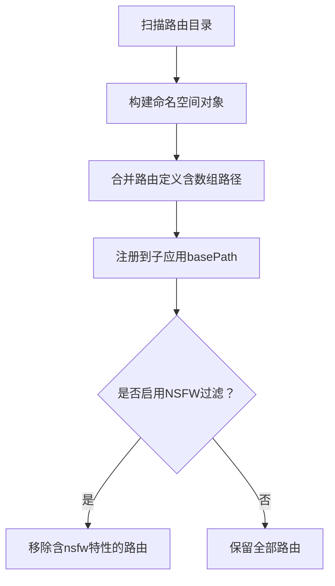
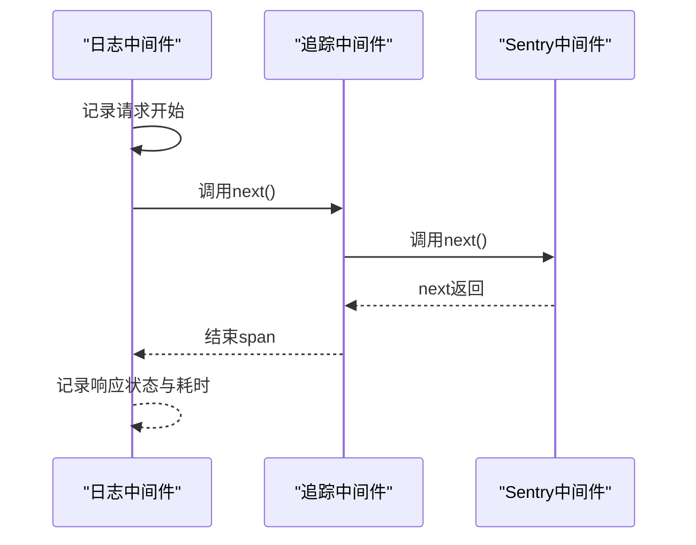
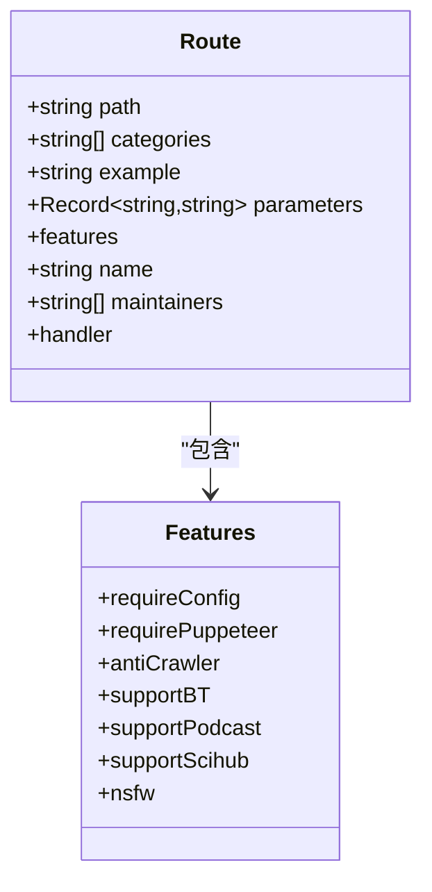
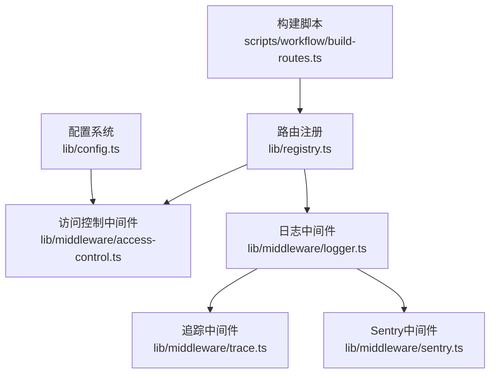

# 路由保护

<cite>
**本文引用的文件**
- [lib/config.ts](file://lib/config.ts)
- [lib/app-bootstrap.tsx](file://lib/app-bootstrap.tsx)
- [lib/middleware/access-control.ts](file://lib/middleware/access-control.ts)
- [lib/middleware/logger.ts](file://lib/middleware/logger.ts)
- [lib/middleware/trace.ts](file://lib/middleware/trace.ts)
- [lib/middleware/sentry.ts](file://lib/middleware/sentry.ts)
- [lib/registry.ts](file://lib/registry.ts)
- [lib/routes/CLAUDE.md](file://lib/routes/CLAUDE.md)
- [lib/types.ts](file://lib/types.ts)
- [lib/utils/puppeteer.ts](file://lib/utils/puppeteer.ts)
- [scripts/workflow/build-routes.ts](file://scripts/workflow/build-routes.ts)
</cite>

## 目录
1. [简介](#简介)
2. [项目结构](#项目结构)
3. [核心组件](#核心组件)
4. [架构总览](#架构总览)
5. [详细组件分析](#详细组件分析)
6. [依赖关系分析](#依赖关系分析)
7. [性能考量](#性能考量)
8. [故障排查指南](#故障排查指南)
9. [结论](#结论)
10. [附录](#附录)

## 简介
本文件聚焦RSSHub的“路由保护”能力，系统性阐述如何通过配置与中间件实现对敏感路由的访问控制与安全加固。内容涵盖：
- 如何通过配置启用/禁用特定路由（基于命名空间与特性标记）
- 如何使用访问密钥进行路由级认证
- 如何利用通配符与正则表达式批量保护相似路由
- 如何记录路由访问日志并监控敏感路由
- 实战配置示例：禁用高风险路由、为特定路由增加额外认证
- 常见问题与排错建议

## 项目结构
RSSHub采用Hono作为Web框架，路由注册在运行时完成，并通过中间件链实现统一的安全与可观测性控制。关键位置如下：
- 配置加载与导出：lib/config.ts
- 应用启动与中间件装配：lib/app-bootstrap.tsx
- 路由注册与命名空间管理：lib/registry.ts
- 访问控制中间件：lib/middleware/access-control.ts
- 日志与追踪中间件：lib/middleware/logger.ts、lib/middleware/trace.ts
- 错误与超时监控：lib/middleware/sentry.ts
- 路由定义与特性标记：lib/types.ts、lib/routes/CLAUDE.md
- 路由路径构建与类型生成：scripts/workflow/build-routes.ts

图表来源
- [lib/app-bootstrap.tsx](file://lib/app-bootstrap.tsx#L1-L54)
- [lib/registry.ts](file://lib/registry.ts#L1-L124)
- [lib/middleware/access-control.ts](file://lib/middleware/access-control.ts#L1-L26)
- [lib/middleware/logger.ts](file://lib/middleware/logger.ts#L1-L46)
- [lib/middleware/trace.ts](file://lib/middleware/trace.ts#L1-L26)
- [lib/middleware/sentry.ts](file://lib/middleware/sentry.ts#L1-L28)

章节来源
- [lib/app-bootstrap.tsx](file://lib/app-bootstrap.tsx#L1-L54)
- [lib/registry.ts](file://lib/registry.ts#L1-L124)

## 核心组件
- 配置系统：集中管理访问密钥、日志级别、Sentry、NSFW过滤等开关
- 中间件链：按序执行，确保访问控制在路由处理前生效
- 路由注册：动态扫描路由目录，构建命名空间与路由表
- 访问控制：基于查询参数的密钥/验证码校验
- 日志与追踪：统一记录请求与响应，支持性能指标与错误上报
- 路由特性标记：通过features字段标注敏感路由（如nsfw）

章节来源
- [lib/config.ts](file://lib/config.ts#L764-L791)
- [lib/middleware/access-control.ts](file://lib/middleware/access-control.ts#L1-L26)
- [lib/middleware/logger.ts](file://lib/middleware/logger.ts#L1-L46)
- [lib/middleware/trace.ts](file://lib/middleware/trace.ts#L1-L26)
- [lib/middleware/sentry.ts](file://lib/middleware/sentry.ts#L1-L28)
- [lib/registry.ts](file://lib/registry.ts#L1-L124)
- [lib/types.ts](file://lib/types.ts#L258-L371)

## 架构总览
下图展示了从请求进入至路由处理的关键路径，以及访问控制与日志/追踪/监控的交叉点。

图表来源
- [lib/app-bootstrap.tsx](file://lib/app-bootstrap.tsx#L1-L54)
- [lib/middleware/logger.ts](file://lib/middleware/logger.ts#L1-L46)
- [lib/middleware/trace.ts](file://lib/middleware/trace.ts#L1-L26)
- [lib/middleware/sentry.ts](file://lib/middleware/sentry.ts#L1-L28)
- [lib/middleware/access-control.ts](file://lib/middleware/access-control.ts#L1-L26)
- [lib/registry.ts](file://lib/registry.ts#L192-L216)

## 详细组件分析

### 访问控制中间件（路由级认证）
- 生效范围：除根路径、robots.txt、favicon.ico、logo.png外的所有受管路由
- 校验逻辑：
  - 若配置了访问密钥，则必须满足以下任一条件：
    - 查询参数key等于配置的访问密钥
    - 查询参数code等于对“请求路径+访问密钥”的哈希值
- 作用时机：在路由处理前执行，未通过校验将抛出拒绝错误

图表来源
- [lib/middleware/access-control.ts](file://lib/middleware/access-control.ts#L1-L26)
- [lib/config.ts](file://lib/config.ts#L764-L791)

章节来源
- [lib/middleware/access-control.ts](file://lib/middleware/access-control.ts#L1-L26)
- [lib/config.ts](file://lib/config.ts#L764-L791)

### 路由注册与命名空间管理
- 动态扫描路由目录，构建命名空间与路由表
- 支持数组形式的多路径声明
- 支持按环境变量开关过滤敏感内容（如NSFW）

图表来源
- [lib/registry.ts](file://lib/registry.ts#L1-L124)
- [lib/registry.ts](file://lib/registry.ts#L192-L216)
- [lib/routes/CLAUDE.md](file://lib/routes/CLAUDE.md#L52-L73)
- [lib/types.ts](file://lib/types.ts#L258-L371)

章节来源
- [lib/registry.ts](file://lib/registry.ts#L1-L124)
- [lib/registry.ts](file://lib/registry.ts#L192-L216)
- [lib/routes/CLAUDE.md](file://lib/routes/CLAUDE.md#L52-L73)
- [lib/types.ts](file://lib/types.ts#L258-L371)

### 日志与监控中间件
- 日志中间件：记录请求方法、路径、耗时与状态码
- 追踪中间件：在调试模式下开启OpenTelemetry追踪
- Sentry中间件：对超时路由进行错误上报

图表来源
- [lib/middleware/logger.ts](file://lib/middleware/logger.ts#L1-L46)
- [lib/middleware/trace.ts](file://lib/middleware/trace.ts#L1-L26)
- [lib/middleware/sentry.ts](file://lib/middleware/sentry.ts#L1-L28)

章节来源
- [lib/middleware/logger.ts](file://lib/middleware/logger.ts#L1-L46)
- [lib/middleware/trace.ts](file://lib/middleware/trace.ts#L1-L26)
- [lib/middleware/sentry.ts](file://lib/middleware/sentry.ts#L1-L28)

### 路由特性与敏感路由标记
- 路由定义包含features字段，用于标注依赖配置、反爬机制、BT/Podcast/Sci-Hub支持、NSFW等
- NSFW路由可通过环境变量开关在注册阶段被过滤

图表来源
- [lib/types.ts](file://lib/types.ts#L258-L371)
- [lib/registry.ts](file://lib/registry.ts#L1-L124)

章节来源
- [lib/types.ts](file://lib/types.ts#L258-L371)
- [lib/registry.ts](file://lib/registry.ts#L1-L124)

## 依赖关系分析
- 访问控制依赖配置系统提供的访问密钥
- 路由注册依赖命名空间与路由定义
- 日志/追踪/Sentry依赖配置系统与工具模块
- 路由路径类型由构建脚本生成，保证类型安全

图表来源
- [lib/config.ts](file://lib/config.ts#L764-L791)
- [lib/middleware/access-control.ts](file://lib/middleware/access-control.ts#L1-L26)
- [lib/registry.ts](file://lib/registry.ts#L1-L124)
- [lib/middleware/logger.ts](file://lib/middleware/logger.ts#L1-L46)
- [lib/middleware/trace.ts](file://lib/middleware/trace.ts#L1-L26)
- [lib/middleware/sentry.ts](file://lib/middleware/sentry.ts#L1-L28)
- [scripts/workflow/build-routes.ts](file://scripts/workflow/build-routes.ts#L112-L127)

章节来源
- [lib/config.ts](file://lib/config.ts#L764-L791)
- [lib/middleware/access-control.ts](file://lib/middleware/access-control.ts#L1-L26)
- [lib/registry.ts](file://lib/registry.ts#L1-L124)
- [lib/middleware/logger.ts](file://lib/middleware/logger.ts#L1-L46)
- [lib/middleware/trace.ts](file://lib/middleware/trace.ts#L1-L26)
- [lib/middleware/sentry.ts](file://lib/middleware/sentry.ts#L1-L28)
- [scripts/workflow/build-routes.ts](file://scripts/workflow/build-routes.ts#L112-L127)

## 性能考量
- 中间件顺序影响整体性能与安全性：访问控制需尽早执行，避免不必要的后续处理
- 日志与追踪在调试模式下开启，生产环境建议关闭或降低开销
- 缓存中间件可显著减少重复请求的负载
- Puppeteer使用可能带来额外资源消耗，应结合代理与URL正则限制使用范围

章节来源
- [lib/app-bootstrap.tsx](file://lib/app-bootstrap.tsx#L1-L54)
- [lib/middleware/logger.ts](file://lib/middleware/logger.ts#L1-L46)
- [lib/middleware/trace.ts](file://lib/middleware/trace.ts#L1-L26)
- [lib/utils/puppeteer.ts](file://lib/utils/puppeteer.ts#L1-L191)

## 故障排查指南
- 配置后路由仍可访问
  - 检查是否正确设置了访问密钥
  - 确认请求是否携带正确的查询参数（key或code）
  - 排查中间件顺序是否被自定义修改导致访问控制未生效
  - 参考：访问控制中间件对白名单路径的放行逻辑
- 通配符配置错误
  - 确保通配符与正则表达式符合Hono路由语法
  - 使用构建脚本生成的路由路径类型辅助定位
- NSFW路由未被过滤
  - 检查环境变量开关是否启用
  - 确认路由定义中features.nsfw标记是否正确
- 日志与监控异常
  - 检查日志中间件是否正常输出
  - 确认Sentry配置与超时阈值设置合理

章节来源
- [lib/middleware/access-control.ts](file://lib/middleware/access-control.ts#L1-L26)
- [lib/registry.ts](file://lib/registry.ts#L1-L124)
- [lib/middleware/logger.ts](file://lib/middleware/logger.ts#L1-L46)
- [lib/middleware/sentry.ts](file://lib/middleware/sentry.ts#L1-L28)
- [scripts/workflow/build-routes.ts](file://scripts/workflow/build-routes.ts#L112-L127)

## 结论
RSSHub通过“配置+中间件+路由特性标记”的组合实现了灵活而强大的路由保护体系。访问控制中间件提供基础的路由级认证；日志与追踪中间件保障可观测性；NSFW过滤与特性标记帮助识别与屏蔽高风险路由。配合通配符与正则表达式，可实现对相似路由的批量保护与精细化管控。

## 附录

### 实战配置示例
- 启用访问密钥认证
  - 在配置中设置访问密钥
  - 客户端请求时携带查询参数key或code
  - 参考：访问控制中间件的校验逻辑
- 禁用高风险路由（NSFW）
  - 通过环境变量开关过滤含nsfw特性的路由
  - 参考：注册阶段的安全命名空间过滤
- 为特定路由设置额外认证
  - 在路由定义中使用features.requireConfig声明所需配置项
  - 在访问控制中间件之外，结合业务层校验实现更严格的认证
- 使用通配符与正则批量保护
  - 在路由定义中使用数组路径或正则表达式
  - 通过构建脚本生成的路由路径类型辅助校验
- 访问日志与监控
  - 开启日志中间件记录请求与响应
  - 在调试模式下启用追踪中间件
  - 配置Sentry进行超时与错误上报

章节来源
- [lib/config.ts](file://lib/config.ts#L764-L791)
- [lib/middleware/access-control.ts](file://lib/middleware/access-control.ts#L1-L26)
- [lib/registry.ts](file://lib/registry.ts#L1-L124)
- [lib/routes/CLAUDE.md](file://lib/routes/CLAUDE.md#L52-L73)
- [lib/types.ts](file://lib/types.ts#L258-L371)
- [lib/middleware/logger.ts](file://lib/middleware/logger.ts#L1-L46)
- [lib/middleware/trace.ts](file://lib/middleware/trace.ts#L1-L26)
- [lib/middleware/sentry.ts](file://lib/middleware/sentry.ts#L1-L28)
- [scripts/workflow/build-routes.ts](file://scripts/workflow/build-routes.ts#L112-L127)