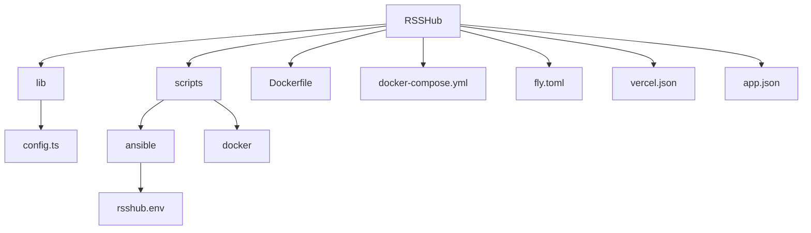
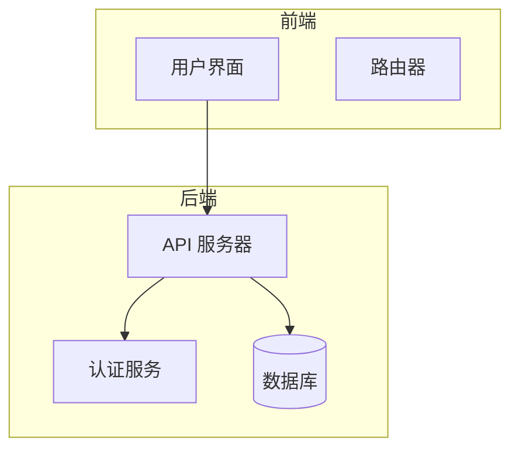
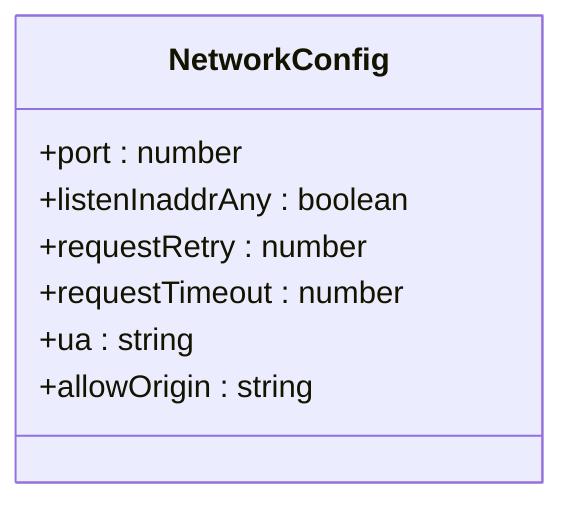
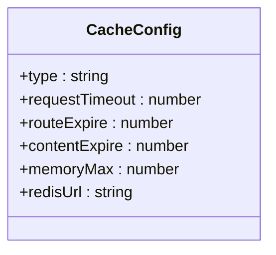
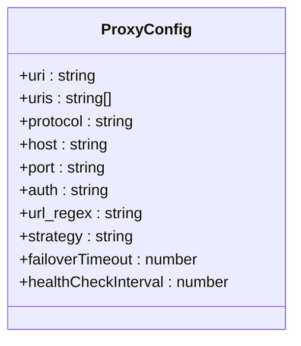
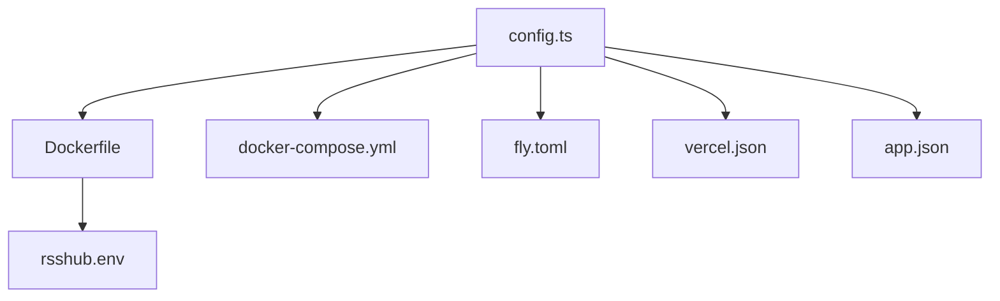

# 服务器配置

<cite>
**本文档中引用的文件**  
- [config.ts](file://lib/config.ts)
- [Dockerfile](file://Dockerfile)
- [docker-compose.yml](file://docker-compose.yml)
- [fly.toml](file://fly.toml)
- [vercel.json](file://vercel.json)
- [app.json](file://app.json)
- [rsshub.env](file://scripts/ansible/rsshub.env)
</cite>

## 目录
1. [简介](#简介)
2. [项目结构](#项目结构)
3. [核心组件](#核心组件)
4. [架构概述](#架构概述)
5. [详细组件分析](#详细组件分析)
6. [依赖分析](#依赖分析)
7. [性能考虑](#性能考虑)
8. [故障排除指南](#故障排除指南)
9. [结论](#结论)

## 简介
RSSHub 是一个将各种内容源转换为 RSS 订阅的工具。本服务器配置文档详细说明了与服务器运行相关的所有配置选项，包括端口设置、主机绑定、SSL/TLS 配置、超时设置等参数。文档解释了每个配置项的作用、默认值和可选值，并提供了不同部署场景下的配置示例，如开发环境、生产环境和反向代理环境。此外，还讨论了服务器性能调优的最佳实践，包括连接数限制、请求大小限制等。

## 项目结构

**图示来源**
- [Dockerfile](file://Dockerfile#L1-L207)
- [docker-compose.yml](file://docker-compose.yml#L1-L63)
- [fly.toml](file://fly.toml#L1-L16)
- [vercel.json](file://vercel.json#L1-L17)
- [app.json](file://app.json#L1-L23)

**节来源**
- [Dockerfile](file://Dockerfile#L1-L207)
- [docker-compose.yml](file://docker-compose.yml#L1-L63)
- [fly.toml](file://fly.toml#L1-L16)
- [vercel.json](file://vercel.json#L1-L17)
- [app.json](file://app.json#L1-L23)

## 核心组件

本节分析了 RSSHub 的核心配置组件，包括网络配置、缓存配置、代理配置等。这些配置项定义了服务器的基本行为和性能特征。

**节来源**
- [config.ts](file://lib/config.ts#L1-L1188)

## 架构概述

**图示来源**
- [config.ts](file://lib/config.ts#L1-L1188)
- [app-bootstrap.tsx](file://lib/app-bootstrap.tsx#L1-L54)

## 详细组件分析

### 网络配置分析

**图示来源**
- [config.ts](file://lib/config.ts#L15-L21)

### 缓存配置分析

**图示来源**
- [config.ts](file://lib/config.ts#L23-L28)

### 代理配置分析

**图示来源**
- [config.ts](file://lib/config.ts#L30-L39)

**节来源**
- [config.ts](file://lib/config.ts#L1-L1188)

## 依赖分析

**图示来源**
- [config.ts](file://lib/config.ts#L1-L1188)
- [Dockerfile](file://Dockerfile#L1-L207)
- [docker-compose.yml](file://docker-compose.yml#L1-L63)
- [fly.toml](file://fly.toml#L1-L16)
- [vercel.json](file://vercel.json#L1-L17)
- [app.json](file://app.json#L1-L23)
- [rsshub.env](file://scripts/ansible/rsshub.env#L1-L4)

**节来源**
- [config.ts](file://lib/config.ts#L1-L1188)
- [Dockerfile](file://Dockerfile#L1-L207)
- [docker-compose.yml](file://docker-compose.yml#L1-L63)
- [fly.toml](file://fly.toml#L1-L16)
- [vercel.json](file://vercel.json#L1-L17)
- [app.json](file://app.json#L1-L23)
- [rsshub.env](file://scripts/ansible/rsshub.env#L1-L4)

## 性能考虑

在配置 RSSHub 服务器时，需要考虑多个性能因素。例如，`CACHE_TYPE` 和 `REDIS_URL` 配置项可以显著影响缓存性能。使用 Redis 作为缓存后端可以提高缓存的可靠性和性能。此外，`REQUEST_TIMEOUT` 和 `CACHE_REQUEST_TIMEOUT` 配置项可以控制请求的超时时间，避免长时间等待导致的性能问题。

## 故障排除指南

当遇到服务器配置问题时，可以检查以下常见问题：
- 确保 `PORT` 配置项设置正确，并且该端口未被其他服务占用。
- 检查 `REDIS_URL` 配置项是否正确指向 Redis 服务器。
- 确认 `PUPPETEER_WS_ENDPOINT` 配置项是否正确配置，以便 Puppeteer 可以正常工作。
- 检查日志文件以获取更多错误信息。

**节来源**
- [config.ts](file://lib/config.ts#L1-L1188)
- [Dockerfile](file://Dockerfile#L1-L207)
- [docker-compose.yml](file://docker-compose.yml#L1-L63)

## 结论

本文档详细介绍了 RSSHub 的服务器配置选项，包括网络、缓存、代理等方面的配置。通过合理配置这些选项，可以优化服务器性能，确保服务的稳定性和可靠性。建议根据实际部署环境选择合适的配置方案，并定期检查和调整配置以适应变化的需求。