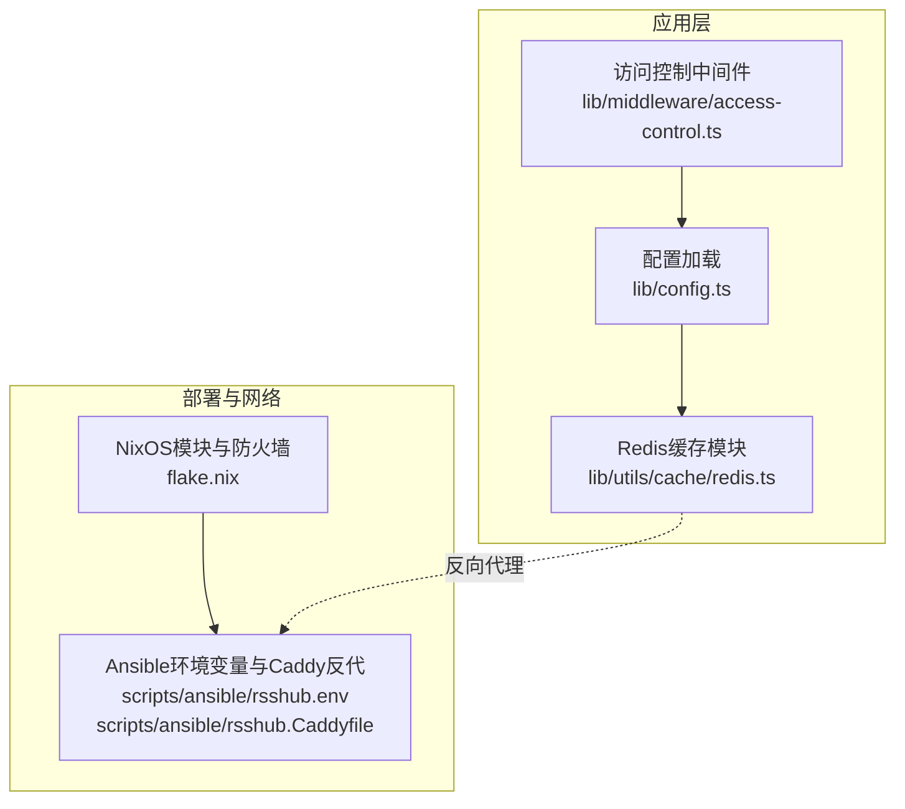
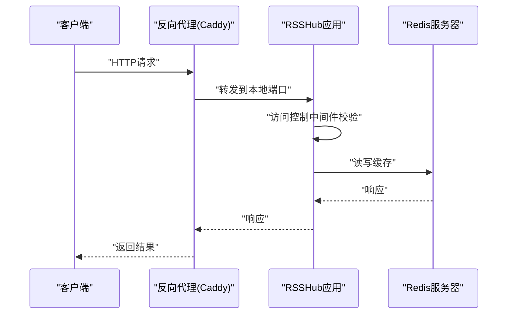
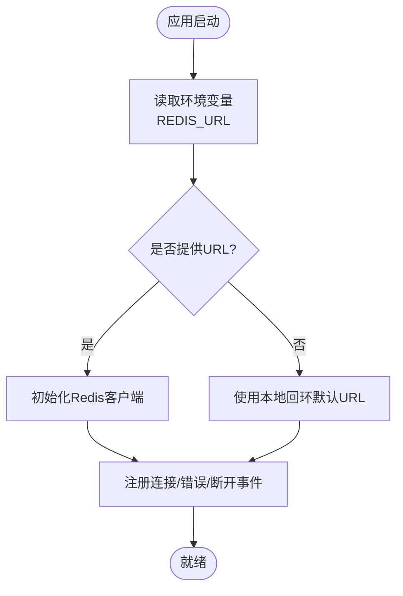
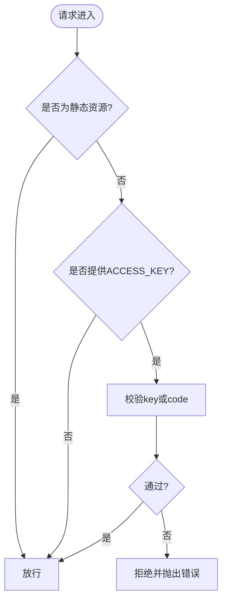
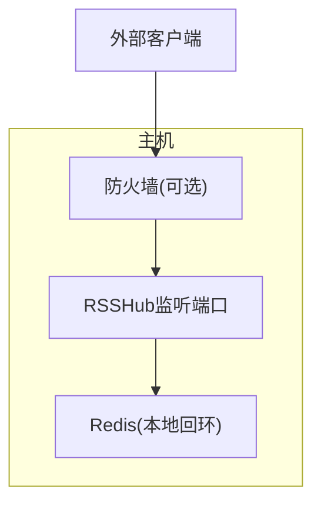
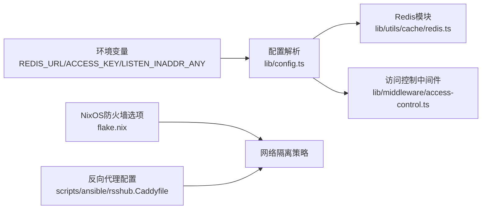

# Redis安全配置

<cite>
**本文引用的文件**
- [lib/config.ts](file://lib/config.ts)
- [lib/utils/cache/redis.ts](file://lib/utils/cache/redis.ts)
- [lib/middleware/access-control.ts](file://lib/middleware/access-control.ts)
- [flake.nix](file://flake.nix)
- [scripts/ansible/rsshub.env](file://scripts/ansible/rsshub.env)
- [scripts/ansible/rsshub.Caddyfile](file://scripts/ansible/rsshub.Caddyfile)
- [lib/middleware/cache.test.ts](file://lib/middleware/cache.test.ts)
</cite>

## 目录
1. [简介](#简介)
2. [项目结构](#项目结构)
3. [核心组件](#核心组件)
4. [架构总览](#架构总览)
5. [详细组件分析](#详细组件分析)
6. [依赖关系分析](#依赖关系分析)
7. [性能考量](#性能考量)
8. [故障排查指南](#故障排查指南)
9. [结论](#结论)
10. [附录](#附录)

## 简介
本指南聚焦于在RSSHub中对Redis进行安全配置，覆盖以下方面：
- 通过反向代理与本地回环地址限制Redis访问面
- 基于环境变量的安全连接参数与最小权限监听策略
- 认证与访问控制（基于查询参数的简单鉴权中间件）
- 防火墙与网络隔离策略
- 安全审计与日志记录要点
- 常见安全风险与最佳实践

说明：当前仓库未发现直接的Redis TLS/SSL配置代码；TLS/SSL通常由外部服务（如反向代理）提供，本指南将结合现有反向代理与本地部署模式给出可落地的安全建议。

## 项目结构
与Redis安全相关的关键位置：
- 配置加载与默认值：lib/config.ts
- Redis客户端初始化与错误处理：lib/utils/cache/redis.ts
- 访问控制中间件：lib/middleware/access-control.ts
- NixOS系统化部署与防火墙开放：flake.nix
- Ansible示例环境变量与反向代理：scripts/ansible/rsshub.env、scripts/ansible/rsshub.Caddyfile
- 测试用例验证Redis连接与错误路径：lib/middleware/cache.test.ts

图表来源
- [lib/config.ts](file://lib/config.ts#L720-L750)
- [lib/utils/cache/redis.ts](file://lib/utils/cache/redis.ts#L1-L78)
- [lib/middleware/access-control.ts](file://lib/middleware/access-control.ts#L1-L27)
- [flake.nix](file://flake.nix#L122-L131)
- [scripts/ansible/rsshub.env](file://scripts/ansible/rsshub.env#L1-L4)
- [scripts/ansible/rsshub.Caddyfile](file://scripts/ansible/rsshub.Caddyfile#L1-L3)

章节来源
- [lib/config.ts](file://lib/config.ts#L720-L750)
- [lib/utils/cache/redis.ts](file://lib/utils/cache/redis.ts#L1-L78)
- [lib/middleware/access-control.ts](file://lib/middleware/access-control.ts#L1-L27)
- [flake.nix](file://flake.nix#L122-L131)
- [scripts/ansible/rsshub.env](file://scripts/ansible/rsshub.env#L1-L4)
- [scripts/ansible/rsshub.Caddyfile](file://scripts/ansible/rsshub.Caddyfile#L1-L3)

## 核心组件
- Redis连接与状态管理
  - 默认Redis URL来源于环境变量，若未设置则使用本地回环地址与默认端口
  - 初始化时注册错误、断开与连接事件，用于可观测性与降级
- 访问控制中间件
  - 通过查询参数key或基于路径与密钥计算的code进行鉴权
  - 对根路径、robots.txt、favicon等静态资源放行
- 部署与网络隔离
  - NixOS模块支持按需开放防火墙端口
  - Ansible示例通过反向代理将应用暴露给公网，Redis仅在本地回环可用

章节来源
- [lib/config.ts](file://lib/config.ts#L745-L747)
- [lib/utils/cache/redis.ts](file://lib/utils/cache/redis.ts#L20-L35)
- [lib/middleware/access-control.ts](file://lib/middleware/access-control.ts#L11-L24)
- [flake.nix](file://flake.nix#L122-L131)
- [scripts/ansible/rsshub.env](file://scripts/ansible/rsshub.env#L1-L4)
- [scripts/ansible/rsshub.Caddyfile](file://scripts/ansible/rsshub.Caddyfile#L1-L3)

## 架构总览
下图展示了RSSHub与Redis的典型交互路径，以及访问控制与反向代理在网络层面的作用。

图表来源
- [scripts/ansible/rsshub.Caddyfile](file://scripts/ansible/rsshub.Caddyfile#L1-L3)
- [lib/middleware/access-control.ts](file://lib/middleware/access-control.ts#L11-L24)
- [lib/utils/cache/redis.ts](file://lib/utils/cache/redis.ts#L36-L77)

## 详细组件分析

### Redis连接与最小权限监听
- 连接URL来源
  - 应用从环境变量读取Redis URL，默认值指向本地回环地址与默认端口
- 最小权限监听
  - 通过将Redis绑定到本地回环地址，限制外部网络访问面
  - 结合反向代理（如Caddy）仅在内网或受控网络暴露应用端口
- 错误处理与可观测性
  - 注册错误、断开与连接事件，便于监控与告警

图表来源
- [lib/config.ts](file://lib/config.ts#L745-L747)
- [lib/utils/cache/redis.ts](file://lib/utils/cache/redis.ts#L20-L35)

章节来源
- [lib/config.ts](file://lib/config.ts#L745-L747)
- [lib/utils/cache/redis.ts](file://lib/utils/cache/redis.ts#L20-L35)

### 认证与访问控制
- 查询参数鉴权
  - 支持两种方式：直接传入key或传入基于路径与密钥计算的code
  - 对静态资源路径放行，避免影响站点基础功能
- 配置来源
  - ACCESS_KEY来自环境变量，作为全局鉴权密钥

图表来源
- [lib/middleware/access-control.ts](file://lib/middleware/access-control.ts#L11-L24)
- [lib/config.ts](file://lib/config.ts#L767-L769)

章节来源
- [lib/middleware/access-control.ts](file://lib/middleware/access-control.ts#L1-L27)
- [lib/config.ts](file://lib/config.ts#L767-L769)

### 防火墙与网络隔离策略
- 开放防火墙端口
  - NixOS模块提供开关，按需开放RSSHub监听端口
- 反向代理与本地回环
  - Ansible示例通过反向代理将应用暴露给公网，Redis仅在本地回环可用
  - 结合LISTEN_INADDR_ANY与本地监听策略，降低暴露面

图表来源
- [flake.nix](file://flake.nix#L122-L131)
- [scripts/ansible/rsshub.Caddyfile](file://scripts/ansible/rsshub.Caddyfile#L1-L3)
- [lib/config.ts](file://lib/config.ts#L726-L728)

章节来源
- [flake.nix](file://flake.nix#L122-L131)
- [scripts/ansible/rsshub.Caddyfile](file://scripts/ansible/rsshub.Caddyfile#L1-L3)
- [lib/config.ts](file://lib/config.ts#L726-L728)

### 安全审计与日志
- Redis连接事件日志
  - 初始化时注册错误、断开与连接事件，便于记录异常与恢复
- 日志级别与输出
  - 应用支持统一的日志级别与输出控制，可用于集中化日志收集与审计

章节来源
- [lib/utils/cache/redis.ts](file://lib/utils/cache/redis.ts#L24-L35)
- [lib/config.ts](file://lib/config.ts#L770-L783)

## 依赖关系分析
- 配置依赖
  - Redis URL依赖环境变量；访问控制依赖ACCESS_KEY
- 组件耦合
  - Redis模块与配置模块松耦合，通过配置对象注入
  - 访问控制中间件独立于缓存模块，但共享配置源
- 外部依赖
  - 反向代理（Caddy）与操作系统防火墙共同构成网络边界

图表来源
- [lib/config.ts](file://lib/config.ts#L745-L747)
- [lib/utils/cache/redis.ts](file://lib/utils/cache/redis.ts#L20-L35)
- [lib/middleware/access-control.ts](file://lib/middleware/access-control.ts#L11-L24)
- [flake.nix](file://flake.nix#L122-L131)
- [scripts/ansible/rsshub.Caddyfile](file://scripts/ansible/rsshub.Caddyfile#L1-L3)

章节来源
- [lib/config.ts](file://lib/config.ts#L745-L747)
- [lib/utils/cache/redis.ts](file://lib/utils/cache/redis.ts#L20-L35)
- [lib/middleware/access-control.ts](file://lib/middleware/access-control.ts#L11-L24)
- [flake.nix](file://flake.nix#L122-L131)
- [scripts/ansible/rsshub.Caddyfile](file://scripts/ansible/rsshub.Caddyfile#L1-L3)

## 性能考量
- 连接池与事件驱动
  - Redis客户端采用事件驱动模型，连接状态变化会触发可观测性事件
- 缓存命中与过期
  - 读写缓存时根据配置设置TTL，避免无效占用
- 网络延迟与代理
  - 反向代理可能引入额外延迟，建议在生产环境启用压缩与持久连接

章节来源
- [lib/utils/cache/redis.ts](file://lib/utils/cache/redis.ts#L36-L77)
- [lib/config.ts](file://lib/config.ts#L735-L740)

## 故障排查指南
- Redis连接失败
  - 检查REDIS_URL是否正确，确认Redis服务可达且监听在本地回环
  - 查看应用日志中Redis错误事件
- 访问被拒绝
  - 确认ACCESS_KEY已配置，且请求携带正确的key或code
  - 排查静态资源路径是否被误拦截
- 缓存不可用
  - 观察Redis连接事件状态，确认连接成功
  - 检查测试用例中对错误URL的处理逻辑

章节来源
- [lib/middleware/cache.test.ts](file://lib/middleware/cache.test.ts#L143-L150)
- [lib/utils/cache/redis.ts](file://lib/utils/cache/redis.ts#L24-L35)
- [lib/middleware/access-control.ts](file://lib/middleware/access-control.ts#L11-L24)

## 结论
- 当前仓库未内置Redis TLS/SSL配置代码，推荐通过反向代理（如Caddy）提供TLS终止，Redis保持本地回环监听
- 结合访问控制中间件与防火墙策略，可显著降低攻击面
- 建议在生产环境启用审计日志与集中化监控，持续评估安全策略有效性

## 附录

### 实际配置示例（路径指引）
- 设置Redis连接URL
  - 参考路径：[lib/config.ts](file://lib/config.ts#L745-L747)
- 启用访问控制
  - 参考路径：[lib/middleware/access-control.ts](file://lib/middleware/access-control.ts#L11-L24)，[lib/config.ts](file://lib/config.ts#L767-L769)
- 打开防火墙端口（NixOS）
  - 参考路径：[flake.nix](file://flake.nix#L122-L131)
- 反向代理与本地回环
  - 参考路径：[scripts/ansible/rsshub.Caddyfile](file://scripts/ansible/rsshub.Caddyfile#L1-L3)，[scripts/ansible/rsshub.env](file://scripts/ansible/rsshub.env#L1-L4)

### 常见安全漏洞与最佳实践
- 避免公网直连Redis
  - 将Redis绑定到本地回环，仅通过反向代理暴露应用端口
- 强制访问控制
  - 使用ACCESS_KEY与动态code双重校验，定期轮换密钥
- 最小权限原则
  - 仅授予必要的缓存操作权限，避免使用高权限账户
- 审计与告警
  - 记录Redis连接事件与访问控制失败事件，接入集中化日志
- 供应链与依赖安全
  - 定期更新依赖，关注Redis与反向代理的安全公告